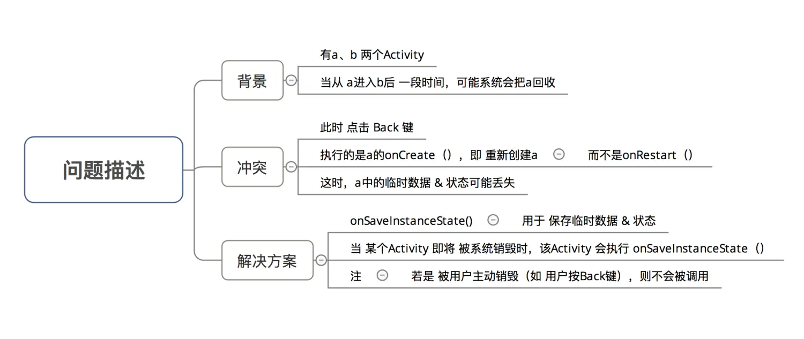
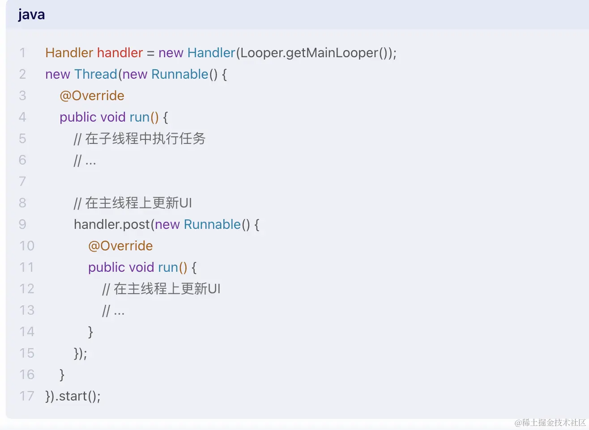
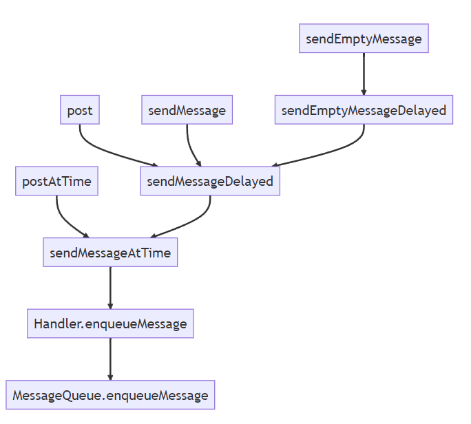
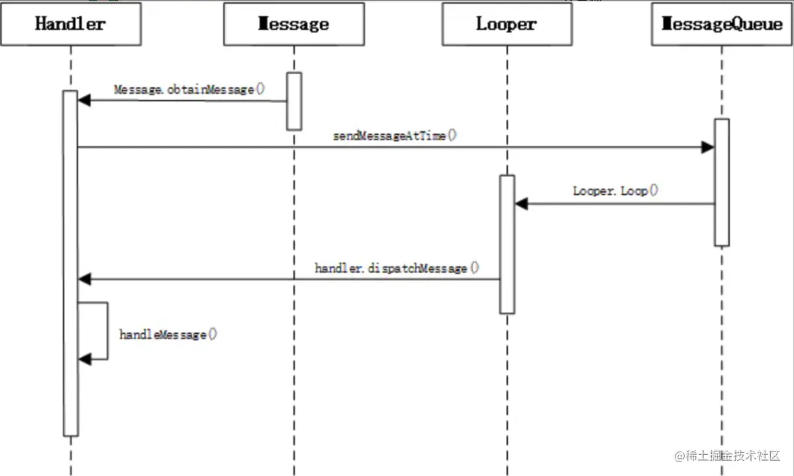
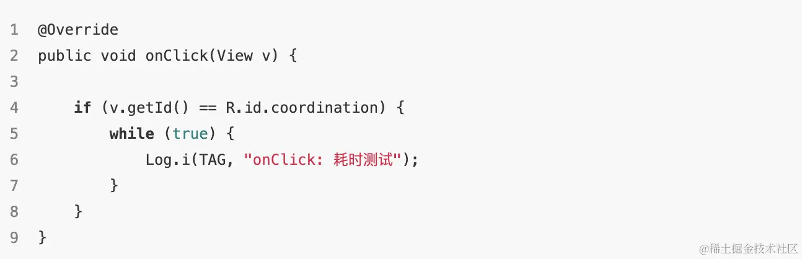
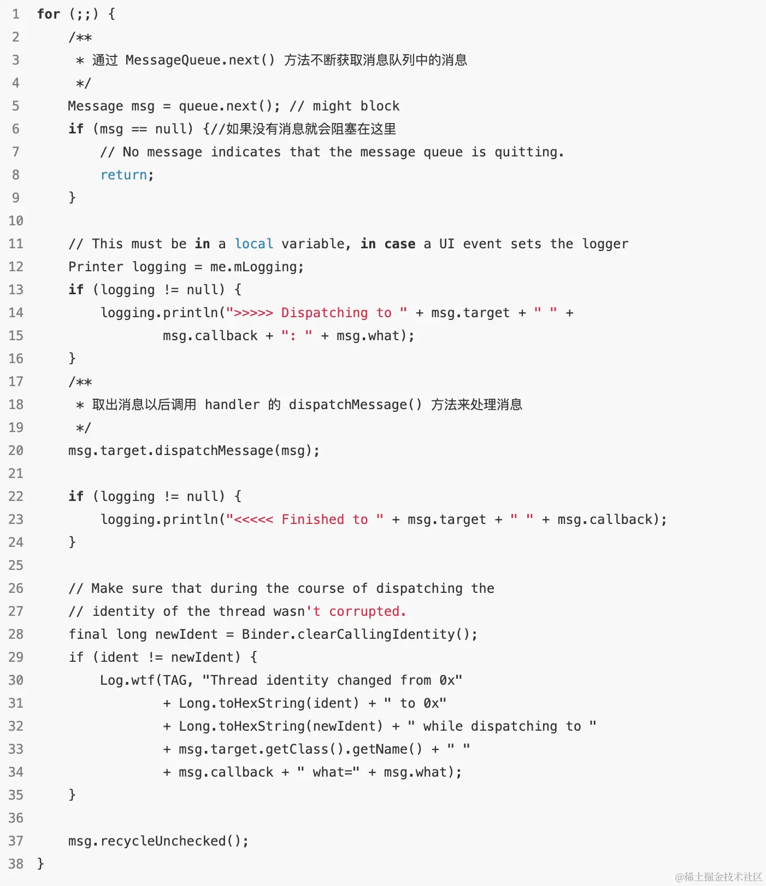
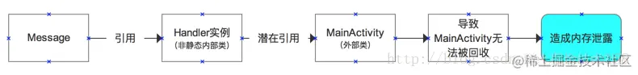
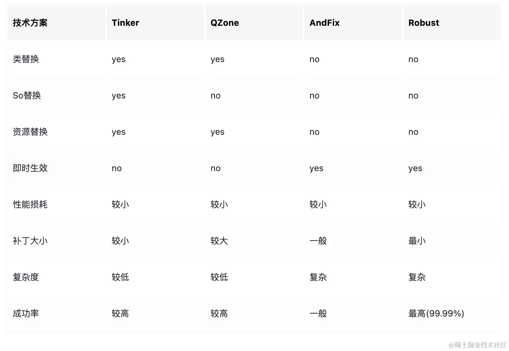

# 面试题

- [面试题](#面试题)
  - [架构](#架构)
    - [Android的四大组件是哪些，它们的作用？](#android的四大组件是哪些它们的作用)
    - [Android 中进程的优先级](#android-中进程的优先级)
    - [Android中asset和res目录的区别](#android中asset和res目录的区别)
    - [Android中App 是如何沙箱化的,为何要这么做](#android中app-是如何沙箱化的为何要这么做)
  - [Activity](#activity)
    - [Activity 生命周期](#activity-生命周期)
    - [onPause能不能执行耗时的操作？](#onpause能不能执行耗时的操作)
    - [横竖屏切换时Activity的生命周期](#横竖屏切换时activity的生命周期)
    - [说说Activity的启动模式](#说说activity的启动模式)
    - [在Activity中创建一个thread跟在service中创建一个thread之间的区别？](#在activity中创建一个thread跟在service中创建一个thread之间的区别)
  - [Fragment](#fragment)
    - [Fragment的生命周期](#fragment的生命周期)
    - [Android中Fragment和Activity通信的方式有哪些](#android中fragment和activity通信的方式有哪些)
    - [如何实现Fragment的滑动?](#如何实现fragment的滑动)
  - [Service](#service)
    - [服务有几种启动方式？服务和Activty或服务之间怎么通信？](#服务有几种启动方式服务和activty或服务之间怎么通信)
    - [Android中，startService和bindService有啥区别？](#android中startservice和bindservice有啥区别)
    - [既使用startService又使用bindService的情况可以吗](#既使用startservice又使用bindservice的情况可以吗)
  - [BroadcastRecevier](#broadcastrecevier)
    - [广播注册一般有几种，各有什么优缺点？](#广播注册一般有几种各有什么优缺点)
  - [View](#view)
    - [View的绘制流程](#view的绘制流程)
    - [View的事件分发机制](#view的事件分发机制)
    - [自定义View的方式有哪些？](#自定义view的方式有哪些)
    - [Android中常用的布局有哪啊些？](#android中常用的布局有哪啊些)
    - [在 Activity 中获取某个 View 的宽高](#在-activity-中获取某个-view-的宽高)
    - [invalidate和requestLayout的区别及使用？](#invalidate和requestlayout的区别及使用)
    - [Android的屏幕适配方案有哪些？](#android的屏幕适配方案有哪些)
    - [动画类型有哪啊些，它们有什么区别？](#动画类型有哪啊些它们有什么区别)
    - [Bitmap使用时需要注意什么？](#bitmap使用时需要注意什么)
    - [说说Listview的复用机制](#说说listview的复用机制)
  - [数据存储](#数据存储)
    - [说说Android数据存储的方式有哪些？](#说说android数据存储的方式有哪些)
    - [SharedPreferences中的commit和apply有啥区别？](#sharedpreferences中的commit和apply有啥区别)
    - [SharedPreferences是线程安全的吗？](#sharedpreferences是线程安全的吗)
    - [SharedPreferences和DataStore有啥区别？](#sharedpreferences和datastore有啥区别)
    - [Serializable和Parcelable的比较](#serializable和parcelable的比较)
  - [异步机制](#异步机制)
    - [Android中线程异步的方式有哪些？](#android中线程异步的方式有哪些)
    - [Android 的子线程能否做到更新 UI？](#android-的子线程能否做到更新-ui)
    - [AsyncTask的缺陷？使用时有什么需要注意的点？](#asynctask的缺陷使用时有什么需要注意的点)
    - [说说Handler机制](#说说handler机制)
    - [谈谈Android的消息机制？](#谈谈android的消息机制)
    - [那Handler是怎么工作的呢？](#那handler是怎么工作的呢)
    - [MessageQueue的内部实现是一个队列吗？](#messagequeue的内部实现是一个队列吗)
    - [为什么采用链表结构存储消息，而不是用数组结构？](#为什么采用链表结构存储消息而不是用数组结构)
    - [消息是怎么发送到MessageQueue中的？](#消息是怎么发送到messagequeue中的)
    - [具体的消息存储过程？](#具体的消息存储过程)
    - [Handler里消息的处理是在主线程还是子线程？](#handler里消息的处理是在主线程还是子线程)
    - [Handler所发送的Delayed消息时间准确吗？](#handler所发送的delayed消息时间准确吗)
    - [怎么从消息队列中取消息然后执行？](#怎么从消息队列中取消息然后执行)
    - [为什么取消息也是用的死循环呢？](#为什么取消息也是用的死循环呢)
    - [MessageQueue没有消息时候会怎样？阻塞之后怎么唤醒呢？说说pipe/epoll机制？](#messagequeue没有消息时候会怎样阻塞之后怎么唤醒呢说说pipeepoll机制)
    - [在Activity里使用Handler需要注意什么？](#在activity里使用handler需要注意什么)
    - [Handler 中有 Loop 死循环，为什么没有阻塞主线程？](#handler-中有-loop-死循环为什么没有阻塞主线程)
    - [同步屏障和异步消息是怎么实现的？](#同步屏障和异步消息是怎么实现的)
    - [同步屏障和异步消息有具体的使用场景吗？](#同步屏障和异步消息有具体的使用场景吗)
    - [Message消息被分发之后会怎么处理？消息怎么复用的？](#message消息被分发之后会怎么处理消息怎么复用的)
    - [为什么Message对象通过Obtain获取？为什么使用复用池？为什么使用复用池就可以优化？](#为什么message对象通过obtain获取为什么使用复用池为什么使用复用池就可以优化)
    - [我们使用Message时应该如何创建他？](#我们使用message时应该如何创建他)
    - [一个线程有几个Handler？](#一个线程有几个handler)
    - [为什么一个线程只能由一个Looper和MessageQueue？](#为什么一个线程只能由一个looper和messagequeue)
    - [MessageQueue是如何保证线程安全的？](#messagequeue是如何保证线程安全的)
    - [Handler机制内存泄漏原因？为什么其他的内部类没有说过这个问题？](#handler机制内存泄漏原因为什么其他的内部类没有说过这个问题)
    - [Message是怎么找到它所属的Handler然后进行分发的？](#message是怎么找到它所属的handler然后进行分发的)
    - [Handler.Callback.handleMessage 和 Handler.handleMessage 有什么不一样？为什么这么设计？](#handlercallbackhandlemessage-和-handlerhandlemessage-有什么不一样为什么这么设计)
    - [Thread、AsyncTask、IntentService的使用场景与特点？](#threadasynctaskintentservice的使用场景与特点)
    - [使用线程池有什么好处？](#使用线程池有什么好处)
    - [ThradPoolExecutor线程池的执行任务的过程遵循什么样的规则？](#thradpoolexecutor线程池的执行任务的过程遵循什么样的规则)
    - [知道哪几种常用的线程池？](#知道哪几种常用的线程池)
    - [Android中有哪几种解析xml的方式,官方推荐哪种？它们的原理和区别？](#android中有哪几种解析xml的方式官方推荐哪种它们的原理和区别)
  - [内存相关](#内存相关)
    - [什么是内存泄漏？](#什么是内存泄漏)
    - [什么是内存溢出？](#什么是内存溢出)
    - [什么是内存抖动，哪些场景会出现内存抖动？](#什么是内存抖动哪些场景会出现内存抖动)
    - [在Android中，有哪些场景会导致内存泄漏，要怎么解决？](#在android中有哪些场景会导致内存泄漏要怎么解决)
    - [哪些情况下会导致OOM问题？](#哪些情况下会导致oom问题)
    - [内存优化的解决方法](#内存优化的解决方法)
    - [ANR 出现的场景以及解决方案？](#anr-出现的场景以及解决方案)
    - [ANR类型](#anr类型)
  - [性能优化](#性能优化)
    - [性能优化的方式有哪些？](#性能优化的方式有哪些)
    - [Android中怎么加速启动Activity？](#android中怎么加速启动activity)
    - [为什么ViewStub可以提高加载性能？](#为什么viewstub可以提高加载性能)
    - [那ViewStub适用于什么场景呢？](#那viewstub适用于什么场景呢)
    - [apk如何瘦身？](#apk如何瘦身)
    - [请谈谈你是如何进行多渠道打包的？](#请谈谈你是如何进行多渠道打包的)
    - [android中的热更新方案有哪些？](#android中的热更新方案有哪些)

## 架构

### Android的四大组件是哪些，它们的作用？

Android的四大组件包括Activity、Service、BroadcastReceiver和ContentProvider。

- Activity：用于表现功能。它是所有程序的根本，所有程序的流程都运行在Activity之中，可以算是开发者遇到的最频繁，也是Android当中最基本的模块之一。
- Service：后台运行服务，不提供界面呈现。它是android系统中的一种组件，它跟Activity的级别差不多，但是他不能自己运行，只能后台运行，并且可以和其他组件进行交互。
- BroadcastReceiver：用于接收广播。
- ContentProvider：支持在多个应用中存储和读取数据。

### Android 中进程的优先级

- **前台进程**：它是与用户进行交互的Activity或者Activity用到的Service等，它的优先级最高，最晚被杀死。
- **可见进程**：可以是处于暂停状态的Activity或者绑定在其上面的Service，用户可见但是不可交互，优先级低于前台进程。
- **服务进程**：是一个Service，系统不到前台进程和可见进程活不下去时不会杀它。
- **后台进程**：运行着onStop方法而停止的程序，当系统内存不够它就首先被杀死。
- **空进程**：不包含应用程序的程序组件的进程，保留这类进程的唯一理由是高速缓存，这样可以提高下次一个组件要运行它时的启动速度。系统经常为了平衡进程高速缓存和底层的内核高速缓存之间的整体系统资而杀死它们。

### Android中asset和res目录的区别

1. res目录下的资源文件会在R文件中生成对应的id，asset不会\
2. res目录下的文件在生成apk时，除raw（即res/raw）目录下文件不进行编译外，都会被编译成二进制文件；asset目录下的文件不会进行编译
3. asset目录允许有子目录

### Android中App 是如何沙箱化的,为何要这么做

沙箱化可以提升安全性和效率
Android的底层内核为Linux，因此继承了Linux良好的安全性，并对其进行了优化。在Linux中，一个用户对应一个uid，而在Android中，（通常）一个APP对应一个uid，拥有独立的资源和空间，与其他APP互不干扰。如有两个APP A和B，A并不能访问B的资源，A的崩溃也不会对B造成影响，从而保证了安全性和效率

## Activity

### Activity 生命周期



- **onCreate()** ：当Activity正在被创建时调用。
- **onRestart()** ：当Activity从不可见重新变为可见状态时调用。
- **onStart()** ：表示Activity正在被启动，已经从不可见到可见状态，但还没出现在前台，但用户看不到，还无法和用户进行交互。
- **onResume()** ：表示Activity已经可见并且出现在前台并开始活动。
- **onPause()** ：表示Activity正在停止，正常情况下，紧接着onStop就会被调用。
- **onStop()** ：表示Activity即将暂停，此时Activity工作在后台，已经不可见了，可以与onPause方法一样做一些轻量级操作，但依然不能太耗时。
- **onDestroy()** ：表示活动即将被销毁。
- **onNewIntent()**：这个方法在Activity收到新的Intent时被调用，可以用于处理多个调用只有一个Activity实例的情况。在Activity中实现onNewIntent()方法，并设置Activity的launchMode为singleTask或者singleTop，就可以实现这个功能

### onPause能不能执行耗时的操作？

不可以，耗时的操作应该尽量放在**onStop**中去做，这样可以让新的Activity尽快显示出来并切换到前台。

> 注意：栈顶的Activity需要先onPause后（消失于前台），新的Activity才能启动。

### 横竖屏切换时Activity的生命周期

- 不设置Activity的``android:configChanges``时，切屏会重新调用各个生命周期，切横屏时会执行1次，切竖屏时会执行2次
- 设置Activity的``android:configChanges="orientation"``时，切屏还是会重新调用各个生命周期，切横、竖屏时只会执行一次
- 设置Activity的`android:configChanges="orientation|keyboardHidden|screenSize"`时，切屏不会重新调用各个生命周期，只会执行``onConfigurationChanged``方法

系统配置发生改变后，比如横竖屏切换，它的``onPause``、``onStop``、``onDestroy``都会被调用，同时Activity是在异常情况下终止的，系统就会在``onStop``方法之前调用``onSaveInstanceState``来保存当前Activity的状态。
在屏幕方向切换回来的时候，会依次调用``onCreate``、``onStart``、``onResume``方法，并可以在``onRestoreInstanceState``和``onCreate``中取出之前保存的数据并恢复。

> 注意: ``onSaveInstanceState``只会在Activity被异常终止的情况下调用。

### 说说Activity的启动模式

Activity的启动模式有四种，分别是standard、singleTop、singleTask和singleInstance。

- **standard模式**：这是Activity的默认启动模式。每当启动一个Activity时，它都会在任务栈中创建一个新的实例。这种模式虽然可以保存之前启动的Activity，但可能会浪费空间。
- **singleTop模式**：当查看任务栈顶和将要启动的Activity是否是同一个Activity时，如果是就直接复用，否则就新创一个实例。
- **singleTask模式**：在任务栈中查看是否有和要启动的Activity相同的实例。如果有，就直接把该Activity之上的所有Activity全部弹出使之置于栈顶。
- **singleInstance模式**：在整个系统中只创建一个Activity实例。

### 在Activity中创建一个thread跟在service中创建一个thread之间的区别？

- 在Activity中被创建：该Thread的就是为这个Activity服务的，完成这个特定的Activity交代的任务，主动通知该Activity一些消息和事件，Activity销毁后，该Thread也没有存活的意义了。
- 在Service中被创建：这是保证最长生命周期的Thread的唯一方式，只要整个Service不退出，Thread就可以一直在后台执行，一般在Service的``onCreate()``中创建，在``onDestroy()``中销毁。所以，在Service中创建的Thread，适合长期执行一些独立于APP的后台任务，比较常见的就是：在Service中保持与服务器端的长连接。

## Fragment

### Fragment的生命周期

- **onAttach**：当Fragment与Activity发生关联时调用。
- **onCreate**：创建Fragment时被回调。
- **onCreateView**：每次创建、绘制该Fragment的View组件时回调该方法，Fragment将会显示该方法返回的View组件。
- **onActivityCreated**：当Fragment所在的Activity被启动完成后回调该方法。
- **onStart**：启动Fragment时被回调，此时Fragment可见。
- **onResume**：恢复Fragment时被回调，获取焦点时回调。
- **onPause**：暂停Fragment时被回调，失去焦点时回调。
- **onStop**：停止Fragment时被回调，Fragment不可见时回调。
- **onDestroyView**：销毁与Fragment有关的视图，但未与Activity解除绑定。
- **onDestroy**：销毁Fragment时被回调。
- **onDetach**：与onAttach相对应，当Fragment与Activity关联被取消时调用。

### Android中Fragment和Activity通信的方式有哪些

- **通过Activity的实例进行通信**：你可以通过在Activity中持有Fragment的实例来直接与Fragment通信。但是这种方式需要你在Fragment中手动地管理生命周期，否则可能会在Activity被销毁后仍然持有Fragment的实例，导致内存泄漏。
- **通过FragmentManager进行通信**：你可以通过``FragmentManager``的``findFragmentById``或``findFragmentByTag``方法找到特定的Fragment，然后与之通信。这种方式是Fragment和Activity之间通信的标准方式。
- **通过EventBus进行通信**：如果你正在使用EventBus库，你也可以通过EventBus来在Fragment和Activity之间进行通信。这种方式不需要你手动管理生命周期，但是需要你手动地注册和注销EventBus。
- **通过LocalBroadcastManager进行通信**：你可以通过LocalBroadcastManager发送广播，然后在Fragment中注册一个广播接收器来接收这个广播。这种方式也可以在Fragment和Activity之间进行通信，但是通常用于在不同的组件之间进行通信，而不是在同一组件的不同部分之间进行通信。
- **通过ViewModel进行通信**：如果你正在使用MVVM架构，你可以通过ViewModel来在Fragment和Activity之间进行通信。这种方式通常用于在视图层和数据层之间进行通信，而不是在不同的视图组件之间进行通信。
- **通过接口回调的方式**

### 如何实现Fragment的滑动?

Fragment实现滑动可以借助ViewPager。

**了解ViewPager+Fragment的懒加载吗？**

ViewPager为了让滑动的时候防止出现卡顿现象，它的内部有一个缓存机制，默认情况下，ViewPager会提前创建好当前Fragment旁的两个Fragment。但是如果加载的数据比较耗时或者占用内存较大，就需要考虑是否实现懒加载来加载fragment。也就是说当我打开某个Fragment时才会去加载它。

## Service

### 服务有几种启动方式？服务和Activty或服务之间怎么通信？

启动服务两种方式

1. **startService**

``onCreate() --> onStartCommand() --> onDestroy()``

如果服务已经开启，再次开启的话不会重复的执行``onCreate()``， 而是会调用``onStartCommand()``。
一旦服务开启后就和开启者没有任何关系了。
开启者不能调用服务里面的方法。

2. **bindService**

``onCreate() --> onBind() --> onUnbind() --> onDestroy()``

bind的方式开启服务后，如果开启者被销毁了，它也会跟着一起销毁。绑定者可以调用服务里的方法。

3. **通信方式**

服务和Activity、服务和服务之间可以通过Binder对象、Broadcast(广播)进行通信。

### Android中，startService和bindService有啥区别？

- **生命周期**：``startService``的服务与启动它的组件无关，即使启动它的组件被销毁，服务也会继续运行。而``bindService``的服务与调用它的组件绑定，当与之绑定的所有组件都被销毁时，服务也会被销毁。
- **通讯**：``startService``通常不提供与启动它的组件进行交互的方式。而``bindService``可以通过一个IBinder接口与服务进行交互。
- **多次启动/绑定**：多次调用``startService``并不会创建多个服务实例，而是多次调用了服务的``onStartCommand``方法。多个组件可以绑定到同一个服务，但服务只有一个实例。
- **结束方式**：服务需要通过``stopSelf``或``stopService``来显式结束。当所有客户端解除绑定后，服务会自动停止。
- **用途**：``startService``更适用于不需要与用户界面进行交互、但需要运行较长时间的任务，例如后台音乐播放、文件下载、数据同步等。``bindService``则适用于需要与用户界面交互或者与其他应用组件交互的服务，例如即时聊天、传感器数据监控等。

总结来说，``startService``和``bindService``的主要区别在于它们的生命周期、通讯方式、多次启动/绑定以及结束方式等方面。开发者应该根据具体需求选择合适的方式启动服务。

### 既使用startService又使用bindService的情况可以吗

可以，既使用``startService``又使用``bindService``的情况是可以的。

如果一个Service又被启动又被绑定，那么该Service会一直在后台运行。首先不管如何调用，onCreate始终只会调用一次。对应startService调用多少次，Service的onStart方法便会调用多少次。Service的终止，需要unbindService和stopService同时调用才行。不管startService与bindService的调用顺序，如果先调用unbindService，此时服务不会自动终止，再调用stopService之后，服务才会终止；如果先调用stopService，此时服务也不会终止，而再调用unbindService或者之前调用bindService的Context不存在了（如Activity被finish的时候）之后，服务才会自动停止。

## BroadcastRecevier

### 广播注册一般有几种，各有什么优缺点？

第一种是常驻型(静态注册)：当应用程序关闭后如果有信息广播来，程序也会被系统调用，自己运行。
第二种不常驻(动态注册)：广播会跟随程序的生命周期。

**动态注册**
优点： 在android的广播机制中，动态注册优先级高于静态注册优先级，因此在必要情况下，是需要动态注册广播接收者的。
缺点： 当用来注册的 Activity 关掉后，广播也就失效了。
**静态注册**
优点： 无需担忧广播接收器是否被关闭，只要设备是开启状态，广播接收器就是打开着的。

## View

### View的绘制流程

View的绘制流程主要包括以下三个步骤：

- **measure阶段**：这个阶段主要是计算出控件树中的各个控件要显示其内容的话，需要多大尺寸。起点是**ViewRootImpl**的**measureHierarchy()** 方法，**measureHierarchy()** 方法中有一段源码如下：**getRootMeasureSpec()** 方法用来获取根 **MeasureSpec**，根 **MeasureSpec** 代表了对  **decorView** 的宽高的约束信息。
- **layout阶段**：这个阶段主要是判断是否需要重新计算View的位置，需要的话则计算。在layout方法中，View会根据父容器的尺寸以及自身的尺寸来确定自己在父容器中的位置和大小。
- **draw阶段**：这个阶段主要是判断是否需要重新绘制View，需要的话则重绘制。在draw方法中，View会先绘制自己的背景，然后再绘制自己的内容，最后再绘制自己的前景。在绘制自己的内容时，View会调用自己的onDraw方法来进行绘制。

### View的事件分发机制

当一个用户在Android设备上进行触摸操作时，会生成一个``MotionEvent``对象，这个对象包含了触摸事件的所有信息，如触摸点的位置、触摸的方式（按下、抬起、移动等）等。
这个``MotionEvent``对象首先被传递到Activity的窗口中。在窗口中，事件被传递给顶级View（DecorView）。DecorView是一个特殊的View，它包含了整个界面树，也就是所有的View。
在DecorView中，事件首先会通过``dispatchTouchEvent``方法进行分发。这个方法会根据事件的类型（按下、抬起、移动等）和位置，将事件传递给相应的View或者ViewGroup进行处理。
如果事件可以被传递给某个具体的View或ViewGroup，那么这个View或ViewGroup就会调用它的onTouchEvent方法来处理这个事件。如果事件不能被传递给任何View或ViewGroup，那么事件就会被上交给它的父View或ViewGroup来处理。
这个过程会一直持续下去，直到找到一个可以处理这个事件的View或ViewGroup为止。这就是Android的View事件分发机制的核心部分。
此外，Android还提供了一些其他的机制来处理事件，如onInterceptTouchEvent方法，当return true时它可以在事件分发过程中拦截事件，改变事件的流向。这些机制可以用于实现一些特殊的效果和交互方式。

### 自定义View的方式有哪些？

- **继承已有的View类**：你可以通过继承已有的View类，例如TextView、Button等，来创建自己的自定义View。这种方式可以让你利用已有 View 类的功能，同时添加自己的特殊功能。

- **继承已有的ViewGroup类**：如果你需要创建的自定义View包含多个子View，那么可以通过继承已有的ViewGroup类，例如LinearLayout、RelativeLayout等，来创建自定义的ViewGroup。

- **继承已有的Drawable类**：如果你需要创建的自定义View是用来绘制图形的，那么可以通过继承已有的Drawable类，例如BitmapDrawable、ColorDrawable等，来创建自定义的Drawable。

### Android中常用的布局有哪啊些？

- **LinearLayout**：线性布局，分为垂直（vertical）和水平（horizontal）两种。
- **RelativeLayout**：相对布局，是相对于某个控件位置的布局。
- **FrameLayout**：帧布局，是一种层叠式的布局。
- **TableLayout**：表格布局。
- **AbsoluteLayout**：绝对布局，将每个控件之间的位置写死，所以不会适配不同大小的屏幕，现在已经被开发人员抛弃。
- **ConstraintLayout**：约束布局，它是一种新型的布局方式，被广泛使用。ConstraintLayout提供了一种更加灵活、强大的方式来创建复杂的布局。通过使用约束（constraints）

### 在 Activity 中获取某个 View 的宽高

1. 通过 Activity的onWindowFocusChanged

```java
@Override
public void onWindowFocusChanged(boolean hasFocus) {
    super.onWindowFocusChanged(hasFocus);
    // 当 Activity 的窗口得到焦点和失去焦点时均会被调用一次
    if (hasFocus) {
        int width = view.getMeasuredWidth();
        int height = view.getMeasuredHeight();
    }
}
```

2. 通过 view.post(runnable)

```java
@Override
protected void onStart() {
    super.onStart();
    
    view.post(() -> {
        int width = view.getMeasuredWidth();
        int height = view.getMeasuredHeight();
    });
}
```

3. 通过 ViewTreeObserver

```java
@Override
protected void onStart() {
    super.onStart();

    ViewTreeObserver observer = view.getViewTreeObserver();
    observer.addOnGlobalLayoutListener(new ViewTreeObserver.OnGlobalLayoutListener() {
        @Override
        public void onGlobalLayout() {
            view.getViewTreeObserver().removeOnGlobalLayoutListener(this);
            int width = view.getMeasuredWidth();
            int height = view.getMeasuredHeight();
        }
    });
}
```

### invalidate和requestLayout的区别及使用？

invalidate()：是自定义View 的时候，重新执行onDraw()方法，当view只在内容和可见度方面发生变化时调用。

requeLayout() : 他跟invalidate()相反，他只调用measure()和layout()过程，不会调用draw()。

**如果需要局部刷新怎么办？**
使用 requestFocus()方法，他只刷新你要刷新的地方。

### Android的屏幕适配方案有哪些？

- **dp与px的转换**：在Android中，dp（设备独立像素）是一种用于适配不同屏幕尺寸和密度的单位。为了在屏幕上显示正确的像素值，需要进行dp到px的转换。转换公式为：px = dp * (dpi / 160)。其中，dpi是设备的像素密度，每个设备的dpi都可能不同。因此，在进行布局和绘制时，需要根据设备的dpi进行适当的转换，以确保在不同设备上显示正确的像素值。
- **布局适配**：Android提供了多种布局方式，如LinearLayout、RelativeLayout、FrameLayout等，可以根据需要选择合适的布局方式进行适配。同时，还可以使用布局参数（如match_parent、wrap_content等）和布局属性（如padding、margin等）进行更精确的布局调整。
- **尺寸适配**：Android还提供了多种尺寸单位，如px、dp、sp等，可以根据需要选择合适的尺寸单位进行适配。例如，可以使用dp单位进行布局适配，因为dp单位是设备独立像素，可以根据设备的dpi进行自动转换。
- **屏幕分辨率限定符适配**：根据当前市面上手机的屏幕分辨率创建不同的文件夹，系统运行的时候，会自动去选择读取对应的文件夹中的xml，即每种屏幕分辨率的设备需要定义一套dimens.xml文件。这种方式适用于对UI设计图在不同设备上显示效果要求较高的场景。
- **权重适配（百分比）**：在某些情况下，可以通过设置控件的权重来调整其在不同屏幕上的大小和位置。权重可以用于垂直或水平方向上的分配空间。通过设置控件的权重值，可以让系统自动根据屏幕大小和可用空间来调整控件的大小和位置。
- **使用第三方适配方案**，如头条适配方案（AndroidAutoSize）

### 动画类型有哪啊些，它们有什么区别？

帧动画、补间动画和属性动画。

1. 帧动画是通过连续播放一系列的静态图像来创建动画效果；
2. 补间动画只能自定义两个关键帧在旋转、位移、缩放、透明度四个方面的变化，
3. 而属性动画可以定义任何属性的变化。另外，补间动画只能对UI组件执行动画，但属性动画几乎可以对任何对象执行动画（不管它是否在屏幕上显示）

### Bitmap使用时需要注意什么？

要选择合适的图片规格，因为不同规格的图片所占用的内存不同

ALPHA_8   每个像素占用1byte内存
ARGB_4444 每个像素占用2byte内存
ARGB_8888 每个像素占用4byte内存（默认）
RGB_565 每个像素占用2byte内存

- 图片压缩。通过BitmapFactory对图片进行压缩，这样就会降低内存占用从而在一定程度上避免OOM，提高Bitmap加载时的性能。
- 复用内存。通过软引用(内存不够的时候才会回收掉)来复用内存块，就不需要再重新给这个bitmap申请一块新的内存，避免了一次内存的分配和回收带来的性能消耗。
- 使用recycle()方法及时回收内存，避免内存泄露。

> 在Android中，Bitmap的存储分为两部分，一部分是Bitmap的数据，一部分是Bitmap的引用。 在Android2.3时代，Bitmap的引用是放在堆中的，而Bitmap的数据部分是放在栈中的，需要用户调用recycle方法手动进行内存回收，而在Android2.3之后，整个Bitmap，包括数据和引用，都放在了堆中，这样，整个Bitmap的回收就全部交给GC了，这个recycle方法就再也不需要使用了。

### 说说Listview的复用机制

ListView的复用机制是ListView为了提高效率内部实现的一种优化，这种优化是通过复用itemview的方式实现的。

**它是怎么提高效率的呢？**

对于一个Listview来说，往往有很多的itemview，如果每次在获取itemview的时候都通过重新创建的方式去获取势必会影响效率，尤其是在用户频繁滑动的情况
下。通过复用之前创建过的itemView就可以避免重复创建，从而提升效率。

**遇到过ListView异步加载图片乱序的问题吗？它的原因是什么？最后是怎么解决的？**

遇到过。把获取到的图片放于itemview中，然后不断的滑动listview时，由于listview的复用机制，它会把之前的view复用到滑动到的新的view上，这就会造成图片错位，同时它还在异步获取新的图片，这就会造成滑动时itemview上图片的变换。

解决方法是使用findViewWithTag，由于ListView中的ImageView控件都是重用的，移出屏幕的控件很快会被进入屏幕的图片重新利用起来，那么getView()方法就会再次得到执行，而在getView()方法中会为这个ImageView控件设置新的Tag，这样老的Tag就会被覆盖掉，于是这时再调用findVIewWithTag()方法并传入老的Tag，就只能得到null了，而我们判断只有ImageView不等于null的时候才会设置图片，这样图片乱序的问题也就不存在了。

## 数据存储

### 说说Android数据存储的方式有哪些？

- **SharedPreferences**：这是一种轻量级的数据存储方式，主要用于存储一些简单的配置信息，如登录的账号密码等。它采用Map数据结构来存储数据，以key-value的方式存储，可以更简单的读写。
- **文件存储**：这是一种比较常见的方式，在读取写入文件的时候，与Java中的I/O程序完全一样，提供了``openFileInput()``和``openFileOutput()``方法来读取设备商的文件。
- **SQLite数据库**：这是一种轻型的关系型数据库，可以用于存储和管理大量的结构化数据。Android提供了SQLite数据库的API，开发者可以直接使用SQL语句进行数据的增删改查操作。
- **ContentProvider**：当实例继承``ContentProvider``类，并重写该类用于提供数据和存储数据的方法，就可以向其他应用共享其数据。
- **网络存储**：通过网络接口进行数据的存储和上传等操作。这种方式主要用于实时采集到的数据需要马上通过网络传输到数据处理中心进行存储并进行处理的情况。

### SharedPreferences中的commit和apply有啥区别？

- **返回值**：commit方法返回一个boolean值，表示修改是否提交成功；而apply方法没有返回值。

- **提交方式**：commit是同步的提交到硬件磁盘，而apply是先将修改数据原子提交到内存，然后异步真正提交到硬件磁盘。

- **提示信息**：commit方法在操作失败时，会提示异常；而apply方法不会提示任何失败的提示。

- **效率**：由于commit是同步提交，因此在多个并发的commit操作时，它们会等待正在处理的commit保存到磁盘后才进行操作，从而降低了效率。而apply只是原子的提交到内存，后面有调用apply的函数的将会直接覆盖前面的内存数据，从一定程度上提高了效率。

### SharedPreferences是线程安全的吗？

SharedPreferences默认实现不是线程安全的。在多线程环境下，同时进行读写操作可能会导致数据不一致或其他问题。

如果需要在多线程环境下使用SharedPreferences，建议采取适当的线程同步机制，以确保数据的正确性和一致性。例如，可以使用互斥锁（Mutex Lock）、synchronized关键字或其他线程同步机制来保护共享资源。

### SharedPreferences和DataStore有啥区别？

- **存储方式**：SharedPreferences是以键值对的方式存储数据，适用于存储简单的数据，如字符串、整数等。而DataStore则提供了一种更灵活、强大的数据存储方式，可以存储键值对、类型化对象等更复杂的数据类型。
- **性能**：SharedPreferences在加载数据时可能会阻塞UI线程，导致ANR异常。而DataStore则采用异步、一致的事务方式存储数据，不会阻塞UI线程，从而提高了应用的性能。
- **跨进程通信**：SharedPreferences不支持跨进程通信，而DataStore可以用于跨进程通信。
- **数据迁移**：SharedPreferences不支持数据迁移，而DataStore可以通过迁移工具进行数据迁移。

总的来说，SharedPreferences适用于存储简单的数据，而DataStore则适用于存储更复杂的数据类型，且具有更高的性能和跨进程通信能力。

### Serializable和Parcelable的比较

它们都是用于对象序列化的接口，有的时候我们需要把对象持久化到存储设备或者通过网络进行传输给其他客户端，这个时候就需要完成对象的持久化。通过这两个接口我们可以序列化来完成对象的持久化。

**Serializable（Java自带）**

Serializable是序列化的意思，表示将一个对象转换成存储或可传输的状态。序列化后的对象可以在网络上进传输，也可以存储到本地。

**Parcelable（android专用）**

使用Parcelable也可以实现对象序列化果，不过不同于Serializable，Parcelable方式的实现原理是将一个完整的对象进行分解，而分解后的每一部分都是Intent所支持的数据类型，这也就实现传递对象的功能。

> Serializable需要大量的I/O操作,虽然使用时操作方便但是开销很大。Parcelable使用起来稍微麻烦点，但它的效率高，它是Android推荐的序列化方式，首选Parcelable。

## 异步机制

### Android中线程异步的方式有哪些？

- **使用Thread**：通过创建一个新的``Thread``对象，并重写其``run()``方法来执行异步任务。这是最简单的方式，但需要注意的是，Android的主线程（UI线程）不支持直接使用``Thread``，否则会导致ANR异常。
- **使用Handler**：``Handler``是Android中用于在主线程（UI线程）中执行消息或``Runnable``对象的机制。通过创建一个``Handler``对象，可以将子线程中的任务发送到主线程中执行。
- **使用AsyncTask**：AsyncTask是Android提供的一个轻量级异步类，用于在后台线程中执行一些耗时的操作，并在完成后更新UI。AsyncTask提供了``doInBackground()``方法用于执行后台任务，``onPostExecute()``方法用于在任务完成后更新UI。
- **使用Thread + Looper + Handler**：这种方式结合了Thread和Handler，通过Looper来管理消息队列，实现异步任务。这种方式可以实现更复杂的异步操作，但需要更多的代码和更深入的理解。
- **使用Service**（如IntentService）：Service是Android中用于在后台执行长时间运行的操作的组件。通过创建一个Service对象，可以在后台执行一些耗时的任务，而不会阻塞UI线程。
- **使用ExecutorService**：ExecutorService是Android提供的一个高级的异步执行机制，可以创建和管理多个线程池，用于执行异步任务。


### Android 的子线程能否做到更新 UI？

Android的子线程不能直接更新UI。UI的更新必须在主线程（UI线程）上执行，因为Android的UI组件（如TextView、Button等）都是主线程上的资源。
如果你在子线程中尝试更新UI，例如使用setText()或invalidate()等方法，那么这可能会导致程序崩溃或不可预知的行为。因为Android不允许在非UI线程上直接修改UI组件。
如果你需要在子线程中执行一些耗时的操作，并且希望在完成后更新UI，你可以使用Handler来实现。Handler可以用来将子线程中的任务传递给主线程，然后在主线程上执行。例如：



### AsyncTask的缺陷？使用时有什么需要注意的点？

1. 通过AsyncTask可以更加方便的执行后台任务以及在主线程中访问ui，但是并不合适**执行特别耗时**的后台任务。
这个主要是因为在Android 3.0之后它的内部是串行执行任务的。串行执行任务效率就会比较低，虽然可以通过调用AsyncTask的``executeOnExecutor``方法并行执行任务，但是在并发程度比较高的情况下，很容易带来并发错误，这也是Android 3.0之后将并行改成串行的主要原因。

2. 注意AsyncTask的内存泄露、生命周期问题
如果AsyncTask被声明为Activity的非静态的内部类，那么AsyncTask会保留一个对Activity的引用。如果Activity已经被销毁，AsyncTask的后台线程还在执行，它将续在内存里保留这个引用，导致Activity无法被内存回收，引起内存泄漏。

解决方法：

- 将AsyncTask改为静态内部类，也可以在内部类AsyncTask里面持有Activity的弱引用。
- 在Activity的``onDestroy``生命周期方法里调用AsyncTask的``cancel``销毁AsyncTask

生命周期

在Activity中创建的AsyncTask会一直执行，直到``doInBackground()``方法执行完毕，所以我们在销毁Activity的时候也需要销毁AsyncTask。通过在Activity的``onDestroy``生命周期方法里调用AsyncTask的``cancel``销毁AsyncTask

### 说说Handler机制

Android中的Handler机制是一种在主线程（UI线程）和工作线程之间进行通信的机制。它允许子线程将任务发送到主线程中执行，从而避免在主线程中执行耗时操作，提高应用的性能。



Android中的Handler机制涉及以下类：

- **Handler**：Handler是处理程序消息和执行相关操作的组件。当一个消息被发送到Handler时，它会被添加到消息队列中，并在适当的时候被处理。Handler的作用是接收子线程发送过来的消息或Runnable对象，并在主线程中执行。
- **Message**：Message是包含消息数据的类。它可以包含不同的消息类型（如Runnable、Runnable对象、数据等），以及一些额外的数据（如Bundle）。MessageQueue 内部实现并不是用的队列，实际上通过一个单链表的数据结构来维护消息列表。next 方法是一个无限循环的方法，如果消息队列中没有消息，那么 next 方法会一直阻塞。当有新消息到来时，next 方法会放回这条消息并将其从单链表中移除。
- **MessageQueue**：MessageQueue是消息队列，它负责存储消息，并按先进先出（FIFO）的顺序进行处理。当一个消息被发送到Handler时，它会被添加到MessageQueue中等待处理。
- **Looper**：Looper是消息循环，它负责不断查询MessageQueue中的消息，并将消息传递给对应的Handler进行处理。每个线程只能有一个Looper，而每个Handler都关联一个Looper，如果有新消息就会立刻处理，否则会一直阻塞。

### 谈谈Android的消息机制？

Handler机制的实现离不开与之相关的其他三个类，**Message是Handler发送的消息实体**，大部分的消息都是通过Message来封装传递的；**MessageQueue是用来将消息按顺序排队的队列**；Looper本质就是一个循环，不停的**从MessageQueue中取出消息然后处理**。

### 那Handler是怎么工作的呢？

Handler主要包含消息的发送和接收。某线程借助Handler发送一条消息，就会插入到MessageQueue这个消息队列中，Looper不断的轮询这个消息队列，如果轮询到新的消息到来就会去取出并处理它，再交由Handler的``dispatchMessage``方法处理消息，``dispatchMessage``方法是在Handler所在的线程，所以与此同时，线程也就切换到了Handler所在的线程了。



- 首先，如上图所示任务的开始是由创建一个Message开始的，Message创建完毕后交给Handler对象发送，``sendMessage``和``sendMessageDelay``最终都是在底层调用了``sendMessageAtTime()``方法，将Message对象放入MessageQueue中的。
- 之后，由Looper的``loop()``方法循环从MessageQueue中取出Message对象，调用``message.getTarget()``获取到发送消息的Handler对象，然后再调用``handler.dispatchMessage()``方法将信息分发给对应handler执行。
- 最后，Handler在``dispatchMessage()``方法中判断是否有callback 存在，存在则执行callback的``onMessageHandler()``，最终交由``Message.callback``执行；否则则执行handler的``onMessageHandler()``方法。

### MessageQueue的内部实现是一个队列吗？

不是，它用一个单链表来维护消息列表，因为MessageQueue需要不断的插入和删除数据，而单链表实现插入和删除的效率高。
存储的时候是随机的，访问方式是顺序访问；

### 为什么采用链表结构存储消息，而不是用数组结构？

1. 因为我们执行过程中，堆里面可能已经建了很多个对象，如果我们初始化一个数组时候，可能空间不够，也没办法很好的利用碎片空间。
2. Handler消息存储与读取应该遵循先进先出，一般在队尾增加数据，在队首进行取数据或者删除数据。先发的消息肯定就会先被处理。
但是，Handler中还有比较特殊的情况，比如**延时消息**。延时消息的存在就让这个队列有些特殊性了，并不能完全保证先进先出，而是需要根据时间来判断，所以Android中采用了链表的形式来实现这个队列，也方便了数据的插入。

### 消息是怎么发送到MessageQueue中的？

Message创建完毕后交给Handler对象发送，sendMessage和sendMessageDelay最终都是在底层调用了``sendMessageAtTime()``方法，将Message对象调用到MessageQueue的``queueMessage()``放入MessageQueue中的。

```java
Handler类
public boolean sendMessageAtTime(@NonNull Message msg, long uptimeMillis) {
    MessageQueue queue = mQueue;
    return enqueueMessage(queue, msg, uptimeMillis);
}
  
final MessageQueue mQueue;
final Looper mLooper;
public Handler(@Nullable Callback callback, boolean async) {
mLooper = Looper.myLooper();
    mQueue = mLooper.mQueue;
    mCallback = callback;
    mAsynchronous = async;
}

private boolean enqueueMessage(@NonNull MessageQueue queue, @NonNull Message msg, long uptimeMillis) {
    msg.target = this;
    msg.workSourceUid = ThreadLocalWorkSource.getUid();

    if (mAsynchronous) {
        msg.setAsynchronous(true);
    }
    return queue.enqueueMessage(msg, uptimeMillis);
}

Looper类

final MessageQueue mQueue;

public static @Nullable Looper myLooper() {
    return sThreadLocal.get();
}

MessageQueue

Handler target;
```

### 具体的消息存储过程？

消息的发送过程，无论是哪种方法发送消息，都会走到``sendMessageDelayed``方法，最后调用``sendMessageAtTime``方法。``sendMessageDelayed``方法主要计算了消息需要被处理的时间，如果delayMillis为0，那么消息的处理时间就是当前时间。
然后就是关键方法MessageQueue的``enqueueMessage``方法。

首先设置了Message的when字段，也就是代表了这个消息的处理时间
然后判断当前队列是不是为空，是不是即时消息，是不是执行时间when小于表头的消息时间，满足任意一个，就把当前消息msg插入到表头。
否则，就需要遍历这个队列，也就是链表，找出when小于某个节点的when，找到后插入。
总之，插入消息就是通过消息的执行时间，也就是when字段，来找到合适的位置插入链表。
具体方法就是通过for死循环，使用快慢指针p和prev，每次向后移动一格，直到找到某个节点p的when大于我们要插入消息的when字段，则插入到p和prev之间。或者遍历到链表结束，插入到链表结尾。
所以，MessageQueue就是一个用于存储消息、用链表实现的特殊队列结构。

### Handler里消息的处理是在主线程还是子线程？

Handler是Android中用来在UI线程上处理其他线程传递的消息或Runnable的机制。当你在子线程中创建一个Handler时，你实际上是在子线程中创建了一个消息队列和一个消息分发器。但是，当这些消息到达时，它们实际上是由主线程来处理的。因此，**尽管消息是在子线程中产生的，但处理这些消息的代码仍然在主线程中执行。**

### Handler所发送的Delayed消息时间准确吗？

实际上，这个问题与线程安全性为同一个问题，多线程中线程一旦安全，时间就不能准确；时间一旦准确，线程就一定不安全。
所以，Handler所发送的Delayed消息时间基本准确，但不完全准确。
因为多个线程去访问这个队列的时候，在放入对列和取出消息的时候都会加锁，当第一个线程还没有访问完成的时候，第二个线程就无法使用，所以他实际的时间会被延迟。

### 怎么从消息队列中取消息然后执行？

由Looper的``loop()``方法循环从MessageQueue中取出Message对象（通过调用MessageQueue的``next()``方法，
调用msg.target获取到发送消息的Handler对象，然后再调用handler的``dispatchMessage()``方法将信息分发给对应handler执行。

```java
Looper类
final MessageQueue mQueue;

public static void loop() {
    final Looper me = myLooper();
    for (;;) {
        if (!loopOnce(me, ident, thresholdOverride)) {
            return;
        }
    }
}

private static boolean loopOnce(final Looper me,
    final long ident, final int thresholdOverride) {
    Message msg = me.mQueue.next(); // might block
    if (msg == null) {
        // No message indicates that the message queue is quitting.
        return false;
    }
    try {
        msg.target.dispatchMessage(msg);
    } catch (Exception exception) {
    } finally {}
    msg.recycleUnchecked();
}


Message next() {
    int pendingIdleHandlerCount = -1; // -1 only during first iteration
    int nextPollTimeoutMillis = 0;
    for (;;) {
        if (nextPollTimeoutMillis != 0) {
            Binder.flushPendingCommands();
        }
        nativePollOnce(ptr, nextPollTimeoutMillis);//会阻塞的过程
        synchronized (this) {
            // Try to retrieve the next message.  Return if found.
            //取消息过程
            // Process the quit message now that all pending messages have been handled.
            if (mQuitting) {
                dispose();
                return null;
            }
        }
    }

}
```

### 为什么取消息也是用的死循环呢？

死循环就是为了保证一定要返回一条消息，如果没有可用消息，那么就阻塞在这里，一直到有新消息的到来。
其中，``nativePollOnce``方法就是阻塞方法，``nextPollTimeoutMillis``参数就是阻塞的时间。
那什么时候会阻塞呢？两种情况：

1. 有消息，但是当前时间小于消息执行时间，

```java
if (now < msg.when) {
    nextPollTimeoutMillis = (int) Math.min(msg.when - now, Integer.MAX\_VALUE);
}
```

这时候阻塞时间就是消息时间减去当前时间，然后进入下一次循环，阻塞。

2. 没有消息的时候，

```java
if (msg != null) {}
    else {
    // No more messages.
    nextPollTimeoutMillis = -1;
    }
\-1就代表一直阻塞。
```

### MessageQueue没有消息时候会怎样？阻塞之后怎么唤醒呢？说说pipe/epoll机制？

当消息不可用或者没有消息的时候就会阻塞在next方法，而阻塞的办法是通过pipe/epoll机制

epoll机制是一种IO多路复用的机制，具体逻辑就是一个进程可以监视多个描述符，当某个描述符就绪（一般是读就绪或者写就绪），能够通知程序进行相应的读写操作，这个读写操作是阻塞的。在Android中，会创建一个Linux管道（Pipe）来处理阻塞和唤醒。

当消息队列为空，管道的读端等待管道中有新内容可读，就会通过epoll机制进入阻塞状态。
当有消息要处理，就会通过管道的写端写入内容，唤醒主线程。

### 在Activity里使用Handler需要注意什么？

- **避免在Handler中持有Activity的引用**：如前所述，如果Handler持有Activity的引用，可能会导致内存泄漏。因此，应该避免在Handler中持有Activity的引用，而是持有Runnable或Message对象的引用。
- **使用WeakReference来持有Activity的引用**：为了避免内存泄漏，可以使用WeakReference来持有Activity的引用。WeakReference是一种弱引用，它不会阻止对象被垃圾回收。当Activity被销毁时，WeakReference指向的对象会被垃圾回收，从而避免了内存泄漏。
- **及时移除Handler的消息**：当Activity被销毁时，应该及时移除Handler的消息，以避免消息队列中残留的Activity引用导致内存泄漏。可以通过在Activity的onDestroy方法中移除Handler的消息来实现。
- **避免在Handler中执行复杂的计算**：如果需要在Handler中执行复杂的计算，应该考虑使用其他线程来执行这些计算，而不是在Handler中执行。因为Handler是在主线程上执行的，如果执行复杂的计算，会阻塞主线程，导致UI响应变慢。

### Handler 中有 Loop 死循环，为什么没有阻塞主线程？

Android 是单线程模型, UI的更新只能在主线程中执行, 在开发过程中, 不能在主线程中执行耗时的操作, 避免造成卡顿, 甚至导致ANR. 
这里面, 我故意把执行耗时这四个字突出, 我想大家在面试的时候说个这个问题, 但是造成界面卡顿甚至ANR的原因真的是执行耗时操作本身造成的吗??
现在我们来写个例子, 我们定义一个 button, 在 button 的 onClick 事件中写一个死循环来模拟耗时操作, 代码很简单, 例子如下: 


注意, 这里我们运行程序, 然后点击按钮以后, 接下来不做任何操作运行程序以后, 你会发现, 我们的程序会已知打印 log, 并不会出现ANR的情况...按照我们以往的想法, 如果我们在主线程中执行了耗时的操作, 这里还是一个死循环, 那么肯定会造成ANR的情况, 那为什么我们的程序现在还在打印 log, 并没有出现我们所想的ANR呢??接下来让我们继续,  如果这时候你用手指去触摸屏幕, 比如再次点击按钮或者点击我们的返回键, 你会发现5s 以后就出现了ANR....其实前面的这个例子, 已经很好的说明了我们的问题. 之所以运行死循环不会导致ANR, 而在自循环以后触摸屏幕却出发了ANR, 原因就是因为耗时操作本身并不会导致主线程卡死, 导致主线程卡死的真正原因是耗时操作之后的触屏操作, 没有在规定的时间内被分发。其实这也是我们标题索要讨论的Looper 中的 ``loop()``方法不会导致主线程卡死的原因之一。看过 Looper 源码的都知道, 在 ``loop()`` 方法中也是有死循环的:

前面我们说过, 死循环**并不是**导致主线程卡死的真正原因, 真正的原因是死循环后面的事件**没有得到分发**, 那 ``loop()``方法里面也是一个死循环, 为什么这个死循环后面的事件没有出现问题呢??
熟悉Android 消息机制的都知道, Looper 中的 ``loop()``方法, 他的作用就是从消息队列MessageQueue 中不断地取消息, 然后将事件分发出去:



最终调用的是 ``msg.target.dispatchMessage(msg)`` 将我们的事件分发出去, 所以不会造成卡顿或者ANR.

### 同步屏障和异步消息是怎么实现的？

其实在Handler机制中，有三种消息类型：

- **同步消息**。也就是普通的消息。
- **异步消息**。通过setAsynchronous(true)设置的消息。
- **同步屏障消息**。通过postSyncBarrier方法添加的消息，特点是target为空，也就是没有对应的handler。

这三者之间的关系如何呢？

正常情况下，同步消息和异步消息都是正常被处理，也就是根据时间when来取消息，处理消息。
当遇到同步屏障消息的时候，就开始从消息队列里面去找异步消息，找到了再根据时间决定阻塞还是返回消息。
也就是说**同步屏障消息不会被返回，他只是一个标志，一个工具，遇到它就代表要去先行处理异步消息了**。

### 同步屏障和异步消息有具体的使用场景吗？

使用场景就很多了，比如绘制方法scheduleTraversals。

```java
void scheduleTraversals() {
        if (!mTraversalScheduled) {
            mTraversalScheduled = true;
            // 同步屏障，阻塞所有的同步消息
            mTraversalBarrier = mHandler.getLooper().getQueue().postSyncBarrier();
            // 通过 Choreographer 发送绘制任务
            mChoreographer.postCallback(
                    Choreographer.CALLBACK\_TRAVERSAL, mTraversalRunnable, null);
        }
    }

    Message msg = mHandler.obtainMessage(MSG\_DO\_SCHEDULE\_CALLBACK, action);
    msg.arg1 = callbackType;
    msg.setAsynchronous(true);
    mHandler.sendMessageAtTime(msg, dueTime);
```

在该方法中加入了同步屏障，后续加入一个异步消息``MSG_DO_SCHEDULE_CALLBACK``，最后会执行到``FrameDisplayEventReceiver``，用于申请VSYNC信号。

### Message消息被分发之后会怎么处理？消息怎么复用的？

loop方法，在消息被分发之后，也就是执行了``dispatchMessage``方法之后，
还偷偷做了一个操作——``recycleUnchecked``。在``recycleUnchecked``方法中，释放了所有资源，然后将当前的空消息插入到sPool表头。这里的sPool就是一个消息对象池，它也是一个链表结构的消息，最大长度为50。

那么Message又是怎么复用的呢？
在Message的实例化方法``obtain``中：直接复用消息池sPool中的第一条消息，然后sPool指向下一个节点，消息池数量减一。

```java
public static Message obtain() {
    synchronized (sPoolSync) {
        if (sPool != null) {
            Message m = sPool;
            sPool = m.next;
            m.next = null;
            m.flags = 0; // clear in-use flag
            sPoolSize--;
            return m;
        }
    }
    return new Message();
}

Looper类
final MessageQueue mQueue;
public static void loop() {
    final Looper me = myLooper();
    for (;;) {
        if (!loopOnce(me, ident, thresholdOverride)) {
            return;
        }
    }
}

private static boolean loopOnce(final Looper me,final long ident, final int thresholdOverride) {
    Message msg = me.mQueue.next(); // might block
    if (msg == null) {
        // No message indicates that the message queue is quitting.
        return false;
    }
    try {
        msg.target.dispatchMessage(msg);
    } catch (Exception exception) {
    } finally {}
    msg.recycleUnchecked();

}

void recycleUnchecked() {
    // Mark the message as in use while it remains in the recycled object pool.
    // Clear out all other details.
    flags = FLAG\_IN\_USE;
    what = 0;
    arg1 = 0;
    arg2 = 0;
    obj = null;
    replyTo = null;
    sendingUid = UID\_NONE;
    workSourceUid = UID\_NONE;
    when = 0;
    target = null;
    callback = null;
    data = null;
    synchronized (sPoolSync) {
        if (sPoolSize < MAX\_POOL\_SIZE) {
            next = sPool;
            sPool = this;
            sPoolSize++;

        }
    }
}
```

### 为什么Message对象通过Obtain获取？为什么使用复用池？为什么使用复用池就可以优化？

使用复用池，让内存使用更加高效，优化内存。使用复用池可以减少对象的创建过程，因为我们消息比较多，要创建多个对象，创建就要分配内存。如果对象太多的就要频繁的进行垃圾回收，我们消息一般处理的比较快，创建后很快就被执行完了，但是要进行垃圾回收，相对耗时，回收时候也可能造成内存抖动。

### 我们使用Message时应该如何创建他？

通过``obtain``进行创建，为什么要用复用池？让内存使用更加高效，优化内存，
为什么使用复用池就能优化，就能更高效？原因是什么？减少对象的创建过程？为什么？创建就要分配内存；
由于Message创建非常频繁，如果不断以new的方式去创建它，可能会导致垃圾回收机制中新生代被占满，从而触发GC，产生内存抖动。
所以在Android的Message机制里面，对Message的管理采用了享元设计模式，通过``obtain``进行创建，复用一个消息池中已经被回收的message。

``obtain()``维持了一个Message的pool（池子）我们在构建一个消息的时候，一般的步骤是先``obtain``一个消息，然后对它的各个字段进行设置，像target、data、when、flags...
当MessageQueu去释放消息的时候（quit），它只是把消息的内容置空了，然后再把这条处理的消息放到池子里面来，让池子不断变大。
在这个池子里面，最多**放置50个**消息。如果消息超过了50个消息，这个池子也不要了，然后mMessage也为空，则它也会被及时的回收。

主要的 Message 回收时机是：

- 在 MQ 中 ``remove Message`` 后，调用``msg. recycleUnchecked``
- 单次 loop 结束后，调用``msg. recycleUnchecked``.
- 我们主动调用 Message 的 recycle 方法，后从而调用 ``recycleUnchecked``；

### 一个线程有几个Handler？

我们可以多次new一个Handler；所以一个线程可以有无数个handler。
一个线程可以拥有多 Handler，因为 Handler 最终是被 Message 持用的（post 里面的 Runnable 最终也会被包装成一个 Message），以便 Looper 在拿到 Message 后调用 Handler 的 ``dispatchMessage`` 完成回调，而且项目中仔细去看也确实如此，我们可以每个 Activity 中都创建一个 Handler 来处理回调到主线程的任务。

### 为什么一个线程只能由一个Looper和MessageQueue？

因为加入我们有多个MessageQueue，假如我们存一个延时2s消息到队列1，延时4s的消息到队列2，如果我们先从队列2中读取，则延时4s的消息先执行，不符合设计要求。

### MessageQueue是如何保证线程安全的？

添加消息到队列和获取数据的方法都加了``synchronized``同步锁。

### Handler机制内存泄漏原因？为什么其他的内部类没有说过这个问题？

主线程 —> threadlocal —> Looper —> MessageQueue —> Message —> Handler —> Activity


1. handler创建时候就对持有当前Activity得引用，同时message持有对handler的引用。MessageQueue持有Message；Message持有了Handler；handler是匿名内部类，持有this Activity，Activity持有大量内存，就会造成内存泄漏。
2. 发送一个延迟消息时候，消息被处理前，该消息一直保存在消息队列中，在持续保存这段时间，messageque持有对message的引用，Message持有了handler；在我们的activity中建立一个Handler的实例，该handler实例默认持有了外部的对象acticity的引用，当我们调用acticity的ondestroy方法时，activity销毁了，但是根据可达性分析，我们的需要的activity存在被handler引用，只要handler不被释放，没办法会销毁，就造成了内存泄漏。

解决该办法的两个方法：

1. 将handler变为static，就会不会引用activity，因为静态内部类不会持有外部的类的引用。
2. 使用弱引用``weakreference``持有activity；垃圾回收器在回收过程中，不过内存空间够与否，都将弱引用对象进行回收。
3. 在外部结束生命周期的``ondestroy``方法中，清除消息队列中的消息；只要清除该msg，引用就会断开，避免内存泄漏。调用这个方法``mHandler.removeCallbacksAndMessages(null)``

为什么其他内部类没有这个说法？

因为正常来说其他内部类持有外部类的对象，但是在内部持有外部类的时候没有做耗时操作，也就不存在这种持续引用的，造成内存泄漏。

### Message是怎么找到它所属的Handler然后进行分发的？

在``loop``方法中，找到要处理的Message，然后调用了这么一句代码处理消息：
``msg.target.dispatchMessage(msg)``;
所以是将消息交给了msg.target来处理，那么这个target是啥呢？Hanlder发送消息的时候，会设置``msg.target = this``，所以target就是当初把消息加到消息队列的那个Handler。

```java
//Handler
    private boolean enqueueMessage(MessageQueue queue,Message msg,long uptimeMillis) {
        msg.target = this;
        return queue.enqueueMessage(msg, uptimeMillis);
    }
```

### Handler.Callback.handleMessage 和 Handler.handleMessage 有什么不一样？为什么这么设计？

接着上面的代码说，这两个处理方法的区别在于``Handler.Callback.handleMessage``方法是否返回true：
如果为true，则不再执行``Handler.handleMessage``
如果为false，则两个方法都要执行。
那么什么时候有Callback，什么时候没有呢？这涉及到两种Hanlder的 创建方式：

```java
    val handler1= object : Handler(){
       override fun handleMessage(msg: Message) {
           super.handleMessage(msg)
        }
    }

    val handler2 = Handler(object : Handler.Callback {
        override fun handleMessage(msg: Message): Boolean {
            return true
        }
    })
```

常用的方法就是第1种，派生一个Handler的子类并重写``handleMessage``方法。而第2种就是系统给我们提供了一种不需要派生子类的使用方法，只需要传入一个``Callback``即可。

[handler大集合](https://juejin.cn/post/7265212750364360764?searchId=20240114193040C1BA9A2FD471EF6CCE4C#heading-3)

### Thread、AsyncTask、IntentService的使用场景与特点？

- Thread是一个普通的线程，独立于Activity的。当Activity 被 finish 后，如果没有主动停止 Thread或者 run 方法没有执行完，就会一直执行下去。
- AsyncTask是 封装了两个线程池和一个Handler，（SerialExecutor用于排队，THREAD_POOL_EXECUTOR为真正的执行任务，Handler用于将工作线程切换到主线程）。它适合网络请求或者简单数据处理。但不适合处理特别耗时的后台任务。
- IntentService本质上是封装了HandlerThread和Handler的异步框架。当任务会执行完成后，它会自动停止，因为它是一个服务，所以它的优先级比线程高很多，不容易被杀死，所以适合执行一些高优先级的耗时的后台任务。

> HandlerThread就是可以使用Handler的Thread，它是一个串行队列，有自己的内部Looper对象，背后只有一个线程。

### 使用线程池有什么好处？

- 重用线程池中的线程，避免了线程的创建和销毁带来的性能开销。
- 能够控制线程池中线程的并发数，避免大量的线程之间因互相抢占系统资源导致的阻塞现象。
- 能够对线程进行简单的管理，可以提供定时执行以及指定间隔循环执行等功能。

### ThradPoolExecutor线程池的执行任务的过程遵循什么样的规则？

- 如果所需线程数量没有达到核心线程的数量，那么就开启一个核心线程执行任务。
- 如果所需线程的数量达到核心线程池的数量，那么任务就会被插入到任务队列中等待执行。
- 如果任务队列已满，无法再将任务添加到任务队列中，就会立刻启动一个非核心线程。
- 如果线程数量达到线程池的所能容纳的最大值，就会启动拒绝策略拒绝此任务，并通知调用者。

### 知道哪几种常用的线程池？

- **FixThreadPool**
只有核心线程，并且数量固定的，也不会被回收，所有线程都活动时，因为队列没有限制大小，新任务会等待执行。优点:更快的响应外界请求。
- **SingleThreadPool**
只有一个核心线程，确保所有的任务都在同一线程中按序完成。因此不需要处理线程同步的问题。
- **CachedThreadPool**
只有非核心线程，最大线程数非常大，所有线程都活动时会为新任务创建新线程，否则会利用空闲线程(60s空闲时间,过了就会被回收,所以线程池中有0个线程的可能)处理任务。
优点:任何任务都会被立即执行(任务队列SynchronousQuue相当于一个空集合);比较适合执行大量的耗时较少的务。
- **ScheduledThreadPool**
核心线程数固定，非核心线程(闲着没活干会被立即回收数量没有限制。
优点:执行定时任务以及有固定周期的重复任务

### Android中有哪几种解析xml的方式,官方推荐哪种？它们的原理和区别？

有DOM、SAX、PULL三种解析方式

- DOM是基于文档驱动的方式。可用于直接访问 XML 文档的各个部分。
它是一次性全部将内容加载在内存中，生成一个树状结构,它没有涉及回调和复杂的状态管理。缺点是加载大文档时效率低下。
- SAX使用流式处理的方式。是以事件为驱动的XML API，使用回调函数来实现。优点是解析速度快，占用内存少。缺点是不能倒退。
- PULL内置于 Android 系统中。也是官方解析布局文件所使用的方式。
Pull 与 SAX 有点类似，都提供了类似的事件，如开始元素和结束元素。不同的是Pull解析器并没有强制要求提供触发的方法。因为他触发的事件不是一个方法，而是一个数字。它使用方便，效率高。

## 内存相关

### 什么是内存泄漏？

内存泄漏指的是程序运行时未能正确释放不再使用的内存资源，导致这些内存资源无法被垃圾回收器回收和重新利用。内存泄漏会导致程序占用越来越多的内存，最终可能导致内存耗尽和程序崩溃。
在Java中，当一个对象不再被引用时，Java的垃圾回收器会自动将其标记为可回收，并在合适的时机释放其占用的内存。然而，如果存在内存泄漏的情况，这些不再使用的对象仍然被保留在内存中，无法被垃圾回收器回收。内存泄漏可能是由于编程错误、资源管理不当或设计问题引起的。

### 什么是内存溢出？

内存溢出（Out of Memory Error，OOM）是指程序在申请内存时，没有足够的内存可供使用，从而抛出异常或错误。
当程序试图申请的内存超过Java虚拟机（JVM）所允许的最大内存时，就会发生内存溢出。这通常是由于程序中存在内存泄漏、大量对象未被及时回收或堆内存分配不当等问题导致的。
内存溢出会导致程序崩溃或抛出异常，如``java.lang.OutOfMemoryError``。为了解决内存溢出问题，需要仔细检查程序的内存使用情况，找出内存泄漏的原因并修复它。

### 什么是内存抖动，哪些场景会出现内存抖动？

在Android开发中，内存抖动（Memory Churning）是指程序不断地分配和回收内存，导致内存的频繁波动，进而引发系统频繁的垃圾回收，从而导致系统性能下降的现象。
内存抖动通常发生在以下场景：

- **大量创建和销毁临时对象**：如果程序中存在大量创建和销毁临时对象的操作，就会导致内存抖动。例如，频繁地创建和销毁大量的字符串、数组、集合等对象。
- **频繁的内存分配和回收**：如果程序中存在频繁的内存分配和回收操作，就会导致内存抖动。例如，大量地使用HashMap、ArrayList等数据结构，并在每次操作后立即回收它们的内存。
- **大对象的使用**：如果程序中存在大对象的使用，也会导致内存抖动。例如，频繁地读取和写入大量的数据到文件、数据库等，或者一次性加载大量的图片、视频等资源。

为了避免内存抖动，可以采取以下措施：

- **减少临时对象的创建和销毁**：尽量避免频繁地创建和销毁临时对象，可以使用对象池、缓存等技术来重用对象。
- **合理使用数据结构**：避免频繁地创建和回收数据结构，可以使用可重用的数据结构或者自定义的数据结构来减少内存分配和回收的次数。
- **减少大对象的使用**：尽量避免一次性加载大量的数据或者资源，可以使用分页加载、懒加载等技术来减少内存占用。
- 如避免在循环遍历时创建临时大对象，不在自定义View时在onDraw里创建对象等。

### 在Android中，有哪些场景会导致内存泄漏，要怎么解决？

1. 非静态内部类的静态示例

```java
private static Object innerClass;

@Override
protected void onCreate(Bundle savedInstanceState) {
    super.onCreate(savedInstanceState);
    setContentView(R.layout.activity_main);
    view = findViewById(R.id.view);
    view.setOnClickListener(new View.OnClickListener() {
        @Override
        public void onClick(View v) {
            createInnerClass();
            finish();
        }
    });
}

void createInnerClass() {
    class InnerClass {}
    innerClass = new InnerClass();
}
```

执行``createInnerClass``时非静态内部类``InnerClass``实例``innerClass``的生命周期会和程序一样长，一直持有Activity的引用，导致Activity没法被回收产生内存泄漏。

2. 多线程相关的匿名内部类/非静态内部类

```java
@Override
protected void onCreate(Bundle savedInstanceState) {
    super.onCreate(savedInstanceState);
    setContentView(R.layout.activity_main);
    view = findViewById(R.id.view);
    view.setOnClickListener(new View.OnClickListener() {
        @Override
        public void onClick(View v) {
            startAsyncTask();
            finish();
        }
    });
}

void startAsyncTask() {
    new AsyncTask<Void, Void, Void>() {

        @Override
        protected Void doInBackground(Void... voids) {
            while (true);
        }
    }.execute();
}
```

解决办法：
自定义一个静态的AsyncTask，如：

```java
private static class MyAsyncTask extends AsyncTask<Void, Void, Void> {
    @Override
    protected Void doInBackground(Void... voids) {
        while (true);
    }
} 

void startAsyncTask() {
    new MyAsyncTask().execute();
}
```

3. Handler导致的内存泄漏
4. Context使用不当
5. 静态View
6. WebView的使用

在Android开发中，如果我们在xml文件中定义WebView，那么WebView就会对当前的Activity持有引用。这样，当Activity无法正常销毁时，就会导致Activity的内存泄露。
解决办法：

- 直接 ``new WebView`` 并传入 ``application context`` 代替在 XML 里面声明以防止 activity 引用被滥用导致内存泄漏。

**创建**：

```java
vWeb = new WebView(getContext().getApplicationContext());
container.addView(vWeb);
```

**销毁**：

```java
@Override
protected void onDestroy() {
    super.onDestroy();
    if (vWeb != null) {
        vWeb.setWebViewClient(null);
        vWeb.setWebChromeClient(null);
        vWeb.loadDataWithBaseURL(null, "", "text/html", "utf-8", null);
        vWeb.clearHistory();
        ((ViewGroup) vWeb.getParent()).removeView(vWeb);
        vWeb.destroy();
        vWeb = null;
    }
}
```

- WebView单开一个进程，使用AIDL与应用的主进程进行通信，根据业务需求在合适的时机销毁WebView进程。

1. 资源对象未关闭，如Cursor，File等
2. Bitmap对象未回收
3. 监听器未关闭，如register和unregister，广播，EventBus等。

### 哪些情况下会导致OOM问题？

1. 过多的内存泄漏会导致内存溢出  
2. 加载大的图片
3. 创建过多的线程

### 内存优化的解决方法

1.申请更大的内存，比如多进程、设置manifest中的largeHeap=true等。
2.减少内存使用

- 使用优化后的集合对象，分场景使用SpaseArray和HashMap
- 使用微信的mmkv替代sharedpreference
- 使用``StringBuilder``替代``String``拼接
- 统一带有缓存的基础库，特别是图片库，如果用了两套不一样的图片加载库就会出现2个图片各自维护一套图片缓存
- 给ImageView设置合适尺寸的图片，列表页显示缩略图，查看大图显示原图 
- 优化业务架构设计，比如省市区数据分批加载，需要加载省就加载省，需要加载市就加载市，避免**一下子加载所有数据** 

3.避免内存泄漏

### ANR 出现的场景以及解决方案？

**场景**：

1. 触摸无响应5s
2. BroadCastReciver 前台处理超过10s 后台超过60s
3. Server 前台处理超过20s 后台超过200s

**ANR出现的类型有两种**

1. 主线程耗时导致
2. CPU、内存、IO 占用过高资源耗尽（其他进程也可以导致）

如何避免：

1. 不要在主线程中做耗时的操作
2. 避免CPU占用过高，简化方法，减少执行时间 
3. 避免内存占用过高，防止内存泄漏

在实际开发中，ANR很难从代码中发现问题，在发生ANR时系统会生成一个trace.txt文本日志文件，通过分析这个文件可以定位到问题出现的地方。

[ANR分析例子](https://juejin.cn/post/6844903715313303565)

### ANR类型

出现ANR的一般有以下几种类型：

1. **KeyDispatchTimeout**（常见）
input事件在5S内没有处理完成发生了ANR。
logcat日志关键字：Input event dispatching timed out
2. **BroadcastTimeout**
前台Broadcast：onReceiver在**10S**内没有处理完成发生ANR。
后台Broadcast：onReceiver在**60s**内没有处理完成发生ANR。
logcat日志关键字：Timeout of broadcast BroadcastRecord
3. **ServiceTimeout**
前台Service：onCreate，onStart，onBind等生命周期在**20s**内没有处理完成发生ANR。
后台Service：onCreate，onStart，onBind等生命周期在**200s**内没有处理完成发生ANR
logcat日志关键字：Timeout executing service
4. **ContentProviderTimeout**
ContentProvider 在10S内没有处理完成发生ANR。
logcat日志关键字：timeout publishing content providers

## 性能优化

### 性能优化的方式有哪些？

- **布局优化**：通过减少布局文件的层级，使用``ConstraintLayout``等轻量级布局，减少布局层次，优化布局结构，可以提高应用程序的性能（合理使用include,merge,viewStub等使用）。
- **绘制优化**：使用高压缩比的图片，避免产生过多的内存开销。另外，可以通过Canvas、OpenGL等技术进行自定义绘制，提高绘制性能。
- **内存泄漏优化**：检查代码中是否存在内存泄漏，例如静态变量持有大对象、注册的对象未注销、资源性对象未关闭、Handler临时性内存泄漏以及容器中的对象没清理造成内存泄漏等问题，并采取相应的措施进行修复。
- **线程优化**：在Android中，UI线程是主线程，所有与UI相关的操作都应该在主线程中执行。如果某些操作需要耗时较长，可以使用异步线程进行执行，避免阻塞主线程，从而提高用户体验。
- **使用缓存**：合理使用缓存可以减少数据库访问次数和网络请求次数，从而提高应用程序的性能。
- **网络请求优化**：减少HTTP请求：通过合并图片、减少图片大小、使用缓存等方式可以减少HTTP请求次数，从而提高应用程序的性能，使用 Gzip 压缩 Response 减少数据传输量；使用 Protocol Buffer 代替 JSON。
- **数据库查询优化**：通过索引、分页查询、批量操作等方式可以优化数据库查询性能。
- **电量优化**：避免轮循。可以利用推送。如果非要轮循，合理的设置频率。应用处于后台时，避免某些数据的传输，比如感应器，定位，视频缓存。页面销毁时，取消掉网络请求。限制访问频率，失败后不要无限的重连等。

### Android中怎么加速启动Activity？

1. 耗时操作的优化
在``onCreate``方法里做耗时的话会很容易引发卡顿甚至ANR，所以耗时操作放在子线程中完成，使用多线程可以减少``onCreate``和``onResume``的时间，让用户尽快看到页面。

2. 布局文件优化
去掉多余的控件，用不到的控件和层级会浪费界面的渲染时间。
使用``include``和``merge``，``include``减少视图重用，``merge``减少视图层级。
使用``ViewStub``，``ViewStub``可以延迟加载无用的视图。

3. 视图加载优化
最常见的就是我们Fragment的懒加载，只有当它显示的时候才会去加载。

### 为什么ViewStub可以提高加载性能？

ViewStub使用的是惰性加载的方式，即使将其放置于布局文件中，如果没有进行加载那就为空，不像其它控件一样只要布局文件中声明就会存在。

### 那ViewStub适用于什么场景呢？

通常用于网络请求页面失败的显示。一般情况下若要实现一个网络请求失败的页面，我们是不是使用两个View呢，一个隐藏，一个显示。试想一下，如果网络状况良好，并不需要加载失败页面，但是此页面确确实实已经加载完了，无非只是隐藏看不见而已。如果使用ViewStub，在需要的时候才进行加载，就达到节约内存提高性能的目的了。

### apk如何瘦身？

- **图片压缩**：使用工具对图片进行压缩，减少图片的大小（如合理使用shape替代图片，webp，svg替代png,jpg格式等），从而减小APK的大小。
- **代码混淆**：使用代码混淆工具对代码进行混淆，减少代码的可读性和可维护性，同时减小APK的大小。
- **移除不需要的资源**：检查项目中是否包含不需要的资源文件，如冗余的图片、音频、视频等，将其移除可以减小APK的大小。
- **使用Proguard**：Proguard是一个代码优化工具，可以对代码进行优化和混淆，减小APK的大小。
- **启用APK拆分**：Android支持APK拆分，可以将APK拆分为多个模块，从而减小APK的大小。
- **压缩资源文件**：使用工具对资源文件进行压缩，如对字符串资源进行压缩，从而减小APK的大小。
- **移除未使用的库**：检查项目中是否包含未使用的库，将其移除可以减小APK的大小。

### 请谈谈你是如何进行多渠道打包的？

1. productFlavor
2. 如果不涉及apk类和资源改动，仅仅是某些配置信息，用walle（美团）更快
3. 第三方的类似腾讯（VasDolly）

### android中的热更新方案有哪些？

- **DexClassLoader**：DexClassLoader是Android系统提供的一个类加载器，它可以在运行时动态加载DEX文件。通过将新的DEX文件上传到服务器，并在客户端下载并加载新的DEX文件，可以实现热更新。但需要注意的是，多个DEX文件的加载顺序和冲突问题需要妥善处理。
- **Multidex**：Multidex是Android平台提供的一种支持多个DEX文件的方式。通过使用Multidex，可以将应用程序的代码分割成多个DEX文件，并在运行时动态加载和卸载这些文件。这种方式可以更好地管理代码的动态更新和扩展性。
- **Tinker**：Tinker是腾讯开发的一款Android热更新框架，它基于DexClassLoader实现动态加载。Tinker提供了更加完善的热更新机制，包括增量更新、依赖分析、版本兼容性校验等功能，可以更加高效地进行应用代码的动态更新。
- **AndFix**：AndFix是阿里巴巴开源的一款Android热修复框架，它基于Native层的hook技术实现动态修复。AndFix可以在运行时替换指定方法的实现，从而实现对应用代码的动态更新。
- **Robust**：Robust是美团的一款Instant-Run插桩方案：在出包apk包编译阶段对Java层每个方法的前面都织入一段控制执行逻辑代码。

优缺点：

