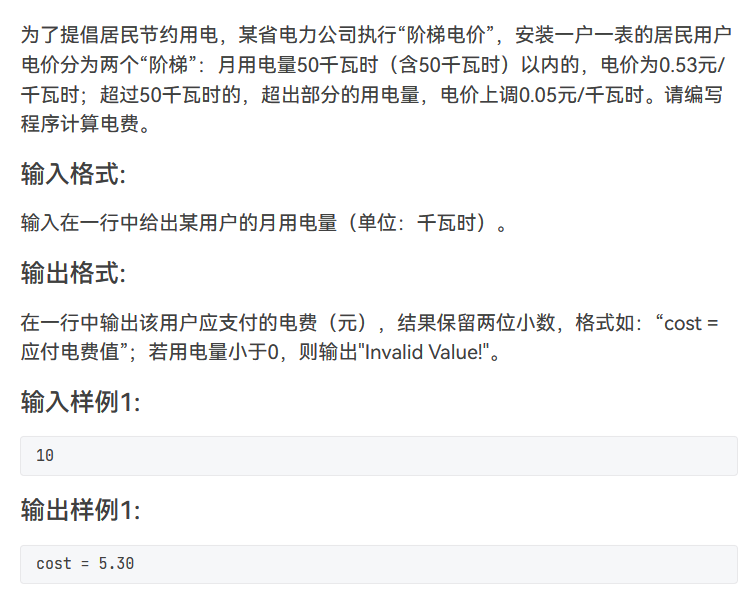

# C语言及简答题

## 简答题

### 中缀表达式与后缀表达式的转换

[中缀表达式与后缀表达式的转换](https://blog.csdn.net/Amentos/article/details/127182926?ops_request_misc=%257B%2522request%255Fid%2522%253A%2522169828740516800180670486%2522%252C%2522scm%2522%253A%252220140713.130102334..%2522%257D&request_id=169828740516800180670486&biz_id=0&utm_medium=distribute.pc_search_result.none-task-blog-2~all~top_positive~default-1-127182926-null-null.142^v96^pc_search_result_base3&utm_term=%E4%B8%AD%E7%BC%80%E8%A1%A8%E8%BE%BE%E5%BC%8F%E8%BD%AC%E5%90%8E%E7%BC%80&spm=1018.2226.3001.4187)

1、字符为 **运算数** ：

直接送入后缀表达式（注：需要先分析出完整的运算数）。

2、字符为 **左括号** ：

直接入栈（注：左括号入栈后优先级降至最低）。

3、字符为 **右括号** ：

直接出栈，并将出栈字符依次送入后缀表达式，直到栈顶字符为左括号（左括号也要出栈，但不送入后缀表达式）。

总结：只要满足 栈顶为左括号 即可进行最后一次出栈。

4、字符为 **操作符** ：

若栈空，直接入栈。

若栈非空，判断栈顶操作符，若栈顶操作符优先级低于该操作符，该操作符入栈；否则一直出栈，并将出栈字符依次送入后缀表达式，直到栈空或栈顶操作符优先级低于该操作符，该操作符再入栈。

总结：只要满足 **栈空** 或者 **优先级高于栈顶操作符** 即可停止出栈，并将该操作符入栈。

5、重复以上步骤直至遍历完成中缀表达式，接着判断字符栈是否为空，非空则直接出栈，并将出栈字符依次送入后缀表达式。

注：中缀表达式遍历完成，栈中可能还有字符未输出，故需要判断栈空。

```c
#include <stdio.h>
#include <stdlib.h>
#include <malloc.h>
#include <string.h>
#include <ctype.h>

#define ERROR 0
#define OK 1
#define STACK_INT_SIZE 10 /*存储空间初始分配量*/
#define STACKINCREMENT 5  /*存储空间分配增量*/
#define M 50

typedef char ElemType;    /*定义字符数据类型*/
typedef double ElemType2; /*定义运算数数据类型*/

/*字符栈*/
typedef struct
{
    ElemType *base;
    ElemType *top;
    int stacksize;
} SqStack;

/*运算数栈*/
typedef struct
{
    ElemType2 *base;
    ElemType2 *top;
    int stacksize;
} NStack;

int InitStack(SqStack *S);                /*构造空栈*/
int push(SqStack *S, ElemType e);         /*入栈*/
int Pop(SqStack *S, ElemType *e);         /*出栈*/
int StackEmpty(SqStack *s);               /*栈空判断*/
void in2post(ElemType *str, ElemType *p); /*中缀表达式转后缀表达式*/
double cal_post(char *str);               /*计算后缀表达式*/

/*字符栈初始化*/
int InitStack(SqStack *S)
{
    S->base = (ElemType *)malloc(STACK_INT_SIZE * sizeof(ElemType));
    if (!S->base)
        return ERROR; // 分配失败
    S->top = S->base;
    S->stacksize = STACK_INT_SIZE;
    return OK;
} /*InitStack*/

/*运算数栈初始化*/
int InitStack_N(NStack *S)
{
    S->base = (ElemType2 *)malloc(STACK_INT_SIZE * sizeof(ElemType2));
    if (!S->base)
        return ERROR;
    S->top = S->base;
    S->stacksize = STACK_INT_SIZE;
    return OK;
}

/*字符栈入栈*/
int Push(SqStack *S, ElemType e)
{
    // 判断栈满
    if (S->top - S->base >= S->stacksize)
    {
        S->base = (ElemType *)realloc(S->base, (S->stacksize + STACKINCREMENT) * sizeof(ElemType));
        if (NULL == S->base) // 分配失败
            return ERROR;
        S->top = S->base + S->stacksize;
        S->stacksize = S->stacksize + STACKINCREMENT;
    }
    *S->top = e;
    S->top++;
    return OK;
}

/*运算数栈入栈*/
int Push_N(NStack *S, ElemType2 e)
{
    if (S->top - S->base >= S->stacksize)
    {
        S->base = (ElemType2 *)realloc(S->base, (S->stacksize + STACKINCREMENT) * sizeof(ElemType2));
        if (NULL == S->base)
            return ERROR;
        S->top = S->base + S->stacksize;
        S->stacksize = S->stacksize + STACKINCREMENT;
    }
    *S->top = e;
    S->top++;
    return OK;
}

/*字符栈出栈*/
int Pop(SqStack *S, ElemType *e)
{
    // 判断栈空
    if (S->top == S->base)
        return ERROR;
    S->top--;
    *e = *S->top;
    return OK;
} /*Pop*/

/*运算数栈出栈*/
int Pop_N(NStack *S, ElemType2 *e)
{
    if (S->top == S->base)
        return ERROR;
    S->top--;
    *e = *S->top;
    return OK;
}

/*判断栈空*/
int StackEmpty(SqStack *s)
{
    if (s->top == s->base)
        return OK;
    return ERROR;
} /*StackEmpty*/

// str为待转换的中缀表达式字符串,p为转换后的后缀表达式字符串
void in2post(ElemType *str, ElemType *p)
{ /*infix to postfix*/
    SqStack s;
    InitStack(&s); // 初始化一个空字符栈
    ElemType e;
    int i;
    int j = 0;
    for (i = 0; i < strlen(str); i++) // 遍历中缀表达式
    {
        // 遇到数字和小数点直接输出
        // 使用循环完整接收一个运算数
        while (isdigit(str[i]) || '.' == str[i])
        {
            p[j++] = str[i++];
            if (!isdigit(str[i]) && '.' != str[i])
                p[j++] = ' '; // 一个数字完整输出后使用空格与其它运算符或数字分隔开
        }

        // 遇到左括号直接入栈
        if ('(' == str[i])
            Push(&s, str[i]);

        // 遇到右括号直接出栈，直到栈顶为左括号
        if (')' == str[i])
        {
            while ('(' != *(s.top - 1))
            {
                Pop(&s, &e);
                p[j++] = e;
                p[j++] = ' ';
            }
            Pop(&s, &e); // 左括号出栈但不输出
        }

        // 遇到+或—
        // 1.栈空/栈顶为左括号:直接入栈
        // 2.否则一直出栈,直到栈空/栈顶为左括号,再入栈
        if ('+' == str[i] || '-' == str[i])
        {
            while (!StackEmpty(&s) && '(' != *(s.top - 1))
            {
                Pop(&s, &e);
                p[j++] = e;
                p[j++] = ' ';
            }
            Push(&s, str[i]);
        }

        // 遇到*或/
        // 1.栈空/栈顶为左括号/栈顶操作符为+ or -:直接入栈
        // 2.否则一直出栈,直到满足1,再入栈
        if ('*' == str[i] || '/' == str[i] || '%' == str[i])
        {
            while (!StackEmpty(&s) && '(' != *(s.top - 1) && '+' != *(s.top - 1) && '-' != *(s.top - 1))
            {
                Pop(&s, &e);
                p[j++] = e;
                p[j++] = ' ';
            }
            Push(&s, str[i]);
        }
    }
    // 中缀表达式遍历完成,还需检查栈中是否有未输出字符
    // 判断栈空,非空则直接出栈并输出(左括号不用输出)
    while (!StackEmpty(&s))
    {
        Pop(&s, &e);
        if ('(' != e)
        {
            p[j++] = e;
            p[j++] = ' ';
        }
    }
    p[--j] = '\0';
} /*infix2postfix*/

// str为待计算的后缀表达式,返回值为计算结果
double cal_post(char *str)
{ /*计算后缀表达式*/
    int i;
    ElemType2 e, a, b;
    char d[M];
    NStack n;
    InitStack_N(&n); // 初始化一个运算数栈保存运算数
    for (i = 0; i < strlen(str); i++)
    {
        int j = 0;
        while (isdigit(str[i]) || '.' == str[i])
        {
            d[j++] = str[i++];
            d[j] = '\0';
            if (!isdigit(str[i]) && '.' != str[i])
            {
                e = atof(d);   // 使用atof()将字符串形式的运算数转换为double型数据
                Push_N(&n, e); // 运算数入栈
            }
        }
        switch (str[i])
        {
        case '+':
            Pop_N(&n, &b);
            Pop_N(&n, &a);
            Push_N(&n, a + b);
            break;
        case '-':
            Pop_N(&n, &b);
            Pop_N(&n, &a);
            Push_N(&n, a - b);
            break;
        case '*':
            Pop_N(&n, &b);
            Pop_N(&n, &a);
            Push_N(&n, a * b);
            break;
        case '/':
            Pop_N(&n, &b);
            Pop_N(&n, &a);
            Push_N(&n, a / b);
            break;
        }
    }
    Pop_N(&n, &e);
    return e;
} /*calculate_postfix*/

int main()
{
    char str[M];
    char post[M];
    int i;
    printf("\n输入一串中缀表达式：\n");
    gets(str);
    printf("\n对应的后缀表达式：\n");
    in2post(str, post);
    printf("%s", post);
    printf("\n\n计算后缀表达式：\n");
    printf("%f", cal_post(post));
    return 0;
}
```

## 文件

- fopen() —— 打开文件；
`FILE * fopen ( const char * filename, const char * mode );`
- fclose() —— 关闭文件；
`int fclose ( FILE * stream );`

| 使用方式      | 作用                                     | 如果文件不存在   |
| ------------- | ---------------------------------------- | ---------------- |
| "r"（只读）   | 为了输入数据，打开一个已经存在的文本文件 | 出错             |
| "w"（只写）   | 为了输出数据，打开一个文本文件           | 建立一个新的文件 |
| "a"（追加）   | 向文本文件添加数据                       | 建立一个新的文件 |
| "rb"（只读）  | 为了输入数据，打开一个二进制文件         | 出错             |
| "wb"（只写）  | 为了输出数据，打开一个二进制文件         | 建立一个新的文件 |
| "ab"（追加）  | 向一个二进制文件尾添加数据               | 出错             |
| "r+"（读写）  | 为了读和写，打开一个文本文件             | 出错             |
| "w+"（读写）  | 为了读和写，建立一个新的文本文件         | 建立一个新的文件 |
| "a+"（读写）  | 打开一个文本文件，在文件尾进行读写       | 建立一个文件     |
| "rb+"（读写） | 为了读和写，打开一个二进制文件           | 出错             |
| "wb+"（读写） | 为了读和写，建立一个新的二进制文件       | 建立一个新的文件 |
| "ab+"（读写） | 打开一个二进制文件，在文件尾进行读写     | 建立一个新的文件 |

| 函数名    | 功能           | 适用性     |
| --------- | -------------- | ---------- |
| fgetc()   | 字符输入函数   | 所有输入流 |
| fputc()   | 字符输出函数   | 所有输出流 |
| fgets()   | 文本行输入函数 | 所有输入流 |
| fputs()   | 文本行输出函数 | 所有输出流 |
| fscanf()  | 格式化输入函数 | 所有输入流 |
| fprintf() | 格式化输出函数 | 所有输出流 |
| fread()   | 二进制输入     | 文件       |
| fwrite()  | 二进制输出     | 文件       |

- fseek()函数：
该函数可以从定位位置的偏移量处开始读写；
`int fseek( FILE *stream, long offset, int origin );`
                     文件流          偏移量    起始位置
返回值：
  如果成功，fseek返回0；
    否则，它返回一个非零值；
在无法查找的设备上，返回值未定义；

- feof()函数：
该函数被许多人错误用来判断文件是否读取结束，其实它的作用是判断文件读取结束的原因；

文件读取结束有两种情况：1.读取过程中出现异常； 2.读取到文件末尾；

要找出文件读取是哪个原因，就分为以下情况：

文本文件：
> 如果用 fgetc() 读取，要判断 feof() 的返回值是否为EOF；
> 如果用 fgets() 读取，要判断 feof() 的返回值是否为NULL(0)；

二进制文件：
> 都是使用 fread() 读取，要判断其返回值与指定读取个数的大小，如果小于实际要读的个数，就说明发生读取异常，如果等于实际要读的个数，就说明是因读取成功而结束；

对于读取异常的判断，我们考虑判断 ferror() 函数的返回值：

> 若ferrror()为真——异常读取而结束；
> 若feof()为真——正常读取到尾而结束；

### 读取示例

```c
#include <stdio.h>
#include <math.h>
#include <stdlib.h>

typedef struct Shop
{
    char name[20];
    double price;
    int num;
    double totalprice;
    Shop *next;
} Shop;

Shop *create(FILE *fp)
{
    Shop *head = (Shop *)malloc(sizeof(Shop));
    Shop *tail = head;

    while (1)
    {
        Shop *temp = (Shop *)malloc(sizeof(Shop));
        fscanf(fp, "%s %lf %d %lf", &temp->name, &temp->price, &temp->num, &temp->totalprice);
        tail->next = temp;
        tail = temp;
        if (feof(fp))
            break;
    }
    tail->next = NULL;
    return head;
}

int main()
{
    FILE *fp1 = fopen("file1.txt", "r");
    FILE *fp2 = fopen("file2.txt", "r");

    Shop *shop1 = create(fp1);
    Shop *shop2 = create(fp2);

    double total1, total2;

    printf("first people\n");
    Shop *first = shop1->next;
    while (first)
    {
        total1 += first->totalprice;
        printf("%s -> ", first->name);

        first = first->next;
    }
    printf("\nfirst: %lf\n", total1);

    printf("second people\n");
    for (Shop *it = shop2->next; it != nullptr; it = it->next)
    {
        total2 += it->totalprice;
        printf("%s -> ", it->name);
    }
    printf("\nsecond: %lf\n", total2);

    printf("插值: %lf", abs(total1 - total2));

    return 0;
}
```

### 转换字符串并写入文件

```c
#include <stdio.h>
#include <math.h>
#include <stdlib.h>

// 使用格式化输入输出
int main()
{
    FILE *fpin = fopen("in.txt", "r");
    FILE *fpout = fopen("out.txt", "w");

    char str[20];
    // 格式化读，注意"%s"的格式无法读取空格和回车，遇到就结束
    fscanf(fpin, "%s", str);

    // 转换
    for (int i = 0; str[i] != '\0'; i++)
    {
        if ('a' <= str[i] && str[i] <= 'z')
        {
            str[i] = 'A' + (str[i] - 'a');
        }
    }

    // 格式化写
    fprintf(fpout, "%s", str);

    fclose(fpin);
    fclose(fpout);

    return 0;
}

// 使用字符输入输出
int main()
{
    FILE *fpin = fopen("in.txt", "r");
    FILE *fpout = fopen("out.txt", "w");

    char str[20];

    // 字符读 可以读空格 回车
    int i = 0;
    char ch;
    while ((ch = fgetc(fpin)) != EOF)
    {
        if(ch == ' ') continue;
        str[i] = (ch - 'a') + 'A';
        i++;
    }
    str[i] = '\0';

    
    
    for(int i = 0; str[i] != '\0'; i++)
    {
        fputc(str[i], fpout);
    }

    fclose(fpin);
    fclose(fpout);

    return 0;
}

// 使用字符串输入输出
int main()
{
    FILE *fpin = fopen("in.txt", "r");
    FILE *fpout = fopen("out.txt", "w");

    char str[20];

    // 字符串读 可以读空格 不能读回车
    fgets(str, 20, fpin);

    int i = 0;
    while (str[i] != '\0')
    {
        str[i] = (str[i] - 'a') + 'A';
        i++;
    }
    
    fputs(str, fpout);
    
    fclose(fpin);
    fclose(fpout);

    return 0;
}
```

## 真题

### 分解质因数

```c
int main()
{
    int n;
    scanf("%d", &n);

    for (int i = 2; i < n; i++)
    {
        while (i != n)
        {
            if (n % i == 0)
            {
                printf("%d * ", i);
                n = n / i;
            }
            else
                break;
        }
    }

    printf("%d", n);

    return 0;
}
```

### 编程题

#### 20软专

将二维数组中加起来最大的那一行删除,不数组改变原有结构

```c
int main()
{
    int m = 3, n = 4;
    int a[m][n] = {1, 1, 1, 1, 3, 3, 3, 1, 2, 2, 2, 1};

    int sum[m];
    memset(sum, 0, sizeof(sum));
    int maxIndex = 0;

    for (int i = 0; i < m; i++)
    {
        for (int j = 0; j < n; j++)
        {
            sum[i] += a[i][j];
        }
        printf("%d\n", sum[i]);
    }

    int maxSum = sum[0];
    for (int i = 0; i < m; i++)
    {
        if (maxSum < sum[i])
        {
            maxIndex = i;
            maxSum = sum[i];
        }
    }

    printf("第%d行和最大, 为%d\n", maxIndex, maxSum);

    // 删除对应行, 并且移动元素
    for (int i = maxIndex; i < m - 1; i++)
    {
        for (int j = 0; j < n; j++)
        {

            a[i][j] = a[i + 1][j];
        }
    }

    for (int i = 0; i < n; i++)
    {
        a[m - 1][i] = 0;
    }

    for (int i = 0; i < m; i++)
    {
        for (int j = 0; j < n; j++)
        {
            printf("%d", a[i][j]);
        }
        printf("\n");
    }

    return 0;
}
```

把字符串空格后面的小写字符变成大写的

```c
int main()
{
    char s[20];
    scanf("%s", &s);

    for (int i = 0; i < 20; i++)
    {
        if (s[i] == ' ' && s[i + 1] >= 'a' && s[i + 1] <= 'z')
        {
            s[i + 1] = (s[i + 1] - 'a') + 'A';
        }
    }

    std::cout << s << std::endl;

    return 0;
}
```

#### 19软专

以实数形式打印前20项, 第一项为2/1, 从第二项开始每一项的分子为前一项分子分母之和, 分母为前一项的分子

```c
int main()
{
    int n = 20;

    int fz = 2;
    int fm = 1;

    while (n > 0)
    {
        printf("%d/%d ", fz, fm);
        int temp = fz;
        fz = fz + fm;
        fm = temp;

        n--;
    }

    return 0;
}
```

输出前20组孪生素数对

```c
bool isSu(int n)
{
    if (n < 2)
        return false;
    for (int i = 2; i < n; i++)
    {
        if (n % i == 0)
            return false;
    }
    return true;
}

int main()
{
    int count = 0;

    for (int i = 0; count != 20; i++)
    {
        if (isSu(i) && isSu(i + 2))
        {
            printf("{%d %d}", i, i + 2);
            count++;
        }
    }
    return 0;
}
```

判断M和N是否是友好数, 如果M和N的约数和相等, 友好数

```c
int sumY(int n)
{
    int sum = 0;
    for (int i = 1; i < n; i++)
    {
        if (n % i == 0)
            sum += i;
    }
    return sum;
}

bool friendNum(int m, int n)
{
    return sumY(m) == sumY(n);
}

int main()
{
    int M, N;
    scanf("%d %d", &M, &N);

    if (friendNum(M, N))
    {
        printf("True");
    }
    else
    {
        printf("False");
    }

    return 0;
}
```

文件+链表合并排序

```c

typedef struct student
{
    int index;
    char name[20];
    double grade;
    student *next;
} Student;

Student *Build()
{
    Student *head = (Student *)malloc(sizeof(student));
    int n = 6;
    Student *ptr = head;

    while (n--)
    {
        Student *temp = (Student *)malloc(sizeof(student));
        scanf("%d %s %d", &temp->index, &temp->name, &temp->grade);
        ptr->next = temp;
        ptr = temp;
    }
    ptr->next = NULL;
    return head;
}

Student *Build2(FILE *file)
{
    Student *head = (Student *)malloc(sizeof(student));
    Student *p = head;

    if (file)
    {
        // 文件读到末尾返回true
        while (!feof(file))
        {
            Student *temp = (Student *)malloc(sizeof(student));
            fscanf(file, "%d %s %d", &temp->index, &temp->name, &temp->grade);
            p->next = temp;
            p = temp;
        }
        p->next = NULL;
    }
    else
    {
        printf("Error!!");
    }

    return head;
}

void Sort(Student *head)
{
    Student *p = head->next;
    Student *q;

    while (p != nullptr)
    {
        q = p->next;

        while (q != nullptr)
        {
            if (p->grade > q->grade)
            {
                Student tem = *p;
                *p = *q;
                *q = tem;

                tem.next = p->next;
                p->next = q->next;
                q->next = tem.next;
            }
            q = q->next;
        }
        p = p->next;
    }
}

Student *Merge(Student *head1, Student *head2)
{
    if (head1 == NULL)
    {
        return head2;
    }
    else if (head2 == NULL)
    {
        return head1;
    }
    else if (head1->grade < head2->grade)
    {
        head1->next = Merge(head1->next, head2);
        return head1;
    }
    else
    {
        head2->next = Merge(head2->next, head1);
        return head2;
    }
}

void print(Student *head)
{
    Student *p = head->next;
    while (p)
    {
        printf("%d %s %d\n", p->index, p->name, p->grade);
        p = p->next;
    }
}

int main()
{
    Student *res = Build();
    FILE *fp = fopen("student.txt", "r");
    Student *res2 = Build2(fp);
    Sort(res);
    Sort(res2);
    print(res);
    printf("\n");
    print(res2);
    printf("\n");
    Student *res3 = Merge(res->next, res2->next);

    print(res3);

    printf("\n");
    return 0;
}
```

#### 18软专


> 思路: 首先拆分单个数字到数组中,然后进行排序, 倒序输出即可

```c
int main()
{
    int n;
    scanf("%d", &n);

    int a[9] = {0};
    int i = 0;

    while (n / 10 != 0 && i < 9)
    {
        a[i] = n % 10;
        n = n / 10;
        i++;
    }
    a[i] = n;

    for (int i = 0; i < 9; i++)
    {
        int temp = a[i];
        int j = 0;

        for (j = i - 1; j >= 0 && a[j] > temp; j--)
        {
            a[j + 1] = a[j];
        }
        a[j + 1] = temp;
    }

    for (int i = 8; i >= 0; i--)
    {
        if (a[i] == 0)
            continue;
        printf("%d", a[i]);
    }

    return 0;
}   
```


> 遍历一遍根据ASCKALL判断即可

```c
int main()
{
    char a[100];

    scanf("%s", a);
    int d, b, c;

    for (int i = 0; a[i] != '\0'; i++)
    {
        if (a[i] >= 'a' && a[i] <= 'z')
        {
            d = 1;
        }
        else if (a[i] >= 'A' && a[i] <= 'Z')
        {
            b = 1;
        }
        else if (a[i] >= '0' && a[i] <= '9')
        {
            c = 1;
        }
    }

    if (d + b + c >= 2)
        printf("至少包含两类字符");
    else
        printf("不包含两类字符");

    return 0;
}
```


> 这道题就是从两边取值比较大小，较小的乘以系数，不断循环得到加权和

```c
int main(int a[], int n)
{
    int i = 0;
    int j = n - 1;

    int sum = 0;
    int t = 1;

    while (i <= j)
    {
        if (a[i] < a[j])
        {
            sum += a[i] * t;
            i++;
        }
        else
        {
            sum += a[t] * t;
            j--;
        }
        t++;
    }

    return sum;
}
```


> 深度优先搜索 注意图的表示形式

```c++
void dfs(int a[10][10], int n, int i, int k, int visited[], int arraved[])
{
    // 终止条件
    if (k == 0)
    {
        arraved[i] = 1;
        return;
    }

    // 分叉所有相邻的节点
    for (int t = 0; t < n; t++)
    {
        if (visited[t] == 0 && a[i][t])
        {
            visited[t] = 1;
            dfs(a, n, t, k--, visited, arraved);
            visited[t] = 0;
        }
    }
}

void distance_k(int a[10][10], int n, int i, int k)
{
    // 记录遍历过的节点
    int visited[n];
    // 记录结果
    int arraved[n];
    memset(visited, 0, sizeof(visited));
    memset(arraved, 0, sizeof(arraved));

    dfs(a, n, i, k, visited, arraved);

    for (int i = 0; i < n; i++)
    {
        if (arraved[i])
            printf("%d " arraved[i]);
    }
}
```

#### 18计专


```c
int main()
{
    int jw = 5;
    int jm = 3;
    int jc = 1 / 3;

    for (int i = 0; i <= 20; i++)
    {
        for (int j = 0; j <= 33; j++)
        {
            for (int n = 0; n < 300; n++)
            {
                if (jw * i + jm * j + jc * n == 100 && n % 3 == 0)
                {
                    printf("%d %d %d \n", i, j, n);
                }
            }
        }
    }
    return 0;
}
```


```c
int jc(int n)
{
    if (n == 0 || n == 1)
    {
        return 1;
    }

    if (n < 0)
    {
        return NULL;
    }

    return n * jc(n - 1);
}

double traverse(int n)
{
    if (n == 0)
    {
        return 0;
    }

    return (traverse(n - 1) + (n / (n + 1) * jc(n + 2))) * 1.00;
}
```


```c
void mASort(int a[], int n)
{
    for (int i = n - 1; i > 0; i--)
    {
        for (int j = 0; j < i; j++)
        {
            if (a[j] > a[j + 1])
            {
                int temp = a[j];
                a[j] = a[j + 1];
                a[j + 1] = temp;
            }
        }
    }
}

bool kblk(int n)
{
    if (n == 6174)
    {
        return true;
    }

    int a[4] = {0};
    for (int i = 0; i < 4; i++)
    {
        a[i] = n % 10;
        n = n / 10;
    }
    mASort(a, 4);

    int minValue = 0;
    int maxVlaue = 0;
    for (int i = 0; i < 4; i++)
    {
        minValue = minValue * 10 + a[i];
        maxVlaue = maxVlaue * 10 + a[3 - i];
    }

    int res = maxVlaue - minValue;
    printf("%d\n", res);
    kblk(res);
    return false;
}

int main()
{
    kblk(9998);
    return 0;
};
```


```c
typedef struct Point
{
    int x, int y;
} Point;

double dist(Point x, Point y)
{
    return sqrt((x.x - y.x) * (x.x - y.x) + (y.y - x.y) * (y.y - x.y));
}

double square(Point a, Point b, Point c)
{
    double e1 = dist(a, b);
    double e2 = dist(a, c);
    double e3 = dist(b, c);

    double s = (e1 + e2 + e2) / 2;

    return sqrt(s * (s - e1) * (s - e2) * (s - e3));
}

void maxTrangle(int ax[], int ay[], int n)
{
    Point ps[n];
    for (int i = 0; i < n; i++)
    {
        ps[i].x = ax[i];
        ps[i].y = ay[i];
    }

    double maxArea = 0;
    Point maxPoint[3];

    for (int i = 0; i < 98; i++)
    {
        for (int j = i + 1; j < 99; j++)
        {
            for (int k = j + 1; k < 100; k++)
            {
                int sq = square(ps[i], ps[j], ps[k]);
                if (sq > maxArea)
                {
                    maxArea = sq;
                    maxPoint[0] = ps[i];
                    maxPoint[1] = ps[j];
                    maxPoint[2] = ps[k];
                }
            }
        }
    }

    printf("%lf", maxArea);
    for (int i = 0; i < 3; i++)
    {
        printf("%d %d\n", maxPoint[i].x, maxPoint[i].y);
    }
}
```

#### 17软专


```c
int main()
{
    int n;
    scanf("%d", &n);

    int count;
    if (n > 0)
    {
        while (n != 1)
        {
            if (n % 2 == 0)
            {
                n = n / 2;
            }
            else
            {
                n = n * 3 + 1;
            }
            count++;
        }
        printf("经过了%d次变换", count);
    }
    else
    {
        printf("输入必须大于0");
        return 0;
    }
    return 0;
}
```


> 使用哈希表, 记录下s表值, 再把结果存到数组返回就行, 函数返回数组只能返回指针, 动态分配内存

```c
int *search(char *s, char a[20], int n)
{
    int hashtable[255] = {0};
    int *res = (int *)malloc(sizeof(int) * n);

    int i = 0;
    while (s[i] != '\0')
    {
        hashtable[s[i]]++;
        i++;
    }

    for (int i = 0; i < n; i++)
    {
        res[i] = hashtable[a[i]];
    }

    return res;
}

int main()
{
    char *s = "aaabbbddddeeeeyyy";
    char a[5] = {'a', 'b', 'c', 'd', 'e'};
    int *res = search(s, a, 5);
    for (int i = 0; i < 5; i++)
    {
        printf("%d", res[i]);
    }
}
```


> 不要想复杂了, 遍历一遍就行了

```c
int hasSeven(int n)
{
    while (n)
    {
        if (n % 10 == 7)
        {
            return 1;
        }
        n = n / 10;
    }
}

int main()
{
    int n;
    scanf("%d", &n);
    if (n < 7)
        return 0;
    
    for(int i = 1; i< n; i++)
    {
        if(i % 7 == 0 || hasSeven(i))
        {
            printf("%d, ", i);
        }
    }
    return 0;
}
```


> 遍历二维数组, 每当小于等于0时, 就将该行该列第一个元素置为0;
> 如果第一行或者第一列有小于等于0元素, 用标志位记录下来, 不然置为0后记不清是否有0了

```c
void setZero(int a[5][5], int m, int n)
{
    bool row0 = false, col0 = false;
    for (int i = 0; i < m; i++)
    {
        for (int j = 0; j < n; j++)
        {
            if (a[i][j] <= 0)
            {
                if (i == 0)
                {
                    row0 = true;
                }
                if (j == 0)
                {
                    col0 = true;
                }
                a[0][j] = 0;
                a[i][0] = 0;
            }
        }
    }

    for (int i = 1; i < m; i++)
    {
        for (int j = 1; j < n; j++)
        {
            if (a[i][0] == 0 || a[0][j] == 0)
                a[i][j] = 0;
        }
        if (col0)
        {
            for (int i = 0; i < m; i++)
            {
                a[i][0] = 0;
            }
        }
        if (row0)
        {
            for (int i = 0; i < n; i++)
            {
                a[0][i] = 0;
            }
        }
    }
}
```

#### 17计专


#### 16软专


> 直接排序, 第k大的数就是第m-k个数

```c
int portition(int a[], int low, int high)
{
    int k = a[low];
    while (low < high)
    {
        while (low < high && a[high] > k)
        {
            high--;
        }

        a[low] = a[high];

        while (low < high && a[low] < k)
        {
            low++;
        }
        a[high] = a[low];
    }
    a[high] = k;
    return high;
}

void quick_Soct(int a[], int low, int high)
{
    if (low < high)
    {
        int mid = portition(a, low, high);
        quick_Soct(a, low, mid - 1);
        quick_Soct(a, mid + 1, high);
    }
}

int main()
{
    int a[10] = {19, 2, 39, 4, 59, 6, 79, 8, 9};
    quick_Soct(a, 0, 9);
    for (int i = 0; i < 10; i++)
    {
        std::cout << a[i] << " ";
    }
    printf("%d", a[10 - 2]);
}
```


> 如果末尾是0, 加一即可
> 如果末尾是1, 从后往前找到第一个0, 记录其位置并将其置一
> 然后将其后的元素全置为0
> 注意边界问题

```c
void plusOne(int a[], int n)
{
    if (a[n - 1] == 0)
    {
        a[n - 1] += 1;
        return;
    }

    int flag = -1;

    for (int i = n; i >= 0; i--)
    {
        if (a[i] == 0)
        {
            flag = i;
            a[i] = 1;
        }
    }

    for (int i = n; i > flag; i--)
    {
        a[i] = 0;
    }

    // if(flag == -1) a[0] = 0;
}

int main()
{
    int a[4] = {1, 1, 1, 1};
    plusOne(a, 4);
    for (int i = 0; i < 4; i++)
    {
        std::cout << a[i] << " ";
    }
}
```


```c
#include <stdio.h>
#include <math.h>
#include <stdlib.h>
#include <memory.h>

#include <iostream>

int *unions(int a[], int an, int b[], int bn, int *size)
{
    *size = 0;
    int maxN = 0;
    int minN = 0;
    if (an < bn)
    {
        maxN = bn;
        minN = an;
    }
    else
    {
        minN = bn;
        maxN = an;
    }

    int *res = (int *)malloc(sizeof(int) * maxN);

    for (int i = 0; i < minN; i++)
    {
        if (a[i] == 1 || b[i] == 1)
        {
            res[i] = 1;
        }
        else if (a[i] == 0 && b[i] == 0)
        {
            res[i] = 0;
        }
        (*size)++;
    }

    if (bn > an)
    {
        for (int i = minN; i < bn; i++)
        {
            res[i] = b[i];
            (*size)++;
        }
    }
    else
    {
        for (int i = minN; i < an; i++)
        {
            (*size)++;
            res[i] = a[i];
        }
    }
    return res;
}

int *intersection(int a[], int an, int b[], int bn, int *size)
{
    int minN;
    *size = 0;
    if (an < bn)
    {
        minN = an;
    }
    else
    {
        minN = bn;
    }

    // 结果数组
    int *res = (int *)malloc(sizeof(int) * minN);

    for (int i = 0; i < minN; i++)
    {
        if (a[i] == 1 && b[i] == 1)
        {
            res[i] = a[i];
        }
        else{
            res[i] = 0;
        }
        (*size)++;
    }

    return res;
}

int main()
{
    int a[9] = {0, 0, 0, 1, 1, 0, 1, 0, 1};
    int b[7] = {0, 0, 1, 1, 1, 1, 1};

    int *sizeU;
    int *un = unions(a, 9, b, 7, sizeU);
    int *sizeI;
    int *in = intersection(a, 9, b, 7, sizeI);
    for (int i = 0; i < (*sizeU); i++)
    {
        std::cout << un[i] << " ";
    }
    for (int i = 0; i < (*sizeI); i++)
    {
        std::cout << in[i] << " ";
    }
}
```


```c
// 开头一定为Y/N/2
// Y/N 后面肯定是 Y/N/2
// 2之后一定是y/n/1
// y/n之后一定是 y/n/1
// 1之后只能是Y/N/2
bool idTrue(char *s)
{
    if (s[0] != 'Y' && s[0] 'N' && s[0] != '2')
    {
        return false;
    }

    int i = 1;
    while (s[i] != '\0')
    {
        if (s[i] == 'Y' || s[i] == 'N')
        {
            if (s[i + 1] != 'Y' && s[i + 1] != 'N' && s[i + 1] != '2')
                return false;
        }
        else if (s[i] == '2')
        {
            if (s[i + 1] == '\0')
            {
                break;
            }
            if (s[i + 1] != 'y' && s[i + 1] != 'n' && s[i + 1] != '1')
            {
                return false;
            }
        }
        else if (s[i] == 'y' || s[i] == 'n')
        {
            if (s[i + 1] != 'y' && s[i + 1] != 'n' && s[i + 1] != '1')
                return false;
        }
        else if (s[i] == '1')
        {
            if (s[i + 1] == '\0')
            {
                break;
            }
            if (s[i + 1] != 'Y' && s[i + 1] != 'N' && s[i + 1] != '2')
            {
                return false;
            }
        }
        else
        {
            return false;
        }
        i++;
    }
    return true;
}
```

#### 15软专


> 哈希一遍就行
> 注意表初始化0

```c
void CountChar(char *s)
{
    int i = 0;
    int count = 0;

    int hashtable[26] = {0};

    while (s[i] != '\0')
    {
        if (s[i] >= 'a' && s[i] <= 'z')
        {
            hashtable[s[i] - 'a']++;
        }
        i++;
    }

    for (int i = 0; i < 26; i++)
    {
        printf("%c has %d ", i + 'a', hashtable[i]);
    }
}

int main()
{
    char *s = "abcdefgghijklmnopqrstuvwx";
    CountChar(s);
    return 0;
}
```


```c
void check(char *s)
{
    int i = 0;
    int sum = 0;

    while (s[i] != '\0')
    {
        if (s[i] >= '0' && s[i] <= '9')
        {
            sum = sum * 10 + s[i] - '0';
        }
        else
        {
            printf("Wrong");
            return;
        }
        i++;
    }

    printf("%d", sum);
}

int main()
{
    char *s = "20Y14";
    check(s);
    return 0;
}
```


```c
void curb(int n)
{
    n = 10;
    int l = 0, r = n - 1, t = 0, b = n - 1;
    int count = 1;
    int a[n][n];

    for (int i = 0; i < n; i++)
    {
        for (int j = 0; j < n; j++)
        {
            a[i][j] = 0;
        }
    }

    while (count <= n * n)
    {
        for (int i = l; i <= r; i++)
        {
            a[t][i] = count;
            count++;
        }
        t++;
        for (int i = t; i <= b; i++)
        {
            a[i][r] = count;
            count++;
        }
        r--;
        for (int i = r; i >= l; i--)
        {
            a[b][i] = count;
            count++;
        }
        b--;
        for (int i = b; i >= t; i--)
        {
            a[i][l] = count;
            count++;
        }
        l++;
    }

    for (int i = 0; i < n; i++)
    {
        for (int j = 0; j < n; j++)
        {
            printf("%d ", a[i][j]);
        }
        printf("\n");
    }
}

int main()
{
    curb(10);
    return 0;
}
```


```c
void dfs(int A[], int n, int **res, int *size,
         int **num, int path[], int pathSize, int start, int M)
{
    if (pathSize == M)
    {
        // 二位数组分配内存
        res[*size] = (int *)malloc(sizeof(int) * pathSize);
        // 用一个二维数组将对应的行path的大小存下来
        (*num)[*size] = pathSize;
        // 将path存到res里
        for (int i = 0; i < pathSize; i++)
        {
            res[*size][i] = path[i];
        }
        // 将二位数组行指针下移
        (*size)++;
        return;
    }

    for (int i = start; i < n; i++)
    {
        path[pathSize] = A[i];
        dfs(A, n, res, size, num, path, pathSize + 1, i + 1, M);
    }
}

int **subset(int A[], int n, int *size, int **num, int M)
{
    int **res = (int **)malloc(sizeof(int *) * 100);
    *num = (int *)malloc(sizeof(int) * 100);
    int path[n];
    *size = 0;
    dfs(A, n, res, size, num, path, 0, 0, M);
    return res;
}

int main()
{
    int A[4] = {1, 2, 3, 4};
    int n;
    int *num;
    int *size;
    int **result = subset(A, 4, size, &num, 2);
    for (int i = 0; i < *size; i++)
    {
        for (int j = 0; j < num[i]; j++)
        {
            printf("%d ", result[i][j]);
        }
        printf("\n");
    }
}
```

#### 14软专


```c
bool IsPrime(int n)
{
    if(n <= 1)
    {
        return false;
    }
    for(int i = 2; i< n; i++)
    {
        if(n%i == 0)
        {
            return false;
        } 
    }
    return true;
}

void Find(int n)
{
    for(int i = 2; i<n;i++ )
    {
        if(IsPrime(i) && IsPrime(n-i))
        {
            printf("%d = %d + %d", n, i, n-i);
            break;
        }
    }

}

int main()
{
    Find(16);
    return 0;
}
```


```c
typedef struct Point
{
    int x, y;
} Point;

double dist(Point a, Point b)
{
    return (double)sqrt((a.x - b.x) * (a.x - b.x) + (a.y - b.y) * (a.y - b.y));
}

double Area(Point a, Point b, Point c)
{
    double ab = dist(a, b);
    double bc = dist(b, c);
    double ac = dist(a, c);

    double h = (ab + bc + ac) / 2;

    return (double)sqrt(h * (h - ab) * (h - ac) * (h - bc));
}

void Cheek()
{
    Point a, b, c, d;
    scanf("%d %d", &a.x, &a.y);
    scanf("%d %d", &b.x, &b.y);
    scanf("%d %d", &c.x, &c.y);
    scanf("%d %d", &d.x, &d.y);

    double abc = Area(a, b, c);
    double abd = Area(a, b, d);
    double bcd = Area(b, d, c);
    double acd = Area(a, c, d);

    if (abc == abd + acd + bcd)
    {
        printf("Yes");
    }
    else
    {
        printf("No");
    }
}

int main()
{
    Cheek();
    return 0;
}
```


> 将a数组的第i位于b数组的第j位相乘的结果存到c数组的第i+j位
> 将c数组中大于等于10的数的个位留存, 十位往上加到第i+1位上去

```c
void mul(int a[], int an, int b[], int bn, int c[100], int *k)
{
    for (int i = 0; i < 100; i++)
        c[i] = 0;
    for (int i = 0; i < an; i++)
    {
        for (int j = 0; j < bn; j++)
        {
            c[i + j] += a[i] * b[i];
        }
    }

    for (int i = 0; i < 100; i++)
    {
        if (c[i] >= 10)
        {
            c[i + 1] += c[i] / 10;
            c[i] = c[i] % 10;
        }

        if (c[i] != 0)
        {
            *k = i;
        }
    }
}
```


```c
typedef struct Point
{
    int x, y;
} Point;

double dist(Point a, Point b)
{
    return (double)sqrt((a.x - b.x) * (a.x - b.x) + (a.y - b.y) * (a.y - b.y));
}

double Area(Point a, Point b, Point c)
{
    double ab = dist(a, b);
    double bc = dist(b, c);
    double ac = dist(a, c);

    double h = (ab + bc + ac) / 2;

    return (double)sqrt(h * (h - ab) * (h - ac) * (h - bc));
}

double MaxArea()
{
    int n = 100;
    double maxArea = 0;
    Point[100];
    for(int i =0 ; i< n; i++)
    {
        scanf("%d %d", &(Point[i].x), &(Point[i].y));
    }

    for(int i = 0; i< n; i++)
    {
        for(int j = 0; j < n; j++)
        {
            for(int k = 0; k< n; k++)
            {
                if(maxArea < Area(Point[i], Point[j], Point[k]))
                {
                    maxArea = Area(Point[i], Point[j], Point[k]);
                }
            }
        }
    }
    return maxArea;
}
```

#### 13软专


```c
int main(void)
{
    double sum, t, x;
    int i;

    scanf("%lf", &x);

    sum = x;
    i = 1;
    t = x;
    while (fabs(t) >= 1e-8)
    {
        t = -x * x * t / ((2 * i + 1) * (i * 2));
        sum = sum + t;
        i++;
    }
    printf("%f\n", sum);
    return 0;
}
```


```c
void bubleSort(int a[], int n)
{
    bool flag = true;
    while (flag)
    {
        flag = false;
        for (int i = 0; i < n - 1; i++)
        {
            if (a[i] > a[i + 1])
            {
                flag = true;
                int temp = a[i];
                a[i] = a[i + 1];
                a[i + 1] = temp;
            }
        }
    }
    return;
}

void sumUp()
{
    int score[10];
    for (int i = 0; i < 10; i++)
    {
        scanf("%d", &score[i]);
    }

    bubleSort(score, 10);

    int sum = 0;
    for (int i = 1; i < 9; i++)
    {
        sum += score[i];
    }
    printf("%d", sum / 8);
}

int main(void)
{
    sumUp();
    return 0;
}
```


```c
int main()
{
    int n;
    scanf("%d", &n);

    for (int i = 2; i < n; i++)
    {
        while (i != n)
        {
            if (n % i == 0)
            {
                printf("%d * ", i);
                n = n / i;
            }
            else
                break;
        }
    }

    printf("%d", n);

    return 0;
}
```


> 法雷序列
> 首尾为0/1 1/1 中间元素就是 1/2

```c

typedef struct LinkedNode
{
    int up, down;
    LinkedNode *next;
} LinkNode;

void tracing(LinkNode *a, LinkNode *b, int n)
{
    if (a->down + b->down > n)
        return;

    LinkNode *p = (LinkNode *)malloc(sizeof(LinkedNode));

    p->up = a->up + b->up;
    p->down = a->down + b->down;

    a->next = p;
    p->next = b;

    tracing(a, p, n);
    tracing(p, b, n);
    return;
}

void Create()
{
    int n;
    scanf("%d", &n);

    LinkNode *head = (LinkNode *)malloc(sizeof(LinkedNode));
    head->up = 0;
    head->down = 1;

    LinkNode *tail = (LinkNode *)malloc(sizeof(LinkedNode));
    tail->up = 1;
    tail->down = 1;

    head->next = tail;
    tracing(head, tail, n);

    LinkNode *p = head->next;
    while (p !=tail)
    {
        printf("%d/%d ", p->up, p->down);
        p = p->next;
    }
}

int main()
{
    Create();
}
```

#### 12软专


```c
void ttoe()
{
    int n;
    scanf("%d", &n);
    int a[99] = {0};

    int i = 0;
    while (n)
    {
        a[i++] = n % 8;
        n = n / 8;
    }

    for (int j = i - 1; j >= 0; j--)
    {
        printf("%d", a[j]);
    }
}

int main()
{
    ttoe();
}
```


> 注意化简分数要除以最大公因数
> 分数用结构体储存

```c
typedef struct Fn
{
    int up, down;
    Fn *next;
} LinkNode;

int gcd(int a, int b)
{
    if (b == 0)
    {
        return a;
    }
    else
    {
        return gcd(b, a % b);
    }
}

void bubble(LinkNode a[], int n)
{
    for (int i = n - 1; i > 0; i--)
    {
        for (int j = 0; j < i; j++)
        {
            if (1.0 * a[j].up / a[j].down > 1.0 * a[j].up / a[j].down)
            {
                LinkNode p = a[j];
                a[j] = a[j + 1];
                a[j + 1] = p;
            }
        }
    }
}

void simply()
{
    LinkNode a[100];

    for (int i = 0; i < 100; i++)
    {
        scanf("%d %d", &a[i].up, &a[i].down);
    }

    for (int i = 0; i < 100; i++)
    {
        int gcds = gcd(a[i].up, a[i].down);
        a[i].up /= gcds;
        a[i].down /= gcds;
    }

    bubble(a, 100);

    for (int i = 0; i < 100; i++)
    {
        printf("%d %d", a[i].up, a[i].down);
    }
}

int main()
{
    simply();
}
```


> 使用哈希表

```c
bool IsTrue(char *s)
{
    int hashtable[26] = {0};
    int i = 0;
    while (s[i] != '\0')
    {
        hashtable[s[i] - 'a']++;
        i++;
    }

    for (int i = 4; i < 26; i++)
    {
        if (hashtable[i] > 0)
        {
            return false;
        }
    }

    if (hashtable[0] > 0 && hashtable[3] > 0)
    {
        return true;
    }

    return false;
}

int main()
{
    char *s = "bbbiidd";
    if (IsTrue(s))
    {
        printf("Y");
    }
    else
    {
        printf("N");
    }
    return 0;
}
```


> 前缀转后缀, 运算符号入栈, 左括号和其他数字直接输出, 遇到右括号输出并出一次栈

```c
void IntoPost()
{
    char s[50];
    scanf("%s", s);
    char stack[40];
    int top = -1, i = 0;
    while (s[i] != '\0')
    {
        if (s[i] == '+' || s[i] == '-' || s[i] == '*' || s[i] == '/')
        {
            stack[++top] = s[i];
        }
        else if (s[i] == ')')
        {
            printf(")");
            printf("%c", stack[top--]);
        }
        else
        {
            printf("%c", s[i]);
        }
        i++;
    }
}
```

### 算法题

#### 18软专


> 首先将两个链表翻转
> 然后让头指针指向较大的链表头结点
> 然后再定义一个指针进行循环比较合并

```c++
typedef struct ListNode
{
    int val;
    ListNode *next;
} Lis;

// 利用双指针进行逆置
Lis *Reverse(Lis *head)
{
    Lis *pre = nullptr;
    Lis *cur = head;
    Lis *temp;

    while (cur != nullptr)
    {
        temp = cur->next;
        cur->next = pre;
        pre = cur;
        cur = temp;
    }

    return pre;
}

Lis *Merge(Lis *head1, Lis *head2)
{
    Lis *p = Reverse(head1);
    Lis *q = Reverse(head2);

    Lis *head, *rear;

    if (p == nullptr)
    {
        return q;
    }
    else if (q == nullptr)
    {
        return p;
    }

    if (p->val > q->val)
    {
        head = p;
        p = p->next;
    }
    else
    {
        head = q;
        q = q->next;
    }

    rear = head;

    while (q != nullptr && p != nullptr)
    {
        if (p->val > q->val)
        {
            rear->next = p;
            p = p->next;
        }
        else
        {
            rear->next = q;
            q = q->next;
        }
        rear = rear->next;
    }

    if(p != nullptr)
    {
        rear->next = p;
    }

    if(q != nullptr)
    {
        rear ->next = q;
    }

    return head;
}
```


> 使用深度优先搜索, 将路径全部遍历出来,在存进二维数组里

```c
// 边表
typedef struct ArcNode
{
    int adjvex; // 节点值
    int info;   // 边值
    ArcNode *next;
} Arcnode;

// 顶点表
typedef struct VNode
{
    int data;
    struct ArcNode *first;
} VNode;

type struct
{
    VNode adjlist[maxnum];
    int n, e; // 顶点数和边数
} AGraph;

//@parma index
void dfs(AGraph *g, int u, int v, int **result, int *size, int **num, int *path, int *visited, int index)
{
    path[index] = u;
    if (u == v)
    {
        result[*size] = (int *)malloc(sizeof(int) * (index) + 1);
        num[*size] = index + 1;
        for (int i = 0; i <= index; i++)
        {
            result[*size][i] = path[i];
        }
        (*size)++; // 结果路径的数目

        return;
    }

    ArcNode *p = g->adjlist[u];

    while (p)
    {
        if (visited[p - adjvex] == 0)
        {
            visited[p->adjvex] = 1;
            dfs(g, p, v, result, size, num, path, visited, index + 1);
            visited[p->adjvex] = 0;
        }
        p = p->next;
    }
}

int **FindAllPath(AGraph *g, int u, int v, int *size, int **num)
{
    int **result = (int **)malloc(sizeof(int *) * maxnum); // 结果数组
    *num = (int *)malloc(sizeof(int) * maxnum);            // 结果数组的每一行的路径大小;
    intvisited[g->n], path[maxnum];
    for (int i = 0; i < g->n; i++)
    {
        visited[i] = 0;
    }
    *size = 0;
    visited[u] = 1;
    dfs(g, u, v, result, size, numpath, visited, 0);
    return result;
}
```

#### 18计专


```c
void sortNP(int a[], int n)
{
    int i = 0;
    int j = n - 1;

    while (i < j)
    {
        while (a[i] < 0 && i < j)
        {
            i++;
        }
        while (a[j] >= 0 && i < j)
        {
            j--;
        }

        int temp = a[i];
        a[i] = a[j];
        a[j] = temp;

        i++;
        j--;
    }

    for (int i = 0; i < n; i++)
    {
        printf("%d ", a[i]);
    }
}

int main()
{
    int a[10] = {1, 3, 4, 5, 0, -1, -2, -5, -6};
    sortNP(a, 10);
    return 0;
}
```


> 求两次最短路径,先求得最长的最短路径,再以此顶点为起点再求的最长的最短路径就是直径

```c
typedef struct EdgeNode
{
    int val;
    int edge;
    EdgeNode *next;
} EdgeNode;

typedef struct ArcNode
{
    int val;
    EdgeNode *first;
} ArcNode;

typedef struct AGraph
{
    ArcNode adj[100];
    int pointNum, edgeNum;
};

int ShortestPath(AGraph *g, int v, int dist[])
{
    int *queue = (int *)malloc(sizeof(int) * g->n);
    int front = -1;
    int rear = -1;

    for (int i = 0; i < g->n; i++)
    {
        dist[i] = -1;
    }
    // 起点路径为0
    dist[v] = 0;
    queue[++rear] = v;
    while (front != rear)
    {
        int p = queue[++front];
        EdgeNode *q = g->adj[p].first;
        while (q != NULL)
        {
            if (dist[q->val] == -1)
            {
                dist[q->val] += dist[p] + q->edge;
                queue[++rear] = q;
            }
            q = q->next;
        }
    }

    int max = 0;
    for(int i = 0; i< g->n; i++
    {
        if (dist[i] > dist[max])
        {
            max = i;
        }
    }

    // 返回节点
    return max;
}

int Diameter(AGraph *g)
{
    int dist[g->n];
    int first = ShortestPath(g, 0, dist);
    printf("%d", first);

    int last = ShortestPath(g, first, dist);
    printf("%d", last);
    return dist[last];
}
```

#### 17软专


```c
typedef struct TreeNode
{
    int val;
    TreeNode *left, *right;
} TreeNode;

void traverse(TreeNode *root, int level)
{
    if (root)
    {
        printf("%d %d", level, root->val);
        traverse(root->left, level + 1);
        traverse(root->right, level + 1);
    }
}
```


```c
typedef struct DLinkNode
{
    DLinkNode *LLink;
    DLinkNode *RLink;
    int Data;
    int Freq;
} DLinkNode;

void Locate(DLinkNode l, int x)
{
    DLinkNode *p = l->RLink;
    while (p != NULL && p->Data != x)
    {
        p = p->RLink;
    }
    if (p != NULL)
    {
        p - > Freq++;
    }

    DLinkNode *q = p;
    while (q ! = l && q->Freq < p->Freq)
    {
        q = q->LLink;
    }
    if (q != l)
    {
        p->LLink->RLink = p->RLink;
        p->RLink->LLink = p->LLink;

        p->LLink = q;
        p->RLink = q->RLink;
        q->RLink = p;
        p->RLink->LLink = p;
    }
}
```

#### 17计专


```c
void insert(int a[], int x, int n)
{
    for (int i = n - 1; i > 0; i--)
    {
        if (a[i] > x)
        {
            a[i + 1] = a[i];
        }
        else
        {
            a[i] = x;
            return;
        }
    }
    return;
}
```


```c
typedef struct TreeNode
{
    int data;
    TreeNode *left;
    TreeNode *right;
} TreeNode;

TreeNode *createByS(int s[], int n)
{
    if (n == 0)
    {
        return NULL;
    }

    TreeNode *root = (TreeNode *)malloc(sizeof(TreeNode));
    TreeNode *p = root;
    int i = 0, top = -1;

    TreeNode **stack = (TreeNode **)malloc(sizeof(TreeNode *) * 100);

    while (p != NULL || top != -1)
    {
        if (p != NULL)
        {
            if ([i] == 0)
            {
                p->left = NULL;
                p->right = NULL;
            }
            else if (s[i] == 1)
            {
                TreeNode *temp = (TreeNode *)malloc(sizeof(TreeNode));
                p->left = temp;
                p->right = NULL;
            }
            else if (s[i] == 2)
            {
                TreeNode *temp1 = (TreeNode *)malloc(sizeof(TreeNode));
                TreeNode *temp2 = (TreeNode *)malloc(sizeof(TreeNode));
                p->left = temp1;
                p->right = temp2;
            }

            stack[++top] = p;
            p = p->left;
            i++;
        }
        else
        {
            p = stack[top--];
            p = p->right;
        }
    }

    return root;
}
```

#### 16软专


```c
typedef struct TreeNode
{
    int val;
    TreeNode *left, *right;
} TreeNode;

int IsPerfect(TreeNode *root)
{
    TreeNode **queue = (TreeNode **)malloc(sizeof(TreeNode *));
    int front = -1, rear = -1;
    queue[++rear] = root;
    bool flag = 0;
    while (front != rear)
    {
        TreeNode *node = queue[++front];
        if (node != NULL)
        {
            if (flag == 1)
            {
                return 0;
            }
            else
            {
                queue[++rear] = node->left;
                queue[++rear] = node->right;
            }
        }
        else
        {
            flag = 1;
        }
    }
    return 1;
}
```


```c
typedef struct EdgeNode
{
    int val;
    int edge;
    EdgeNode *next;
} EdgeNode;

typedef struct HeadNode
{
    int val;
    EdgeNode *first
} HeadNode;

typedef struct AGraph
{
    HeadNode adj[100];
    int n, e;
} AGraph;

bool hasCycle = false;

void traverse(AGraph *g, int start, int visited[], int onPath[], int preorder[], int *preorderSize)
{
    if (onPath[start])
    {
        hasCycle = true;
    }

    if (hasCycle || visited[start])
    {
        return;
    }

    visited[start] = 1;
    onPath[start] = 1;

    EdgeNode *p = g->adj[start].first;
    while (p)
    {
        dfs(g, p->val, visited, onPath, preorder, preorderSize);
    }

    preorder[(*preorderSize)++] = start;
    onPath[start] = 0;
}

void TPSort(AGraph *g)
{
    // 判断节点是否被递归过
    int visited[g->n] = {0};
    // 保存路径上的节点
    int onPath[g->n] = {0};
    // 后序数组
    int preorder[g->n] = {0};

    int *preorderSize = 0;

    traverse(g, 0, visited, onPath, preorder, preorderSize);

    if (hasCycle)
    {
        printf("wu");
    }

    int i = 0, j = (*preorderSize) - 1;
    while (i < j)
    {
        int temp = preorder[i];
        preorder[i] = preorder[j];
        preorder[j] = temp;

        i++;
        j--;
    }
}

```

#### 15软专


```c
typedef struct ENode
{
    int val;
    int edge;
    ENode *next;
} ENode;

typedef struct ANode
{
    int val;
    ENode *first;
}

typedef struct
{
    ANode adj[100];
    int e, n;
} AGraph;

void Dfs(AGraph *g, int v, int *countvnum, int *countenum, int visited[])
{
    visited[v] = 1;
    (*countvnum)++;
    ENode *p = g->adj[v]->first;
    while (p)
    {
        (*countenum)++;
        if (visited[p->val] == 0)
        {
            Dfs(g, p->val, countvnum, countenum, visited);
        }
        p = p->next;
    }
}

bool isTree(AGraph *g)
{
    int visited[g->n] = {0};
    int countvnum, countenum = 0;
    Dfs(g, 0, &countvnum, &countenum, visited);
    if (countvnum == g->n && countenum == (g->n - 1) * 2)
    {
        return true;
    }
    else
    {
        return false;
    }
}
```


> 双指针, 左边循环找偶数, 右边循环找奇数,找到后互换, 直到i jx相遇

```c
void partion(int s[], int n)
{
    int low = 0, high - n - 1;
    while (i < j)
    {
        while (a[i] % 2 == 0 && i < j)
        {
            i++;
        }

        while (a[j] % 2 != 0 && i < j)
        {
            j--;
        }

        if (i < j)
        {
            int temp = a[i];
            a[i] = a[j];
            a[j] = temp;
        }
    }
}
```

#### 14软专


> 使用栈进行存储节点, 然后出栈序列就是题目所要求的
> 注意操作上还是需要队列来进行层序遍历然后取节点加入栈中, 因为直接只用栈无法实现要求操作,在人脑中倒可以

```c
typedef struct TreeNode
{
    int val;
    TreeNode *left, *right;
} TreeNode;

void InvertLevelOrder(TreeNode *root)
{
    TreeNode **queue = (TreeNode **)malloc(sizeof(TreeNode *) * 100);
    int front = -1, rear = -1;
    TreeNode **stack = (TreeNode **)malloc(sizeof(TreeNode *) * 100);
    in top = -1;

    queue[++rear] = root;
    while (front != rear)
    {
        TreeNode *p = queue[++front];
        stack[++top] = p;
        if (p->left != NULL)
        {
            queue[++rear] = p->left;
        }
        if (p->right != NULL)
        {
            queue[++rear] = p->right;
        }
    }

    while (top != -1)
    {
        printf("%d", stack[top--]->val);
    }
}
```


```c
typedef struct TreeNode
{
    int val;
    TreeNode *left, *right;
} TreeNode;

int IsBanlanceTree(TreeNode *root)
{
    if (root->left == NULL && root->right == NULL)
        return 0;

    int left = IsBanlanceTree(root->left);
    int right = IsBanlanceTree(root->right);

    if (left == -1 || right == -1)
    {
        return -1;
    }

    if (abs(left - right) > 1)
    {
        return -1;
    }

    return max(left, right) + 1;
}
```

#### 13软专


```c
void binSort(int a[], int n, int target)
{
    int low = 0, high = n - 1;

    while (low <= high)
    {
        int mid = low + ((high - low) / 2);
        if (a[mid] > target)
        {
            high = mid - 1;
        }
        else if (a[mid] < target)
        {
            low = mid + 1;
        }
        else
        {
            for (int i = mid; i < n - 1; i++)
            {
                a[i] = a[i + 1];
            }
        }
    }
}

int main()
{
    int a[10] = {1, 2, 3, 4, 5, 6, 7, 8, 9};
    binSort(a, 9, 4);
    for (int i = 0; i < 9; i++)
    {
        printf("%d", a[i]);
    }
}
```


```c
typedef struct LinkNode
{
    int val;
    LinkNode *next;
} LinkNode;

// 合并过程就是将链表按从小到大的顺序合并
LinkNode *Merge(LinkNode *head1, LinkNode *head2)
{
    LinkNode *dummyHead = (LinkNode *)malloc(sizeof(LinkNode));
    LinkNode *rear = dummyHead;

    while (head1 != NULL && head2 != NULL)
    {
        if (head1->val > head2->val)
        {
            rear->next = head2;
            rear = rear->next;
            head2 = head2->next;
        }
        else
        {
            rear->next = head1;
            rear = rear->next;
            head1 = head1->next;
        }
    }
    if (head1 != NULL)
    {
        rear->next = head1;
    }
    else
    {
        rear->next = head2;
    }
    return dummyHead->next;
}

LinkNode *mergeSort(LinkNode *head)
{
    if (head->next == NULL)
        return head;
    LinkNode *slow = head, *fast = head;
    LinkNode *midbefore = slow;

    // 快指针走两步, 慢指针走一步, 慢指针就指向了中点
    while (fast != NULL && fast->next != NULL)
    {
        midbefore = slow;
        slow = slow->next;
        fast = fast->next->next;
    }

    midbefore->next = NULL;
    LinkNode *left = mergeSort(head);
    LinkNode *right = mergeSort(slow);
    return Merge(left, right);
}

int main()
{
    int a[10] = {49, 38, 65, 97, 76, 13, 27};
    int n = 7;
    LinkNode *head = (LinkNode *)malloc(sizeof(LinkNode));
    LinkNode *tail = head;
    for (int i = 0; i < n; i++)
    {
        LinkNode *tmp = (LinkNode *)malloc(sizeof(LinkNode));
        tmp->val = a[i];
        tail->next = tmp;
        tail = tmp;
    }
    tail->next = NULL;
    printf("排序前：\n");
    for (LinkNode *it = head->next; it != NULL; it = it->next)
    {
        printf("%d ", it->val);
    }
    printf("\n\n");

    head->next = mergeSort(head->next);

    printf("排序后：\n");
    for (LinkNode *it = head->next; it != NULL; it = it->next)
    {
        printf("%d ", it->val);
    }
    return 0;
}
```

#### 12软专

> 进行层序遍历,从队列里取节点时,当一个节点为空时,将标志位置为真,然后若队列中还有节点那么就不是完全二叉树.
> 当队列取值时遇到空节点, 就意味着之后若队列为空, 就是完全二叉树
> 反之不为空, 就说明不是完全二叉树


```c
typedef struct TreeNode
{
    int val;
    struct TreeNode *left, *right;
} TreeNode;

vool IsCompleteTree(TreeNode *root)
{
    TreeNode **queue = (TreeNode **)malloc(sizeof(TreeNode) * 100);

    int rear = -1. front = -1;

    bool flag = false;

    queue[++rear] = false;

    while (front != rear)
    {
        TreeNode *p = queue[++front];
        if (p != NULL)
        {
            if (flag == true)
            {
                return false;
            }
            else
            {
                queue[++rear] = p->left;
                queue[++rear] = p->right;
            }
        }
        else
        {
            flag = true;
        }
    }
    return true;
}
```

## PTA

### Programming in C is fun

```c
#include <stdio.h>

int main(void) {
    printf("Programming in C is fun!\n");
    return 0;
}
```

### 输出倒三角形

```c
#include<stdio.h>

int main(void){
    printf("* * * *\n * * *\n  * *\n   *");
    return 0;
}
```

### 温度转换

```c
#include <stdio.h>

int main(void)
{
    int fahr = 150;
    int celsius = 5 * (fahr - 32) / 9;
    printf("fahr = %d, celsius = %d", fahr, celsius);
    return 0;
}
```

### 计算物体自由下落的距离

```c
#include <stdio.h>

int main(void)
{
    int height = 100;
    int time = 3;
    int grivaty = 10;

    int result = 0.5 * grivaty * time * time;
    printf("height = %d", result);
    return 0;
}
```

### 计算摄氏温度

```c
#include <stdio.h>

int main(void)
{
    int fahr = 0;
    scanf("%d", &fahr);
    
    int celsius = 5 * (fahr - 32) / 9;
    printf("celsius = %d", celsius);
    return 0;
}
```

### 整数四则运算

```c
#include <stdio.h>

int main(void)
{
    int A, B;
    scanf("%d %d", &A, &B);

    printf("%d + %d = %d\n", A, B, A + B);
    printf("%d - %d = %d\n", A, B, A - B);
    printf("%d * %d = %d\n", A, B, A * B);
    printf("%d / %d = %d", A, B, A / B);
}
```

### 计算分段函数

```c
#include <stdio.h>
int main()
{
    float x, y;
    scanf("%f", &x);
    if (x != 0)
    {
        y = 1 / x;
    }
    else
    {
        y = 0.0;
    }
    printf("f(%.1f) = %.1f", x, y);
    return 0;
}
```

### 计算分段函数2

> double类型的输入输出应该用　**%lf**

```c
#include <stdio.h>
#include <math.h>

int main()
{
    double x = 0;
    scanf("%lf", &x);

    double y = 0;

    if(x >= 0)
    {
        y = sqrt(x);
    }else
    {
        y = pow(x+1, 2) + 2*x + 1/x;
    }
    
    printf("f(%.2f) = %.2f", x, y);
    return 0;
}
```

### 输出华氏-摄氏温度转换表

```c
#include <stdio.h>
#include <stdlib.h>
int main()
{
    int lower, upper;
    scanf("%d %d", &lower, &upper);
    if (lower > upper || upper > 100)
    {
        printf("Invalid.");
        exit(0);
    }
    printf("fahr celsius\n");
    do
    {
        printf("%d%6.1f\n", lower, 5.0 * (lower - 32) / 9);
        lower += 2;
    } while (lower <= upper);
    return 0;
}
```

### 求N分之一序列前N项和

> 注意类型转换

```c
#include <stdio.h>

int main()
{
    int n;
    scanf("%d", &n);

    double sum = 0;

    for (int i = 1; i < n + 1; i++)
    {
        sum += 1.0 / i;
    }

    printf("%.6f", sum);
    return 0;
}
```

### 求奇数分之一序列前N项和

```c
#include <stdio.h>
int main()
{
    int n;
    double s = 0;
    scanf("%d", &n);

    for (int i = 1; i <= n; i++)
    {
        s += 1.0 / (2 * i - 1);
    }

    printf("sum = %.6lf", s);
    return 0;
}
```

### 求简单交错序列前N项和

```c
#include <stdio.h>
int main()
{
    int n, i;
    double sum = 0, x = 1;
    scanf("%d", &n);

    for (i = 0; i < n; i++)
    {
        if (i % 2 == 0)
        {
            sum += 1.0 / x;
        }
        else
        {
            sum -= 1.0 / x;
        }
        x += 3;
    }
    
    printf("sum = %.3lf", sum);
    return 0;
}
```

### 生成3的乘方表

```c
#include <stdio.h>
#include <math.h>

int main()
{
    int n = 0;
    scanf("%d", &n);

    int x;

    for (int i = 0; i <= n; i++)
    {
        x = pow(3, i);
        printf("pow(3, %d) = %d\n", i, x);
    }

    return 0;
}
```

### 求组合数


```c
#include <stdio.h>
#include <math.h>

double fact(int n)
{
    if (n == 1)
        return 1;
    return n * fact(n - 1);
}

int main()
{
    int m, n;

    scanf("%d %d", &m, &n);

    double a = fact(n);
    double b = fact(m);
    double c = fact(n - m);

    double result = a / (b * c);

    printf("result = %.0lf", result);

    return 0;
}
```

### 求整数均值


```c
#include <stdio.h>

int main()
{
    int a, b, c, d;

    scanf("%d %d %d %d", &a, &b, &c, &d);

    int sum = a + b + c + d;
    float average = sum / 4.0;

    printf("Sum = %d; Average = %.1f", sum, average);

    return 0;
}
```

### 阶梯电价



```c
#include <stdio.h>
int main()
{
    int kwh;
    double cost;
    scanf("%d", &kwh);
    if (kwh >= 0 && kwh <= 50)
    {
        cost = 0.53 * kwh;
        printf("cost = %.2lf", cost);
    }
    else if (kwh > 50)
    {
        cost = (kwh - 50) * 0.58 + 0.53 * 50;
        printf("cost = %.2lf", cost);
    }
    else
    {
        printf("Invalid Value!");
    }
    return 0;
}
```

### 求平方与倒数序列的部分和


```c
#include <stdio.h>

int main()
{
    int m, n, i;
    double a, b, s = 0;
    scanf("%d %d", &m, &n);
    for (i = m; i <= n; i++)
    {
        a = i * i;
        b = 1.0 / i;
        s = s + a + b;
    }
    printf("sum = %.6lf", s);
    return 0;
}
```

### 求交错序列前N项和


> c语言自动转型会出错所以`double frac = i / (2.0 * i - 1.0);`
> 写成`double frac = i / (2 * i - 1);`
> 就会由int转成double丢失数据

```c
#include <stdio.h>
#include <math.h>

int main()
{
    int m;
    scanf("%d", &m);

    double sum = 0.0;

    for (int i = 1; i <= m; i++)
    {
        double frac = i / (2.0 * i - 1.0);
        double np = pow(-1, i + 1);

        sum += np * frac;
    }

    printf("%.3lf", sum);

    return 0;
}
```

### 求平方根序列前N项和


```c
#include <stdio.h>
#include <math.h>

int main()
{
    int m;
    scanf("%d", &m);

    double sum = 0.0;

    for (int i = 1; i <= m; i++)
    {
        sum += sqrt(i);
    }

    printf("sum = %.2lf", sum);

    return 0;
}
```

### 求阶乘序列前N项和


```c
#include <stdio.h>

double fact(int n)
{
    if (n == 1)
        return 1;
    return n * fact(n - 1);
}

int main()
{
    int m;
    scanf("%d", &m);

    double sum = 0.0;

    for (int i = 1; i <= m; i++)
    {
        sum += fact(i);
    }

    printf("%.0lf", sum);

    return 0;
}
```

### 计算符号函数的值


```c
#include <stdio.h>
int main()
{
    int n, sign;
    
    scanf("%d", &n);

    if (n < 0)
    {
        sign = -1;
    }
    else if (n == 0)
    {
        sign = 0;
    }
    else if (n > 0)
    {
        sign = 1;
    }

    printf("sign(%d) = %d", n, sign);

    return 0;
}
```

### 统计学生平均成绩与及格人数


```c
#include <stdio.h>
int main()
{
    int n, i, record, count = 0;
    double sum = 0, average = 0;

    scanf("%d", &n);

    if (n != 0)
    {
        for (i = 0; i < n; i++)
        {
            scanf("%d", &record);
            sum += record;
            if (record >= 60)
            {
                count++;
            }
        }
        average = sum / n;
    }
    else
    {
        average = 0, count = 0;
    }

    printf("average = %.1f\n count = %d", average, count);

    return 0;
}
```

### 统计字符


```c
#include <stdio.h>

int main()
{
    int letter, blank, digit, other;

    char a[10];

    for (int i = 0; i < 10; i++)
    {
        scanf("%c", &a[i]);
    }

    for (int i = 0; i < 10; i++)
    {
        if (a[i] > 'a' && a[i] < 'z' || a[i] > 'A' && a[i] < 'Z')
        {
            letter++;
        }
        else if (a[i] == ' ' || a[i] == '\n')
        {
            blank++;
        }
        else if (a[i] >= '0' && a[i] <= '9')
        {
            digit++;
        }
        else
        {
            other++;
        }
    }
    printf("letter = %d, blank = %d, digit = %d, other = %d", letter, blank, digit, other);

    return 0;
}
```

### 输出闰年


```c
#include <stdio.h>

int main()
{
    int end;

    scanf("%d", &end);

    if (end < 2000 || end > 2100)
    {
        printf("Invalid year!");
        return 0;
    }

    for (int i = 2000; i <= end; i++)
    {
        if (i % 4 == 0 || i % 400 == 0)
        {
            if (i % 100 != 0)
            {
                printf("%d\n", i);
            }
        }
    }

    return 0;
}
```

### 成绩转换

```c
#include <stdio.h>
int main()
{
    int x;
    char grade;
    scanf("%d", &x);
    if (x >= 0 && x < 60)
    {
        grade = 'E';
    }
    else if (x >= 60 && x < 70)
    {
        grade = 'D';
    }
    else if (x >= 70 && x < 80)
    {
        grade = 'C';
    }
    else if (x >= 80 && x < 90)
    {
        grade = 'B';
    }
    else if (x >= 90)
    {
        grade = 'A';
    }
    printf("%c", grade);
    return 0;
}
```

### 三角形判断


```c
#include <stdio.h>
#include <math.h>
double distance(double a, double b, double c, double d)
{
    double x;
    x = sqrt((a - c) * (a - c) + (b - d) * (b - d));
    return x;
}
int main()
{
    double x1, y1, x2, y2, x3, y3;
    scanf("%lf %lf %lf %lf %lf %lf", &x1, &y1, &x2, &y2, &x3, &y3);
    double a, b, c, A, L;
    a = distance(x1, y1, x2, y2);
    b = distance(x1, y1, x3, y3);
    c = distance(x2, y2, x3, y3);
    L = a + b + c;
    if (a + b > c && a + c > b && b + c > a)
    {
        double p = L / 2.0;
        A = sqrt(p * (p - a) * (p - b) * (p - c));
        printf("L = %.2lf, A = %.2lf\n", L, A);
    }
    else
    {
        printf("Impossible");
    }
    return 0;
}
```
