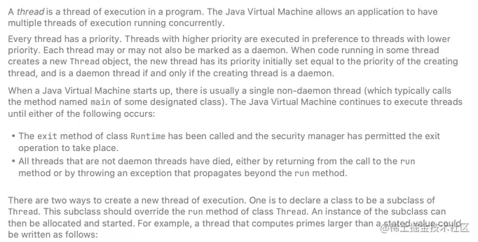
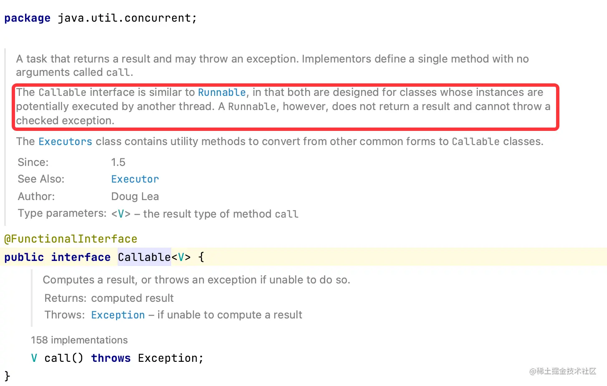
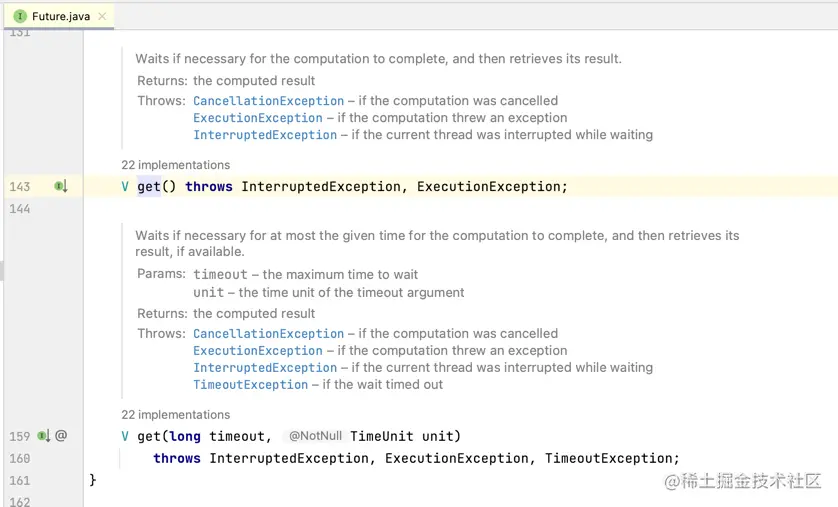
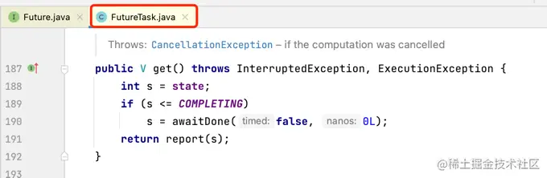
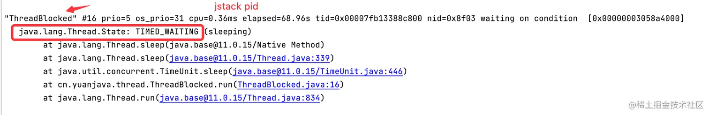
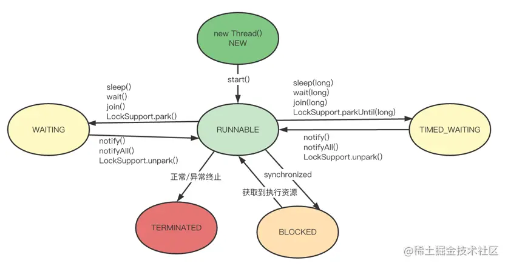
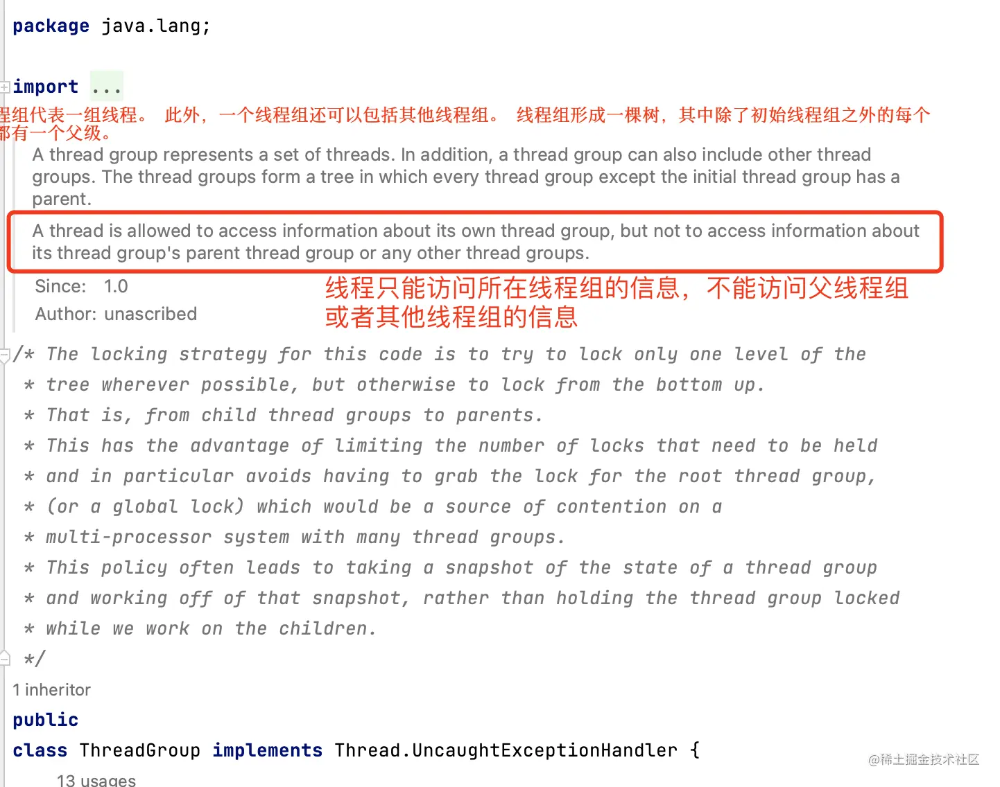
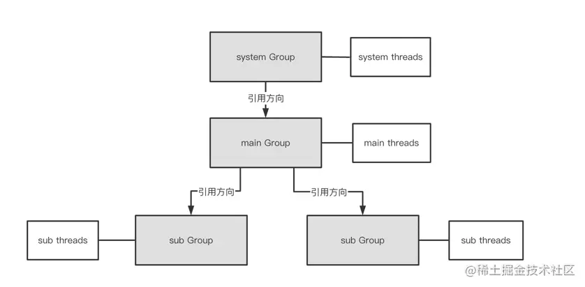

#Java

- [线程](#线程)
  - [什么是线程](#什么是线程)
  - [线程创建方式](#线程创建方式)
    - [继承Thread类](#继承thread类)
    - [实现 Runnable接口](#实现-runnable接口)
    - [Callable/Future](#callablefuture)
    - [Thread、Runnable、Callable/Future 比较](#threadrunnablecallablefuture-比较)
  - [线程的状态](#线程的状态)
    - [NEW](#new)
    - [RUNNABLE](#runnable)
    - [BLOCKED](#blocked)
    - [WAITING](#waiting)
    - [TIMED\_WAITING](#timed_waiting)
    - [TERMINATED](#terminated)
- [Java线程组](#java线程组)
  - [Java线程优先级](#java线程优先级)
  - [Java线程通信](#java线程通信)
    - [共享内存](#共享内存)
    - [消息传递](#消息传递)


## 线程

### 什么是线程


通过维基百科的描述，我们可以知道线程是操作系统执行的最小单元，一条线程指的是进程中一个单一顺序的控制流，一个进程中可以并发多个线程，每条线程并行执行不同的任务。在Unix System V及SunOS中也被称为轻量进程（lightweight processes），但轻量进程更多指内核线程（kernel thread），而把用户线程（user thread）称为线程。
在Java中，线程对应的是 java.lang.Thread类，下图为 ``Thread``的源码描述：

因此，在 Java中，线程是指程序中的执行线程，每个线程都有一个优先级，高优先级的线程执行要优先于低优先级线程，在 Java虚拟机中，允许应用程序同时运行多个执行线程，当 JVM启动时，通常会维护一个 非守护线程（main方法对应的线程）。

### 线程创建方式
在 Java中，创建线程有3种方式：继承 ``Thread``类、实现 ``Runnable``接口、``Callable/Future``。

#### 继承Thread类

创建线程的第一种方法是将类声明为 ``Thread``的子类。该子类需要重写 ``Thread``类的 ``run()``方法，然后创建子类的实例，最后调用实例的 ``start()``方法启动线程。示例代码如下：

```java	
public class MyThread extends Thread {

  @Override
  public void run() {
    System.out.println("MyThread extends Thread!");
  }

  public static void main(String[] args) {
    MyThread thread = new MyThread();
    thread.start();
  }
}

// 代码执行结果如下：
MyThread extends Thread
```

#### 实现 Runnable接口

创建线程的第二种方法是声明一个实现 ``Runnable``接口的类。然后在类中实现 ``run()`` 方法，并且将该类的实例作为参数传递给一个线程类，最后，调用``Thread.start()``启动。示例代码如下：

```java
public class MyRunnable implements Runnable {

  @Override
  public void run() {
    System.out.println("MyRunnable implements Runnable!");
  }

  public static void main(String[] args) {
    MyRunnable runnable = new MyRunnable();
    Thread thread = new Thread(runnable);
    thread.start();
  }
}

MyRunnable implements Runnable!
```

#### Callable/Future

创建线程的第三种方法是实现 ``Callable``接口，然后通过 ``Future``获取结果值。一般来说 ``Callable``需要配合线程池工具类 ``ExecutorService``来使用，如下代码，定义一个 ``MyTask``类，然后让该类去实现 ``Callable``接口，并且实现 ``call()``方法，最后通过 ``executor.submit()``提交任务。

```java
public class MyThread implements Callable {

  @Override
  public Object call() throws Exception {

    return "MyThread implements Callable";
  }

  public static void main(String[] args) throws Exception {

    ExecutorService executor = Executors.newCachedThreadPool();
    MyTask task = new MyTask();
    Future<Integer> future = executor.submit(task);
    // get()方法会阻塞当前线程，直到得到结果。
    System.out.println(future.get());
  }
}

MyThread implements Callable!
```



通过 Callable的源码，我们可以得知 ``Callable``是一个函数式接口，并且只有一个`` call() ``抽象方法，``Callable`` 接口与 ``Runnable`` 类似。 不过，``Runnable``不返回结果，也不能抛出检查异常。
我们再看下 ``Future.get()``是如何获取数据的




通过源码可以看出，get()是一个阻塞方法，等待直到处理完成返回结果或者等待超时。

#### Thread、Runnable、Callable/Future 比较

由于 Java是单继承，因此 Runnable接口比 Thread更灵活；

- Runnable接口更符合面向对象编程；
- Thread类的方法比较丰富，本身也实现了 Runnable接口，而 Runnable接口更为轻量；
- Thread、Runnable 都无法返回值，Callable/Future 可以拿到线程执行的结果值；
- Future.get()是阻塞方法来获取结果值；

### 线程的状态

在 Java中，线程的状态，也叫线程生命周期，主要有 6种，其源码如下：

```java
public class Thread implements Runnable {
  public enum State {
    NEW,
    RUNNABLE,
    BLOCKED,
    WAITING,
    TIMED_WAITING,
    TERMINATED;
  }
}
```

#### NEW

NEW：尚未启动的线程处于此状态，我们可以通过下面的代码来验证 NEW：

```java
@Test
public void testStateNew(){
  Thread thread=new Thread(()->{});
  System.out.println(thread.getState()); // 输出 NEW
  }
```

#### RUNNABLE

RUNNABLE：处于 RUNNABLE(可运行)状态的线程在 Java虚拟机中执行，但它可能正在等待来自操作系统的其他资源，例如处理器。我们可以通过下面的代码来验证 RUNNABLE：

```java
@Test
public void testStateNew(){
  // 只创建一个线程，并没有调用 start()方法
  Thread thread=new Thread(()->{});
  thread.start();
  System.out.println(thread.getState()); // 输出 RUNNABLE
  }
```

#### BLOCKED

BLOCKED：处于阻塞状态的线程正在等待监视器锁进入同步块/方法或调用 Object.wait 后重新进入同步块/方法。

#### WAITING

WAITING：等待状态。 调用以下方法，线程就会处于等待状态：

```
Object.wait()
Thread.join()
LockSupport.park()
```

处于 WAITING等待状态的线程，需要其他线程对其对象执行下面任一方法才能切换成 RUNNABLE状态：

```
notify()
notifyAll()
LockSupport.unpark()
```

#### TIMED_WAITING

TIMED_WAITING：超时等待状态。线程等待给定的时间后会被自动唤醒。 调用以下方法会使线程进入超时等待状态：

- Thread.sleep(long millis)：使当前线程睡眠指定时间；
- Object.wait(long timeout)：线程休眠指定时间，等待期间可以通过notify()/notifyAll()唤醒；
- Thread.join(long millis)：等待当前线程最多执行millis毫秒，如果millis为0，则会一直执行；
- LockSupport.parkNanos(long nanos)： 除非获得调用许可，否则禁用当前线程进行线程调度指定时间；
- LockSupport.parkUntil(long deadline)：同上，也是禁止线程进行调度指定时间；

我们通过下面的代码来验证状态：

```java
public class ThreadBlocked extends Thread {
  @Override
  public void run() {
    while (true) {
      try {
        // 线程进入 TIMED_WAITING 状态
        TimeUnit.SECONDS.sleep(100);
      } catch (InterruptedException e) {
        e.printStackTrace();
      }
    }
  }

  public static void main(String[] args) {
    Thread threadBlocked = new Thread(new ThreadBlocked(), "ThreadBlocked");
    threadBlocked.start();
  }
}
```

在上述代码中，让线程 sleep睡眠 100s，然后可以通过 jstack pid指令查看堆栈信息，从而观测线程状态



#### TERMINATED

TERMINATED：已终止状态，代表线程已完成执行。

通过上文的分析，我们可以把 6种状态及其转换关系总结如下图：


## Java线程组

ThreadGroup：线程组，在 Java中，每个线程必须属于一个组，不能独立存在，如果在 ``new Thread()``时没有显式指定线程组，那么默认将父线程（当前执行``new Thread()``的线程）线程组设置为自己的线程组。

- public static void main(String[] args)方法的线程组默认为 main。

我们以一个实例来感受下线程组，如下代码，定义一个线程类，然后获取线程对应的线程组名称。

```java
public class MyThread extends Thread {

  @Override
  public void run() {
    System.out.println("MyThread extends Thread!");
  }

  public static void main(String[] args) {
    MyThread thread = new MyThread();
    thread.start();
    // 输出 threadGroup:main
    System.out.println("threadGroup:" + thread.getThreadGroup().getName());
  }
}
```

上述示例，我们并没有给线程示例设置过线程组，那么，线程组是在什么时候设置的呢？
我们先看看 Thread类在创建线程实例时做了什么，源码如下：

```java
public class Thread implements Runnable {

  // 无参构造器 创建线程
  public Thread() {
    this(null, null, "Thread-" + nextThreadNum(), 0);
  }

  // 指定线程组，Runnable和线程名来 创建线程
  public Thread(ThreadGroup group, Runnable target, String name, long stackSize) {
    this(group, target, name, stackSize, null, true);
  }

  // 最底层线程创建逻辑
  private Thread(ThreadGroup g, Runnable target, String name,
                 long stackSize, AccessControlContext acc,
                 boolean inheritThreadLocals) {
    if (name == null) {
      throw new NullPointerException("name cannot be null");
    }

    this.name = name;

    Thread parent = currentThread();
    SecurityManager security = System.getSecurityManager();
    if (g == null) {
      /* Determine if it's an applet or not */

            /* If there is a security manager, ask the security manager
               what to do. */
      if (security != null) {
        g = security.getThreadGroup();
      }

            /* If the security manager doesn't have a strong opinion
               on the matter, use the parent thread group.
              如果当前线程没有设置组，则获取父线程的线程组                */
      if (g == null) {
        g = parent.getThreadGroup();
      }
      /* checkAccess regardless of whether or not threadgroup is
           explicitly passed in. */
      g.checkAccess();

      /*        * Do we have the required permissions?        */
      if (security != null) {
        if (isCCLOverridden(getClass())) {
          security.checkPermission(
            SecurityConstants.SUBCLASS_IMPLEMENTATION_PERMISSION);
        }
      }

      g.addUnstarted();

      this.group = g;
      this.daemon = parent.isDaemon();
      this.priority = parent.getPriority();
      if (security == null || isCCLOverridden(parent.getClass()))
        this.contextClassLoader = parent.getContextClassLoader();
      else
        this.contextClassLoader = parent.contextClassLoader;
      this.inheritedAccessControlContext =
        acc != null ? acc : AccessController.getContext();
      this.target = target;
      setPriority(priority);
      if (inheritThreadLocals && parent.inheritableThreadLocals != null)
        this.inheritableThreadLocals =
          ThreadLocal.createInheritedMap(parent.inheritableThreadLocals);
      /* Stash the specified stack size in case the VM cares */
      this.stackSize = stackSize;

      /* Set thread ID */
      this.tid = nextThreadID();
    }
  }
}
```

通过Thread源码可以看出，**如果创建线程时未指定线程组，那么会采用父类的线层组**，接着就来看下



通过源码的描述可以得知：ThreadGroup（线程组）简单来说就是线程的集合，它是一个树形结构，并呈父子关系，除了 system线程组（只有子线程组），一个线程组既可以有父线程组，同时也可以有子线程组。但是，线程只能访问本线程组的信息，不能访问其父类或者其他线程组的信息。在 Java中线程组的树状结构如下图：


- system线程组，它是用来处理 JVM系统任务的线程组，比如对象销毁等；
- main线程组，它是 system线程组的直接子线程组，这个线程组至少包含一个- main线程，用于执行main方法；
- sub线程组，它是 main线程组的子线程组，是应用程序创建的线程组；

所以，ThreadGroup线程组是一个标准的向下引用的树状结构，这样设计的目的是防止”上级”线程被”下级”线程引用而无法有效地被 GC回收。

ThreadGroup其他一些重要方法：

| 方法                                    | 说明                                     |
| --------------------------------------- | ---------------------------------------- |
| void checkAccess()                      | 判断线程能否访问该线程组                 |
| int activeCount()                       | 返回线程组及其子组中活动线程数的估计值   |
| void destroy()                          | 销毁线程组及子线程组                     |
| void interrupt()                        | 中断线程组中所有线程                     |
| void stop()                             | 停止线程组中所有线程                     |
| void suspend()                          | 挂起线程组中的所有线程                   |
| ThreadLocal.ThreadLocalMap threadLocals | 存放线程变量副本，和 ThreadLocal配合使用 |

### Java线程优先级

在 Thread类中，关于线程优先级的源码如下，通过源码可以看出，线程的优先级在 1~10，Java 默认的线程优先级为 5，可以通过 setPriority()进行优先级的设置，通常情况下，高优先级的线程会比低优先级的线程更优先执行，但是最终执行的顺序还是由操作系统的调度器来决定。 所以说，Java中的线程的优先级来是一个参考值，它只是给操作系统一个建议，最终的调用顺序，是由操作系统的线程调度算法决定的。

```java	
public class Thread implements Runnable {
  private int priority;
  /**    * The minimum priority that a thread can have.    */
  public static final int MIN_PRIORITY = 1;

  /**    * The default priority that is assigned to a thread.    */
  public static final int NORM_PRIORITY = 5;

  /**    * The maximum priority that a thread can have.    */
  public static final int MAX_PRIORITY = 10;
}
```

上文我们讲述了 Thread工作机制，线程组等相关知识，那么，线程作为 Java19之前的最小运行单元，他们之间是如何通信的呢？

### Java线程通信

Java中线程间通信的方式主要有 2种：共享内存 和 消息传递。

#### 共享内存

线程之间共享程序的公共状态，线程之间通过写-读内存中的公共状态来隐式进行通信，比如：``volatile``和``synchronized``关键字。

- volatile关键字保证了共享变量的可见性，也就是说，任何线程更新了主内存，其他线程就必须失效本地工作内存，然后从主内存中获取最新值同步到自己的工作内存，这样线程之间通过共享内存实现通信。
- synchronized关键字通过向对象施加 Monitor锁，从而确保同一时间只能有一个线程能拿到锁，保证了线程访问的可见性和排他性。

#### 消息传递

线程之间通过明确的发送消息来显式进行通信，在 Java中典型的消息传递方式就是 wait()、notify()、notifyAll()。
当线程A 调用了对象 Object的 wait()方法后，会释放 Object的 monitor所有权，然后进入等待状态，当另外一个线程B调用了同一个对象的 notify()或者notifyAll()方法，线程A 收到通知后会继续抢占运行需要的资源，因此，线程A，B就通过消息传递的方式实现了通信。

