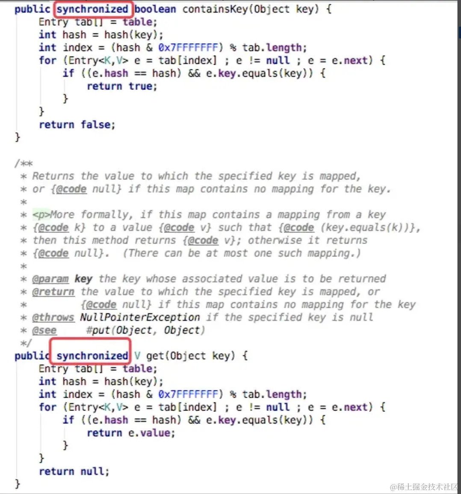
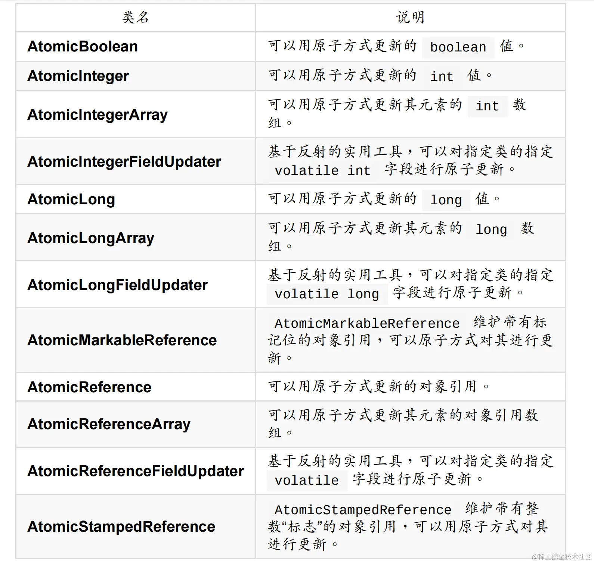

# Java

- [Java](#java)
  - [Java设计思想](#java设计思想)
    - [OOP是什么](#oop是什么)
    - [JDK和JRE](#jdk和jre)
    - [面向对象的特征有哪些](#面向对象的特征有哪些)
    - [java是值传递还是引用传递](#java是值传递还是引用传递)
  - [抽象类和接口](#抽象类和接口)
    - [抽象类与接口的区别？](#抽象类与接口的区别)
    - [抽象和接口](#抽象和接口)
    - [接口的意义](#接口的意义)
    - [抽象类的意义](#抽象类的意义)
  - [接口是否可继承（extends）接口？抽象类是否可实现（implements）接口？抽象类是否可继承具体类（concrete class）？](#接口是否可继承extends接口抽象类是否可实现implements接口抽象类是否可继承具体类concrete-class)
  - [类和方法](#类和方法)
    - [一个".java"源文件中是否可以包含多个类（不是内部类）？有什么限制？](#一个java源文件中是否可以包含多个类不是内部类有什么限制)
    - [构造器（constructor）是否可被重写（override）](#构造器constructor是否可被重写override)
    - [静态变量和成员变量的区别](#静态变量和成员变量的区别)
    - [Object 中定义了哪些方法](#object-中定义了哪些方法)
    - [Cloneable 实现原理](#cloneable-实现原理)
    - [==和equals的区别](#和equals的区别)
    - [两个对象值相同(x.equals(y) == true)，但却可有不同的hash code，这句话对不对？](#两个对象值相同xequalsy--true但却可有不同的hash-code这句话对不对)
    - [如何实现对象的克隆](#如何实现对象的克隆)
    - [类中方法调用顺序](#类中方法调用顺序)
    - [重载（Overload）和重写（Override）的区别](#重载overload和重写override的区别)
      - [重写（Override）](#重写override)
      - [重载（Overload）](#重载overload)
    - [是否可以从一个静态（static）方法内部发出对非静态（non-static）方法的调用？](#是否可以从一个静态static方法内部发出对非静态non-static方法的调用)
    - [抽象的（abstract）方法是否可同时是静态的（static）,是否可同时是本地方法（native），是否可同时被synchronized修饰？](#抽象的abstract方法是否可同时是静态的static是否可同时是本地方法native是否可同时被synchronized修饰)
    - [Super与this表示什么](#super与this表示什么)
    - [hashcode()和equals()的关系](#hashcode和equals的关系)
  - [内部类](#内部类)
    - [内部类](#内部类-1)
    - [匿名内部类](#匿名内部类)
    - [内部类的作用](#内部类的作用)
    - [静态嵌套类(Static Nested Class,或者叫静态内部类)和内部类（Inner Class）的不同](#静态嵌套类static-nested-class或者叫静态内部类和内部类inner-class的不同)
    - [Anonymous Inner Class(匿名内部类)是否可以继承其它类？是否可以实现接口？](#anonymous-inner-class匿名内部类是否可以继承其它类是否可以实现接口)
    - [内部类(非静态内部类)可以引用它的包含类（外部类）的成员吗？有没有什么限制？](#内部类非静态内部类可以引用它的包含类外部类的成员吗有没有什么限制)
    - [内部类访问局部变量的时候，为什么要加final](#内部类访问局部变量的时候为什么要加final)
    - [为什么内部类会持有外部类的引用？持有的引用是this？还是其它？](#为什么内部类会持有外部类的引用持有的引用是this还是其它)
  - [wei](#wei)
    - [Java 的基本数据类型都有哪些各占几个字节](#java-的基本数据类型都有哪些各占几个字节)
    - [String 是基本数据类型吗？可以被继承吗？](#string-是基本数据类型吗可以被继承吗)
    - [int和Integer有什么区别？为什么要有包装类？](#int和integer有什么区别为什么要有包装类)
    - [Java 中有几种类型的流](#java-中有几种类型的流)
    - [Serializable 和 Parcelable 区别](#serializable-和-parcelable-区别)
    - [final](#final)
    - [static](#static)
    - [String、StringBuffer、StringBuilder](#stringstringbufferstringbuilder)
    - [Java 中深拷贝与浅拷贝的区别？](#java-中深拷贝与浅拷贝的区别)
    - [Error 和 Exception 的区别](#error-和-exception-的区别)
    - [泛型](#泛型)
    - [List、Set 以及 Map 的区别，它们之间有什么关系？](#listset-以及-map-的区别它们之间有什么关系)
    - [ArrayList 和 LinkedList 的区别？](#arraylist-和-linkedlist-的区别)
    - [请说说对HashMap的理解](#请说说对hashmap的理解)
    - [HashMap, LinkedHashMap 和 TreeMap有啥区别？](#hashmap-linkedhashmap-和-treemap有啥区别)
    - [HashMap 与 HashTable 的区别](#hashmap-与-hashtable-的区别)
    - [HashMap 和 HashTable 区别](#hashmap-和-hashtable-区别)
    - [创建线程的方式有哪些？](#创建线程的方式有哪些)
    - [线程的状态有哪些？](#线程的状态有哪些)
    - [synchronized 和 volatile 关键字的区别](#synchronized-和-volatile-关键字的区别)
    - [如何保证线程安全](#如何保证线程安全)
    - [ThreadLocal 用法和原理](#threadlocal-用法和原理)
    - [谈一谈线程 sleep() 和 wait() 方法的区别？](#谈一谈线程-sleep-和-wait-方法的区别)
    - [谈谈 Java 线程中 notify 和 notifyAll 方法有什么区别](#谈谈-java-线程中-notify-和-notifyall-方法有什么区别)
    - [Java 中有哪些常见的锁](#java-中有哪些常见的锁)
    - [什么是悲观锁和乐观锁？](#什么是悲观锁和乐观锁)

## Java设计思想

### OOP是什么

面向对象编程（Object Oriented Programming）

### JDK和JRE

JDK:java development kit：java开发工具包，是开发人员所需要安装的环境（包含JRE）
JRE:java runtime environment：java运行环境，java程序运行所需要安装的环境

### 面向对象的特征有哪些

面向对象的特征有：抽象、封装、继承、多态

- **抽象**：抽象是将一类对象的共同特征总结出来构造类的过程，包括数据抽象和行为抽象两方面。抽象只关注对象有哪些属性和行为，并不关注这些行为的细节是什么。
- **封装**：隐藏对象的实现细节，仅对外公开接口，是针对一个对象来说的
- **多态**：多态性是指允许不同子类型的对象对同一消息作出不同的响应。简单的说就是用同样的对象引用调用同样的方法但是做了不同的事情
- **继承**：继承是从已有类得到继承信息创建新类的过程。提供继承信息的类被称为父类（超类、基类）；得到继承信息的类被称为子类（派生类）

### java是值传递还是引用传递

java是值传递。可以理解为传入的是一个引用的副本，指向统一地址。当值改变时，原引用和副本指向地址中的值都变了；当副本指向的地址改变，指向新值时，原引用指向的地址没有改变，原值也没有改变。

## 抽象类和接口

### 抽象类与接口的区别？

1. 抽象类可以提供成员方法的实现细节，而接口中只能存在 ``public`` 抽象方法；
2. 抽象类中的成员变量可以是各种类型的，而接口中的成员变量只能是 ``public static final`` 类型的；
3. 接口中不能含有构造器、静态代码块以及静态方法，而抽象类可以有构造器、静态代码块和静态方法；
4. 一个类只能继承一个抽象类，而一个类却可以实现多个接口；
5. 抽象类访问速度比接口速度要快，因为接口需要时间去寻找在类中具体实现的方法；
6. 如果你往抽象类中添加新的方法，你可以给它提供默认的实现。因此你不需要改变你现在的代码。如果你往接口中添加方法，那么你必须改变实现该接口的类。
7. 接口更多的为了**约束类**的行为，可用于解耦，而抽象类更加侧重于**代码复用**。

### 抽象和接口

1. 抽象类不能有对象（不能用 new 关键字来创建抽象类的对象）
2. 抽象类中的抽象方法必须在子类中被重写
3. 接口中的所有属性默认为：``public static final``
4. 接口中的所有方法默认为：``public abstract``

### 接口的意义

1. 规范
2. 扩展
3. 回掉
4. java是单继承的

### 抽象类的意义

1. 为其他子类提供一个公共的类型
2. 封装子类中重复定义的内容
3. 定义抽象方法,子类可以有不同的实现

## 接口是否可继承（extends）接口？抽象类是否可实现（implements）接口？抽象类是否可继承具体类（concrete class）？

1. 接口可以继承接口,而且支持多重继承
2. 抽象类可以实现(implements)接口
3. 抽象类是否可继承具体类,也可以继承抽象类

## 类和方法

### 一个".java"源文件中是否可以包含多个类（不是内部类）？有什么限制？

一个".java"文件内可以有多个类，但只能有**一个类**是公开的

### 构造器（constructor）是否可被重写（override）

构造器不能被继承，因此不能被重写，但可以被重载

### 静态变量和成员变量的区别

- 静态变量属于类，被多个实例共享，成员变量属于实例
- 静态变量储存在方法区，成员变量在堆
- 静态变量在类加载时候存在，成员变量在实例加载之后存在
- 静态方法可以直接使用静态变量，不能直接使用成员变量

### Object 中定义了哪些方法

clone/toString/wait/notify/notifyAll/equals/hashcode/finalize/getClass

### Cloneable 实现原理

``Cloneable``是一个接口，没有具体方法

clone方法是Object类中方法，会检查当前实例是否实现``Cloneable``接口，没有实现则抛出异常，实现了就调用native方法进行clone（clone进行的是浅拷贝），源码如下

```java
protected Object clone() throws CloneNotSupportedException {
        if (!(this instanceof Cloneable)) {
            throw new CloneNotSupportedException("Class " + getClass().getName() +
                                                 " doesn't implement Cloneable");
        }
        return internalClone();
    }
```

### ==和equals的区别

1. ``==`` 是 Java 中的一个操作符，用于比较两个变量的值是否相等。对于基本数据类型（如 int、float 等），``==`` 比较的是它们的值；对于引用类型（如对象），``== ``比较的是它们在内存中的地址。
（2）``equals()`` 是 Object 类中定义的方法，用于比较两个对象是否相等。默认情况下，``equals()`` 方法与 ``==`` 的作用是一样的，即比较两个对象的内存地址。但是，可以通过重写 ``equals()`` 方法来改变其行为，使其比较对象的内容而不是地址。

### 两个对象值相同(x.equals(y) == true)，但却可有不同的hash code，这句话对不对？

不对。

java 规定，值相同，hashCode一定要相同；hashCode相同，值可能不同
如果值相同，hashCode不同，就会造成Hashset、HashMap等借助hashCode实现的数据结构出现错乱，相同的值或者key可能出现多次

### 如何实现对象的克隆

1. 通过实现``Cloneable``接口实现clone：这里要注意深拷贝和浅拷贝问题，如果该类内部变量是引用类型的，并且内部变量类没有实现``Cloneable``接口，那么克隆出来的该变量是浅拷贝的（只是复制了引用，两个引用指向统一实例）
2. 通过实现``Serializable``接口，通过对象的序列化和反序列化实现克隆。

```java
import java.io.ByteArrayInputStream;
import java.io.ByteArrayOutputStream;
import java.io.ObjectInputStream;
import java.io.ObjectOutputStream;
import java.io.Serializable;

public class MyUtil {

    private MyUtil() {
        throw new AssertionError();
    }

    @SuppressWarnings("unchecked")
    public static <T extends Serializable> T clone(T obj) throws Exception {
        ByteArrayOutputStream bout = new ByteArrayOutputStream();
        ObjectOutputStream oos = new ObjectOutputStream(bout);
        oos.writeObject(obj);

        ByteArrayInputStream bin = new ByteArrayInputStream(bout.toByteArray());
        ObjectInputStream ois = new ObjectInputStream(bin);
        return (T) ois.readObject();

        // 说明：调用ByteArrayInputStream或ByteArrayOutputStream对象的close方法没有任何意义
        // 这两个基于内存的流只要垃圾回收器清理对象就能够释放资源，这一点不同于对外部资源（如文件流）的释放
    }
}
```

### 类中方法调用顺序

指出下面程序的运行结果

```java
class A {

    static {
        System.out.print("1");
    }

    public A() {
        System.out.print("2");
    }
}

class B extends A {

    static {
        System.out.print("a");
    }

    public B() {
        System.out.print("b");
    }
}

public class Hello {

    public static void main(String[] args) {
        A ab = new B();
        ab = new B();
    }

}
```

执行结果：1a2b2b。

创建对象时构造器的调用顺序是：  父类静态初始化块  -> 子类静态初始化块 -> 父类初始化块 ->调用了父类构造器 -> 子类初始化块 -> 调用子类的构造器

### 重载（Overload）和重写（Override）的区别

> 重写（Override）和重载（Overload）其实并无联系，可能是因为名称相似，容易引起混淆 > 重写发生在运行时，重载发生在编译期

#### 重写（Override）

重写是针对父类和子类来说的，是在子类中重写父类的方法。

- 要求方法名，参数个数和类型必须相同
- 返回的数据类型必须与父类相同或者是其子类
- 访问修饰符的限制一定要大于父类中该方法的访问修饰符（public>protected>default>private）
- 重写方法一定不能抛出新的检查异常或者比被重写方法申明更加宽泛的检查型异常

#### 重载（Overload）

重载是针对一个类说的，是Java中多态性的一种表现

- 要求方法名相同
- 必须有不同的参数列表
- 可以有不同的返回类型
- 可以有不同的修饰符
- 可以抛出不同的异常。

> 扩展：华为的面试题中曾经问过这样一个问题 - "为什么不能根据返回类型来区分重载"
答：因为调用时不能指定类型信息，编译器不知道你要调用哪个函数。例如：
float max(int a, int b);
int max(int a, int b);
当调用max(1, 2);时无法确定调用的是哪个。
参考：https://www.zhihu.com/question/21455159/answer/59874307

### 是否可以从一个静态（static）方法内部发出对非静态（non-static）方法的调用？

不可以，静态方法只能访问静态成员，因为非静态方法的调用要先创建对象，在调
用静态方法时可能对象并没有被初始化

### 抽象的（abstract）方法是否可同时是静态的（static）,是否可同时是本地方法（native），是否可同时被synchronized修饰？

- 抽象方法不能是静态的：静态方法不能被子类重写，抽象方法必须被子类重写，冲突；
- 抽象方法不能是native的：本地方法是由本地代码（如C代码）实现的方法，而抽象方法是没有实现的，也是矛盾的
- 抽象方法不能用sychronized：synchronized和方法的实现细节有关，抽象方法不涉及实现细节，因此也是相互矛盾的

### Super与this表示什么

Super表示当前类的父类对象;This表示当前类的对象

### hashcode()和equals()的关系

充分不必要的关系

## 内部类

### 内部类

1. 非静态内部类没法在外部类的静态方法中实例化。
2. 非静态内部类的方法可以直接访问外部类的所有数据，包括私有的数据。
3. 在静态内部类中调用外部类成员，成员也要求用 static 修饰。
4. 创建静态内部类的对象可以直接通过外部类调用静态内部类的构造器
5. 创建非静态的内部类的对象必须先创建外部类的对象，通过外部类的对象调用内部类的构造器。

### 匿名内部类

1. 匿名内部类不能定义任何静态成员、方法
2. 匿名内部类中的方法不能是抽象的
3. 匿名内部类必须实现接口或抽象父类的所有抽象方法
4. 匿名内部类不能定义构造器
5. 匿名内部类访问的外部类成员变量或成员方法必须用 final 修饰

### 内部类的作用

1. 内部类可以很好的实现隐藏
2. 内部类拥有外围类的所有元素的访问权限
3. 可以间接实现多重继承
4. 可以避免修改接口而实现同一个类中两种同名方法的调用

### 静态嵌套类(Static Nested Class,或者叫静态内部类)和内部类（Inner Class）的不同

1. 内部类持有外部类的引用（this），静态内部类不持有
2. 因为持有外部类的引用，所以new时需要先有外部类的实例，再用外部类实例new内部类实例，举例：new Outer().new Inner();

> 扩展：在Android中，因为内部类持用外部类引用，所以容易造成内存泄漏，一般推荐使用静态内部类

### Anonymous Inner Class(匿名内部类)是否可以继承其它类？是否可以实现接口？

可以继承其他类，也可以实现接口

```java
//这里new的就是一个匿名内部类，这个匿名内部类实现了View.OnClickListener接口。所以匿名内部类本身一定会继承或实现一个且仅一个类或者接口
btn.setOnClickListener(new View.OnClickListener(){
    @Override
    public void onClick(View view){
    
    }
    })
```

### 内部类(非静态内部类)可以引用它的包含类（外部类）的成员吗？有没有什么限制？

一个内部类对象可以访问创建它的外部类对象的成员，包括私有成员。
应用局部变量，局部变量前要加final修饰

### 内部类访问局部变量的时候，为什么要加final

- 内部类和局部变量生命周期不同（方法结束后局部变量的生命周期就结束了，而内部类只要有引用就不结束，内部类的生命周期>=局部变量）
- Java为了解决这一问题，会在编译时在内部类的构造方法里边，将局部变量作为参数传入内部类
- 这就造成了局部变量如果改变，内部类不知情的场景，所以要加final，保证引用不可改变

> 扩展：在java8中，可以不使用final关键字，但是如果我们改变局部变量的引用，编译会发生错误，从而保证了局部变量的引用不变。

### 为什么内部类会持有外部类的引用？持有的引用是this？还是其它？

内部类虽然和外部类写在同一个文件中， 但是编译完成后， 还是生成各自的class文件，内部类通过this访问外部类的成员。

- 编译器自动为内部类添加一个成员变量，这个成员变量的类型和外部类的类型相同， 这个成员变量就是指向外部类对象
- 编译器自动为内部类的构造方法添加一个参数，参数的类型是外部类的类型， 在构造方法内部使用这个参数为内部类中添加的成员变量赋值；
- 在调用内部类的构造函数初始化内部类对象时，会默认传入外部类的引用。


## wei
### Java 的基本数据类型都有哪些各占几个字节

byte 1、
char 2、
short 2、
int 4、
float 4、
double 8、
long 8、
boolean 1

补充：
（1）在 Java 中，一共有 8 种基本类，每个基本数据类型都对应了一个包装类
（2）包装类的作用：包装类的存在解决了基本数据类型无法做到的事情泛型类型参数、序列化、类型转换、高频区间数据缓存等问题。


### String 是基本数据类型吗？可以被继承吗？

``String`` 是引用类型，底层用 ``char`` 数组实现的。因为 ``String`` 是 ``final`` 类，在 java 中被 ``final`` 修饰的类不能被继承， 因此 ``String ``当然不可以被继承。

### int和Integer有什么区别？为什么要有包装类？

1. 数据类型不同：``int`` 是基础数据类型，而 ``Integer`` 是包装数据类型；
2. 默认值不同：``int`` 的默认值是 0，而 ``Integer`` 的默认值是 ``null``；
3. 内存中存储的方式不同：``int`` 在内存中直接存储的是数据值，而 ``Integer`` 实际存储的是对象引用，当 new 一个 ``Integer`` 时实际上是生成一个指针指向此对象；
4. 实例化方式不同：``Integer`` 必须实例化才可以使用，而 ``int`` 不需要；
5. 变量的比较方式不同：``int`` 可以使用 ``==`` 来对比两个变量是否相等，而 ``Integer`` 一定要使用 ``equals`` 来比较两个变量是否相等。


### Java 中有几种类型的流

字节流和字符流。字节流继承于 ``InputStream`` 和 ``OutputStream``，字符流继承于 ``InputStreamReader`` 和 ``OutputStreamWriter``。

### Serializable 和 Parcelable 区别

1. ``Serializable`` 是Java本身就支持的接口。
2. ``Parcelable`` 是Android特有的接口，效率比实现``Serializable``接口高效(可用于Intent数据传递，也可以用于进程间通信(IPC))。
3. ``Serializable``的实现，只需要``implements Serializable``即可。这只是给对象打了一个标记，系统会自动将其序列化。
4. ``Parcelabel``的实现，不仅需要``implements Parcelabel``，还需要在类中添加一个静态成员变量``CREATOR``，这个变量需要实现 ``Parcelable.Creator``接口。
5. ``Serializable`` 使用I/O读写存储在硬盘上，而``Parcelable``是直接在内存中读写。
6. ``Serializable`` 会使用反射，序列化和反序列化过程需要大量I/O操作，``Parcelable`` 自己实现封送和解封操作不需要用反射，数据也存放在Native内存中，效率要快很多


### final

``final``可以声明成员变量、方法、类以及本地变量

1. ``final`` 成员变量必须在声明的时候初始化或者在构造器中初始化，否则就会报编译错误
2. ``final`` 变量是只读的
3. ``final`` 申明的方法不可以被子类的方法重写
4. ``final`` 类通常功能是完整的，不能被继承
5. ``final`` 变量可以安全的在多线程环境下进行共享，而不需要额外的同步开销
6. `final` 关键字提高了性能，JVM 和 Java 应用都会缓存 ``final`` 变量，会对方法、变量及
类进行优化
7. 方法的内部类访问方法中的局部变量，但必须用 ``final`` 修饰才能访问

### static

``static`` 关键字修饰的方法或者变量不需要依赖于对象来进行访问，只要类被加载了，就可以通过类名去进行访问。

1. 静态变量被所有的对象所共享，在内存中只有一个副本，它当且仅当在类初次加载时会被初始化。
2. 能通过 this 访问静态成员变量吗?所有的静态方法和静态变量都可以通过对象访问（只要访问权限足够）
3. ``static`` 是不允许用来修饰局部变量

### String、StringBuffer、StringBuilder

1. ``String`` 是 ``final`` 类，不能被继承。对于已经存在的 ``Stirng`` 对象，修改它的值，就是重新创建一个对象
2. ``StringBuffer`` 是一个类似于 ``String`` 的字符串缓冲区，使用 ``append()`` 方法修改
``Stringbuffer`` 的值，使用 ``toString()`` 方法转换为字符串，是线程安全的
3. ``StringBuilder`` 用来替代于 ``StringBuffer``，``StringBuilder`` 是非线程安全的，速度更快
4. 执行速度：``StringBuilder`` > ``StringBuffer`` > ``String``


### Java 中深拷贝与浅拷贝的区别？

1. 浅拷贝：对基本数据类型进行值传递，对引用数据类型进行引用传递般的拷贝，此为浅拷贝。(改指针引用)
2. 深拷贝：对基本数据类型进行值传递，对引用数据类型，创建一个新的对象，并复制其内容，此为深拷贝。(复制一份存下来)

### Error 和 Exception 的区别

1. Error 是系统中的错误，不可预料的，这种异常发生后，会导致程序立即崩溃。只能通过修改代码，使错误不在出现，这种错误 无法被捕获。
2. Exception 则是可以预料的。在程序中如果过感觉某段代码会出现 异常，则可以使用 ``try catch`` 进行捕获，或者直接抛出异常。Exception 可分为 编译时异常(CheckedException) 和 运行时异常(RuntimeException)。运行时异常可以 忽略捕获操作(RuntimeException)，编译时异常必须使用 ``try catch`` 进行捕获。

### 泛型

1. 泛型是对Java语言类型系统的一种扩展，可以把类型参数看作是使用参数化类型时指定的类型的一个占位符，引入泛型，是对Java语言一个较大的功能增强，带来了很多的好处。
2. 类型安全。类型错误现在在编译期间就被捕获到了，而不是在运行时当作java.lang.ClassCastException展示出来，将类型检查从运行时挪到编译时有助于开发者更容易找到错误，并提高程序的可靠性。
3. 消除了代码中许多的强制类型转换，增强了代码的可读性，为较大的优化带来了可能。

### List、Set 以及 Map 的区别，它们之间有什么关系？

1. List集合是一个元素有序、可重复的集合，集合中每个元素都有其对应的顺序索 引。
2. Set集合是无序，不可重复的
3. Map 是有映射关系的键值对

### ArrayList 和 LinkedList 的区别？

1. ``ArrayList``是基于数组的数据结构，分配的是一段连续的内存空间。 新增数据的时候效率低，因为新增一个元素的时候都要考虑数组的容量，即扩容判断，而后进行新增元素； 修改数据同样根据index索引查找修改； 删除数据的时候效率低，因为是连续的内存空间，除删除最后一个元素外，删除任一元素都会使数组中的元素进行移动； 查找数据可根据index索引快速查找；
2. ``LinkedList``是基于链表的数据结构 对比以上： 优点： 不需要考虑扩容的问题和连续的内存空间问题，在新增和删除的效率更好 缺点： 缺少了索引，降低了查找元素的效率，对应也降低了修改元素的效率

### 请说说对HashMap的理解

1. HashMap是基于Map接口的实现，存储键值对时，它可以接收null的键值，是非同步的，
HashMap存储着Entry(hash, key, value, next)对象
（2）通过hash的方法，通过put和get存储和获取对象。存储对象时，我们将K/V传给put
方法时，它调用hashCode计算hash从而得到bucket位置，进一步存储，HashMap会根据当前bucket的占用情况自动调整容量(超过 Load Facotr 则resize为原来的
2倍)。获取对象时，我们将K传给get，它调用hashCode计算hash从而得到bucket
位置，并进一步调用equals()方法确定键值对。如果发生碰撞的时候，Hashmap通
过链表将产生碰撞冲突的元素组织起来，在Java 8中，如果一个bucket中碰撞冲突
的元素超过某个限制(默认是8)，则使用红黑树来替换链表，从而提高速度
（3）通过对key的hashCode()进行hashing，并计算下标( (n-1) & hash )，从而获得
buckets的位置。如果产生碰撞，则利用key.equals()方法去链表或树中去查找对应
的节点
（4）在Java 1.8的实现中，是通过hashCode()的高16位异或低16位实现的： (h =
k.hashCode()) ^ (h >>> 16) ，主要是从速度、功效、质量来考虑的，这么做
可以在bucket的n比较小的时候，也能保证考虑到高低bit都参与到hash的计算中，
同时不会有太大的开销。
（5）如果超过了负载因子(默认0.75)，则会重新resize一个原来长度两倍的HashMap，
并且重新调用hash方法。

### HashMap, LinkedHashMap 和 TreeMap有啥区别？

1. HashMap不保证数据有序
2. LinkedHashMap保证数据可以保持插入顺序
3. TreeMap可以保持key的大小顺序

### HashMap 与 HashTable 的区别

1. ``HashMap`` 是非 ``synchronized`` 的，性能更好
2. ``HashMap`` 可以接受为 ``null`` 的 key-value，而``Hashtable`` 是线程安全的，比 ``HashMap`` 要慢，不接受 ``null`` 的 key-value

### HashMap 和 HashTable 区别

1. 首先``HashMap``是线程不安全的，其主要体现：
第一，在jdk1.7中，使用头插法，在多线程环境下，扩容时会造成环形链或数据丢失。
第二，在jdk1.8中，在多线程环境下，会发生数据覆盖的情况
在jdk1.8中对``HashMap``进行了优化，在发生hash碰撞，不再采用**头插法**方式，而是直接插入链表尾部，因此不会出现环形链表的情况，但是在多线程的情况下仍然不安全，会出现数据覆盖的情况；
2. Hashtable线程安全，但是效率低下，体现在：
 
 ``Hashtable``是用``synchronized``关键字来保证线程安全的，由于``synchronized``的机制是在同一时刻只能有一个线程操作，其他的线程阻塞或者轮询等待，在线程竞争激烈的情况下，这种方式的效率会非常的低下。

### 创建线程的方式有哪些？

1. 继承``Thread``类，重写``run``方法
2. 实现``Runnable``接口，并实现该接口的``run``方法
3. 实现``Callable``接口，重写``call``方法
4. 使用线程池

### 线程的状态有哪些？

1. New:新创建状态。线程被创建，还没有调用start方法
2. Runnable: 可运行状态。调用starth后进入当前状态
3. Blocked: 阻塞状态
4. Waiting: 等待状态
5. Timed waiting: 超时等待状态
6. Terminated: 终止状态

### synchronized 和 volatile 关键字的区别

1. ``volatile``本质是在告诉jvm当前变量在寄存器（工作内存）中的值是不确定的，需要从主存中读取；
2. ``synchronized``则是锁定当前变量，只有当前线程可以访问该变量，其他线程被阻塞住。
3. ``volatile``仅能使用在变量级别
4. ``synchronized``则可以使用在变量、方法、和类级别的
5. ``volatile``仅能实现变量的修改可见性，不能保证原子性；而``synchronized``则可以保证变量的修改可见性和原子性
6. ``volatile``不会造成线程的阻塞；``synchronized``可能会造成线程的阻塞。
7. ``volatile``标记的变量不会被编译器优化；``synchronized``标记的变量可以被编译器优化

### 如何保证线程安全

当多个线程要共享一个实例对象的值得时候，那么在考虑安全的多线程并发编程时就要保证下面3个要素：

1. 原子性（Synchronized, Lock）
2. 有序性(Volatile，Synchronized, Lock)
3. 可见性(Volatile，Synchronized,Lock)

由于``synchronized``和``Lock``保证每个时刻只有一个线程执行同步代码，所以是线程安全的，也可以实现这一功能，但是由于线程是同步执行的，所以会影响效率。

- 原子性： 指的是一个或多个操作要么全部执行成功要么全部执行失败。
- 可见性： 指当多个线程访问同一个变量时，一个线程修改了这个变量的值，其他线程能够立即看得到修改的值。
- 有序性：程序执行的顺序按照代码的先后顺序执行。（处理器可能会对指令进行重排序）

### ThreadLocal 用法和原理

ThreadLocal用于保存某个线程共享变量：对于同一个``static ThreadLocal``，不同线程只能从中get，set，remove自己的变量，而不会影响其他线程的变量。

1. ThreadLocal.get: 获取ThreadLocal中当前线程共享变量的值。
2. ThreadLocal.set: 设置ThreadLocal中当前线程共享变量的值。
3. ThreadLocal.remove: 移除ThreadLocal中当前线程共享变量的值。
4. ThreadLocal.initialValue: ThreadLocal没有被当前线程赋值时或当前线程刚调用remove方法后调用get方法，返回此方法值。

### 谈一谈线程 sleep() 和 wait() 方法的区别？

1. ``sleep`` 是``Thread``类的方法，``wait``是``Object``类的方法
2. ``sleep``不释放锁，``wait``释放锁
3. ``sleep``不需要``Synchronized`` ，``wait``需要``Synchronized``
4. ``sleep``不需要唤醒，``wait``需要唤醒（除wait(int time)）

### 谈谈 Java 线程中 notify 和 notifyAll 方法有什么区别

- notify：只会唤醒等待该锁的其中一个线程。
- notifyAll：唤醒等待该锁的所有线程。
 
既然notify会唤醒一个线程，并获取锁，notifyAll会唤醒所有线程并根据算法选取其中一个线程获取锁

### Java 中有哪些常见的锁

1. synchronized
2. ReentrantLock
3. ReentrantReadWriteLock
4. AtomicInteger



### 什么是悲观锁和乐观锁？

- 乐观锁：默认为，某个线程在自己处理共享资源的时候，不会出现同一时刻来修改此资源的前提，只在处理完毕，最后写入内存的时候，检测是否此资源在之前未被修改。类似于读写锁的读锁就是乐观锁。
- 悲观锁：默认为，某个线程在自己处理共享资源的时候，一定会出现同一时刻来修改此资源，所以刚拿到这个资源就直接加锁，不让其他线程来操作，加锁在逻辑处理之前。类似，``synchronized``关键字，条件锁，数据库的行锁，表锁等就是悲观锁。

