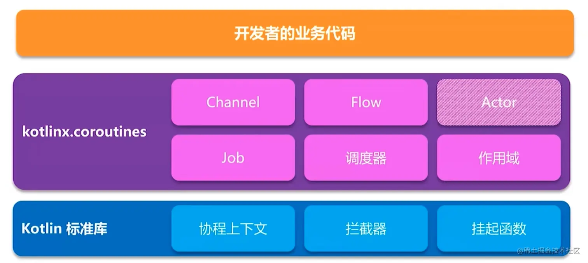

# Kotlin

- [Kotlin](#kotlin)
  - [变量和函数](#变量和函数)
    - [变量](#变量)
  - [常量](#常量)
    - [函数](#函数)
  - [程序的逻辑控制](#程序的逻辑控制)
    - [if 条件语句](#if-条件语句)
    - [when 条件语句](#when-条件语句)
    - [循环语句](#循环语句)
  - [面向对象编程](#面向对象编程)
    - [类与对象](#类与对象)
    - [继承与构造函数](#继承与构造函数)
      - [继承](#继承)
      - [构造函数](#构造函数)
    - [接口](#接口)
    - [函数的可见性修饰符](#函数的可见性修饰符)
    - [数据类与单例类](#数据类与单例类)
      - [数据类](#数据类)
      - [单例类](#单例类)
  - [Lambda 编程](#lambda-编程)
    - [集合的创建和遍历](#集合的创建和遍历)
    - [集合的函数式 API](#集合的函数式-api)
    - [Java 函数式 API 的使用](#java-函数式-api-的使用)
  - [空指针检查](#空指针检查)
    - [可空类型系统和判空辅助工具](#可空类型系统和判空辅助工具)
  - [Kotlin中的小魔术](#kotlin中的小魔术)
    - [字符串的内嵌表达式](#字符串的内嵌表达式)
    - [函数的参数默认值](#函数的参数默认值)
  - [标准函数和静态方法](#标准函数和静态方法)
    - [标准函数let，also，with，run 和 apply](#标准函数letalsowithrun-和-apply)
    - [定义静态方法](#定义静态方法)
  - [延迟初始化和密封类](#延迟初始化和密封类)
    - [对变量延迟初始化](#对变量延迟初始化)
    - [使用密封类优化代码](#使用密封类优化代码)
  - [扩展函数和运算符](#扩展函数和运算符)
    - [大有用途的扩展函数](#大有用途的扩展函数)
    - [有趣的运算符重载](#有趣的运算符重载)
  - [高阶函数详解](#高阶函数详解)
    - [定义高阶函数](#定义高阶函数)
    - [高阶函数的调用](#高阶函数的调用)
    - [内联函数的作用](#内联函数的作用)
  - [泛型和委托](#泛型和委托)
    - [类委托和委托属性](#类委托和委托属性)
    - [使用 infix 函数构建更可读的语法](#使用-infix-函数构建更可读的语法)
    - [泛型擦除](#泛型擦除)
      - [泛型擦除的具体步骤](#泛型擦除的具体步骤)
      - [伪泛型](#伪泛型)
      - [泛型擦除进阶](#泛型擦除进阶)
      - [泛型获取经验总结](#泛型获取经验总结)
    - [边界](#边界)
    - [通配符](#通配符)
      - [泛型的协变，逆变和不变](#泛型的协变逆变和不变)
      - [泛型的上边界通配符](#泛型的上边界通配符)
      - [泛型的下边界通配符](#泛型的下边界通配符)
      - [泛型的无边界通配符](#泛型的无边界通配符)
      - [PECS 原则](#pecs-原则)
      - [使用通配符总结](#使用通配符总结)
    - [泛型的限制](#泛型的限制)
    - [问题](#问题)
    - [泛型的基本用法](#泛型的基本用法)
    - [边界](#边界-1)
    - [泛型实化](#泛型实化)
    - [泛型协变，逆变和不变](#泛型协变逆变和不变)
  - [协程](#协程)
    - [协程生态和依赖库](#协程生态和依赖库)
    - [使用 GlobalScope.launch 函数创建你的第一个协程](#使用-globalscopelaunch-函数创建你的第一个协程)
    - [协程作用域](#协程作用域)
      - [CoroutineScope](#coroutinescope)
      - [GlobalScope](#globalscope)
      - [协程作用域作用](#协程作用域作用)
      - [作用域细分](#作用域细分)
      - [父子协程间的规则](#父子协程间的规则)
    - [使用 Delay 函数延迟协程执行](#使用-delay-函数延迟协程执行)
    - [使用 runBlocking 函数创建一个能阻塞当前线程的协程作用域](#使用-runblocking-函数创建一个能阻塞当前线程的协程作用域)
    - [使用 launch 函数在当前的协程作用域下创建子协程](#使用-launch-函数在当前的协程作用域下创建子协程)
    - [使用 suspend 关键字将一个函数声明成挂起函数](#使用-suspend-关键字将一个函数声明成挂起函数)
    - [使用 coroutineScope 函数创建一个协程作用域](#使用-coroutinescope-函数创建一个协程作用域)
    - [使用 async 函数创建一个子协程并获取执行结果](#使用-async-函数创建一个子协程并获取执行结果)
    - [使用 withContext 函数构建一个简化版的  async 函数](#使用-withcontext-函数构建一个简化版的--async-函数)
    - [使用 suspendCoroutine 函数简化回调的写法](#使用-suspendcoroutine-函数简化回调的写法)
  - [挂起](#挂起)
    - [挂起的本质](#挂起的本质)
      - [线程](#线程)
      - [协程](#协程-1)
    - [是怎么被挂起的？](#是怎么被挂起的)
    - [使用 suspend 的意义](#使用-suspend-的意义)
    - [如何自定义一个挂起函数？](#如何自定义一个挂起函数)


## 变量和函数

### 变量

1. 使用 ``val``（value 的简写）关键字来声明一个不可变的变量，也就是只读变量，这种变量初始赋值后就不能重新赋值了，对应 Java 中的 ``final`` 变量
2. 使用 ``var`` （variable 的简写）关键字用来声明一个可变的变量，也就是可读写变量，这种变量初始赋初值后仍然可以重新被赋值，对应 Java 中的非 ``final`` 变量
3. Kotlin 中的每一行代码都不用加`` ；``

```kotlin
//在 Java 中，我们会这么定义
int a = 10;
boolean b = true

//在 Kotlin 中，我们可以这么定义，当给变量赋值后，Kotlin 编译器会进行类型推导
//定义一个不可变的变量 a 
val a = 10
//定义一个可变的变量 b
var b = true

//如果我们显示的给变量指定类型，Kotlin 就不会进行类型推导了
val a: Int = 10
var b: Boolean = "erdai"
```

如果你观察的仔细会发现，上述代码 Kotlin 定义变量给变量显示的指定类型时，使用的都是首字母大小的 ``Int``，``Boolean``，而在 Java 中都是小写的 ``int``，``boolean``，这表明： Kotlin 完全抛弃了 Java 中的基本数据类型，全部都是**对象数据**类型。 下面给出一个 Java 和 Kotlin 数据类型对照表：
| Java 基本数据类型 | Kotlin 对象数据类型 | 数据类型说明 |
| ----------------- | ------------------- | ------------ |
| byte              | Byte                | 字节型       |
| short             | Short               | 短整型       |
| int               | Int                 | 整型         |
| long              | Long                | 长整型       |
| float             | Float               | 单精度浮点数 |
| double            | Double              | 双精度浮点数 |
| char              | Char                | 字符型       |
| boolean           | Boolean             | 布尔型       |

## 常量

Kotlin 中定义一个常量需要满足三个条件

1. 使用 ``const val`` 来修饰，并初始化
2. 修饰的类型只能是字符串和基础对象类型
3. 只能修饰顶层的常量，object 修饰的成员，companion object 的成员，这些概念后面还会讲到

```kotlin
//定义一个顶层的常量，这个常量不放在任何的类中
const val CONSTANT = "This is a constant"

//定义一个 object 修饰的单例类，类中定义一个常量
object SingeTon {
    const val CONSTANT = "This is a constant"
}

class KotlinPractice {
    //定义一个 companion object 修饰的伴生对象，里面定义一个常量
    companion object{
        const val CONSTANT = "This is a constant"
    }
}
```

### 函数

1. 函数和方法是同一个概念，在 Java 中我们习惯叫方法 (method)，但是 Kotlin 中就需要叫函数 (function)
2. 函数是运行代码的载体,像我们使用过的 main 函数就是一个函数
Kotlin 中定义语法的规则：

```kotlin
fun methodName(param1: Int, param2: Int): Int {
    return 0
}

//下面这两个方法效果是一样的
fun methodName1(params: Int,params2: Int): Unit{

}

fun methodName1(params: Int,params2: Int){

}
```

上述函数语法解释：

fun ( function 的缩写 ) 是定义一个函数的关键字，无论你定义什么函数，都要用 fun 来声明
函数名称可以随便取，就像 Java 里面定义函数名一样
函数名里面的参数可以有任意多个，参数的声明格式为：``"参数名"："参数类型"``
参数名后面这部分代表返回值，我们这返回的是一个 ``Int`` 类型的值，这部分是可选的，如果不定义，默认返回值为 ``Unit``，且 ``Unit`` 可省略

实践一下：

```kotlin
fun main() {
    val number1 = 15
    val number2 = 20
    val maxNumber = largeNumber(number1,number2)
    println(maxNumber)
}

fun largeNumber(number1: Int,number2: Int) : Int{
    //调用顶层 max 函数计算两者中的最大值
    return max(number1,number2)
}

//打印结果
20
```

> Kotlin 语法糖：当一个函数体中只有一行代码的时候，我们可以不编写函数体，可以将唯一的一行代码写在函数定义的尾部，中间用 = 连接即可

那么上述 largeNumber 这个函数我们改造一下：

```kotlin
//根据上述语法糖，我们省略了函数体的 {} 和 return 关键字，增减的 = 连接
fun largeNumber(number1: Int,number2: Int) : Int = max(number1,number2)
//根据 Kotlin 类型推导机制，我们还可以把函数的返回值给省略，最终变成了这样
fun largeNumber(number1: Int,number2: Int) = max(number1,number2)
```

## 程序的逻辑控制

### if 条件语句

1. Kotlin 中的 if 条件语句除了继承了 Java 中 if 条件语句的所有特性，且可以把每一个条件中的最后一行代码作为返回值

我们改造一下上述 largeNumber 函数的内部实现：

```kotlin
//Kotlin 中把每一个条件中的最后一行代码作为返回值
fun largeNumber(number1: Int,number2: Int) : Int{
    return if(number1 > number2){
      	number1
    }else {
      	number2
    }
}

//根据上面学习的语法糖和 Kotlin 类型推导机制，我们还可以简写 largeNumber 函数，最终变成了这样
fun largeNumber(number1: Int,number2: Int) = if(number1 > number2) number1 else number 2
```

### when 条件语句

- when 条件语句也是有返回值的，和 if 条件语句类似，条件中的最后一行代码作为返回值
- when 条件语句允许传入任意类型的参数
- when 条件体中条件格式：``匹配值 -> { 执行逻辑 }``
- when 条件语句和 if 条件语句一样，当条件体里面只有一行代码的时候，条件体的 {} 可省略

```kotlin
//when 中有参数的情况
fun getScore(name: String) = when (name) {
    "tom" -> 99
    "jim" -> 80
    "lucy" -> 70
    else -> 0
}

//when 中无参数的情况，Kotin 中判断字符串或者对象是否相等，直接使用 == 操作符即可
fun getScore(name: String) = when {
    name == "tom" -> 99
    name == "jim" -> 80
    name =="lucy" -> 70
    else -> 0
}
```

### 循环语句

主要有以下两种循环：

1. while 循环，这种循环和 Java 没有任何区别
2. for 循环，Java 中常用的循环有：for-i，for-each，Kotlin 中主要是：for-in

区间

- 使用 .. 表示创建两端都是闭区间的升序区间
- 使用 until 表示创建左端是闭区间右端是开区间的升序区间
- 使用 downTo 表示创建两端都是闭区间的降序区间
- 在区间的后面加上 step ，表示跳过几个元素

```kotlin
//注意: Kotlin 中可以使用字符串内嵌表达式，也就是在字符串中可以引用变量，后续还会讲到
//情况1
fun main() {
    //使用 .. 表示创建两端都是闭区间的升序区间
    for (i in 0..10){
        print("$i ")
    }
}
//打印结果
0 1 2 3 4 5 6 7 8 9 10

//情况2
fun main() {
    //使用 until 表示创建左端是闭区间右端是开区间的升序区间
    for (i in 0 until 10){
        print("$i ")
    }
}
//打印结果
0 1 2 3 4 5 6 7 8 9

//情况3
fun main() {
    //使用 downTo 表示创建两端都是闭区间的降序区间
    for (i in 10 downTo 0){
        print("$i ")
    }
}
//打印结果
10 9 8 7 6 5 4 3 2 1 0

//情况4
fun main() {
    //使用 downTo 表示创建两端都是闭区间的降序区间,每次在跳过3个元素
    for (i in 10 downTo 0 step 3){
        print("$i ")
    }
}
//打印结果
10 7 4 1 
```

## 面向对象编程

### 类与对象

1. 当我们在类中创建属性的时候，Kotlin 会自动帮我们创建 ``get`` 和 ``set`` 方法
2. Kotlin 中实例化对象和 Java 类似，但是把 ``new`` 关键字给去掉了
3. 一般在类中，我们会用 ``var`` 关键字去定义一个属性，因为属性一般是可变的，如果你确定某个属性不需要改变，则用 ``val``

```kotlin
class Person {
    var name = ""
    var age = 0

    fun sleep(){
        println("$name is sleep, He is $age years old.")
    }
}

fun main() {
    val person = Person()
    person.name = "erdai"
    person.age = 20
    person.sleep()
}
//打印结果
erdai is sleep, He is 20 years old.
```

### 继承与构造函数

#### 继承

1. Kotlin 中规定，如果要声明一个非抽象类可继承，必须加上 ``open`` 关键字，否则不可继承，这点和 Java 中不同，Java 中的类默认是可被继承的，Effective Java 这本书中提到：如果一个类不是专门为继承而设计的，那么就应该主动将它加上 final 声明，禁止他可以被继承
2. Kotlin中的继承和实现都是用 : 表示

```kotlin
//声明 Person 类可以被继承
open class Person {
    var name = ""
    var age = 0
  
    fun sleep() {
        println("$name is sleep, He is $age years old.")
    }
}

//定义 Student 继承 Person 类
//为啥 Person 后面会有一个括号呢？因为子类的构造函数必须调用父类中的构造函数，在 Java 中，子类的构造函数会隐式的去调用
class Student : Person(){
    
}
```

#### 构造函数

1. 主构造函数的特点是没有函数体，直接跟在类名的后面即可，如果需要在主构造函数里面做逻辑，复写 ``init`` 函数即可
2. 主构造函数中声明成 ``val`` 或者 ``var`` 的参数将自动成为该类的字段，如果不加，那么该字段的作用域仅限定在主构造函数中
3. 次构造函数是通过 ``constructor`` 关键字来定义的
4. 当一个类没有显示的定义主构造函数，但是定义了次构造函数时，那么被继承的类后面不需要加 ()

```kotlin
//定义 Student 类，定义主构造函数，定义属性 sno 和 grade, 继承 Person 类
class Student(var sno: String, var grade: Int) : Person() {
        //做一些初始化的逻辑
  	init {
        name = "erdai"
        age = 20
    }
    
    //声明带一个参数的次构造函数
    constructor(sno: String): this(sno,8){

    }

    //声明一个无参的次构造函数
    constructor(): this("123",7){

    }

    fun printInfo(){
        println("I am $name, $age yeas old, sno: $sno, grade: $grade")
    }
}

fun main() {
    val student1 = Student()
    val student2 = Student("456")
    val student3 = Student("789",9)
    student1.printInfo()
    student2.printInfo()
    student3.printInfo()
}
//打印结果
I am erdai, 20 yeas old, sno: 123, grade: 7
I am erdai, 20 yeas old, sno: 456, grade: 8
I am erdai, 20 yeas old, sno: 789, grade: 9

//一种特殊情况：当一个类没有显示的定义主构造函数，但是定义了次构造函数时，那么被继承的类后面不需要加 ()
class Student : Person{
    constructor() : super(){
        
    }
}
```

### 接口

Kotlin 和 Java 中定义接口没有任何区别

```kotlin
//定义接口中的一系列的抽象行为 Kotlin 中增加了接口中定义的函数可以有默认实，其实 Java 在 JDK1.8 之后也开始支持这个功能
interface Study{
     fun readBooks()
     //如果子类没有重写这个方法,那么就会调用这个方法的默认实现
     fun doHomework(){
         println("do homework default implementation")
     }
}

//定义一个可被继承的 People 类，有 name 和 age 两个属性
open class People(val name: String,val age: Int){

}

//定义一个 Student 类，继承 People 类，实现 Study 接口
class Student(name: String, age: Int) : People(name, age),Study{
    override fun readBooks() {
        println("$name is read book")
    }
}

//定义的一个方法 然后在main函数调用
fun doStudy(study: Study){
    study.readBooks()
    study.doHomework()
}

//main函数调用
fun main(){
    val student = Student("erdai",20)
    //这里student实现了Study接口,这种叫做面向接口编程,也可以称为多态
    doStydy(student)
}

//打印结果
erdai is read book
do homework default implementation
```

### 函数的可见性修饰符

| 修饰符    | Java                         | Kotlin               |
| --------- | ---------------------------- | -------------------- |
| public    | 所有类可见                   | 所有类可见(默认)     |
| private   | 当前类可见                   | 当前类可见           |
| protected | 当前类,子类,同一个包下的可见 | 当前类和子类可见     |
| default   | 同一个包下的可见(默认)       | 无                   |
| internal  | 无                           | 同一个模块中的类可见 |

### 数据类与单例类

#### 数据类

1. 在 Java 中，数据类通常需要重写 equals( )，hashCode( )，toString( ) 这几个方法，其中 equals( ) 方法用于判断两个数据类是否相等。hashCode( ) 方法作为 equals( ) 的配套方法，也需要一起重写，否则会导致 hash 相关的系统类无法正常工作，toString( ) 方法则用于提供更清晰的输入日志，否则一个数据类默认打印出来的是一行内存地址
2. 在 Kotlin 中，我们只需要使用 ``data`` 关键字去修饰一个类，Kotlin 就会自动帮我们生成 Java 需要重写的那些方法

```kotlin
//在 Java 中，我们会这么写
public class Cellphone {
    
    String brand;
    double price;

    @Override
    public boolean equals(Object o) {
        if (this == o) return true;
        if (o == null || getClass() != o.getClass()) return false;
        Cellphone cellphone = (Cellphone) o;
        return Double.compare(cellphone.price, price) == 0 &&
                Objects.equals(brand, cellphone.brand);
    }

    @Override
    public int hashCode() {
        return Objects.hash(brand, price);
    }

    @Override
    public String toString() {
        return "Cellphone{" +
                "brand='" + brand + '\'' +
                ", price=" + price +
                '}';
    }
}

//在 Kotlin 中，你会发现是如此的简洁
data class Cellphone(val brand: String, val price: Double)
```

#### 单例类

1. Kotlin 中，我们只需要使用 ``object`` 关键字去替换 ``class`` 关键字就可以去定义一个单例类了
2. 调用单例类中的方法也比较简单，直接使用类名 . 上方法就可以了，类似于 Java 中的静态方法调用方式

```kotlin
//java中单例 懒汉式
public class Singleton{
  	private static Singleton instance;
  
  	public synchronized static Singleton getInstace() {
      		if(instance == null){
            	instance = new Singleton();
          }
      		return instance;
    }
  
  	public void singleonTest(){
      	System.out.println("singletonTest in Java is called.");
    }
}

//Kotlin中的单例
object Singleton{
  	fun singletonTest(){
      	println("singletonTest in Kotlin is called.")
    }
}

fun main() {
    Singleton.singletonTest()
}
//打印结果
singletonTest in Kotlin is called.
```

## Lambda 编程

Kotlin 从第一个版本就开始支持了 Lambda 编程，并且 Kotlin 中的 Lambda 表达式极为强大，本章我们学习 Lambda 编程的一些基础知识：

1. 简单来说，Lambda 就是一段可以作为参数传递的代码，它可以作为函数的参数，返回值，同时也可以赋值给一个变量
2. Lambda 完整的表达式的语法结构：``{ 参数名1：参数类型，参数名2：参数类型 -> 函数体 }``
3. 很多时候，我们会使用简化形式的语法结构，直接就是一个函数体：{函数体}，这种情况是当 Lambda 表达式的参数列表中只有一个参数的时候，我们可以把参数给省略，默认会有个 it 参数
4. Kotlin 中规定，当 Lambda 表达式作为函数的最后一个参数的时候，我们可以把 Lambda 表达式移到函数括号的外面
5. Kotlin 中规定，当 Lambda 表达式是函数的唯一参数的时候，函数的括号可以省略

### 集合的创建和遍历

1. 不可变集合：在集合初始化之后，我们不能对其进行增删改操作
2. 可变集合：在集合初始化之后，我们还能对其进行增删改操作

| 不可变集合 | 可变集合      |
| ---------- | ------------- |
| listOf     | mutableListOf |
| setOf      | mutableSetOf  |
| mapOf      | mutableMapOf  |

```kotlin
//List 集合 
//定义一个不可变 List 集合
val list1 = listOf("Apple","Banana","Orange","Pear","Grape")
//定义一个可变 List 集合
val list2 = mutableListOf("Apple","Banana","Orange","Pear","Grape")
//添加元素
list2.add("Watermelon")
for (i in list2) {
    print("$i ")
}
//打印结果
Apple Banana Orange Pear Grape Watermelon

//Set 集合和 List 集合用法完全一样
//定义一个不可变 Set 集合
val set1 = setOf("Apple","Banana","Orange","Pear","Grape")
//定义一个可变 Set 集合
val set2 = mutableSetOf("Apple","Banana","Orange","Pear","Grape")
//添加元素
set2.add("Watermelon")
for (i in set2) {
    print("$i ")
}
//打印结果
Apple Banana Orange Pear Grape Watermelon

//Map 集合
//定义一个不可变 Map 集合
val map1 = mapOf("Apple" to 1,"Banana" to 2,"Orange" to 3, "Pear" to 4,"Grape" to 5)
//定义一个可变 Map 集合
val map2 = mutableMapOf("Apple" to 1,"Banana" to 2,"Orange" to 3, "Pear" to 4,"Grape" to 5)
//当前 key 存在则修改元素，不存在则添加元素
map2["Watermelon"] = 6
for ((key,value) in map2) {
    print("$key: $value ")
}
//打印结果
```

### 集合的函数式 API

```kotlin
//定义一个不可变 List 集合
val list1 = listOf("Apple","Banana","Orange","Pear","Grape","Watermelon")
//现在我想打印集合中英文名字最长的字符串，我们可以这么做
//方式1
var maxLengthFruit = ""
for (fruit in list1) {
    if(fruit.length > maxLengthFruit.length){
        maxLengthFruit = fruit
    }
}
print(maxLengthFruit)
//打印结果
Watermelon

//但是如果使用函数式 Api 将会变得更加简单, maxBy 函数会根据你的条件遍历得到符合条件的最大值
//方式2
val maxLengthFruit = list1.maxBy {
    it.length
}
print(maxLengthFruit)
//打印结果
Watermelon

//通过 maxBy 函数结合 Lambda 表达式语法结构，我们来剖析方式2这种写法的原理, 如下所示
//1
val list1 = listOf("Apple","Banana","Orange","Pear","Grape","Watermelon")
val lambda = {fruit: String -> fruit.length}
//maxBy 函数实际上接收的是一个函数类型的参数，后续讲高阶函数的时候会讲到，也就是我们这里可以传入一个 Lambda 表达式
val maxLengthFruit = list1.maxBy(lambda)

//2 替换 lambda
val maxLengthFruit = list1.maxBy({fruit: String -> fruit.length})

//3 Kotlin 中规定，当 Lambda 表达式作为函数的最后一个参数的时候，我们可以把 Lambda 表达式移到函数括号的外面
val maxLengthFruit = list1.maxBy(){fruit: String -> fruit.length}

//4 Kotlin 中规定，当 Lambda 表达式是函数的唯一参数的时候，函数的括号可以省略
val maxLengthFruit = list1.maxBy{fruit: String -> fruit.length}

//5 当 Lambda 表达式的参数列表中只有一个参数的时候，我们可以把参数给省略，默认会有个 it 参数
val maxLengthFruit = list1.maxBy{ it.length }

//经过上面 1->2->3->4->5 这几个步骤，我们最终得到了 5 的这种写法
```

集合中还有很多这样的函数式 Api，下面我们通过 list 集合来实践一下其他的一些函数式 Api：

```kotlin
val list = listOf("Apple","Banana","Orange","Pear","Grape","Watermelon")
//1
//通过 map 操作，把一个元素映射成一个新的元素
val newList = list.map{
    it.toUpperCase()
}
for (s in newList) {
    print("$s ")
}
//打印结果
APPLE BANANA ORANGE PEAR GRAPE WATERMELON 

//2
//通过 filter 筛选操作，筛选长度小于等于5的字符串
val newList = list.filter {
    it.length <= 5
}
for (s in newList) {
    print("$s ")
}
//打印结果
Apple Pear Grape
```

### Java 函数式 API 的使用

1. Kotlin 中调用 Java 方法也可以使用函数式 Api ,但必须满足两个条件：1、得是用 Java 编写的接口 2、接口中只有一个待实现的方法
2. Kotlin 中写匿名内部类和 Java 有一点区别，Kotlin 中因为抛弃了 ``new`` 关键字，改用 ``object`` 关键字就可以了

```kotlin
//java 中的匿名内部类
new Thread(new Runnable() {
     @Override
     public void run() {

     }
}).start();

//Kotlin 中可以这么写
Thread(object : Runnable{
    override fun run() {
            
    }
}).start()

/**
 * 我们接着来简化 Kotlin 中的写法
 * 因为 Runnable 类中只有一个待实现方法，即使这里没有显示的重写 run() 方法，
 * Kotlin 也能明白后面的 Lambda 表达式就是要在 run() 方法中实现的内容
 */
Thread(Runnable{
  
}).start()

//因为是单抽象方法接口，我们可以将接口名进行省略
Thread({
  
}).start()

//当 Lambda 表达式作为函数的最后一个参数的时候，我们可以把 Lambda 表达式移到函数括号的外面
Thread(){
  
}.start()

//当 Lambda 表达式是函数的唯一参数的时候，函数的括号可以省略
Thread{
  
}.start()
```

## 空指针检查

Android 系统上奔溃最高的异常就是空指针异常（NullPointerException），造成这种现象的主要原因是因为空指针是一种不受编程语言检查的运行时异常，只能由程序员主动通过逻辑判断来避免，但即使在出色的程序员，也不可能将所有潜在的空指针异常都考虑到。但是这种情况在 Kotlin 上得到了很好的解决，Kotlin 把空指针异常提前到了编译期去检查，这样的做法几乎杜绝了空指针异常，但是这样子会导致代码变得比较难写，不过 Kotlin 提供了一系列的辅助工具，让我们能轻松的处理各种判空的情况，下面我们就来学习它

### 可空类型系统和判空辅助工具

1. 在类型后面加上 ? ，表示可空类型，Kotlin 默认所有的参数和变量不可为空
2. 在对象调用的时候，使用 ?. 操作符，它表示如果当前对象不为空则调用，为空则什么都不做
3. ?: 操作符表示如果左边的结果不为空，返回左边的结果，否则返回右边的结果
4. 在对象后面加 !! 操作符表示告诉Kotlin我这里一定不会为空,你不用进行检测了，如果为空，则抛出空指针异常
5. let 函数，提供函数式 Api，并把当前调用的对象当作参数传递到 Lambda 表达式中

情况1： 在类型后面加上 ? ，表示可空类型，Kotlin 默认所有的参数和变量不可为空

```kotlin
interface Study{
    fun readBooks()
    fun domeHomework(){
        println("do homework default implementation")
    }
}

fun doStudy(study: Study){
    study.readBooks()
    study.domeHomework()
}
```

上面这段代码是不会出现空指针异常的，如果你尝试向 doStudy 这个方法传递一个 null ，编译器会报错：

因此这种情况我们就可以使用可空类型，把 Study 改成 Study？，如下图：

你会发现虽然调用 doStudy 方法不报错了，但是 doStudy 内部的调用却报错了，因为此时 doStudy 接受一个可空的类型参数，可能会造成内部的空指针， Kotlin 编译器不允许这种情况存在，那么我们进行如下改造就好了：

```kotlin
fun doStudy(study: Study?){
    if(study != null){
        study.readBooks()
        study.domeHomework()
    }
}
```

情况2： 在对象调用的时候，使用 ?. 操作符，它表示如果当前对象不为空则调用，为空则什么都不做
针对上面的 doStudy 方法，我们还可以这么做：

```kotlin
fun doStudy(study: Study?){
    study?.readBooks()
    study?.domeHomework()
}
```

情况3： ?: 操作符表示如果左边的结果不为空，返回左边的结果，否则返回右边的结果

```kotlin
//平时我们可能写这样的代码
val a = if (b != null) {
    b
} else {
    c
}

//使用 ?: 操作符可以简化成这样
val a = b ?: c
```

情况4： 在对象后面加 !! 操作符表示告诉Kotlin我这里一定不会为空,你不用进行检测了，如果为空，则抛出空指针异常

```kotlin
//下面这段代码编译通不过，因为 printName 方法里的 name 并不知道你在外面做了非空判断
val name: String? = "erdai"

fun printName(){
    val upperCaseName = name.toUpperCase()
    print(upperCaseName)
}

fun main() {
    if(name != null){
       printName()
    }
}

//因此在上面这种明确不会为空的情况下，我们可以使用 !! 操作符，改造一下 printName 方法
//同时要提醒一下自己，是否存在更好的实现方式，因为使用这种操作符，还是会存在潜在的空指针异常
fun printName(){
    val upperCaseName = name!!.toUpperCase()
    print(upperCaseName)
}
//打印结果
ERDAI
```

情况5： let 函数，提供函数式 Api，并把当前调用的对象当作参数传递到 Lambda 表达式中

```kotlin
//这是我们情况2 实现的方式，但是如果这种调用方式一多，会显得特别啰嗦，例如：
fun doStudy(study: Study?){
    study?.readBooks()
    study?.domeHomework()
    study?.a()
    study?.b()
}
//上面这种情况等同于如下代码:
fun doStudy(study: Study?){
    if(study != null){
      	study?.readBooks()
    }
  
    if(study != null){
     	study?.domeHomework()
    }
  
    if(study != null){
     	study?.a()
    }
  
    if(study != null){
      	study?.b()
    }
}

//这个时候我们就可以使用 let 函数来操作了
fun doStudy(study: Study?){
    study?.let{
      it.readBooks()
      it.domeHomework()
      it.a()
      it.b()
    }
}
```

## Kotlin中的小魔术

### 字符串的内嵌表达式

1. Kotlin 中，字符串里面可以使用 ${} 引用变量值和表达式，当 {} 里面只有一个变量，非表达式时，{}也可以去掉
 
```kotlin
fun main() {
    val a = "erdai"
    val b = "666"
    print("$a ${a + b}")
}
//打印结果
erdai erdai666
```

### 函数的参数默认值

1. 定义一个函数时，我们可以给函数的参数添加一个默认值，这样子我们就不需要去传那个参数
2. 在我们调用一个函数时，我们可以使用 key value 的形式来传参

```kotlin
//情况1：定义一个函数时，我们可以给函数的参数添加一个默认值，这样子我们就不需要去传那个参数
fun printParams(name: String,age: Int = 20){
    print("I am $name, $age years old.")
}

fun main() {
    printParams("erdai")
}
//打印结果
I am erdai, 20 years old.

//当然我们也可以选择覆盖默认参数
fun main() {
    printParams("erdai",25)
}
//打印结果
I am erdai, 25 years old.

//情况2：在我们调用一个函数时，我们可以使用 key value 的形式来传参
fun main() {
    //注意 printParams 方法的一个参数是 name ,第二个才是 age, 但是通过 key value 的形式来传参就不会出现参数顺序问题
    printParams(age = 19,name = "erdai666")
}
//打印结果
I am erdai666, 19 years old.
```

> 小技巧：我们可以通过函数的参数默认值来代替次构造函数，使用主构造函数就好了

## 标准函数和静态方法

### 标准函数let，also，with，run 和 apply

1. let 函数，必须让某个对象调用，接收一个 Lambda 表达式参数，Lambda 表达式中的参数为当前调用者，且**最后一行代码作为返回值**
2. also 函数，必须让某个对象调用，接收一个 Lambda 表达式参数，Lambda 表达式中的参数为当前调用者，无法指定返回值，这个函数返回的是当前调用对象本身
3. with 函数，接收两个参数，第一个为任意类型参数，第二个为 Lambda 表达式参数，Lambda 表达式中拥有第一个参数的上下文 this ，且**最后一行代码作为返回值**
4. run 函数，必须让某个对象调用，接收一个 Lambda 表达式参数，Lambda 表达式中拥有当前调用对象的上下文 this ，且**最后一行代码作为返回值**
5. apply 函数，必须让某个对象调用，接收一个 Lambda 表达式参数，Lambda 表达式中拥有当前调用对象的上下文 this ，无法指定返回值，这个函数返回的是当前调用对象本身

> 注意：在Lambda 表达式中，拥有对象的上下文 this，和拥有该对象是一样的，只不过 this 可省略，而拥有该对象我们可以自定义参数名，如果不写该参数，默认会有个 it 参数

下面通过代码来感受一下：

```kotlin
/**
 * 情况1：let 函数
 * 1、创建一个 StringBuilder 对象调用 let 函数，Lambda 表达式中的参数为 StringBuilder 对象
 * 2、当 Lambda 表达式中只有一个参数的时候可省略，默认会有个 it 的参数，返回值即为 Lambda 表达式中最后一行代码
 */
fun main() {
    val name = "erdai"
    val age = 20
    val returnValue = StringBuilder().let {
        it.append(name).append(" ").append(age)
    }
    println(returnValue)
}
//打印结果
erdai 20

/**
 * 情况2：also 函数
 * 1、创建一个 StringBuilder 对象调用 also 函数，Lambda 表达式中的参数为 StringBuilder 对象
 * 2、当 Lambda 表达式中只有一个参数的时候可省略，默认会有个 it 的参数，无法指定返回值，返回调用对象本身
 */
fun main() {
    val name = "erdai"
    val age = 20
    val stringBuilder = StringBuilder().also {
        it.append(name).append(" ").append(age)
    }
    println(stringBuilder.toString())
}
//打印结果
erdai 20

/**
 * 情况3：with 函数
 * 1、接收两个参数，第一个参数为 StringBuilder 对象，第二个参数为 Lambda 表达式，
 * 2、Lambda 表达式中拥有 StringBuilder 对象的上下文 this, 返回值即为 Lambda 表达式中的最后一行代码
 */
fun main() {
    val name = "erdai"
    val age = 20
    val returnValue = with(StringBuilder()) {
        append(name).append(" ").append(age)
    }
    println(returnValue)
}
//打印结果
erdai 20

/**
 * 情况4：run 函数
 * 1、创建一个 StringBuilder 对象调用 also 函数，Lambda 表达式中拥有 StringBuilder 对象的上下文 this
 * 2、返回值即为 Lambda 表达式中的最后一行代码
 */
fun main() {
    val name = "erdai"
    val age = 20

    val returnValue = StringBuilder().run {
        append(name).append(" ").append(age)
    }
    println(returnValue)
}
//打印结果
erdai 20

/**
 * 情况5：apply 函数
 * 1、创建一个 StringBuilder 对象调用 apply 函数，Lambda 表达式中拥有 StringBuilder 对象的上下文 this
 * 2、无法指定返回值，返回调用对象本身
 */
fun main() {
    val name = "erdai"
    val age = 20

    val stringBuilder = StringBuilder().apply {
        append(name).append(" ").append(age)
    }
    println(stringBuilder.toString())
}
//打印结果
erdai 20
```

其实上面 5 个标准函数有很多相似的地方，我们需搞清楚它们差异之处，下面我们用一个图表来总结一下：
| 标准函数 | 函数参数 | 是否是扩展函数 | 返回值       |
| -------- | -------- | -------------- | ------------ |
| T.let    | it       | 是             | 最后一行代码 |
| T.also   | it       | 是             | 对象本身     |
| T.with   | this     | 否             | 最后一行代码 |
| T.run    | this     | 是             | 最后一行代码 |
| T.apply  | this     | 是             | 对象本身     |

### 定义静态方法

Kotlin 中没有直接提供定义为静态方法的关键字，但是提供了一些类似的语法特性来支持静态方法调用的写法

1. 使用 companion object 为一个类创建一个伴生类，然后调用这个伴生类的方法，这个方法不叫静态方法，但是可以当作静态方法调用
2. 使用 ``object`` 关键字定义一个单例类，通过单例类，去调用方法，这种方法也不叫静态方法，但是可以当作静态方法调用
3. 如果想定义真正的静态方法，Kotlin 中也提供了两种方式：1、使用 @JvmStatic 注解，且注解只能加在伴生类和单例类上的方法上面  2、定义顶层方法
4. 顶层方法就是不定义在任何类中的方法，顶层方法在任何位置都能被调用到，Kotlin 编译器会把所有的顶层方法编译成静态方法
5. 如果在 Java 中调用顶层方法，Java 默认是没有顶层方法的概念的，Kotlin 编译器会生成一个我们定义这个文件的 Java 类，例如我在 Kotlin 中的 Util.kt 文件中定义了一个顶层方法，那么就会生成一个 UtilKt 的 Java 类供在 Java 中调用
6. 在 Kotlin 中比较常用的是 单例，伴生类和顶层方法，@JvmStatic 注解用的比较少

```kotlin
//在 Java 中我们可以这样定义一个静态方法
public class Util {
  
    public static void doAction(){
        System.out.println("do something");
    }
}

//Kotlin 中类似这样静态调用多种多样
//情况1：使用 companion object 为一个类创建一个伴生类
fun main() {
   Util.doAction()
}

class Util{
    companion object{
        fun doAction(){
            println("do something")
        }
    }
}
//打印结果
do something

//情况2：使用 object 关键字定义一个单例类
fun main() {
   Util.doAction()
}

object Util {

    fun doAction() {
        println("do something")
    }
}
//打印结果
do something

//情况3：1、使用 @JvmStatic 注解 2、定义顶层方法
//1
//单例类
object Util {
  
    @JvmStatic
    fun doAction() {
        println("do something")
    }
}

//伴生类
class Util {
  
    companion object{
        fun doAction() {
            println("do something")
        }
    }
}

//2 使用 AndroidStudio 新建一个文件，在弹框中选择 File 即可，我们在这个 File 中编写一个顶层方法
//顶层方法在任何位置都能调用到
fun doAction(){
    println("do something")
}
```

上述代码大家可以将 Kotlin 文件转换成 Java 文件看一下，你就会发现定义真正的静态方法和非静态方法的区别

## 延迟初始化和密封类

### 对变量延迟初始化

1. 使用 lateinit 关键字对一个变量延迟初始化

使用  lateinit 关键字注意事项：

- 只能作用于 var 属性，且该属性没有自定义 get 和 set 方法
- 该属性必须是非空类型，且不能是原生类型
- 当你对一个变量使用了 ``lateinit`` 关键字，Kotlin 编译器就不会在去检查这个变量是否会为空了，此时你要确保它在被调用之前已经初始化了，否则程序运行的时候会报错，可以使用 ``::object.isInitialized`` 这种固定的语法结构判断变量是否已经初始化

2. 使用 by lazy 对一个变量延迟初始化

使用 by lazy 注意事项：

- 只能作用于 val 属性

```kotlin
//情况1：使用 lateinit 关键字对一个变量延迟初始化
lateinit var name: String

fun main() {
   name = "erdai"
   println(name)
}
//打印结果
erdai

//情况2: 使用 ::object.isInitialized 这种固定的语法结构判断变量是否已经初始化
lateinit var name: String

fun main() {
    if(::name.isInitialized){
        println(name)
    }else{
        println("name not been initialized")
    }
}
//打印结果
name not been initialized

//情况3: 使用 by lazy 对一个变量延迟初始化
//特点：该属性调用的时候才会初始化，且 lazy 后面的 Lambda 表达式只会执行一次
val name: String by lazy {
    "erdai"
}

fun main() {
    println(name)
}
//打印结果
erdai
```

### 使用密封类优化代码

密封类能使我们写出更加规范和安全的代码

1. 使用 ``sealed class`` 定义一个密封类
2. 密封类及其子类，只能定义在同一个文件的顶层位置
3. 密封类可被继承
4. 当我们使用条件语句的时候，需要实现密封类所有子类的情况，避免写出永远不会执行的代码

```kotlin
//在使用密封类之前我们可能会写出这种代码
interface Result
class Success : Result
class Failure : Result

/**
 * 那么此时如果我新增一个类实现 Result 接口，编译器并不会提示我们去新增新的条件分支
 * 如果我们没有新增相应的条件分支，那么就会出现执行 else 的情况
 * 其实这个 else 就是一个无用分支，这仅仅是为了满足编译器的要求
 */
fun getResultMsg(result: Result) = when (result){
    is Success -> "Success"
    is Failure -> "Failure"
    else -> throw RuntimeException()
}

//在使用密封类之后
sealed class Result
class Success : Result()
class Failure : Result()
/**
 * 此时我们就避免了写 else 分支，这个时候如果我新增一个类实现 Result 密封类
 * 编译器就会提示异常，需要 when 去新增相应的条件分支
 */
fun getResultMsg(result: Result) = when (result){
    is Success -> "Success"
    is Failure -> "Failure"
}
```

## 扩展函数和运算符

### 大有用途的扩展函数

扩展函数允许我们去扩展一个类的函数，这种特性是 Java 中所没有的
扩展函数的语法结构如下：

```kotlin
fun ClassName.methodName(params1: Int, params2: Int) : Int{
  
}
```

相比于普通的函数，扩展函数只需要在函数前面加上一个 ClassName. 的语法结构，就表示把该函数添加到指定的类中

> 一般我们要定义哪个类的扩展函数，我们就定义一个同名的 Kotlin 文件，便于后续查找，虽然说也可以定义在任何一个类中，但是更推荐将它定义成顶层方法，这样可以让扩展方法拥有全局的访问域
> 扩展函数默认拥有这个类的上下文环境
例如我们现在要给 String 这个类扩展一个 printString 方法，我们就可以新建一个 String.kt 的文件，然后在这个文件下面编写扩展函数：

```kotlin
fun String.printString(){
    println(this)
}

fun main() {
    val name = "erdai"
    name.printString()
}
//打印结果
erdai
```

### 有趣的运算符重载

Kotlin 的运算符重载允许我们让任意两个对象进行相加，或者是进行其他更多的运算操作

运算符重载使用的是 ``operator`` 关键字，我们只需要在指定函数前面加上 ``operator`` 关键字，就可以实现运算符重载的功能了。

```kotlin
class Money(val value: Int) {

    //实现运算符重载 Money + Money
    operator fun plus(money: Money): Money {
        val sum = value + money.value
        return Money(sum)
    }

    //实现运算符重载 Money + Int
    operator fun plus(money: Int): Money{
        val sum = value + money
        return Money(sum)
    }
}

fun main() {
    val money1 = Money(15)
    val money2 = Money(20)
    val money3 = money1 + money2
    val money4 = money3 + 15
    println(money3.value)
    print(money4.value)
}

//打印结果
35
50
```

## 高阶函数详解

高阶函数和 Lambda 表达式是密不可分的，在之前的章节，我们学习了一些 函数式 Api 的用法，你会发现，它们都会有一个共同的特点：需要传入一个 Lambda 表达式作为参数。像这种接收 Lambda 表达式的函数我们就可以称之为具有函数式编程风格的 Api，而如果你要定义自己的函数式 Api，那么就需要使用高阶函数来实现了

### 定义高阶函数

高阶函数的定义：一个函数接收另外一个函数作为参数，或者返回值，那么就可以称之为高阶函数

> Kotlin 中新增了函数类型，如果我们将这种函数类型添加到一个函数的参数声明或者返回值，那么这就是一个高阶函数

函数类型的语法规则如下

```kotlin
(String,Int) -> Unit
//或者如下
() -> Unit
```

-> 的左边声明函数接收什么类型的参数，-> 的右边声明的是函数的返回值，现在我们来声明一个高阶函数：

```kotlin
fun example(func: (String,Int) -> Unit) {
    //do something
}
```

### 高阶函数的调用

我们只需要在参数名后面加上一对括号，传入对应类型的参数即可，例如以上面定义的这个高阶函数为例子：

```kotlin
fun example(func: (String,Int) -> Unit) {
    //函数类型调用
    func("erdai",666)
}
```

下面我们就来实践一下：

```kotlin
//我们使用高阶函数来获取两个数相加的和
fun numberPlus(num1: Int,num2: Int,func: (Int,Int) -> Int): Int{
    val sum = func(num1,num2)
    return sum
}

fun plus(num1: Int,num2: Int): Int{
    return num1 + num2
}

fun minus(num1: Int,num2: Int): Int{
    return num1 - num2
}

//调用高阶函数的两种方式
//方式1：成员引用，使用 ::plus，::minus这种写法引用一个函数
fun main() {
    val numberPlus = numberPlus(10, 20, ::plus)
    val numberMinus = numberPlus(10, 20, ::minus)
    println(numberPlus)
    println(numberMinus)
}
//打印结果
30
-10

//方式2：使用 Lambda 表达式的写法
fun main() {
    val numberPlus = numberPlus(10, 20){ num1,num2 ->
        num1 + num2
    }
    val numberMinus = numberPlus(10, 20){ num1,num2 ->
        num1 - num2
    }
    println(numberPlus)
    println(numberMinus)
}
//打印结果
30
-10
```

其中使用 Lambda 表达式的写法是高阶函数中最普遍的调用方式

### 内联函数的作用

1. 内联函数可以消除 Lambda 表达式运行时带来的开销

Kotlin 代码最终还是会转换成 Java 字节码文件，举个🌰：

```kotlin
fun numberPlus(num1: Int,num2: Int,func: (Int,Int) -> Int): Int{
    val sum = func(num1,num2)
    return sum
}

fun main() {
  	val num1 = 10
  	val num2 = 20
    val numberPlus = numberPlus(num1, num2){ num1,num2 ->
        num1 + num2
    }
}

//上面这些代码最终转换成 Java 代码大概会变成这样：
public static int numberPlus(int num1, int num2, Function operation){
  	int sum = (int) operation.invoke(num1,num2);
  	return sum;
}

public static void main(){
  	int num1 = 10;
  	int num2 = 20;
  	int sum = numberPlus(num1,num2,new Function(){
      	@Override
      	public Integer invoke(Integer num1,Integer num2){
          	return num1 + num2;
        }
    });
}
```

可以看到，转换之后，numberPlus 函数的第三个参数变成了一个 Function 接口，这是一种 Kotlin 的内置接口，里面有一个待实现的 invoke 函数，而 numberPlus 函数其实就是调用了 Function 接口的 invoke 函数，并把 num1 和 num2 传了进去。之前的 Lambda 表达式在这里变成了 Function 接口的匿名类实现，这就是 Lambda 表达式的底层转换逻辑，因此我们每调用一次 Lambda 表达式，都会创建一个新的匿名类实例，这样就会造成额外的内存和性能开销。但是我们使用内联函数，就可以很好的去解决这个问题

2. 定义高阶函数时加上 inline 关键字修饰，我们就可以把这个函数称之为内联函数

```kotlin
//定义一个内联函数
inline fun numberPlus(num1: Int,num2: Int,func: (Int,Int) -> Int): Int{
    val sum = func(num1,num2)
    return sum
}
```

**Kotlin 编译器会把内联函数中的代码在编译的时候自动替换到调用它的地方**

3. 使用 ``noinline`` 关键字修饰的函数类型参数，表示该函数类型参数不需要进行内联
一般使用 ``noinline`` 关键字，是在一个内联函数中存在多个函数类型的参数

```kotlin
//使用内联函数定义的高阶函数，其里面的函数类型参数都会进行内联，因此这里使用 noinline 表示我这个函数类型参数不需要内联
inline fun inlineTest(block1: () -> Unit, noinline block2: () -> Unit){
  
}
```

前面我们讲到，使用内联函数能减少运行时开销，为啥现在又要出来个 ``noinline`` 关键字定义不需要内联呢？原因如下：

- 内联函数在编译的时候会进行代码替换，因此它没有真正的参数属性，它的函数类型参数只能传递给另外一个内联函数，而非内联函数的函数类型参数可以自由的传递给其他任何函数
- 内联函数所引用的 Lambda 表达式可以使用 return 关键字来进行函数返回，非内联函数所引用的 Lambda 表达式可以使用 return@Method 语法结构来进行局部返回
  
```kotlin
//情况1：非内联函数所引用的 Lambda 表达式可以使用 return 关键字来进行局部返回
//定义一个非内联的高阶函数
fun printString(str: String, block: (String) -> Unit){
    println("printString start...")
    block(str)
    println("printString end...")
}

fun main() {
    println("main start...")
    val str = ""
    printString(str){
        println("lambda start...")
      	/**
         * 1，非内联函数不能直接使用 return 关键字进行局部返回
	 * 2，需要使用 return@printString 进行局部返回
         */
        if (str.isEmpty())return@printString
        println(it)
        println("lambda end...")
    }
    println("main end...")
}
//打印结果
main start...
printString start...
lambda start...
printString end...
main end...

//情况2：内联函数所引用的 Lambda 表达式可以使用 return 关键字来进行函数返回
//定义一个非内联的高阶函数
inline fun printString(str: String, block: (String) -> Unit){
    println("printString start...")
    block(str)
    println("printString end...")
}

fun main() {
    println("main start...")
    val str = ""
    printString(str){
        println("lambda start...")
        if (str.isEmpty())return
        println(it)
        println("lambda end...")
    }
    println("main end...")
}
//因为内联函数会进行代码替换，因此这个 return 就相当于外层函数调用的一个返回，如下代码：
fun main() {
    println("main start...")
    val str = ""
    println("printString start...")
    println("lambda start...")
    if (str.isEmpty())return
    println(str)
    println("lambda end...")
    println("printString end...")
    println("main end...")
}

//打印结果
main start...
printString start...
lambda start...
```

4. 使用 ``crossinline`` 关键字保证内联函数的 Lambda 表达式中一定不会使用 ``return`` 关键字，但是还是可以使用 ``return@Method`` 语法结构进行局部返回，其他方面和内联函数特性一致

举个使用 ``crossinline`` 场景的🌰 ：


上面图片中的代码报错了，编译器提示我们的大致原因是：这个地方不能使用 ``inline`` ,因为它可能包含非局部的 ``return`` 返回，添加 ``crossinline`` 修饰符去修饰这个函数类型的参数。
为啥呢？我们来分析一下：
我们创建了一个 Runnable 对象，在 Runnable 中的 Lambda 表达式中调用了函数类型参数，Lambda 表达式在编译的时候会被转换成匿名内部类的方式，内联函数允许我们在 Lambda 表达式中使用 ``return`` 关键字进行函数返回，但是由于我们是在匿名类中调用的函数类型参数，此时是不可能进行外层调用函数返回的，最多是在匿名函数中进行返回，因此这里就提示了错误，知道了原因那我们使用 ``crossinline`` 关键字来修改一下

```kotlin
inline fun runRunnable(crossinline block: () -> Unit) {
    println("runRunnable start...")
    val runnable = Runnable {
        block()
    }
    runnable.run()
    println("runRunnable end...")
}


fun main() {
    println("main start...")
    runRunnable {
        println("lambda start...")
        return@runRunnable
        println("lambda end...")
    }
    println("main end...")
}
//打印结果
main start...
runRunnable start...
lambda start...
runRunnable end...
main end...
```

## 泛型和委托

### 类委托和委托属性

委托模式的意义：在于我们大部分方法实现可以调用辅助对象去实现，少部分方法的实现由自己来重写，甚至加入一些自己独有的方法，使我们这个类变成一个全新数据结构的类

1. 类委托核心思想就是把一个类的具体实现委托给另外一个类，使用 ``by`` 关键字进行委托

```kotlin
//定义一个 MySet 类，它里面的具体实现都委托给了 HashSet 这个类，这是是类委托
class MySet<T>(val helperSet: HashSet<T>) : Set<T>{

    override val size: Int get() = helperSet.size

    override fun contains(element: T) = helperSet.contains(element)

    override fun containsAll(elements: Collection<T>) = helperSet.containsAll(elements)

    override fun isEmpty() = helperSet.isEmpty()

    override fun iterator() = helperSet.iterator()
}

/**
 * 如果我们使用 by 关键字，上面的代码将会变得非常整洁，同时我们可以对某个方法进行重写或者新增方法
 * 那么 MySet 就变成了一个全新的数据结构类
 */
class MySet<T>(val helperSet: HashSet<T>) : Set<T> by helperSet{
     fun helloWord(){
        println("Hello World")
    }
    
    override fun isEmpty() = false
}
```

2. 属性委托的核心思想是将一个属性的具体实现委托给另一个类去完成

属性委托的语法结构如下：

```kotlin
/**
* 使用 by 关键字连接了左边的 p 属性和右边的 Delegate 实例
* 这种写法就代表着将 p 属性的具体实现委托给了 Delegate 去完成
*/
class MyClass{

   var p by Delegate()
}

/**
* 下面是一个被委托类的代码实现模版
* 一、getValue 方法和setValue 方法必须使用 operator 关键字修饰
* 
* 二、getValue 方法主要接收两个参数：
* 1、第一个参数表明 Delegate 类的委托功能可以在什么类中使用
* 2、第二个参数 KProperty<*> 是 Kotlin 中的一个属性操作类，
*    可用于获取各种属性的相关值，<*>这种泛型的写法类似 Java 的
*    <?>，表示我不关心泛型的具体类型
*
* 三、setValue 方法也是相似的，接收三个参数：
* 1、前面两个参数和 getValue 是一样的
* 2、第三个参数表示具体要赋值给委托属性的值，这个参数的类型必须和
*    getValue 方法返回值的类型保持一致
*
*
* 一种特殊情况：用 val 定义的变量不需要实现 setValue 方法，因为 val
*             关键字声明的属性只可读，赋值之后就不能更改了
*/
class Delegate{
      var propValue: Any? = null

   operator fun getValue(any: Any?,prop: KProperty<*>): Any?{
       return propValue
   }

   operator fun setValue(any: Any?,prop: KProperty<*>,value: Any?){
       propValue = value
   }
}
```

### 使用 infix 函数构建更可读的语法

infix 函数语法结构可读性高，相比于调用一个函数，它更接近于使用英语 A to B 这样的语法结构
例如我们调用一个函数会使用： A.to(B) 这种结构，但是使用 infix 函数我们可以这么写：A to B，这种语法我们在讲 Map 的时候用过

```kotlin
//定义一个不可变 Map 集合
val map1 = mapOf("Apple" to 1,"Banana" to 2,"Orange" to 3, "Pear" to 4,"Grape" to 5)

1）、在函数前面加上 infix 关键字，就可以声明这是一个 infix 函数
kotlin复制代码//对 String 增加一个扩展的 infix 函数，最终调用的还是 String 的 startsWith 函数
infix fun String.beginWith(string: String) = startsWith(string)

fun main() {
    val name = "erdai"
    println(name beginWith "er")
}
//打印结果
true
```

我们再来实现一个初始化 Map 时里面传入 A to B 这种 infix 函数

```kotlin
//这是 A to B 的源码实现
public infix fun <A, B> A.to(that: B): Pair<A, B> = Pair(this, that)

//我们仿照它写一个
public infix fun <A,B> A.with(that: B): Pair<A,B> = Pair(this,that)

fun main() {
    val map = mapOf("Apple" with 1,"Banana" with 2,"Orange" with 3,"Pear" with 4,"Grape" with 5)
}
```

### 泛型擦除

```java
public class JavaGenericWipe {
  
    public static void main(String[] args) {
        Class a = new ArrayList<String>().getClass();
        Class b = new ArrayList<Integer>().getClass();

        System.out.println("a = " + a);
        System.out.println("b = " + b);
        System.out.println("a == b: " + (a == b));
    }
}

//打印结果
a = class java.util.ArrayList
b = class java.util.ArrayList
a == b: true
```

为啥会出现这种情况呢？
> 因为 Java 中的泛型是使用擦除技术来实现的：泛型擦除是指通过类型参数合并，将泛型类型实例关联到同一份字节码上。编译器只为泛型类型生成一份字节码，并将其实例关联到这份字节码上

之所以要使用泛型擦除是为了兼容 JDK 1.5 之前运行时的类加载器，避免因为引入泛型而导致运行时创建不必要的类

#### 泛型擦除的具体步骤

1. 擦除所有类型参数信息，如果类型参数是有界的，则将每个参数替换为其第一个边界；如果类型参数是无界的，则将其替换为 Object类型擦除的规则：

```java
<T> 擦除后变为 Object
<T extends A> 擦除后变为 A
<? extends A>  擦除后变为 A
<? super A> 擦除后变为Object
```

2. 必要时）插入类型转换，以保持类型安全
3. 必要时）生成桥接方法以在子类中保留多态性


```java
//情况1: 擦除所有类型参数信息，如果类型参数是有界的，则将每个参数替换为其第一个边界；如果类型参数是无界的，则将其替换为 Object
class Paint {
    void draw() {
        System.out.println("Paint.draw() called");
    }
}

//如果不给 T 设置边界，那么 work 方法里面的 t 就调用不到 draw 方法
class Painter<T extends Paint> {
    private T t;

    public Painter(T t) {
        this.t = t;
    }
    public void work() {
        t.draw();
    }
}

//情况2：（必要时）插入类型转换，以保持类型安全
public class JavaGenericWipe {
    public static void main(String[] args) {
        List<String> stringList = new ArrayList<>();
        stringList.add("erdai");
        stringList.add("666");

        for (String s : stringList) {
            System.out.println(s);
        }
    }
}

//编译时生成的字节码文件翻译过来大致如下
public class JavaGenericWipe {
    public JavaGenericWipe() {
    }

    public static void main(String[] args) {
        List<String> stringList = new ArrayList();
        stringList.add("erdai");
        stringList.add("666");
        Iterator var2 = stringList.iterator();

        while(var2.hasNext()) {
            //编译器给我们做了强转的工作
            String s = (String)var2.next();
            System.out.println(s);
        }
    }
}

//情况3 （必要时）生成桥接方法以在子类中保留多态性
class Node {
    public Object data;

    public Node(Object data) {
        this.data = data;
    }

    public void setData(Object data) {
        this.data = data;
    }
}

class MyNode extends Node {

    public MyNode(Integer data) {
        super(data);
    }

    public void setData(Integer data) {
        super.setData(data);
    }
}

//编译时生成的字节码文件翻译过来大致如下
class MyNode extends Node {

    public MyNode(Integer data) {
        super(data);
    }
    // 编译器生成的桥接方法
    public void setData(Object data) {
        setData((Integer) data);
    }

    public void setData(Integer data) {
        System.out.println("MyNode.setData");
        super.setData(data);
    }
}
```

#### 伪泛型

Java 中的泛型是一种特殊的语法糖，通过类型擦除实现，这种泛型称为伪泛型，我们可以反射绕过编译器泛型检查，添加一个不同类型的参数

```java
//反射绕过编译器检查
public static void main(String[] args) {
    
     List<String> stringList = new ArrayList<>();
     stringList.add("erdai");
     stringList.add("666");

     //使用反射增加一个新的元素
     Class<? extends List> aClass = stringList.getClass();
     try {
         Method method = aClass.getMethod("add", Object.class);
         method.invoke(stringList,123);
     } catch (Exception e) {
         e.printStackTrace();
     }

     Iterator iterator = stringList.iterator();
     while (iterator.hasNext()){
         System.out.println(iterator.next());
     }
}
//打印结果
erdai
666
123
```

#### 泛型擦除进阶

下面我抛出一个在工作中经常会遇到的问题：

在进行网络请求的时候，传入一个泛型的实际类型，为啥能够正确的获取到该泛型类型，并利用 Gson 转换为实际的对象？

答：是因为在运行期我们可以使用反射获取到具体的泛型类型

What? 泛型不是在编译的时候被擦除了吗？为啥在运行时还能够获取到具体的泛型类型？🤔️

答：泛型中所谓的类型擦除，其实只是擦除 Code 属性中的泛型信息，在类常量池属性（Signature 属性、LocalVariableTypeTable 属性）中其实还保留着泛型信息，而类常量池中的属性可以被 class 文件，字段表，方法表等携带，这就使得我们声明的泛型信息得以保留，这也是我们在运行时可以反射获取泛型信息的根本依据

```java
//这是反编译后的 JavaGenericClass.class 文件，可以看到 T
public class JavaGenericClass<T> {

    private T a;

    public JavaGenericClass(T a) {
        this.a = a;
    }

    public T getA() {
        return a;
    }

    public void setA(T a) {
        this.a = a;
    }
  
  //...
}
```

> 注意：Java 是在 JDK 1.5 引入的泛型，为了弥补泛型擦除的不足，JVM 的 class 文件也做了相应的修改，其中最重要的就是新增了 Signature 属性表和 LocalVariableTypeTable 属性表

我们看下下面这段代码：

```java
class ParentGeneric<T> {

}

class SubClass extends ParentGeneric<String>{

}

class SubClass2<T> extends ParentGeneric<T> {

}

public class GenericGet {

    //获取实际的泛型类型
    public static <T> Type findGenericType(Class<T> cls) {
        Type genType = cls.getGenericSuperclass();
        Type finalNeedType = null;
        if (genType instanceof ParameterizedType) {
            Type[] params = ((ParameterizedType) genType).getActualTypeArguments();
            finalNeedType = params[0];
        }
        return finalNeedType;
    }
  
    public static void main(String[] args) {
        SubClass subClass = new SubClass();
	SubClass2<Integer> subClass2 = new SubClass2<Integer>();
        //打印 subClass 获取的泛型
        System.out.println("subClass: " + findNeedClass(subClass.getClass()));
      	//打印subClass2获取的泛型
        System.out.println("subClass2: " + findGenericType(subClass2.getClass()));
    }
}

//运行这段代码 打印结果如下
subClass: class java.lang.String
subClass2: T
```

上面代码：

1. ubClass 相当于对 ParentGeneric 做了赋值操作 T = String，我们通过反射获取到了泛型类型为 String
2. SubClass2 对 ParentGeneric没有做赋值操作 ，我们通过反射获取到了泛型类型为 T

这里大家肯定会有很多疑问？

1. 为啥 1 中没有传入任何泛型的信息却能获取到泛型类型呢？
2. 为啥 2 中我创建对象的时候传入的泛型是 Integer ，获取的时候变成了 T 呢？

现在我们来仔细分析一波：
上面我讲过，类型擦除其实只是擦除 Code 属性中的泛型信息，在类常量池属性中还保留着泛型信息，因此上面的 SubClass 和SubClass2 **在编译的时候其实会保留各自的泛型到字节码文件中**，一个是 String，一个是 T 。而 subClass 和 subClass2 是运行时动态创建的，这个时候你即使传入了泛型类型，也会被擦除掉，因此才会出现上面的结果，到这里，大家是否明了了呢？

如果还有点模糊，我们再来看一个例子：

```java
class ParentGeneric<T> {

}

public class GenericGet {
    //获取实际的泛型类型
    public static <T> Type findGenericType(Class<T> cls) {
       Type genType = cls.getGenericSuperclass();
        Type finalNeedType = null;
        if (genType instanceof ParameterizedType) {
            Type[] params = ((ParameterizedType) genType).getActualTypeArguments();
            finalNeedType = params[0];
        }
        return finalNeedType;
    }

    public static void main(String[] args) {
        ParentGeneric<String> parentGeneric1 = new ParentGeneric<String>();
        ParentGeneric<String> parentGeneric2 = new ParentGeneric<String>(){};

        //打印 parentGeneric1 获取的泛型
        System.out.println("parentGeneric1: " + findGenericType(parentGeneric1.getClass()));
        //打印 parentGeneric2 获取的泛型
        System.out.println("parentGeneric2: " + findGenericType(parentGeneric2.getClass()));

    }
}
//运行这段代码 打印结果如下
parentGeneric1: null
parentGeneric2: class java.lang.String
```

上述代码 parentGeneric1 和 parentGeneric2 唯一的区别就是多了 {}，获取的结果却截然不同，我们在来仔细分析一波：

1. ParentGeneric 声明的泛型 T 在编译的时候其实是保留在了字节码文件中，parentGeneric1 是在运行时创建的，由于泛型擦除，我们无法通过反射获取其中的类型，因此打印了 null

这个地方可能大家又会有个疑问了，你既然保留了泛型类型为 T，那么我获取的时候应该为 T 才是，为啥打印的结果是 null 呢？

如果你心里有这个疑问，说明你思考的非常细致，要理解这个问题，我们首先要对 Java 类型（Type）系统有一定的了解，这其实和我上面写的那个获取泛型类型的方法有关：

```java
//获取实际的泛型类型
public static <T> Type findGenericType(Class<T> cls) {
    //获取当前带有泛型的父类
    Type genType = cls.getGenericSuperclass();
    Type finalNeedType = null;
    //如果当前 genType 是参数化类型则进入到条件体
    if (genType instanceof ParameterizedType) {
      	//获取参数类型 <> 里面的那些值,例如 Map<K,V> 那么就得到 [K,V]的一个数组
        Type[] params = ((ParameterizedType) genType).getActualTypeArguments();
      	//将第一个泛型类型赋值给 finalNeedType
        finalNeedType = params[0];
    }
    return finalNeedType;
}
```

上述代码我们需要先获取这个类的泛型父类，如果是**参数化类型**则进入到条件体，获取实际的泛型类型并返回。如果不是则直接返回 finalNeedType , 那么这个时候就为 null 了

在例1中：

```java
SubClass1 subClass1 = new SubClass1();
SubClass2<Integer> subClass2 = new SubClass2<>();
System.out.println(subClass1.getClass().getGenericSuperclass());
System.out.println(subClass2.getClass().getGenericSuperclass());
//运行程序 打印结果如下
com.dream.java_generic.share.ParentGeneric<java.lang.String>
com.dream.java_generic.share.ParentGeneric<T>
```

可以看到获取到了泛型父类，因此会走到条件体里面获取到实际的泛型类型并返回
在例2中:

```java
ParentGeneric<String> parentGeneric1 = new ParentGeneric<String>();
System.out.println(parentGeneric1.getClass().getGenericSuperclass());
//运行程序 打印结果如下
class java.lang.Object
```

可以看到获取到的泛型父类是 ``Object``，因此进不去条件体，所以就返回 null 了

2. parentGeneric2 在创建的时候后面加了 {}，这就使得 parentGeneric2 成为了一个匿名内部类，且父类就是 ParentGeneric，因为匿名内部类是在编译时创建的，那么在编译的时候就会创建并携带具体的泛型信息，因此 parentGeneric2 可以获取其中的泛型类型

通过上面两个例子我们可以得出结论：**如果在编译的时候就保存了泛型类型到字节码中，那么在运行时我们就可以通过反射获取到，如果在运行时传入实际的泛型类型，这个时候就会被擦除，反射获取不到当前传入的泛型实际类型**

例子1中我们指定了泛型的实际类型为 String，编译的时候就将它存储到了字节码文件中，因此我们获取到了泛型类型。
例子2中我们创建了一个匿名内部类，同样在编译的时候会进行创建并保存了实际的泛型到字节码中，因此我们可以获取到。
而 parentGeneric1 是在运行时创建的，虽然 ParentGeneric 声明的泛型 T 在编译时也保留在了字节码文件中，但是它传入的实际类型被擦除了，这种泛型也是无法通过反射获取的，记住上面这条结论，那么对于泛型类型的获取你就得心应手了

#### 泛型获取经验总结

其实通过上面两个例子可以发现，当我们定义一个子类继承一个泛型父类，并给这个泛型一个类型，我们就可以获取到这个泛型类型

```java
//定义一个子类继承泛型父类，并给这个泛型一个实际的类型
class SubClass extends ParentGeneric<String>{

}

//匿名内部类，其实我们定义的这个匿名内部类也是一个子类，它继承了泛型父类，并给这个泛型一个实际的类型
ParentGeneric<String> parentGeneric2 = new ParentGeneric<String>(){};
```

### 边界

边界就是在泛型的参数上设置限制条件，这样可以强制泛型可以使用的类型，更重要的是可以按照自己的边界类型来调用方法

1. Java 中设置边界使用 ``extends`` 关键字，完整语法结构：``<T extends Bound>`` ，Bound 可以是类和接口，如果不指定边界，默认边界为``Object``
2. 可以设置多个边界，中间使用 & 连接，多个边界中只能有**一个**边界是类，且类必须放在最前面，类似这种语法结构

```java
<T extends ClassBound & InterfaceBound1 & InterfaceBound2>

// 下面我们来演示一下：
abstract class ClassBound{
    public abstract void test1();
}

interface InterfaceBound1{
    void test2();
}

interface InterfaceBound2{
    void test3();
}

class ParentClass <T extends ClassBound & InterfaceBound1 & InterfaceBound2>{
    private final T item;

    public ParentClass(T item) {
        this.item = item;
    }

    public void test1(){
        item.test1();
    }

    public void test2(){
        item.test2();
    }

    public void test3(){
        item.test3();
    }
}

class SubClass extends ClassBound implements InterfaceBound1,InterfaceBound2 {

    @Override
    public void test1() {
        System.out.println("test1");
    }

    @Override
    public void test2() {
        System.out.println("test2");
    }

    @Override
    public void test3() {
        System.out.println("test3");
    }
}

public class Bound {
    public static void main(String[] args) {
        SubClass subClass = new SubClass();
        ParentClass<SubClass> parentClass = new ParentClass<SubClass>(subClass);
        parentClass.test1();
        parentClass.test2();
        parentClass.test3();
    }
}
//打印结果
test1
test2
test3
```

### 通配符

#### 泛型的协变，逆变和不变

思考一个问题，代码如下：

```java
Number number = new Integer(666);
ArrayList<Number> numberList = new ArrayList<Integer>();//编译器报错 type mismatch
```

上述代码，为啥 ``Number`` 的对象可以由 ``Integer`` 实例化，而 ``ArrayList<Number>`` 的对象却不能由 ``ArrayList<Integer>`` 实例化？
要明白上面这个问题，我们首先要明白，什么是泛型的协变，逆变和不变

1. 泛型协变，假设我定义了一个 ``Class<T>`` 的泛型类，其中 A 是 B 的子类，同时 ``Class<A>`` 也是 ``Class<B>`` 的子类，那么我们说 ``Class`` 在 T 这个泛型上是协变的
2. 泛型逆变，假设我定义了一个 ``Class<T>`` 的泛型类，其中 A 是 B 的子类，同时 ``Class<B>`` 也是 ``Class<A>`` 的子类，那么我们说 Class 在 T 这个泛型上是逆变的
3. 泛型不变，假设我定义了一个 ``Class<T>``  的泛型类，其中 A 是 B 的子类，同时 ``Class<B>`` 和 ``Class<A>`` 没有继承关系，那么我们说 Class 在 T 这个泛型上是不变的

因此我们可以知道 ``ArrayList<Number>`` 的对象不能由 ``ArrayList<Integer>`` 实例化是因为 ``ArrayList`` 当前的泛型是不变的，我们要解决上面报错的问题，可以让 ``ArrayList`` 当前的泛型支持协变，如下：

```java
Number number = new Integer(666);
ArrayList<? extends Number> numberList = new ArrayList<Integer>();
```

#### 泛型的上边界通配符

泛型的上边界通配符语法结构：``<? extends Bound>``，使得泛型支持协变，它限定的类型是当前上边界类或者其子类，如果是接口的话就是当前上边界接口或者实现类，使用**上边界通配符的变量只读，不可以写**，可以添加 null ，但是没意义

```java
public class WildCard {
    public static void main(String[] args) {
        List<Integer> integerList = new ArrayList<Integer>();
        List<Number> numberList = new ArrayList<Number>();
        integerList.add(666);
        numberList.add(123);

        getNumberData(integerList);
        getNumberData(numberList);
    }

    public static void getNumberData(List<? extends Number> data) {
        System.out.println("Number data :" + data.get(0));
    }
}
//打印结果
Number data: 666
Number data: 123
```

问题：为啥使用上边界通配符的变量只读，而不能写？

- ``<? extends Bound>``，它限定的类型是当前上边界类或者其子类，它无法确定自己具体的类型，因此编译器无法验证类型的安全，所以不能写
- 假设可以写，我们向它里面添加若干个子类，然后用一个具体的子类去接收，势必会造成类型转换异常

#### 泛型的下边界通配符

泛型的下边界通配符语法结构：``<? super Bound>``，使得泛型支持逆变，它限定的类型是当前下边界类或者其父类，如果是接口的话就是当前下边界接口或者其父接口，使用**下边界通配符的变量只写，不建议读**

```java
public class WildCard {

    public static void main(String[] args) {
        List<Number> numberList = new ArrayList<Number>();
        List<Object> objectList = new ArrayList<Object>();
        setNumberData(numberList);
        setNumberData(objectList);
    }
    
    public static void setNumberData(List<? super Number> data) {
        Number number = new Integer(666);
        data.add(number);
    }
}
```

问题：为啥使用下边界通配符的变量可以写，而不建议读？

- ``<? super Bound>``，它限定的类型是当前下边界类或者其父类，虽然它也无法确定自己具体的类型，但根据多态，它能保证自己添加的元素是安全的，因此可以写
- 获取值的时候，会返回一个 ``Object`` 类型的值，而不能获取实际类型参数代表的类型，因此建议不要去读，如果你实在要去读也行，但是要注意类型转换异常

#### 泛型的无边界通配符

无边界通配符的语法结构：``<?>``，实际上它等价于 ``<? extends Object>``，也就是说它的上边界是 ``Object`` 或其子类，因此使用无界通配符的变量同样只读，不能写，可以添加 null ，但是没意义

```java
public class WildCard {
  
    public static void main(String[] args) {
        List<String> stringList = new ArrayList<String>();
        List<Number> numberList = new ArrayList<Number>();
        List<Integer> integerList = new ArrayList<Integer>();
        stringList.add("erdai");
        numberList.add(666);
        integerList.add(123);
        getData(stringList);
        getData(numberList);
        getData(integerList);
    }
    
     public static void getData(List<?> data) {
        System.out.println("data: " + data.get(0));
    }
}
//打印结果
data: erdai
data: 666
data: 123
```

#### PECS 原则

泛型代码的设计，应遵循PECS原则（Producer extends Consumer super）：

1. 如果只需要获取元素，使用 <? extends T>
2. 如果只需要存储，使用 <? super T>

```java
//这是 Collections.java 中 copy 方法的源码
public static <T> void copy(List<? super T> dest, List<? extends T> src) {
      //...
}
```

这是一个很经典的例子，src 表示原始集合，使用了 ``<? extends T>``，只能从中读取元素，dest 表示目标集合，只能往里面写元素，充分的体现了 PECS 原则

#### 使用通配符总结

1. 当你只想读取值的时候，使用 ``<? extends T>``
2. 当你只想写入值的时候，使用 ``<? super T>``
3. 当你既想读取值又想写入值的时候，就不要使用通配

### 泛型的限制

1. 泛型不能显式地引用在运行时类型的操作里，如 ``instanceof`` 操作和 ``new`` 表达式，运行时类型只适用于原生类型

```java
public class GenericLimitedClass<T> {
    private void test(){
        String str = "";
      	//编译器不允许这种操作
        if(str instanceof T){

        }
        //编译器不允许这种操作
        T t = new T();
    }
}
```

2. 不能创建泛型类型的数组，只可以声明一个泛型类型的数组引用

```java
public class GenericLimitedClass<T> {
    private void test(){
       GenericLimitedClass<Test>[] genericLimitedClasses;
       //编译器不允许
       genericLimitedClasses = new GenericLimitedClass<Test>[10];
    }
}
```

3. 不能声明类型为泛型的静态字段

```java
public class GenericLimitedClass<T> {
    //编译器不允许
    private static T t;
}
```

4. 泛型类不可以直接或间接地继承 Throwable

```java
//编译器不允许
public class GenericLimitedClass<T> extends Throwable {
   
}
```

5. 方法中不可以捕获类型参数的实例，但是可以在 throws 语句中使用类型参数

```java
public class GenericLimitedClass<T> {
    private <T extends Throwable> void test1() throws T{
        try {

        //编译器不允许
        }catch (T exception){

        }
    }
}
```

6. 一个类不可以重载在类型擦除后有同样方法签名的方法

```java
public class GenericLimitedClass<T> {
    //编译器不允许
    private void test2(List<String> stringList){

    }

    private void test2(List<Integer> integerList){

    }
}
```

### 问题

1. 类型边界和通配符边界有什么区别？
类型边界可以有多个，通配符边界只能有一个

2. ``List<?>`` 和 ``List<Object>`` 一样吗？
不一样

- ``List<Object>`` 可读写，但是 ``List<?>`` 只读
- ``List<?>``可以有很多子类，但是 ``List<Object>`` 没有

### 泛型的基本用法

1. 在 Kotlin 中我们定义和使用泛型的方式如下：

```kotlin
//1、定义一个泛型类，在类名后面使用 <T> 这种语法结构就是为这个类定义一个泛型
class MyClass<T>{
  	fun method(params: T) {
      
    }
}
//泛型调用
val myClass = MyClass<Int>()
myClass.method(12)

//2、定义一个泛型方法，在方法名的前面加上 <T> 这种语法结构就是为这个方法定义一个泛型
class MyClass{
    fun <T> method(params: T){

    }
}
//泛型调用
val myClass = MyClass()
myClass.method<Int>(12)
//根据 Kotlin 类型推导机制，我们可以把泛型给省略
myClass.method(12)

//3、定义一个泛型接口，在接口名后面加上 <T> 这种语法结构就是为这个接口定义一个泛型
interface MyInterface<T>{
    fun interfaceMethod(params: T)
}
```

对比 Java 中定义泛型，我们可以发现：在定义类和接口泛型上没有任何区别，在定义方法泛型时，Kotlin 是在方法名前面添加泛型，而 Java 是在返回值前面添加泛型

### 边界

1. 为泛型指定边界，我们可以使用 ``<T : Class>`` 这种语法结构，如果不指定泛型的边界，默认为 ``Any?``
2. 如果有多个边界，可以使用 ``where`` 关键字，中间使用``:`` 隔开，多个边界中只能有一个边界是类，且类必须放在最前面

```kotlin
//情况1 单个边界
class MyClass1<T : Number> {

    var data: T? = null

    fun <T : Number> method(params: T) {

    }
}

//情况2 多个边界使用 where 关键字
open class Animal
interface Food
interface Food2

class MyClass2<T> where T : Animal, T : Food, T : Food2 {

    fun <T> method(params: T) where T : Animal, T : Food, T : Food2 {

    }
}
```

### 泛型实化

泛型实化在 Java 中是不存在的，Kotlin 中之所以能实现泛型实化，是因为使用的内联函数会对代码进行替换，那么在内联函数中使用泛型，最终也会使用实际的类型进行替换

1. 使用内联函数配合 ``reified`` 关键字对泛型进行实化，语法结构如下：

```kotlin
inline fun <reified T> getGenericType() {
  
}
```

实操一下：

```kotlin
inline fun <reified T> getGenericType() = T::class.java

fun main() {
    //泛型实化 这种情况在 Java 是会被类型擦除的
    val result1 = getGenericType<String>()
    val result2 = getGenericType<Number>()
    println(result1)
    println(result2)
}
//打印结果
class java.lang.String
class java.lang.Number
```

2. 实际应用

在我们跳转 Activity 的时候通常会这么操作

```kotlin
val intent = Intent(mContext,TestActivity::class.java)
mContext.startActivity(intent)
```

有没有感觉写这种 TestActivity::class.java 的语法很难受，反正我是觉得很难受，那么这个时候我们就可以使用泛型实化换一种写法：

```kotlin
//定义一个顶层函数
inline fun <reified T> startActivity(mContext: Context){
    val intent = Intent(mContext,T::class.java)
    mContext.startActivity(intent)
}

//使用的时候
startActivity<TestActivity>(mContext)
```

这种写法是不是清爽了很多，那么在我们跳转 Activity 的时候，可能会携带一些参数，如下：

```kotlin
val intent  = Intent(mContext,TestActivity::class.java)
intent.putExtra("params1","erdai")
intent.putExtra("params2","666")
mContext.startActivity(intent)
```

这个时候我们可以增加一个函数类型的参数，使用 Lambda 表达式去调用，如下：

```kotlin
inline fun <reified T> startActivity(mContext: Context, block: Intent.() -> Unit){
    val intent = Intent(mContext,T::class.java)
    intent.block()
    mContext.startActivity(intent)
}

//使用的时候
startActivity<SecondActivity>(mContext){       
  putExtra("params1","erdai")     
  putExtra("params2","666")
}
```

### 泛型协变，逆变和不变

1. 泛型协变的语法规则：``<out T>`` 类似于 Java 的  ``<? extends Bound>``，它限定的类型是当前上边界类或者其子类，如果是接口的话就是当前上边界接口或者实现类，协变的泛型变量只读，不可以写，可以添加 null ，但是没意义

```kotlin
open class Person
class Student: Person()
class Teacher: Person()

class SimpleData<out T>{

}

fun main() {
    val person: Person = Student()
    val personGeneric: SimpleData<Person> = SimpleData<Student>()
    val list1: ArrayList<out Person> = ArrayList<Student>()
}
```

2. 泛型逆变的语法规则：``<in T>`` 类似于 Java 的 ``<? super Bound>``，它限定的类型是当前下边界类或者其父类，如果是接口的话就是当前下边界接口或者其父接口，逆变的泛型变量只能写，不建议读

```kotlin
open class Person
class Student: Person()
class Teacher: Person()

class SimpleData<in T>{

}

fun main() {
    val person1: Person = Student()
    val personGeneric1: SimpleData<Student> = SimpleData<Person>()
    val list2: ArrayList<in Person> = ArrayList<Any>()
}
```

5. 泛型不变和 Java 语法规则是一样的

```kotlin
open class Person
class Student: Person()
class Teacher: Person()

class SimpleData<T>{

}

fun main() {
    val person: Person = Student()
    //编译器不允许
    val personGeneric: SimpleData<Person> = SimpleData<Student>()
}
```

6. Kotlin 使用 ``<*>`` 这种语法结构来表示无界通配符，它等价于 ``<out Any>``，类似于 Java 中的 ``<?>``，在定义一个类的时候你如果使用``<out T : Number>`` ，那么 * 就相当于 ``<out Number>``

```kotlin
class KotlinGeneric<out T: Number>{

}

//无界通配符 等价于 <out Any>，但是我这个类限制了泛型边界为 Number，因此这里相当于 <out Number>
fun main() {
    val noBound: KotlinGeneric<*> = KotlinGeneric<Int>()
 
    //根据协变规则 编译器不允许这样写
    val noBound: KotlinGeneric<*> = KotlinGeneric<Any>()
}
```

## 协程

### 协程生态和依赖库

Kotlin 并没有把协程纳入标准库中，而是以依赖库的形式提供的，这是一张 Kotlin 协程的生态图：



从上图我们可以很清晰的看到，Kotlin 标准库和协程依赖库所提供的东西，在我们创建一个 Kotlin 项目的时候，默认会导入标准库的依赖，因此这里添加如下协程依赖库就可以了，最新协程依赖库版本可以点击传送门查看：

```kotlin
//协程核心库
implementation 'org.jetbrains.kotlinx:kotlinx-coroutines-core:1.4.3'
//这个库在 Android 项目中才会用到
implementation 'org.jetbrains.kotlinx:kotlinx-coroutines-android:1.4.3'
```

### 使用 GlobalScope.launch 函数创建你的第一个协程

``GlobalScope.launch`` 函数可以创建一个协程作用域，这样传递给 ``launch`` 函数的代码块就是在协程中运行了
``GlobalScope.launch`` 函数创建的是一个**顶级协程**，当应用程序运行结束时也会跟着一起结束
``GlobalScope.launch`` 函数创建的协程和线程有点像，因为线程没有顶级这一说，所以永远都是顶级的

```kotlin
fun main() {
    GlobalScope.launch {
        println("codes run in coroutine scope")
    }  
}
```

上面这段简短的代码就是开启了一个协程，很简单吧，一行代码就实现了，协程也不过如此啊😂。实际下面这段代码背后包含着成吨的知识点：

1. 协程作用域
2. 协程作用域的扩展函数
3. 协程上下文
4. 协程启动模式

可能大家会有点疑惑，区区一行代码，怎么可能会涉及这么多东西？不信我们在点击 launch 函数看下它的源码：

```kotlin
// launch 函数源码
public fun CoroutineScope.launch(
    context: CoroutineContext = EmptyCoroutineContext,
    start: CoroutineStart = CoroutineStart.DEFAULT,
    block: suspend CoroutineScope.() -> Unit
): Job {
  	//...
}
```

可以看到，``launch`` 函数是 ``CoroutineScope`` 即协程作用域的一个扩展函数，它里面有三个参数：第一个参数： ``CoroutineContext`` 即协程上下文，有默认值。第二个参数：``CoroutineStart`` 即协程启动模式，有默认值。第三个参数：函数类型参数，无默认值。因此``launch``函数在实际调用的时候，只需要传入一个 ``Lambda`` 表达式就可以了，当然你也可以传参去覆盖默认值
好了，知道它里面涉及到这么多知识点，现在我们来进行各个击破，下面我会讲解协程作用域，其他的在这篇文章分析可能有点枯燥，我们放到下篇文章在来分析

### 协程作用域

回到最开始那段代码，首先我们看到 ``GlobalScope`` 这个东东，点进去看一眼它的源码：

```kotlin
public object GlobalScope : CoroutineScope {
    /**
     * Returns [EmptyCoroutineContext].
     */
    override val coroutineContext: CoroutineContext
        get() = EmptyCoroutineContext
}
```

上述代码我们可以知道：``GlobalScope`` 是一个单例类，实现了 ``CoroutineScope`` 这个接口，并重写了 ``coroutineContext`` 这个属性

#### CoroutineScope

接着点进去 ``CoroutineScope`` 这个东东看一下：

```kotlin
public interface CoroutineScope {
    public val coroutineContext: CoroutineContext
}
```

1. 源码里面有一段对它的注释，翻译过来大致就是：``CoroutineScope`` 能够定义一个协程作用域，每个协程构建器像 ``launch``, ``async`` 都是它的一个扩展。
2. 它是一个接口，里面持有一个 ``CoroutineContext`` 即协程上下文，我们可以让类实现它，让该类成为一个协程作用域

#### GlobalScope

现在回到 ``GlobalScope`` 这个东东，我们应该可以把它解释清楚了：因为 ``GlobalScope`` 是一个单例类，且实现了``CoroutineScope``，所有它拥有了全局的协程作用域，且在整个 JVM 虚拟机中只有一份对象实例。因为它的生命周期贯穿整个 JVM，所以我们在使用它的时候需要警惕内存泄漏。上面代码中调用的 ``GlobalScope.launch``，实质上是调用了 ``CoroutineScope`` 的 ``launch`` 扩展函数

#### 协程作用域作用

那么这里你心里是否会有个疑问：拥有协程作用域有啥用呢？作用可大了

协程必须在协程作用域中才能启动，协程作用域中定义了一些父子协程的规则，Kotlin 协程通过协程作用域来管控域中的所有协程

协程作用域间可并列或包含，组成一个树状结构，这就是 Kotlin 协程中的结构化并发，规则如下：

#### 作用域细分

有下述三种

1. 顶级作用域：没有父协程的协程所在的作用域
2. 协同作用域：协程中启动新协程(即子协程)，此时子协程所在的作用域默认为协同作用域，子协程抛出的未捕获异常都将传递给父协程处理，父协程同时也会被取消；
3. 主从作用域：与协同作用域父子关系一致，区别在于子协程出现未捕获异常时不会向上传递给父协程

#### 父子协程间的规则

1. 父协程如果取消或结束了，那么它下面的所有子协程均被取消或结束
2. 父协程需等待子协程执行完毕后才会最终进入完成状态，而不管父协程本身的代码块是否已执行完
3. 子协程会继承父协程上下文中的元素，如果自身有相同 Key 的成员，则覆盖对应 Key，覆盖效果仅在自身范围内有效
好了，到了这里关于协程作用域你是否理解了呢？如果不明白，接着往下看，或许随着学习的深入，你的问题就引刃而解了

### 使用 Delay 函数延迟协程执行

``delay`` 函数是一个非阻塞式挂起函数，它可以让当前协程延迟到指定的时间执行，且只能在协程的作用域或者其他挂起函数中调用

对比``Thread.sleep()`` 函数，``delay`` 函数只会挂起当前协程，并不会影响其他协程的运行，而 ``Thread.sleep()`` 函数会阻塞当前线程，那么该线程下的所有协程都会被阻塞

```kotlin
fun main() {
\    GlobalScope.launch {
        println("codes run in coroutine scope")
    }  
}
```

上述代码你运行一下会发现日志打印不出来，小朋友，你是否有很多问号？😂
这是因为代码块中的代码还没来得及执行，应用程序就结束了，要解决这个问题，我们可以让程序延迟一段时间在结束，如下：

```kotlin
fun main() {
    GlobalScope.launch {
        println("codes run in coroutine scope")
    }  
    Thread.sleep(1000)
}
//打印结果
codes run in coroutine scope
```

上述代码我们让主线程阻塞了 1 秒钟在执行，因此代码块中的代码得到了执行。其实这种写法还是存在一点问题，如果我让代码块中的代码在 1 秒钟内不能运行结束，那么就会被强制中断：

```kotlin
fun main() {
    GlobalScope.launch {
        println("codes run in coroutine scope")
      	delay(1500)
        println("codes run in coroutine scope finished")
    }  
    Thread.sleep(1000)
}
//打印结果
codes run in coroutine scope
```

上述代码我们在代码块中加入了一个 ``delay`` 函数，并在其之后又打印了一行日志。那么当前协程会挂起 1.5 秒，而主线程却只阻塞了 1 秒，那么重新运行一下程序，新增的这条日志并没有打印出来，因为它还没来得及运行，程序就结束了。
那有办法让协程中所有的代码都执行完了之后在结束吗？🤔️
答：有的，使用 runBlocking 函数

### 使用 runBlocking 函数创建一个能阻塞当前线程的协程作用域

runBlocking 函数可以保证在协程作用域内的所有代码和子协程没有全部执行完之前一直阻塞当前线程

注意：runBlocking 函数通常只能在测试环境中使用，在正式环境中使用会容易产生一些性能上的问题

```kotlin
fun main() {
    runBlocking {
       println("codes run in coroutine scope")
       delay(1500)
       println("codes run in coroutine scope finished")
    }
}
//打印结果
codes run in coroutine scope
codes run in coroutine scope finished
```

上述代码我们使用了 runBlocking 函数，可以看到两条日志都能够正常打印出来了。到了这里我心里会有一个疑问：上面的代码都是跑在同一个协程中，我能不能创建多个协程同时跑呢？
答：可以的，使用 launch 函数

### 使用 launch 函数在当前的协程作用域下创建子协程

上面我们讲到过，``launch`` 函数是 ``CoroutineScope`` 的一个扩展函数，因此只要拥有协程作用域，就可以调用 ``launch`` 函数

单独使用 ``launch`` 函数和我们刚才使用的 ``GlobalScope.launch`` 函数不同， ``GlobalScope.launch`` 创建的是一个顶级协程，而 ``launch`` 函数创建的是子协程

```kotlin
fun main() {
    runBlocking {
        launch {
            println("launch1")
            delay(1000)
            println("launch1 finished")
        }

        launch {
            println("launch2")
            delay(1000)
            println("launch2 finished")
        }
    }
}
//打印结果
launch1
launch2
launch1 finished
launch2 finished
```

上述代码我们调用了两次 launch 函数，也就是创建了两个子协程，运行之后我们可以看到两个子协程的日志是交替打印的，这一现象表明他们像是**多线程那样并发运行的**。然而这两个子协程实际上是运行在同一个线程中，只是由编程语言来决定如何在多个协程之间进行调度，让谁运行，让谁挂起。调度的过程完全不需要操作系统参与，这也就使得协程的并发效率出奇的高
目前 launch 函数中的逻辑是比较简单的，那么随着逻辑越来越多，我们可能需要将部分代码提取到一个单独的函数中，如下：

```kotlin
fun performLogistics(){
    //处理成吨的逻辑代码
    //...
    //这句代码编译器会报错，因为 delay 函数只能在协程作用域或者其他挂起函数中调用
    delay(1500)
    //...
}
```

上面这段代码报错了，因为提取到一个单独的函数中就没有协程作用域了，那么 delay 函数就调用不了了，蛋疼，有没有其他办法呢？
仔细分析一下，我们知道 delay 函数只能在**协程作用域或者其他挂起函数中**调用，现在提取出来的单独函数没有协程作用域了，那么是否可以把它声明成一个挂起函数呢？
答：可以的，**使用 suspend 关键字将一个函数声明成挂起函数，挂起函数之间是可以相互调用的**

### 使用 suspend 关键字将一个函数声明成挂起函数

``suspend`` 关键字能将一个函数声明成挂起函数
挂起函数必须在协程或者另一个挂起函数里被调用

那么上面代码我们加个关键字修饰一下就 ok 了，如下：

```kotlin
suspend fun performLogistics(){
    //处理成吨的逻辑代码
    //...
    delay(1500)
    //...
}
```

现在问题又来了，如果我想在这个挂起函数中调用 launch 函数可以么？如下：

```kotlin
suspend fun performLogistics(){
    //处理成吨的逻辑代码
    //...
    delay(1500)
    //...
    //这句代码编译器会报错，因为没有协程作用域
    launch{
      
    }
}
```

上面这段代码又报错了，因为没有协程作用域，那么如果我想这样调用，能实现么？
答：可以的，借助 coroutineScope 函数来解决

### 使用 coroutineScope 函数创建一个协程作用域

``coroutineScope`` 函数会继承外部的协程作用域并创建一个子作用域
``coroutineScope`` 函数也是一个挂起函数，因此我们可以在任何其他挂起函数中调用

```kotlin
suspend fun printDot() = coroutineScope {
    println(".")
    delay(1000)
    launch {

    }
}
```

上述代码调用 launch 函数就不会报错了。
另外， ``coroutineScope`` 函数和 ``runBlocking`` 函数有点类似，它可以保证其作用域内的所有代码和子协程在全部执行完之前，一直阻塞当前协程。而 runBlocking 是一直阻塞当前线程，我们来做个验证：

```kotlin
fun main() {
    runBlocking {
        coroutineScope {
            launch {
                for (i in 1..5) {
                    println(i)
                }
            }
        }
        println("coroutineScope finished")
    }
    println("runBlocking finished")
}

//打印结果
1
2
3
4
5
coroutineScope finished
runBlocking finished
```

从打印结果，我们就可以验证上面这一结论

### 使用 async 函数创建一个子协程并获取执行结果

从上面的学习我们可以知道 ``launch`` 函数可以创建一个子协程，但是 ``launch`` 函数只能用于执行一段逻辑，却不能获取执行的结果，因为它的返回值永远是一个 Job 对象，那么如果我们想创建一个子协程并获取它的执行结果，我们可以使用 ``async`` 函数

- async 函数必须在协程作用域下才能调用
- async 函数会创建一个子协程并返回一个 Deferred 对象，如果需要获取 async 函数代码块中的执行结果，只需要调用 Deferred 对象的 ``await()`` 方法即可
- async 函数在调用后会立刻执行，当调用 ``await()`` 方法时，如果代码块中的代码还没执行完，那么 await() 方法会将当前协程阻塞住，直到可以获取 async 函数中的执行结果

```kotlin
fun main() {
    runBlocking {
        val start = System.currentTimeMillis()
        val result1 = async {
            delay(1000)
            5 + 5
        }.await()


        val result2 = async {
            delay(1000)
            4 + 6
        }.await()
        println("result is ${result1 + result2}")
        val end = System.currentTimeMillis()
        println("cost: ${end - start} ms.")
    }
}

//打印结果
result is 20
cost: 2017 ms.
```

上述代码连续使用了两个 ``async`` 函数来执行任务，并在代码块中进行 1 秒的延迟，按照刚才上面说的，``await()`` 方法在 ``async`` 函数代码块中的代码执行完之前会一直将当前协程阻塞住。整段代码的执行耗时是 2017 ms，说明这里的两个 async 函数确实是一种串行的关系，前一个执行完了下一个才能执行。很明显这种写法是比较低效的，因为两个 async 完全可以异步去执行，而现在却被整成了同步，我们改造一下上面的写法：

```kotlin
fun main() {
    runBlocking {
        val start = System.currentTimeMillis()
        val deferred1 = async {
            delay(1000)
            5 + 5
        }


        val deferred2 = async {
            delay(1000)
            4 + 6
        }
        println("result is ${deferred1.await() + deferred2.await()}")
        val end = System.currentTimeMillis()
        println("cost: ${end - start} ms.")
    }
}

//打印结果
result is 20
cost: 1020 ms.
```

上面的写法我们没有在每次调用 ``async`` 函数之后就立刻使用 ``await()`` 方法获取结果了，而是仅在需要用到 ``async`` 函数的执行结果时才调用 ``await()`` 方法进行获取，这样 ``async`` 函数就变成了一种异步关系了，可以看到打印结果也验证了这一点
我是个喜欢偷懒的人， async 函数每次都要调用 await() 方法才能获取结果，比较繁琐，那我就会想：有没有类似 async 函数并且不需要每次都去调用 await() 方法获取结果的函数呢？
答：有的，使用 withContext 函数

### 使用 withContext 函数构建一个简化版的  async 函数

``withContext`` 函数是一个挂起函数，并且强制要求我们指定一个协程上下文参数，这个调度器其实就是指定协程具体的运行线程
``withContext`` 函数在调用后会立刻执行，它可以保证其作用域内的所有代码和子协程在全部执行完之前，一直阻塞当前协程
``withContext`` 函数会创建一个子协程并将最后一行的执行结果作为返回值

```kotlin
fun main() {
    runBlocking {
        val result = withContext(Dispatchers.Default) {
            5 + 5
        }
        println(result)
    }
}

//打印结果
10
```

### 使用 suspendCoroutine 函数简化回调的写法

在日常工作中，我们通常会通过异步回调机制去获取网络响应数据，不知你有没有发现，这种回调机制基本上是依靠匿名内部类来实现的，比如如下代码：

```kotlin
sendHttpRequest(object : OnHttpCallBackListener{
    override fun onSuccess(response: String) {
            
    }

    override fun onError(exception: Exception) {
            
    }
 })
```

那么在多少地方发起网络请求，就需要编写多少次这样的匿名内部类去实现，这样会显得特别繁琐。在我们学习 Kotin 协程之前，可能确实是没有啥更简单的写法了，不过现在，我们就可以借助 Kotlin 协程里面的 ``suspendCoroutine`` 函数来简化回调的写法：

``suspendCoroutine`` 函数必须在协程作用域或者挂起函数中调用，它接收一个 Lambda 表达式，主要作用是将当前协程立即挂起，然后在一个普通线程中去执行 Lambda 表达式中的代码
``suspendCoroutine`` 函数的 Lambda 表达式参数列表会传入一个 ``Contination`` 参数，调用它的 ``resume()`` 或 ``resumeWithException()`` 方法可以让协程恢复执行

```kotlin
//定义成功和失败的接口
interface OnHttpCallBackListener{
    fun onSuccess(response: String)
    fun onError(exception: Exception)
}

//模拟发送一个网络请求
fun sendHttpRequest(url: String, httpCallBack: OnHttpCallBackListener){

}

//对发送的网络请求回调使用 suspendCoroutine 函数进行封装
suspend fun request(url: String): String{
    return suspendCoroutine { continuation ->
        sendHttpRequest(url,object : OnHttpCallBackListener{
            override fun onSuccess(response: String) {
                continuation.resume(response)
            }

            override fun onError(exception: Exception) {
                continuation.resumeWithException(exception)
            }

        })

    }
}

//具体使用
suspend fun getBaiduResponse(){
    try {
        val request = request("https://www.baidu.com/")
    } catch (e: Exception) {
        //对异常情况进行处理
    }
}
```

上述代码中：
1、我们在 request 函数内部使用了刚刚介绍的 ``suspendCoroutine`` 函数，这样当前协程会立刻被挂起，而 Lambda 表达式中的代码则会在普通线程中执行。接着我们在 Lambda 表达式中调用了``sendHttpRequest()`` 方法发起网络请求，并通过传统回调的方式监听请求结果
2、如果请求成功就调用 Continuation 的 ``resume()`` 方法恢复被挂起的协程，并传入服务器响应的数据，该值会成为 ``suspendCoroutine`` 函数的返回值
3、如果请求失败，就调用 Continuation 的 ``resumeWithException()`` 方法恢复被挂起的协程，并传入具体的异常原因
4、最后在 ``getBaiduResponse()`` 中进行了具体使用，有没有觉得这里的代码清爽了很多？由于  ``getBaiduResponse()`` 是一个挂起函数，当 ``getBaiduResponse()`` 调用了 ``request()`` 函数时，当前协程会立刻挂起，然后等待网络请求成功或者失败后，当前协程才能恢复运行
5、如果请求成功，我们就能获得异步网络请求的响应数据，如果请求失败，则会直接进入 catch 语句中
到这里其实又会产生一个问题：``getBaiduResponse()`` 函数被声明成了一个挂起函数，因此它只能在协程作用域或其他挂起函数中调用了，使用起来是不是非常有局限性？
答：确实如此，因为 ``suspendCoroutine`` 函数本身就是要结合协程一起使用的，这个时候我们就需要通过合理的项目架构设计去解决这个问题
经过上面的步骤，我们使用 ``suspendCoroutine`` 函数实现了看似同步的方式写出异步的代码，事实上 ``suspendCoroutine`` 函数几乎可以用于简化任何回调的写法，例如我们在实际项目中使用 Retrofit 就可以使用 ``suspendCoroutine`` 函数来简化回调
到了这里，相信你对协程有了一定的了解了，接下来，我们分析一点深入的东西

## 挂起

### 挂起的本质

如下代码：

```kotlin
class MainActivity : AppCompatActivity() {

    private val TAG: String = "MainActivity"
  
    override fun onCreate(savedInstanceState: Bundle?) {
        super.onCreate(savedInstanceState)
        setContentView(R.layout.activity_main)

        Log.d(TAG, "start... ");
        GlobalScope.launch(Dispatchers.Main) {
            mockTimeConsume()
            Log.d(TAG, "我等挂起函数执行完了在执行");
        }
        Log.d(TAG, "我在主线程执行了成吨的代码");
    }


    //模拟挂起函数耗时任务
    suspend fun mockTimeConsume() = withContext(Dispatchers.IO){
        Log.d(TAG, "紧张的执行耗时任务中... " +  + Thread.currentThread().name);
        Thread.sleep(3000)
    }
}
//打印结果如下
start...
我在主线程执行了成吨的代码
紧张的执行耗时任务中...DefaultDispatcher-worker-2
我等挂起函数执行完了在执行
```

上述代码步骤：

1. 在主线程中创建了一个顶级协程，并指定该协程在主线程中运行
2. 在协程中执行 ``mockTimeConsume`` 这个方法并打印了一句 Log
现在我们从线程和协程两个角度去分析它：
前面我在回答问题的时候讲到过，**挂起就是切换到另外一个指定的线程去执行**

#### 线程

线程：那么当执行到协程中的 ``mockTimeConsume()`` 这句代码的时候，因为遇到了挂起函数，协程被挂起了，主线程将会跳出这个协程，如果下面还有代码，则继续执行下面的代码，如果没有，则执行它界面刷新的任务

#### 协程

协程：当执行到协程中的 ``mockTimeConsume()`` 这句代码的时候，因为遇到了挂起函数，当前协程会被挂起，注意是整个协程被挂起了，意味着 ``mockTimeConsume()`` 这句代码下面的代码都不会执行了，需等待我这句代码执行完之后在接着往后执行，接下来会在指定的线程执行挂起函数里面的内容。谁指定的？是当前挂起函数指定的，比如我们这个例子中，函数内部的 withContext 传入的 Dispatchers.IO 所指定的 IO 线程

Dispatchers 调度器，它可以将协程限制在一个特定的线程执行，或者将它分派到一个线程池，或者让它不受限制地运行
常用的 Dispatchers ，有以下三种：

- Dispatchers.Main：Android 中的主线程
- Dispatchers.IO：针对磁盘和网络 IO 进行了优化，适合 IO 密集型的任务，比如：读写文件，操作数据库以及网络请求
- Dispatchers.Default：适合 CPU 密集型的任务，比如计算

当挂起函数执行完之后，协程为我们做的最爽的事就来了：恢复当前协程，把线程从其他线程，切回到了当前的线程。那么接着就会执行协程中 Log.d(TAG, "我等挂起函数执行完了在执行") 这句代码，整个流程就结束了
通过上面对线程和协程两个角度都分析，我们可以得出一些结论：

1. 被 ``suspend`` 修饰的挂起函数比普通函数多两个操作：
   
- 挂起：暂停当前协程的执行，保存所有的局部变量
- 恢复：从协程被暂停的地方继续执行协程
  
2. 协程在执行到有 ``suspend`` 标记的挂起函数时，会被挂起，而所谓的被挂起，就是切换线程
   
3. 协程被挂起之后需要恢复，而恢复这个操作是协程框架给我们做的

通过结论 3 ，我们引申一下：如果你不在协程里面调用挂起函数，恢复这个功能没法实现，所以也就回答了问题：为什么挂起函数必须在协程或者另一个挂起函数里被调用

再细想下这个逻辑：一个挂起函数要么在协程里被调用，要么在另一个挂起函数里被调用，那么它其实直接或者间接地，总是会在一个协程里被调用的
所以，**要求 suspend 函数只能在协程里或者另一个 suspend 函数里被调用，还是为了要让协程能够在挂起函数切换线程之后再切回来**

### 是怎么被挂起的？

到这里你心里是否会有另外一个疑问：协程是怎么被挂起的？如果上面那个挂起函数这么写：

```kotlin
suspend fun mockTimeConsume(){
   Log.d(TAG, "紧张的执行耗时任务中..." + Thread.currentThread().name);
   Thread.sleep(3000)
}
```

运行后你会发现打印的线程是主线程，那为什么没有切换线程呢？因为它不知道往哪切，需要我们告诉它，之前我们是这么写的：

```kotlin
suspend fun mockTimeConsume() = withContext(Dispatchers.IO){
   Log.d(TAG, "紧张的执行耗时任务中... " +  + Thread.currentThread().name);
   Thread.sleep(3000)
}
```

我们可以发现不同之处其实在于 ``withContext`` 函数。
其实通过 ``withContext`` 源码可以知道，它本身就是一个挂起函数，它接收一个 Dispatcher 参数，依赖这个 Dispatcher 参数的指示，你的协程就被挂起了，然后切到别的线程
所以使用 ``suspend`` 定义的挂起函数，还不是真正的挂起函数，**真正的挂起函数内部需要调用到 Kotlin 协程框架自带的挂起函数**
因此我们想要自己写一个挂起函数，仅仅只加上 ``suspend`` 关键字是不行的，还需要函数内部直接或间接地调用到 Kotlin 协程框架自带的 挂起函数才行

### 使用 suspend 的意义

通过上面的分析我们知道，使用 ``suspend`` 关键字修饰的函数可能还不是一个真正的挂起函数，那它的作用是啥呢？
起到一个提醒的作用，提醒调用者我是一个耗时函数，需要在挂起函数或者协程中调用我
为什么 ``suspend`` 关键字并没有实际去操作挂起，但 Kotlin 却把它提供出来？
因为它本来就不是用来操作挂起的。
**挂起的操作 —— 也就是切线程，依赖的是挂起函数里面的实际代码，而不是这个关键字**
所以这个关键字，只是一个提醒。

```kotlin
suspend fun mockTimeConsume(){
   Log.d(TAG, "紧张的执行耗时任务中..." + Thread.currentThread().name);
   Thread.sleep(3000)
}
```

上述这段代码这样做是没有意义的，而且会影响到程序的性能，AndroidStudio 也会提示你 suspend 修饰符是多余的。

### 如何自定义一个挂起函数？

第一步：分析在什么情况下去使用挂起函数？
如果你的某个函数比较耗时，涉及到多线程操作，如：网络请求，I/O 操作，CPU 计算工作等需要等待的操作，那就把它写成 suspend 挂起函数，这是原则
第二步：使用 **suspend** 关键字修饰你的函数，并在函数内部调用 Kotin 协程框架提供的挂起函数，如下：

```kotlin
suspend fun mockTimeConsume() = withContext(Dispatchers.IO){
   Log.d(TAG, "紧张的执行耗时任务中... " +  + Thread.currentThread().name);
   Thread.sleep(3000)
}
```
