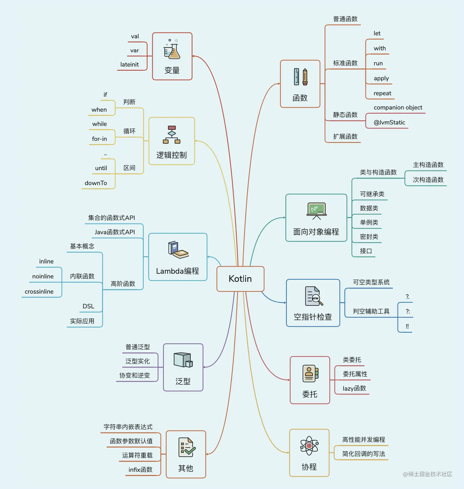
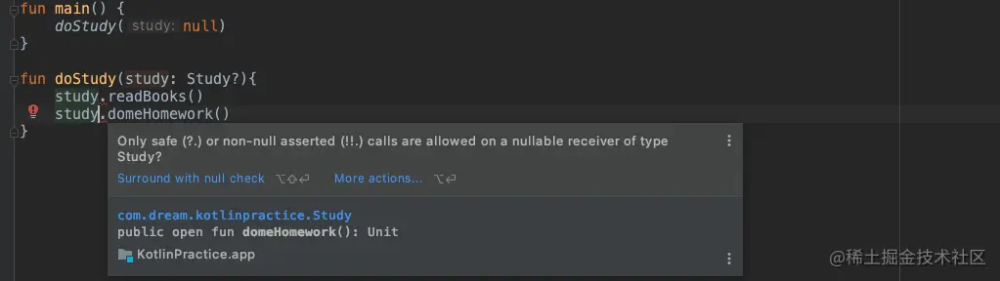
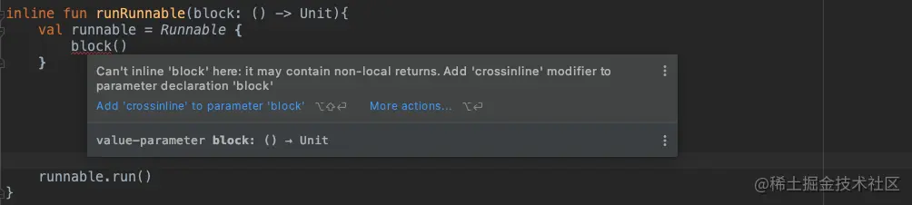

# Kotlin

- [Kotlin](#kotlin)
  - [变量和函数](#变量和函数)
    - [变量](#变量)
  - [常量](#常量)
    - [函数](#函数)
  - [程序的逻辑控制](#程序的逻辑控制)
    - [if 条件语句](#if-条件语句)
    - [when 条件语句](#when-条件语句)
    - [循环语句](#循环语句)
  - [面向对象编程](#面向对象编程)
    - [类与对象](#类与对象)
    - [继承与构造函数](#继承与构造函数)
      - [继承](#继承)
      - [构造函数](#构造函数)
    - [接口](#接口)
    - [函数的可见性修饰符](#函数的可见性修饰符)
    - [数据类与单例类](#数据类与单例类)
      - [数据类](#数据类)
      - [单例类](#单例类)
  - [Lambda 编程](#lambda-编程)
    - [集合的创建和遍历](#集合的创建和遍历)
    - [集合的函数式 API](#集合的函数式-api)
    - [Java 函数式 API 的使用](#java-函数式-api-的使用)
  - [空指针检查](#空指针检查)
    - [可空类型系统和判空辅助工具](#可空类型系统和判空辅助工具)
  - [Kotlin中的小魔术](#kotlin中的小魔术)
    - [字符串的内嵌表达式](#字符串的内嵌表达式)
    - [函数的参数默认值](#函数的参数默认值)
  - [标准函数和静态方法](#标准函数和静态方法)
    - [标准函数let，also，with，run 和 apply](#标准函数letalsowithrun-和-apply)
    - [定义静态方法](#定义静态方法)
  - [延迟初始化和密封类](#延迟初始化和密封类)
    - [对变量延迟初始化](#对变量延迟初始化)
    - [使用密封类优化代码](#使用密封类优化代码)
  - [扩展函数和运算符](#扩展函数和运算符)
    - [大有用途的扩展函数](#大有用途的扩展函数)
    - [有趣的运算符重载](#有趣的运算符重载)
  - [高阶函数详解](#高阶函数详解)
    - [定义高阶函数](#定义高阶函数)
    - [高阶函数的调用](#高阶函数的调用)
    - [内联函数的作用](#内联函数的作用)
  - [泛型和委托](#泛型和委托)
    - [泛型的基本用法](#泛型的基本用法)
  - [类委托和委托属性](#类委托和委托属性)
  - [使用 infix 函数构建更可读的语法](#使用-infix-函数构建更可读的语法)



## 变量和函数

### 变量

1. 使用 ``val``（value 的简写）关键字来声明一个不可变的变量，也就是只读变量，这种变量初始赋值后就不能重新赋值了，对应 Java 中的 ``final`` 变量
2. 使用 ``var`` （variable 的简写）关键字用来声明一个可变的变量，也就是可读写变量，这种变量初始赋初值后仍然可以重新被赋值，对应 Java 中的非 ``final`` 变量
3. Kotlin 中的每一行代码都不用加`` ；``

```kotlin
//在 Java 中，我们会这么定义
int a = 10;
boolean b = true

//在 Kotlin 中，我们可以这么定义，当给变量赋值后，Kotlin 编译器会进行类型推导
//定义一个不可变的变量 a 
val a = 10
//定义一个可变的变量 b
var b = true

//如果我们显示的给变量指定类型，Kotlin 就不会进行类型推导了
val a: Int = 10
var b: Boolean = "erdai"
```

如果你观察的仔细会发现，上述代码 Kotlin 定义变量给变量显示的指定类型时，使用的都是首字母大小的 ``Int``，``Boolean``，而在 Java 中都是小写的 ``int``，``boolean``，这表明： Kotlin 完全抛弃了 Java 中的基本数据类型，全部都是**对象数据**类型。 下面给出一个 Java 和 Kotlin 数据类型对照表：
| Java 基本数据类型 | Kotlin 对象数据类型 | 数据类型说明 |
| ----------------- | ------------------- | ------------ |
| byte              | Byte                | 字节型       |
| short             | Short               | 短整型       |
| int               | Int                 | 整型         |
| long              | Long                | 长整型       |
| float             | Float               | 单精度浮点数 |
| double            | Double              | 双精度浮点数 |
| char              | Char                | 字符型       |
| boolean           | Boolean             | 布尔型       |

## 常量

Kotlin 中定义一个常量需要满足三个条件

1. 使用 ``const val`` 来修饰，并初始化
2. 修饰的类型只能是字符串和基础对象类型
3. 只能修饰顶层的常量，object 修饰的成员，companion object 的成员，这些概念后面还会讲到

```kotlin
//定义一个顶层的常量，这个常量不放在任何的类中
const val CONSTANT = "This is a constant"

//定义一个 object 修饰的单例类，类中定义一个常量
object SingeTon {
    const val CONSTANT = "This is a constant"
}

class KotlinPractice {
    //定义一个 companion object 修饰的伴生对象，里面定义一个常量
    companion object{
        const val CONSTANT = "This is a constant"
    }
}
```

### 函数

1. 函数和方法是同一个概念，在 Java 中我们习惯叫方法 (method)，但是 Kotlin 中就需要叫函数 (function)
2. 函数是运行代码的载体,像我们使用过的 main 函数就是一个函数
Kotlin 中定义语法的规则：

```kotlin
fun methodName(param1: Int, param2: Int): Int {
    return 0
}

//下面这两个方法效果是一样的
fun methodName1(params: Int,params2: Int): Unit{

}

fun methodName1(params: Int,params2: Int){

}
```

上述函数语法解释：

fun ( function 的缩写 ) 是定义一个函数的关键字，无论你定义什么函数，都要用 fun 来声明
函数名称可以随便取，就像 Java 里面定义函数名一样
函数名里面的参数可以有任意多个，参数的声明格式为：``"参数名"："参数类型"``
参数名后面这部分代表返回值，我们这返回的是一个 ``Int`` 类型的值，这部分是可选的，如果不定义，默认返回值为 ``Unit``，且 ``Unit`` 可省略

实践一下：

```kotlin
fun main() {
    val number1 = 15
    val number2 = 20
    val maxNumber = largeNumber(number1,number2)
    println(maxNumber)
}

fun largeNumber(number1: Int,number2: Int) : Int{
    //调用顶层 max 函数计算两者中的最大值
    return max(number1,number2)
}

//打印结果
20
```

> Kotlin 语法糖：当一个函数体中只有一行代码的时候，我们可以不编写函数体，可以将唯一的一行代码写在函数定义的尾部，中间用 = 连接即可

那么上述 largeNumber 这个函数我们改造一下：

```kotlin
//根据上述语法糖，我们省略了函数体的 {} 和 return 关键字，增减的 = 连接
fun largeNumber(number1: Int,number2: Int) : Int = max(number1,number2)
//根据 Kotlin 类型推导机制，我们还可以把函数的返回值给省略，最终变成了这样
fun largeNumber(number1: Int,number2: Int) = max(number1,number2)
```

## 程序的逻辑控制

### if 条件语句

1. Kotlin 中的 if 条件语句除了继承了 Java 中 if 条件语句的所有特性，且可以把每一个条件中的最后一行代码作为返回值

我们改造一下上述 largeNumber 函数的内部实现：

```kotlin
//Kotlin 中把每一个条件中的最后一行代码作为返回值
fun largeNumber(number1: Int,number2: Int) : Int{
    return if(number1 > number2){
      	number1
    }else {
      	number2
    }
}

//根据上面学习的语法糖和 Kotlin 类型推导机制，我们还可以简写 largeNumber 函数，最终变成了这样
fun largeNumber(number1: Int,number2: Int) = if(number1 > number2) number1 else number 2
```

### when 条件语句

- when 条件语句也是有返回值的，和 if 条件语句类似，条件中的最后一行代码作为返回值
- when 条件语句允许传入任意类型的参数
- when 条件体中条件格式：``匹配值 -> { 执行逻辑 }``
- when 条件语句和 if 条件语句一样，当条件体里面只有一行代码的时候，条件体的 {} 可省略

```kotlin
//when 中有参数的情况
fun getScore(name: String) = when (name) {
    "tom" -> 99
    "jim" -> 80
    "lucy" -> 70
    else -> 0
}

//when 中无参数的情况，Kotin 中判断字符串或者对象是否相等，直接使用 == 操作符即可
fun getScore(name: String) = when {
    name == "tom" -> 99
    name == "jim" -> 80
    name =="lucy" -> 70
    else -> 0
}
```

### 循环语句

主要有以下两种循环：

1. while 循环，这种循环和 Java 没有任何区别
2. for 循环，Java 中常用的循环有：for-i，for-each，Kotlin 中主要是：for-in

区间

- 使用 .. 表示创建两端都是闭区间的升序区间
- 使用 until 表示创建左端是闭区间右端是开区间的升序区间
- 使用 downTo 表示创建两端都是闭区间的降序区间
- 在区间的后面加上 step ，表示跳过几个元素

```kotlin
//注意: Kotlin 中可以使用字符串内嵌表达式，也就是在字符串中可以引用变量，后续还会讲到
//情况1
fun main() {
    //使用 .. 表示创建两端都是闭区间的升序区间
    for (i in 0..10){
        print("$i ")
    }
}
//打印结果
0 1 2 3 4 5 6 7 8 9 10

//情况2
fun main() {
    //使用 until 表示创建左端是闭区间右端是开区间的升序区间
    for (i in 0 until 10){
        print("$i ")
    }
}
//打印结果
0 1 2 3 4 5 6 7 8 9

//情况3
fun main() {
    //使用 downTo 表示创建两端都是闭区间的降序区间
    for (i in 10 downTo 0){
        print("$i ")
    }
}
//打印结果
10 9 8 7 6 5 4 3 2 1 0

//情况4
fun main() {
    //使用 downTo 表示创建两端都是闭区间的降序区间,每次在跳过3个元素
    for (i in 10 downTo 0 step 3){
        print("$i ")
    }
}
//打印结果
10 7 4 1 
```

## 面向对象编程

### 类与对象

1. 当我们在类中创建属性的时候，Kotlin 会自动帮我们创建 ``get`` 和 ``set`` 方法
2. Kotlin 中实例化对象和 Java 类似，但是把 ``new`` 关键字给去掉了
3. 一般在类中，我们会用 ``var`` 关键字去定义一个属性，因为属性一般是可变的，如果你确定某个属性不需要改变，则用 ``val``

```kotlin
class Person {
    var name = ""
    var age = 0

    fun sleep(){
        println("$name is sleep, He is $age years old.")
    }
}

fun main() {
    val person = Person()
    person.name = "erdai"
    person.age = 20
    person.sleep()
}
//打印结果
erdai is sleep, He is 20 years old.
```

### 继承与构造函数

#### 继承

1. Kotlin 中规定，如果要声明一个非抽象类可继承，必须加上 ``open`` 关键字，否则不可继承，这点和 Java 中不同，Java 中的类默认是可被继承的，Effective Java 这本书中提到：如果一个类不是专门为继承而设计的，那么就应该主动将它加上 final 声明，禁止他可以被继承
2. Kotlin中的继承和实现都是用 : 表示

```kotlin
//声明 Person 类可以被继承
open class Person {
    var name = ""
    var age = 0
  
    fun sleep() {
        println("$name is sleep, He is $age years old.")
    }
}

//定义 Student 继承 Person 类
//为啥 Person 后面会有一个括号呢？因为子类的构造函数必须调用父类中的构造函数，在 Java 中，子类的构造函数会隐式的去调用
class Student : Person(){
    
}
```

#### 构造函数

1. 主构造函数的特点是没有函数体，直接跟在类名的后面即可，如果需要在主构造函数里面做逻辑，复写 ``init`` 函数即可
2. 主构造函数中声明成 ``val`` 或者 ``var`` 的参数将自动成为该类的字段，如果不加，那么该字段的作用域仅限定在主构造函数中
3. 次构造函数是通过 ``constructor`` 关键字来定义的
4. 当一个类没有显示的定义主构造函数，但是定义了次构造函数时，那么被继承的类后面不需要加 ()

```kotlin
//定义 Student 类，定义主构造函数，定义属性 sno 和 grade, 继承 Person 类
class Student(var sno: String, var grade: Int) : Person() {
        //做一些初始化的逻辑
  	init {
        name = "erdai"
        age = 20
    }
    
    //声明带一个参数的次构造函数
    constructor(sno: String): this(sno,8){

    }

    //声明一个无参的次构造函数
    constructor(): this("123",7){

    }

    fun printInfo(){
        println("I am $name, $age yeas old, sno: $sno, grade: $grade")
    }
}

fun main() {
    val student1 = Student()
    val student2 = Student("456")
    val student3 = Student("789",9)
    student1.printInfo()
    student2.printInfo()
    student3.printInfo()
}
//打印结果
I am erdai, 20 yeas old, sno: 123, grade: 7
I am erdai, 20 yeas old, sno: 456, grade: 8
I am erdai, 20 yeas old, sno: 789, grade: 9

//一种特殊情况：当一个类没有显示的定义主构造函数，但是定义了次构造函数时，那么被继承的类后面不需要加 ()
class Student : Person{
    constructor() : super(){
        
    }
}
```

### 接口

Kotlin 和 Java 中定义接口没有任何区别

```kotlin
//定义接口中的一系列的抽象行为 Kotlin 中增加了接口中定义的函数可以有默认实，其实 Java 在 JDK1.8 之后也开始支持这个功能
interface Study{
     fun readBooks()
     //如果子类没有重写这个方法,那么就会调用这个方法的默认实现
     fun doHomework(){
         println("do homework default implementation")
     }
}

//定义一个可被继承的 People 类，有 name 和 age 两个属性
open class People(val name: String,val age: Int){

}

//定义一个 Student 类，继承 People 类，实现 Study 接口
class Student(name: String, age: Int) : People(name, age),Study{
    override fun readBooks() {
        println("$name is read book")
    }
}

//定义的一个方法 然后在main函数调用
fun doStudy(study: Study){
    study.readBooks()
    study.doHomework()
}

//main函数调用
fun main(){
    val student = Student("erdai",20)
    //这里student实现了Study接口,这种叫做面向接口编程,也可以称为多态
    doStydy(student)
}

//打印结果
erdai is read book
do homework default implementation
```

### 函数的可见性修饰符

| 修饰符    | Java                         | Kotlin               |
| --------- | ---------------------------- | -------------------- |
| public    | 所有类可见                   | 所有类可见(默认)     |
| private   | 当前类可见                   | 当前类可见           |
| protected | 当前类,子类,同一个包下的可见 | 当前类和子类可见     |
| default   | 同一个包下的可见(默认)       | 无                   |
| internal  | 无                           | 同一个模块中的类可见 |

### 数据类与单例类

#### 数据类

1. 在 Java 中，数据类通常需要重写 equals( )，hashCode( )，toString( ) 这几个方法，其中 equals( ) 方法用于判断两个数据类是否相等。hashCode( ) 方法作为 equals( ) 的配套方法，也需要一起重写，否则会导致 hash 相关的系统类无法正常工作，toString( ) 方法则用于提供更清晰的输入日志，否则一个数据类默认打印出来的是一行内存地址
2. 在 Kotlin 中，我们只需要使用 ``data`` 关键字去修饰一个类，Kotlin 就会自动帮我们生成 Java 需要重写的那些方法

```kotlin
//在 Java 中，我们会这么写
public class Cellphone {
    
    String brand;
    double price;

    @Override
    public boolean equals(Object o) {
        if (this == o) return true;
        if (o == null || getClass() != o.getClass()) return false;
        Cellphone cellphone = (Cellphone) o;
        return Double.compare(cellphone.price, price) == 0 &&
                Objects.equals(brand, cellphone.brand);
    }

    @Override
    public int hashCode() {
        return Objects.hash(brand, price);
    }

    @Override
    public String toString() {
        return "Cellphone{" +
                "brand='" + brand + '\'' +
                ", price=" + price +
                '}';
    }
}

//在 Kotlin 中，你会发现是如此的简洁
data class Cellphone(val brand: String, val price: Double)
```

#### 单例类

1. Kotlin 中，我们只需要使用 ``object`` 关键字去替换 ``class`` 关键字就可以去定义一个单例类了
2. 调用单例类中的方法也比较简单，直接使用类名 . 上方法就可以了，类似于 Java 中的静态方法调用方式

```kotlin
//java中单例 懒汉式
public class Singleton{
  	private static Singleton instance;
  
  	public synchronized static Singleton getInstace() {
      		if(instance == null){
            	instance = new Singleton();
          }
      		return instance;
    }
  
  	public void singleonTest(){
      	System.out.println("singletonTest in Java is called.");
    }
}

//Kotlin中的单例
object Singleton{
  	fun singletonTest(){
      	println("singletonTest in Kotlin is called.")
    }
}

fun main() {
    Singleton.singletonTest()
}
//打印结果
singletonTest in Kotlin is called.
```

## Lambda 编程

Kotlin 从第一个版本就开始支持了 Lambda 编程，并且 Kotlin 中的 Lambda 表达式极为强大，本章我们学习 Lambda 编程的一些基础知识：

1. 简单来说，Lambda 就是一段可以作为参数传递的代码，它可以作为函数的参数，返回值，同时也可以赋值给一个变量
2. Lambda 完整的表达式的语法结构：``{ 参数名1：参数类型，参数名2：参数类型 -> 函数体 }``
3. 很多时候，我们会使用简化形式的语法结构，直接就是一个函数体：{函数体}，这种情况是当 Lambda 表达式的参数列表中只有一个参数的时候，我们可以把参数给省略，默认会有个 it 参数
4. Kotlin 中规定，当 Lambda 表达式作为函数的最后一个参数的时候，我们可以把 Lambda 表达式移到函数括号的外面
5. Kotlin 中规定，当 Lambda 表达式是函数的唯一参数的时候，函数的括号可以省略

### 集合的创建和遍历

1. 不可变集合：在集合初始化之后，我们不能对其进行增删改操作
2. 可变集合：在集合初始化之后，我们还能对其进行增删改操作

| 不可变集合 | 可变集合      |
| ---------- | ------------- |
| listOf     | mutableListOf |
| setOf      | mutableSetOf  |
| mapOf      | mutableMapOf  |

```kotlin
//List 集合 
//定义一个不可变 List 集合
val list1 = listOf("Apple","Banana","Orange","Pear","Grape")
//定义一个可变 List 集合
val list2 = mutableListOf("Apple","Banana","Orange","Pear","Grape")
//添加元素
list2.add("Watermelon")
for (i in list2) {
    print("$i ")
}
//打印结果
Apple Banana Orange Pear Grape Watermelon

//Set 集合和 List 集合用法完全一样
//定义一个不可变 Set 集合
val set1 = setOf("Apple","Banana","Orange","Pear","Grape")
//定义一个可变 Set 集合
val set2 = mutableSetOf("Apple","Banana","Orange","Pear","Grape")
//添加元素
set2.add("Watermelon")
for (i in set2) {
    print("$i ")
}
//打印结果
Apple Banana Orange Pear Grape Watermelon

//Map 集合
//定义一个不可变 Map 集合
val map1 = mapOf("Apple" to 1,"Banana" to 2,"Orange" to 3, "Pear" to 4,"Grape" to 5)
//定义一个可变 Map 集合
val map2 = mutableMapOf("Apple" to 1,"Banana" to 2,"Orange" to 3, "Pear" to 4,"Grape" to 5)
//当前 key 存在则修改元素，不存在则添加元素
map2["Watermelon"] = 6
for ((key,value) in map2) {
    print("$key: $value ")
}
//打印结果
```

### 集合的函数式 API

```kotlin
//定义一个不可变 List 集合
val list1 = listOf("Apple","Banana","Orange","Pear","Grape","Watermelon")
//现在我想打印集合中英文名字最长的字符串，我们可以这么做
//方式1
var maxLengthFruit = ""
for (fruit in list1) {
    if(fruit.length > maxLengthFruit.length){
        maxLengthFruit = fruit
    }
}
print(maxLengthFruit)
//打印结果
Watermelon

//但是如果使用函数式 Api 将会变得更加简单, maxBy 函数会根据你的条件遍历得到符合条件的最大值
//方式2
val maxLengthFruit = list1.maxBy {
    it.length
}
print(maxLengthFruit)
//打印结果
Watermelon

//通过 maxBy 函数结合 Lambda 表达式语法结构，我们来剖析方式2这种写法的原理, 如下所示
//1
val list1 = listOf("Apple","Banana","Orange","Pear","Grape","Watermelon")
val lambda = {fruit: String -> fruit.length}
//maxBy 函数实际上接收的是一个函数类型的参数，后续讲高阶函数的时候会讲到，也就是我们这里可以传入一个 Lambda 表达式
val maxLengthFruit = list1.maxBy(lambda)

//2 替换 lambda
val maxLengthFruit = list1.maxBy({fruit: String -> fruit.length})

//3 Kotlin 中规定，当 Lambda 表达式作为函数的最后一个参数的时候，我们可以把 Lambda 表达式移到函数括号的外面
val maxLengthFruit = list1.maxBy(){fruit: String -> fruit.length}

//4 Kotlin 中规定，当 Lambda 表达式是函数的唯一参数的时候，函数的括号可以省略
val maxLengthFruit = list1.maxBy{fruit: String -> fruit.length}

//5 当 Lambda 表达式的参数列表中只有一个参数的时候，我们可以把参数给省略，默认会有个 it 参数
val maxLengthFruit = list1.maxBy{ it.length }

//经过上面 1->2->3->4->5 这几个步骤，我们最终得到了 5 的这种写法
```

集合中还有很多这样的函数式 Api，下面我们通过 list 集合来实践一下其他的一些函数式 Api：

```kotlin
val list = listOf("Apple","Banana","Orange","Pear","Grape","Watermelon")
//1
//通过 map 操作，把一个元素映射成一个新的元素
val newList = list.map{
    it.toUpperCase()
}
for (s in newList) {
    print("$s ")
}
//打印结果
APPLE BANANA ORANGE PEAR GRAPE WATERMELON 

//2
//通过 filter 筛选操作，筛选长度小于等于5的字符串
val newList = list.filter {
    it.length <= 5
}
for (s in newList) {
    print("$s ")
}
//打印结果
Apple Pear Grape
```

### Java 函数式 API 的使用

1. Kotlin 中调用 Java 方法也可以使用函数式 Api ,但必须满足两个条件：1、得是用 Java 编写的接口 2、接口中只有一个待实现的方法
2. Kotlin 中写匿名内部类和 Java 有一点区别，Kotlin 中因为抛弃了 ``new`` 关键字，改用 ``object`` 关键字就可以了

```kotlin
//java 中的匿名内部类
new Thread(new Runnable() {
     @Override
     public void run() {

     }
}).start();

//Kotlin 中可以这么写
Thread(object : Runnable{
    override fun run() {
            
    }
}).start()

/**
 * 我们接着来简化 Kotlin 中的写法
 * 因为 Runnable 类中只有一个待实现方法，即使这里没有显示的重写 run() 方法，
 * Kotlin 也能明白后面的 Lambda 表达式就是要在 run() 方法中实现的内容
 */
Thread(Runnable{
  
}).start()

//因为是单抽象方法接口，我们可以将接口名进行省略
Thread({
  
}).start()

//当 Lambda 表达式作为函数的最后一个参数的时候，我们可以把 Lambda 表达式移到函数括号的外面
Thread(){
  
}.start()

//当 Lambda 表达式是函数的唯一参数的时候，函数的括号可以省略
Thread{
  
}.start()
```

## 空指针检查

Android 系统上奔溃最高的异常就是空指针异常（NullPointerException），造成这种现象的主要原因是因为空指针是一种不受编程语言检查的运行时异常，只能由程序员主动通过逻辑判断来避免，但即使在出色的程序员，也不可能将所有潜在的空指针异常都考虑到。但是这种情况在 Kotlin 上得到了很好的解决，Kotlin 把空指针异常提前到了编译期去检查，这样的做法几乎杜绝了空指针异常，但是这样子会导致代码变得比较难写，不过 Kotlin 提供了一系列的辅助工具，让我们能轻松的处理各种判空的情况，下面我们就来学习它

### 可空类型系统和判空辅助工具

1. 在类型后面加上 ? ，表示可空类型，Kotlin 默认所有的参数和变量不可为空
2. 在对象调用的时候，使用 ?. 操作符，它表示如果当前对象不为空则调用，为空则什么都不做
3. ?: 操作符表示如果左边的结果不为空，返回左边的结果，否则返回右边的结果
4. 在对象后面加 !! 操作符表示告诉Kotlin我这里一定不会为空,你不用进行检测了，如果为空，则抛出空指针异常
5. let 函数，提供函数式 Api，并把当前调用的对象当作参数传递到 Lambda 表达式中

情况1： 在类型后面加上 ? ，表示可空类型，Kotlin 默认所有的参数和变量不可为空

```kotlin
interface Study{
    fun readBooks()
    fun domeHomework(){
        println("do homework default implementation")
    }
}

fun doStudy(study: Study){
    study.readBooks()
    study.domeHomework()
}
```

上面这段代码是不会出现空指针异常的，如果你尝试向 doStudy 这个方法传递一个 null ，编译器会报错：

因此这种情况我们就可以使用可空类型，把 Study 改成 Study？，如下图：

你会发现虽然调用 doStudy 方法不报错了，但是 doStudy 内部的调用却报错了，因为此时 doStudy 接受一个可空的类型参数，可能会造成内部的空指针， Kotlin 编译器不允许这种情况存在，那么我们进行如下改造就好了：

```kotlin
fun doStudy(study: Study?){
    if(study != null){
        study.readBooks()
        study.domeHomework()
    }
}
```

情况2： 在对象调用的时候，使用 ?. 操作符，它表示如果当前对象不为空则调用，为空则什么都不做
针对上面的 doStudy 方法，我们还可以这么做：

```kotlin
fun doStudy(study: Study?){
    study?.readBooks()
    study?.domeHomework()
}
```

情况3： ?: 操作符表示如果左边的结果不为空，返回左边的结果，否则返回右边的结果

```kotlin
//平时我们可能写这样的代码
val a = if (b != null) {
    b
} else {
    c
}

//使用 ?: 操作符可以简化成这样
val a = b ?: c
```

情况4： 在对象后面加 !! 操作符表示告诉Kotlin我这里一定不会为空,你不用进行检测了，如果为空，则抛出空指针异常

```kotlin
//下面这段代码编译通不过，因为 printName 方法里的 name 并不知道你在外面做了非空判断
val name: String? = "erdai"

fun printName(){
    val upperCaseName = name.toUpperCase()
    print(upperCaseName)
}

fun main() {
    if(name != null){
       printName()
    }
}

//因此在上面这种明确不会为空的情况下，我们可以使用 !! 操作符，改造一下 printName 方法
//同时要提醒一下自己，是否存在更好的实现方式，因为使用这种操作符，还是会存在潜在的空指针异常
fun printName(){
    val upperCaseName = name!!.toUpperCase()
    print(upperCaseName)
}
//打印结果
ERDAI
```

情况5： let 函数，提供函数式 Api，并把当前调用的对象当作参数传递到 Lambda 表达式中

```kotlin
//这是我们情况2 实现的方式，但是如果这种调用方式一多，会显得特别啰嗦，例如：
fun doStudy(study: Study?){
    study?.readBooks()
    study?.domeHomework()
    study?.a()
    study?.b()
}
//上面这种情况等同于如下代码:
fun doStudy(study: Study?){
    if(study != null){
      	study?.readBooks()
    }
  
    if(study != null){
     	study?.domeHomework()
    }
  
    if(study != null){
     	study?.a()
    }
  
    if(study != null){
      	study?.b()
    }
}

//这个时候我们就可以使用 let 函数来操作了
fun doStudy(study: Study?){
    study?.let{
      it.readBooks()
      it.domeHomework()
      it.a()
      it.b()
    }
}
```

## Kotlin中的小魔术

### 字符串的内嵌表达式

1. Kotlin 中，字符串里面可以使用 ${} 引用变量值和表达式，当 {} 里面只有一个变量，非表达式时，{}也可以去掉
 
```kotlin
fun main() {
    val a = "erdai"
    val b = "666"
    print("$a ${a + b}")
}
//打印结果
erdai erdai666
```

### 函数的参数默认值

1. 定义一个函数时，我们可以给函数的参数添加一个默认值，这样子我们就不需要去传那个参数
2. 在我们调用一个函数时，我们可以使用 key value 的形式来传参

```kotlin
//情况1：定义一个函数时，我们可以给函数的参数添加一个默认值，这样子我们就不需要去传那个参数
fun printParams(name: String,age: Int = 20){
    print("I am $name, $age years old.")
}

fun main() {
    printParams("erdai")
}
//打印结果
I am erdai, 20 years old.

//当然我们也可以选择覆盖默认参数
fun main() {
    printParams("erdai",25)
}
//打印结果
I am erdai, 25 years old.

//情况2：在我们调用一个函数时，我们可以使用 key value 的形式来传参
fun main() {
    //注意 printParams 方法的一个参数是 name ,第二个才是 age, 但是通过 key value 的形式来传参就不会出现参数顺序问题
    printParams(age = 19,name = "erdai666")
}
//打印结果
I am erdai666, 19 years old.
```

> 小技巧：我们可以通过函数的参数默认值来代替次构造函数，使用主构造函数就好了

## 标准函数和静态方法

### 标准函数let，also，with，run 和 apply

1. let 函数，必须让某个对象调用，接收一个 Lambda 表达式参数，Lambda 表达式中的参数为当前调用者，且**最后一行代码作为返回值**
2. also 函数，必须让某个对象调用，接收一个 Lambda 表达式参数，Lambda 表达式中的参数为当前调用者，无法指定返回值，这个函数返回的是当前调用对象本身
3. with 函数，接收两个参数，第一个为任意类型参数，第二个为 Lambda 表达式参数，Lambda 表达式中拥有第一个参数的上下文 this ，且**最后一行代码作为返回值**
4. run 函数，必须让某个对象调用，接收一个 Lambda 表达式参数，Lambda 表达式中拥有当前调用对象的上下文 this ，且**最后一行代码作为返回值**
5. apply 函数，必须让某个对象调用，接收一个 Lambda 表达式参数，Lambda 表达式中拥有当前调用对象的上下文 this ，无法指定返回值，这个函数返回的是当前调用对象本身

> 注意：在Lambda 表达式中，拥有对象的上下文 this，和拥有该对象是一样的，只不过 this 可省略，而拥有该对象我们可以自定义参数名，如果不写该参数，默认会有个 it 参数

下面通过代码来感受一下：

```kotlin
/**
 * 情况1：let 函数
 * 1、创建一个 StringBuilder 对象调用 let 函数，Lambda 表达式中的参数为 StringBuilder 对象
 * 2、当 Lambda 表达式中只有一个参数的时候可省略，默认会有个 it 的参数，返回值即为 Lambda 表达式中最后一行代码
 */
fun main() {
    val name = "erdai"
    val age = 20
    val returnValue = StringBuilder().let {
        it.append(name).append(" ").append(age)
    }
    println(returnValue)
}
//打印结果
erdai 20

/**
 * 情况2：also 函数
 * 1、创建一个 StringBuilder 对象调用 also 函数，Lambda 表达式中的参数为 StringBuilder 对象
 * 2、当 Lambda 表达式中只有一个参数的时候可省略，默认会有个 it 的参数，无法指定返回值，返回调用对象本身
 */
fun main() {
    val name = "erdai"
    val age = 20
    val stringBuilder = StringBuilder().also {
        it.append(name).append(" ").append(age)
    }
    println(stringBuilder.toString())
}
//打印结果
erdai 20

/**
 * 情况3：with 函数
 * 1、接收两个参数，第一个参数为 StringBuilder 对象，第二个参数为 Lambda 表达式，
 * 2、Lambda 表达式中拥有 StringBuilder 对象的上下文 this, 返回值即为 Lambda 表达式中的最后一行代码
 */
fun main() {
    val name = "erdai"
    val age = 20
    val returnValue = with(StringBuilder()) {
        append(name).append(" ").append(age)
    }
    println(returnValue)
}
//打印结果
erdai 20

/**
 * 情况4：run 函数
 * 1、创建一个 StringBuilder 对象调用 also 函数，Lambda 表达式中拥有 StringBuilder 对象的上下文 this
 * 2、返回值即为 Lambda 表达式中的最后一行代码
 */
fun main() {
    val name = "erdai"
    val age = 20

    val returnValue = StringBuilder().run {
        append(name).append(" ").append(age)
    }
    println(returnValue)
}
//打印结果
erdai 20

/**
 * 情况5：apply 函数
 * 1、创建一个 StringBuilder 对象调用 apply 函数，Lambda 表达式中拥有 StringBuilder 对象的上下文 this
 * 2、无法指定返回值，返回调用对象本身
 */
fun main() {
    val name = "erdai"
    val age = 20

    val stringBuilder = StringBuilder().apply {
        append(name).append(" ").append(age)
    }
    println(stringBuilder.toString())
}
//打印结果
erdai 20
```

其实上面 5 个标准函数有很多相似的地方，我们需搞清楚它们差异之处，下面我们用一个图表来总结一下：
| 标准函数 | 函数参数 | 是否是扩展函数 | 返回值       |
| -------- | -------- | -------------- | ------------ |
| T.let    | it       | 是             | 最后一行代码 |
| T.also   | it       | 是             | 对象本身     |
| T.with   | this     | 否             | 最后一行代码 |
| T.run    | this     | 是             | 最后一行代码 |
| T.apply  | this     | 是             | 对象本身     |

### 定义静态方法

Kotlin 中没有直接提供定义为静态方法的关键字，但是提供了一些类似的语法特性来支持静态方法调用的写法

1. 使用 companion object 为一个类创建一个伴生类，然后调用这个伴生类的方法，这个方法不叫静态方法，但是可以当作静态方法调用
2. 使用 ``object`` 关键字定义一个单例类，通过单例类，去调用方法，这种方法也不叫静态方法，但是可以当作静态方法调用
3. 如果想定义真正的静态方法，Kotlin 中也提供了两种方式：1、使用 @JvmStatic 注解，且注解只能加在伴生类和单例类上的方法上面  2、定义顶层方法
4. 顶层方法就是不定义在任何类中的方法，顶层方法在任何位置都能被调用到，Kotlin 编译器会把所有的顶层方法编译成静态方法
5. 如果在 Java 中调用顶层方法，Java 默认是没有顶层方法的概念的，Kotlin 编译器会生成一个我们定义这个文件的 Java 类，例如我在 Kotlin 中的 Util.kt 文件中定义了一个顶层方法，那么就会生成一个 UtilKt 的 Java 类供在 Java 中调用
6. 在 Kotlin 中比较常用的是 单例，伴生类和顶层方法，@JvmStatic 注解用的比较少

```kotlin
//在 Java 中我们可以这样定义一个静态方法
public class Util {
  
    public static void doAction(){
        System.out.println("do something");
    }
}

//Kotlin 中类似这样静态调用多种多样
//情况1：使用 companion object 为一个类创建一个伴生类
fun main() {
   Util.doAction()
}

class Util{
    companion object{
        fun doAction(){
            println("do something")
        }
    }
}
//打印结果
do something

//情况2：使用 object 关键字定义一个单例类
fun main() {
   Util.doAction()
}

object Util {

    fun doAction() {
        println("do something")
    }
}
//打印结果
do something

//情况3：1、使用 @JvmStatic 注解 2、定义顶层方法
//1
//单例类
object Util {
  
    @JvmStatic
    fun doAction() {
        println("do something")
    }
}

//伴生类
class Util {
  
    companion object{
        fun doAction() {
            println("do something")
        }
    }
}

//2 使用 AndroidStudio 新建一个文件，在弹框中选择 File 即可，我们在这个 File 中编写一个顶层方法
//顶层方法在任何位置都能调用到
fun doAction(){
    println("do something")
}
```

上述代码大家可以将 Kotlin 文件转换成 Java 文件看一下，你就会发现定义真正的静态方法和非静态方法的区别

## 延迟初始化和密封类

### 对变量延迟初始化

1. 使用 lateinit 关键字对一个变量延迟初始化

使用  lateinit 关键字注意事项：

- 只能作用于 var 属性，且该属性没有自定义 get 和 set 方法
- 该属性必须是非空类型，且不能是原生类型
- 当你对一个变量使用了 ``lateinit`` 关键字，Kotlin 编译器就不会在去检查这个变量是否会为空了，此时你要确保它在被调用之前已经初始化了，否则程序运行的时候会报错，可以使用 ``::object.isInitialized`` 这种固定的语法结构判断变量是否已经初始化

2. 使用 by lazy 对一个变量延迟初始化

使用 by lazy 注意事项：

- 只能作用于 val 属性

```kotlin
//情况1：使用 lateinit 关键字对一个变量延迟初始化
lateinit var name: String

fun main() {
   name = "erdai"
   println(name)
}
//打印结果
erdai

//情况2: 使用 ::object.isInitialized 这种固定的语法结构判断变量是否已经初始化
lateinit var name: String

fun main() {
    if(::name.isInitialized){
        println(name)
    }else{
        println("name not been initialized")
    }
}
//打印结果
name not been initialized

//情况3: 使用 by lazy 对一个变量延迟初始化
//特点：该属性调用的时候才会初始化，且 lazy 后面的 Lambda 表达式只会执行一次
val name: String by lazy {
    "erdai"
}

fun main() {
    println(name)
}
//打印结果
erdai
```

### 使用密封类优化代码

密封类能使我们写出更加规范和安全的代码

1. 使用 ``sealed class`` 定义一个密封类
2. 密封类及其子类，只能定义在同一个文件的顶层位置
3. 密封类可被继承
4. 当我们使用条件语句的时候，需要实现密封类所有子类的情况，避免写出永远不会执行的代码

```kotlin
//在使用密封类之前我们可能会写出这种代码
interface Result
class Success : Result
class Failure : Result

/**
 * 那么此时如果我新增一个类实现 Result 接口，编译器并不会提示我们去新增新的条件分支
 * 如果我们没有新增相应的条件分支，那么就会出现执行 else 的情况
 * 其实这个 else 就是一个无用分支，这仅仅是为了满足编译器的要求
 */
fun getResultMsg(result: Result) = when (result){
    is Success -> "Success"
    is Failure -> "Failure"
    else -> throw RuntimeException()
}

//在使用密封类之后
sealed class Result
class Success : Result()
class Failure : Result()
/**
 * 此时我们就避免了写 else 分支，这个时候如果我新增一个类实现 Result 密封类
 * 编译器就会提示异常，需要 when 去新增相应的条件分支
 */
fun getResultMsg(result: Result) = when (result){
    is Success -> "Success"
    is Failure -> "Failure"
}
```

## 扩展函数和运算符

### 大有用途的扩展函数

扩展函数允许我们去扩展一个类的函数，这种特性是 Java 中所没有的
扩展函数的语法结构如下：

```kotlin
fun ClassName.methodName(params1: Int, params2: Int) : Int{
  
}
```

相比于普通的函数，扩展函数只需要在函数前面加上一个 ClassName. 的语法结构，就表示把该函数添加到指定的类中

> 一般我们要定义哪个类的扩展函数，我们就定义一个同名的 Kotlin 文件，便于后续查找，虽然说也可以定义在任何一个类中，但是更推荐将它定义成顶层方法，这样可以让扩展方法拥有全局的访问域
> 扩展函数默认拥有这个类的上下文环境
例如我们现在要给 String 这个类扩展一个 printString 方法，我们就可以新建一个 String.kt 的文件，然后在这个文件下面编写扩展函数：

```kotlin
fun String.printString(){
    println(this)
}

fun main() {
    val name = "erdai"
    name.printString()
}
//打印结果
erdai
```

### 有趣的运算符重载

Kotlin 的运算符重载允许我们让任意两个对象进行相加，或者是进行其他更多的运算操作

运算符重载使用的是 ``operator`` 关键字，我们只需要在指定函数前面加上 ``operator`` 关键字，就可以实现运算符重载的功能了。

```kotlin
class Money(val value: Int) {

    //实现运算符重载 Money + Money
    operator fun plus(money: Money): Money {
        val sum = value + money.value
        return Money(sum)
    }

    //实现运算符重载 Money + Int
    operator fun plus(money: Int): Money{
        val sum = value + money
        return Money(sum)
    }
}

fun main() {
    val money1 = Money(15)
    val money2 = Money(20)
    val money3 = money1 + money2
    val money4 = money3 + 15
    println(money3.value)
    print(money4.value)
}

//打印结果
35
50
```

## 高阶函数详解

高阶函数和 Lambda 表达式是密不可分的，在之前的章节，我们学习了一些 函数式 Api 的用法，你会发现，它们都会有一个共同的特点：需要传入一个 Lambda 表达式作为参数。像这种接收 Lambda 表达式的函数我们就可以称之为具有函数式编程风格的 Api，而如果你要定义自己的函数式 Api，那么就需要使用高阶函数来实现了

### 定义高阶函数

高阶函数的定义：一个函数接收另外一个函数作为参数，或者返回值，那么就可以称之为高阶函数

> Kotlin 中新增了函数类型，如果我们将这种函数类型添加到一个函数的参数声明或者返回值，那么这就是一个高阶函数

函数类型的语法规则如下

```kotlin
(String,Int) -> Unit
//或者如下
() -> Unit
```

-> 的左边声明函数接收什么类型的参数，-> 的右边声明的是函数的返回值，现在我们来声明一个高阶函数：

```kotlin
fun example(func: (String,Int) -> Unit) {
    //do something
}
```

### 高阶函数的调用

我们只需要在参数名后面加上一对括号，传入对应类型的参数即可，例如以上面定义的这个高阶函数为例子：

```kotlin
fun example(func: (String,Int) -> Unit) {
    //函数类型调用
    func("erdai",666)
}
```

下面我们就来实践一下：

```kotlin
//我们使用高阶函数来获取两个数相加的和
fun numberPlus(num1: Int,num2: Int,func: (Int,Int) -> Int): Int{
    val sum = func(num1,num2)
    return sum
}

fun plus(num1: Int,num2: Int): Int{
    return num1 + num2
}

fun minus(num1: Int,num2: Int): Int{
    return num1 - num2
}

//调用高阶函数的两种方式
//方式1：成员引用，使用 ::plus，::minus这种写法引用一个函数
fun main() {
    val numberPlus = numberPlus(10, 20, ::plus)
    val numberMinus = numberPlus(10, 20, ::minus)
    println(numberPlus)
    println(numberMinus)
}
//打印结果
30
-10

//方式2：使用 Lambda 表达式的写法
fun main() {
    val numberPlus = numberPlus(10, 20){ num1,num2 ->
        num1 + num2
    }
    val numberMinus = numberPlus(10, 20){ num1,num2 ->
        num1 - num2
    }
    println(numberPlus)
    println(numberMinus)
}
//打印结果
30
-10
```

其中使用 Lambda 表达式的写法是高阶函数中最普遍的调用方式

### 内联函数的作用

1. 内联函数可以消除 Lambda 表达式运行时带来的开销

Kotlin 代码最终还是会转换成 Java 字节码文件，举个🌰：

```kotlin
fun numberPlus(num1: Int,num2: Int,func: (Int,Int) -> Int): Int{
    val sum = func(num1,num2)
    return sum
}

fun main() {
  	val num1 = 10
  	val num2 = 20
    val numberPlus = numberPlus(num1, num2){ num1,num2 ->
        num1 + num2
    }
}

//上面这些代码最终转换成 Java 代码大概会变成这样：
public static int numberPlus(int num1, int num2, Function operation){
  	int sum = (int) operation.invoke(num1,num2);
  	return sum;
}

public static void main(){
  	int num1 = 10;
  	int num2 = 20;
  	int sum = numberPlus(num1,num2,new Function(){
      	@Override
      	public Integer invoke(Integer num1,Integer num2){
          	return num1 + num2;
        }
    });
}
```

可以看到，转换之后，numberPlus 函数的第三个参数变成了一个 Function 接口，这是一种 Kotlin 的内置接口，里面有一个待实现的 invoke 函数，而 numberPlus 函数其实就是调用了 Function 接口的 invoke 函数，并把 num1 和 num2 传了进去。之前的 Lambda 表达式在这里变成了 Function 接口的匿名类实现，这就是 Lambda 表达式的底层转换逻辑，因此我们每调用一次 Lambda 表达式，都会创建一个新的匿名类实例，这样就会造成额外的内存和性能开销。但是我们使用内联函数，就可以很好的去解决这个问题

2. 定义高阶函数时加上 inline 关键字修饰，我们就可以把这个函数称之为内联函数

```kotlin
//定义一个内联函数
inline fun numberPlus(num1: Int,num2: Int,func: (Int,Int) -> Int): Int{
    val sum = func(num1,num2)
    return sum
}
```

**Kotlin 编译器会把内联函数中的代码在编译的时候自动替换到调用它的地方**

3. 使用 ``noinline`` 关键字修饰的函数类型参数，表示该函数类型参数不需要进行内联
一般使用 ``noinline`` 关键字，是在一个内联函数中存在多个函数类型的参数

```kotlin
//使用内联函数定义的高阶函数，其里面的函数类型参数都会进行内联，因此这里使用 noinline 表示我这个函数类型参数不需要内联
inline fun inlineTest(block1: () -> Unit, noinline block2: () -> Unit){
  
}
```

前面我们讲到，使用内联函数能减少运行时开销，为啥现在又要出来个 ``noinline`` 关键字定义不需要内联呢？原因如下：

- 内联函数在编译的时候会进行代码替换，因此它没有真正的参数属性，它的函数类型参数只能传递给另外一个内联函数，而非内联函数的函数类型参数可以自由的传递给其他任何函数
- 内联函数所引用的 Lambda 表达式可以使用 return 关键字来进行函数返回，非内联函数所引用的 Lambda 表达式可以使用 return@Method 语法结构来进行局部返回
  
```kotlin
//情况1：非内联函数所引用的 Lambda 表达式可以使用 return 关键字来进行局部返回
//定义一个非内联的高阶函数
fun printString(str: String, block: (String) -> Unit){
    println("printString start...")
    block(str)
    println("printString end...")
}

fun main() {
    println("main start...")
    val str = ""
    printString(str){
        println("lambda start...")
      	/**
         * 1，非内联函数不能直接使用 return 关键字进行局部返回
	 * 2，需要使用 return@printString 进行局部返回
         */
        if (str.isEmpty())return@printString
        println(it)
        println("lambda end...")
    }
    println("main end...")
}
//打印结果
main start...
printString start...
lambda start...
printString end...
main end...

//情况2：内联函数所引用的 Lambda 表达式可以使用 return 关键字来进行函数返回
//定义一个非内联的高阶函数
inline fun printString(str: String, block: (String) -> Unit){
    println("printString start...")
    block(str)
    println("printString end...")
}

fun main() {
    println("main start...")
    val str = ""
    printString(str){
        println("lambda start...")
        if (str.isEmpty())return
        println(it)
        println("lambda end...")
    }
    println("main end...")
}
//因为内联函数会进行代码替换，因此这个 return 就相当于外层函数调用的一个返回，如下代码：
fun main() {
    println("main start...")
    val str = ""
    println("printString start...")
    println("lambda start...")
    if (str.isEmpty())return
    println(str)
    println("lambda end...")
    println("printString end...")
    println("main end...")
}

//打印结果
main start...
printString start...
lambda start...
```

4. 使用 ``crossinline`` 关键字保证内联函数的 Lambda 表达式中一定不会使用 ``return`` 关键字，但是还是可以使用 ``return@Method`` 语法结构进行局部返回，其他方面和内联函数特性一致

举个使用 ``crossinline`` 场景的🌰 ：


上面图片中的代码报错了，编译器提示我们的大致原因是：这个地方不能使用 ``inline`` ,因为它可能包含非局部的 ``return`` 返回，添加 ``crossinline`` 修饰符去修饰这个函数类型的参数。
为啥呢？我们来分析一下：
我们创建了一个 Runnable 对象，在 Runnable 中的 Lambda 表达式中调用了函数类型参数，Lambda 表达式在编译的时候会被转换成匿名内部类的方式，内联函数允许我们在 Lambda 表达式中使用 ``return`` 关键字进行函数返回，但是由于我们是在匿名类中调用的函数类型参数，此时是不可能进行外层调用函数返回的，最多是在匿名函数中进行返回，因此这里就提示了错误，知道了原因那我们使用 ``crossinline`` 关键字来修改一下

```kotlin
inline fun runRunnable(crossinline block: () -> Unit) {
    println("runRunnable start...")
    val runnable = Runnable {
        block()
    }
    runnable.run()
    println("runRunnable end...")
}


fun main() {
    println("main start...")
    runRunnable {
        println("lambda start...")
        return@runRunnable
        println("lambda end...")
    }
    println("main end...")
}
//打印结果
main start...
runRunnable start...
lambda start...
runRunnable end...
main end...
```

## 泛型和委托

### 泛型的基本用法

1. 首先我们解释下什么是泛型，泛型就是参数化类型，它允许我们在不指定具体类型的情况下进行编程。我们在定义一个类，方法，或者接口的时候，给他们加上一个类型参数，就是为这个类，方法，或者接口添加了一个泛型

```kotlin
//1、定义一个泛型类，在类名后面使用 <T> 这种语法结构就是为这个类定义一个泛型
class MyClass<T>{
  	fun method(params: T) {
      
    }
}
//泛型调用
val myClass = MyClass<Int>()
myClass.method(12)

//2、定义一个泛型方法，在方法名的前面加上 <T> 这种语法结构就是为这个方法定义一个泛型
class MyClass{
    fun <T> method(params: T){

    }
}
//泛型调用
val myClass = MyClass()
myClass.method<Int>(12)
//根据 Kotlin 类型推导机制，我们可以把泛型给省略
myClass.method(12)

//3、定义一个泛型接口，在接口名后面加上 <T> 这种语法结构就是为这个接口定义一个泛型
interface MyInterface<T>{
    fun interfaceMethod(params: T)
}
```

上面的 T 不是固定的，可以是任意单词和字母，但是定义的泛型尽量做到见名知义

2. 为泛型指定上界，我们可以使用 ``<T : Class>`` 这种语法结构，如果不指定泛型的上界，默认为 ``Any?`` 类型

```kotlin
class MyClass{
  	//我们指定了泛型的上界为 Number, 那么我们就只能传入数字类型的参数了
  	fun <T : Number> method(params: T) {
      
    }
}
```

## 类委托和委托属性

委托模式的意义：在于我们大部分方法实现可以调用辅助对象去实现，少部分方法的实现由自己来重写，甚至加入一些自己独有的方法，使我们这个类变成一个全新数据结构的类

1. 类委托核心思想就是把一个类的具体实现委托给另外一个类，使用 ``by`` 关键字进行委托

```kotlin
//定义一个 MySet 类，它里面的具体实现都委托给了 HashSet 这个类，这是是类委托
class MySet<T>(val helperSet: HashSet<T>) : Set<T>{

    override val size: Int get() = helperSet.size

    override fun contains(element: T) = helperSet.contains(element)

    override fun containsAll(elements: Collection<T>) = helperSet.containsAll(elements)

    override fun isEmpty() = helperSet.isEmpty()

    override fun iterator() = helperSet.iterator()
}

/**
 * 如果我们使用 by 关键字，上面的代码将会变得非常整洁，同时我们可以对某个方法进行重写或者新增方法
 * 那么 MySet 就变成了一个全新的数据结构类
 */
class MySet<T>(val helperSet: HashSet<T>) : Set<T> by helperSet{
     fun helloWord(){
        println("Hello World")
    }
    
    override fun isEmpty() = false
}
```

2. 属性委托的核心思想是将一个属性的具体实现委托给另一个类去完成

属性委托的语法结构如下：

```kotlin
/**
* 使用 by 关键字连接了左边的 p 属性和右边的 Delegate 实例
* 这种写法就代表着将 p 属性的具体实现委托给了 Delegate 去完成
*/
class MyClass{

   var p by Delegate()
}

/**
* 下面是一个被委托类的代码实现模版
* 一、getValue 方法和setValue 方法必须使用 operator 关键字修饰
* 
* 二、getValue 方法主要接收两个参数：
* 1、第一个参数表明 Delegate 类的委托功能可以在什么类中使用
* 2、第二个参数 KProperty<*> 是 Kotlin 中的一个属性操作类，
*    可用于获取各种属性的相关值，<*>这种泛型的写法类似 Java 的
*    <?>，表示我不关心泛型的具体类型
*
* 三、setValue 方法也是相似的，接收三个参数：
* 1、前面两个参数和 getValue 是一样的
* 2、第三个参数表示具体要赋值给委托属性的值，这个参数的类型必须和
*    getValue 方法返回值的类型保持一致
*
*
* 一种特殊情况：用 val 定义的变量不需要实现 setValue 方法，因为 val
*             关键字声明的属性只可读，赋值之后就不能更改了
*/
class Delegate{
      var propValue: Any? = null

   operator fun getValue(any: Any?,prop: KProperty<*>): Any?{
       return propValue
   }

   operator fun setValue(any: Any?,prop: KProperty<*>,value: Any?){
       propValue = value
   }
}
```

## 使用 infix 函数构建更可读的语法

infix 函数语法结构可读性高，相比于调用一个函数，它更接近于使用英语 A to B 这样的语法结构
例如我们调用一个函数会使用： A.to(B) 这种结构，但是使用 infix 函数我们可以这么写：A to B，这种语法我们在讲 Map 的时候用过

```kotlin
//定义一个不可变 Map 集合
val map1 = mapOf("Apple" to 1,"Banana" to 2,"Orange" to 3, "Pear" to 4,"Grape" to 5)

1）、在函数前面加上 infix 关键字，就可以声明这是一个 infix 函数
kotlin复制代码//对 String 增加一个扩展的 infix 函数，最终调用的还是 String 的 startsWith 函数
infix fun String.beginWith(string: String) = startsWith(string)

fun main() {
    val name = "erdai"
    println(name beginWith "er")
}
//打印结果
true
```

我们再来实现一个初始化 Map 时里面传入 A to B 这种 infix 函数

```kotlin
//这是 A to B 的源码实现
public infix fun <A, B> A.to(that: B): Pair<A, B> = Pair(this, that)

//我们仿照它写一个
public infix fun <A,B> A.with(that: B): Pair<A,B> = Pair(this,that)

fun main() {
    val map = mapOf("Apple" with 1,"Banana" with 2,"Orange" with 3,"Pear" with 4,"Grape" with 5)
}
```