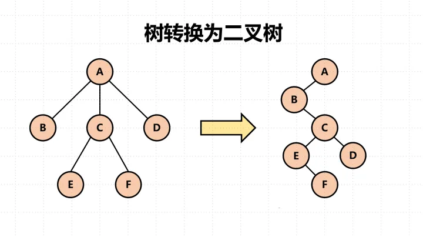
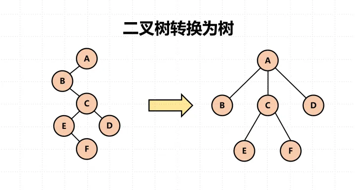
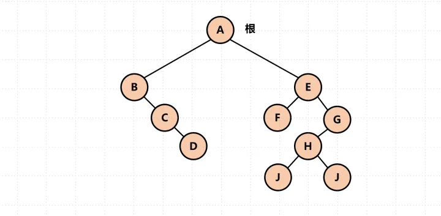
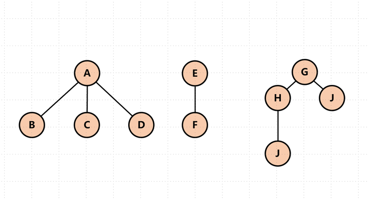
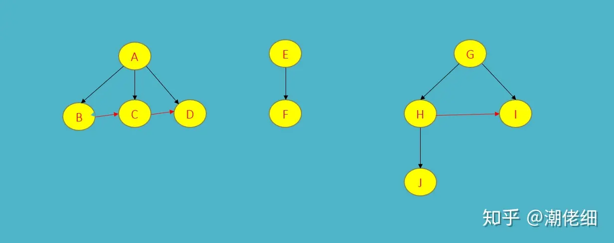
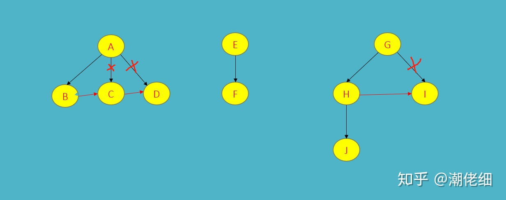
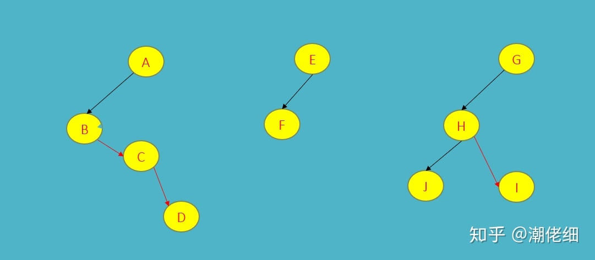
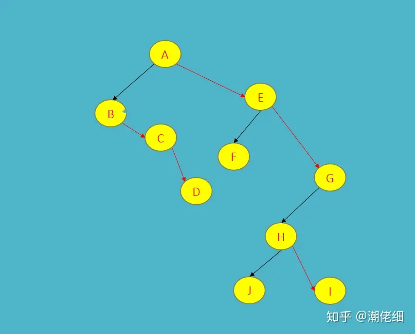

# Algorithm-For-Better

为了考研,努力刷题

## 线性表课后习题

### 链表的初始化

单链表

```c++
#include <iostream>
#include <vector>

using namespace std;

struct Node
{
    int data = 0;
    Node *next = nullptr;
};

// 初始化链表节点
Node *initList(Node *head, vector<int> a)
{
    Node *cur = head;
    for (int num : a)
    {
        // 给新节点赋值
        Node *newNode = new Node;
        newNode->data = num;
        // 将新节点加入链表
        cur->next = newNode;
        cur = cur->next;
    }
    return head;
}

int main()
{
    Node *head = new Node;
    vector<int> a = {1, 2, 3, 4, 5, 6, 7};
    head = initList(head, a);

    Node* it = head->next;
    while (it != nullptr)
    {
        cout << it->data << " ";
        it = it->next;
    }

    return 0;
}
```

循环链表

```c++
#include <iostream>
#include <vector>

using namespace std;

struct Node
{
    int data = 0;
    Node *next = nullptr;
    Node *prve = nullptr;
};

Node *initList(Node *head, vector<int> a)
{
    Node *cur = head;
    for (int num : a)
    {
        // 给新节点赋值
        Node *newNode = new Node;
        newNode->data = num;
        // 将新节点添加进链表中
        cur->next = newNode;
        newNode->prve = cur;
        cur = cur->next;
    }
    // 将尾结点与头结点连接
    cur->next = head;
    head->prve = cur;

    return head;
}

int main()
{
    Node *head = new Node;
    vector<int> a = {2, 3, 5, 1, 0, 2, 9, 8};
    head = initList(head, a);

    Node *it = head->next;
    while (it != head)
    {
        cout << it->data << " ";
        it = it->next;
    }
    cout << endl;

    it = head->prve;
    while (it != head)
    {
        cout << it->data << " ";
        it = it->prve;
    }
    cout << endl;

    return 0;
}
```

### 递归算法, 删除不带头节点的单链表中所有值为x的点

```c++
Node *deleteNode(int x, Node *cur)
{
    if (cur != nullptr)
    {
        if (cur->data == x)
        {
            // 递归出口
            Node *temp = cur->next;
            delete cur;
            // 如果下一个值是x, 那么就会反复执行, 直到 cur == nullptr 或 到达下面的else分支
            return deleteNode(x, temp);
        }
        else
        {
            // 如果下一个节点为空, 则会返回nullptr
            // 如果下一个节点为x, 则执行上面的if分支得到返回值
            // 如果下一个节点不为x, 那么会不断递归, next连接的节点不变
            cur->next = deleteNode(x, cur->next);
            return cur;
        }
    }
    return nullptr;
}
```

### 链表逆置

迭代写法

```c++
void reserseList(Node *head)
{
    // 判空
    Node *left = head->next;
    if (left == nullptr)
        return;

    // 第二个节点赋值给right
    Node *right = left->next;
    left->next = nullptr;

    /*
    将left暂存起来, 作为转换后的主体链
    将最新的顺序元素赋值给left
    右指针右移
    让最新的顺序元素left接上逆置的主体链
    */
    while (right != nullptr)
    {
        Node *temp = left;
        left = right;
        right = right->next;
        left->next = temp;
    }
    head->next = left;
}
```

## 字符串

给你两个字符串 haystack 和 needle ，请你在 haystack 字符串中找出 needle 字符串的第一个匹配项的下标（下标从 0 开始）。如果 needle 不是 haystack 的一部分，则返回  -1 。

### 暴力匹配

```c++
// pat 目标串 txt 文本串
int mySearch(string pat, string txt)
{
    int M = pat.size();
    int N = txt.size();

    // i < 文本串长度 - 目标串长度
    for (int i = 0; i <= N - M; i++)
    {
        int j;
        for (j = 0; j < M; j++)
        {
            if (pat[j] != txt[i + j])
                break;
        }
        // 匹配成功
        if (j == M)
            return i;
    }
    return -1;
}
```

### KMP算法

前缀表特性 一个字符串的最长相等的前后缀

> 前缀是包含首字符不包含尾字母的所有子串
> 后缀是包含尾字符不包含首字母的所有子串
> [理论知识](https://www.bilibili.com/video/BV1PD4y1o7nd/?spm_id_from=333.337.search-card.all.click&vd_source=7e92ec9131757560b71f0a6be9839426) + [代码实现](https://www.bilibili.com/video/BV1M5411j7Xx/?p=22&spm_id_from=pageDriver)

求目标串的最长**相等**的前后缀得到目标串的**前缀表**

```c++
int myKMP(string pat, string txt)
{
    int M = pat.size();
    int N = txt.size();

    /* 初始化 => 前后缀不相同情况 => 前后缀相同的情况 => next数组(前缀表的更新) */

    // 计算next数组, next数组告诉我们当冲突发生时
    // pat串的指针要回退到哪里
    vector<int> next(M);
    next[0] = 0;

    // 起始时, next[0] = 0, j begin with 0, i begin with 1
    // i 指向后缀的末尾位置, i 的作用是遍历目标串, 每次循环确定next[i]的值
    // j 指向前缀的末尾位置, j 还代表了包括 i 之前的最长相等前后缀的长度
    for (int i = 1, j = 0; i < M; i++)
    {
        // 如果 pat[i] != pat[j], 就将 j 指针指向前一位置的 next 数组所对应的值, 即 j = next[j - 1]
        // 这一过程循环进行直到 j == 0 或者 pat[i] == pat[j]
        // 当 pat[i] != pat[j] 时, 不断前移, 去寻找使得前 0 ~ j 个字符为对应的 pat[i]  的尽可能大的相等前后缀
        // 如果 j == 0 了还没找到, 就说明没有和这部分匹配的前后缀
        while (j > 0 && pat[i] != pat[j])
            j = next[j - 1];

        // pat[i] == pat[j], 说明前0 ~ j个字符是最大相等前后缀, 因此最大相等前后缀长度就是j+1
        if (pat[i] == pat[j])
        {
            next[i] = j + 1;
            j++;
        }
        else
        {
            next[i] = 0;
        }
    }

    int i, j = 0;
    // KMP匹配
    while (i < N && j < M)
    {
        if (txt[i] == pat[j])
        {
            i++;
            j++;
        }
        else
        {
            if (j == 0)
                i++;
            else
            {
                // 此时 j 正指向 pat 串中不匹配的字符
                // 所以 pat 串指针回退到的位置要使用 j-1
                j = next[j - 1];
            }
        }
    }

    if (j == M)
        return i - j;
    return -1;
}
```

吉大版
> 与上文主要区别是将整个前缀数组进行了减一操作,
> 所以进行回退操作时需要加一
> 即 `j = fail[j - 1] + 1`

```c++
class Solution {
public:
    int strStr(string S, string T) {
        int n = S.size(), m = T.size();
 
        //以下为计算fail数组过程
        vector<int> fail(m);         //fail数组
        fail[0] = -1;                //起始时，先将fail[0]赋为-1
        //指针j从0开始，指针i从1开始
        //指针i的作用：遍历模式串T，每次循环确定fail[i]的值
        //指针j的作用：当j >= 0，并且T[i] == T[j]时，说明前0 ~ j个字符就是最大相等前后缀，其长度为j + 1
        //当j == 0，且T[i] != T[j]时，就说明无相等前后缀，最大相等前后缀长度为0
        for (int i = 1, j = 0; i < m; i++)
        {
            //如果T[i] != T[j]，就将j指针指向前一位置的fail数组所对应的值，即j = fail[j - 1] + 1
            //这一过程循环进行直到 j == 0 或者 T[i] == T[j]
            //我对这一过程的理解是，当T[i] != T[j]时，一直让j = fail[j - 1] + 1，是为了找到一个j值，
            //使前0 ~ j个字符为对应T[i]的尽可能大的相等前后缀，如果一直到j == 0，T[i]还不等于T[j]，就说明不存在相等前后缀
            while (j > 0 && T[i] != T[j]) j = fail[j - 1] + 1;
            //如果T[i] == T[j]，就令fail[i] = j，指针i和j同时后移
            //T[i] == T[j]，说明前0 ~ j个字符是最大相等前后缀，因此最大相等前后缀长度为j+1，再减一就是j
            if (T[i] == T[j])
            {
                fail[i] = j;
                j++;
            }
            //如果j == 0，且T[i] != T[j]，说明不存在相等前后缀
            else //if (j == 0)
            {
                fail[i] = -1;
            }
        }
 
        //以下为kmp匹配过程
        int i = 0, j = 0;   //i是主串S中的指针，j是模式串T中的指针
        while (i < n && j < m)
        {
            if (S[i] == T[j])
            {
                i++;
                j++;
            }
            else 
            {
                //如果主串S中的S[i]与串T中的第一个字符T[0]就匹配失败，那么主串中的指针i直接移动到下一位
                //将这种特殊情况放在这里写，就不用像王道书上那样，fail数组的第一个元素还得赋一个特值
                //匹配失败时，只有这种情况下需要移动主串中的指针i
                if (j == 0) i++;
                else
                {
                    j = fail[j - 1] + 1;
                }
            }
        }
        //这里可以这么想：如果主串的第一个子串就匹配成功的话，那么最终i和j的值是相等的，于是返回的下标是i - j
        if (j == m) return i - j;
        return -1;
    }
};
```

## 树

> 树转换为二叉树
>
> 1. 在所有的兄弟结点之间加一条线
> 2. 树中的每个结点，只保留它与第一个孩子结点的连线，删除其他孩子结点之间的连线
> 3. 以树的根结点为轴心，将整个树调节一下
>
> 
>
> 二叉树转换为树
>
> 1. 将二叉树从左上到右下分为若干层。然后调整成水平方向
> 2. 找到每一层节点在其上一层的父节点，加线
> 3. 去除兄弟节点之间的连线
>
> 
>
> 二叉树转换为森林
>
> 前提: 加入一棵二叉树的根节点有右孩子，则这棵二叉树能够转换为森林，否则转换为一棵树。
> 
>
> 1. 从根节点开始，若右孩子存在，则把与右孩子结点的连线删除。再查看分离后的二叉树，若其根节点的右孩子存在，则连续删除。直到所有这些根结点与右孩子的连线都删除为止。
> 2. 将每棵分离后的二叉树转换为树。
> 
>
> 森林转换为二叉树
>
> 1. 第一步每棵树自己先成为一课二叉树
> 
> 
> 
> 2. 从第二棵二叉树开始，每棵二叉树都是上一个二叉树根节点的右孩子
> 

### 二叉树

> 完全二叉树 使用顺序存储 fabulous
>

### 并查集
