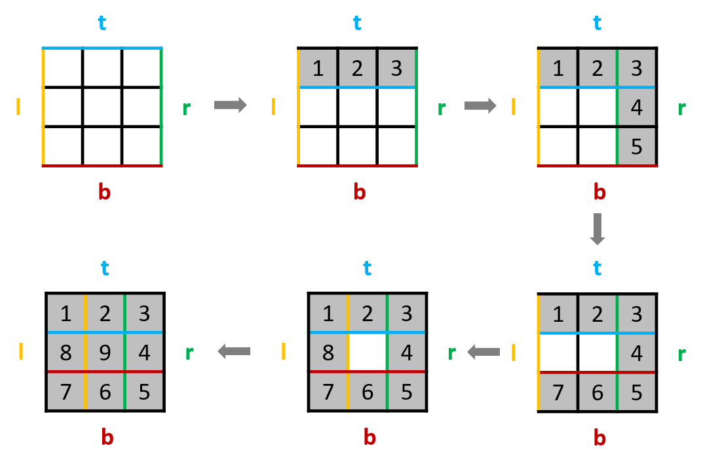
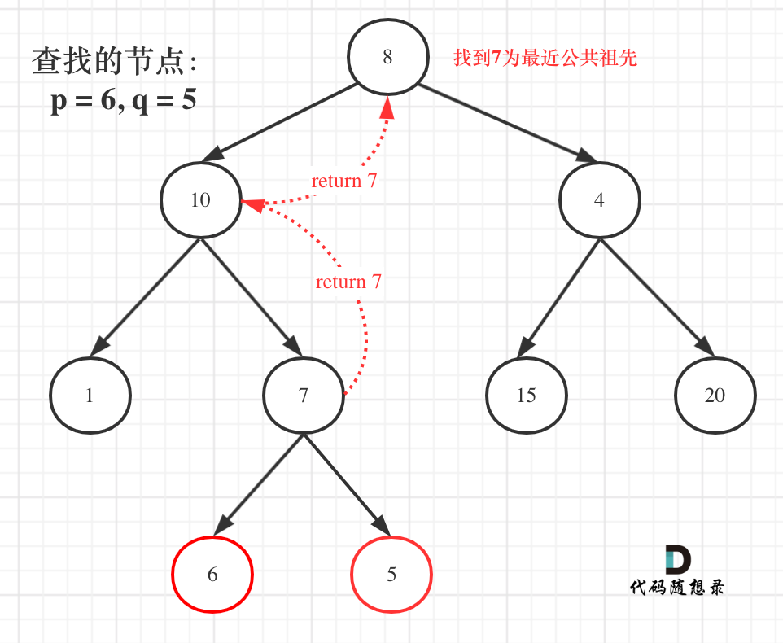
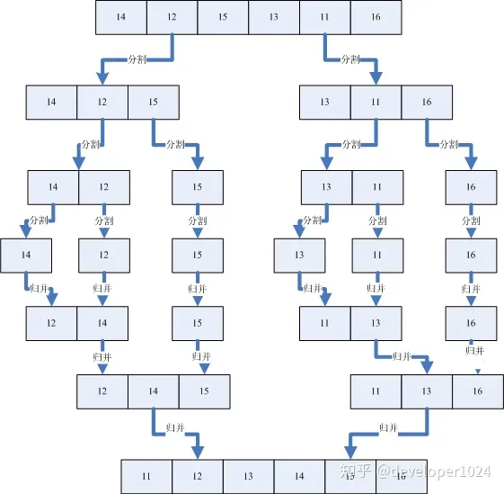
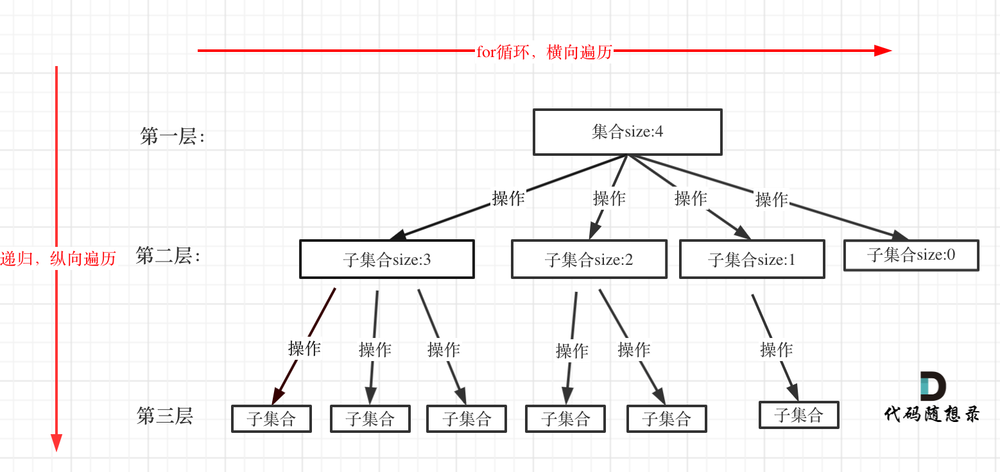

# Algorithm-For-Better

为了考研,努力刷题

## 数组


### 二分搜索

[二分查找](https://leetcode.cn/problems/binary-search/)

> 左闭右闭区间，while(left <= right)，left = middle + 1, right = middle - 1
> 左闭右开区间，while(left < right)，left = middle + 1, right = middle

```c++
class Solution
{
public:
    int search(vector<int> &nums, int target)
    {
        int left = 0;
        int right = nums.size() - 1;

        // 当left==right，区间[left, right]依然有效，所以用 <=
        while (left <= right)
        {
            // 防止溢出 等同于(left + right)/2
            int middle = left + ((right - left) / 2);
            if (nums[middle] > target)
            {
                // target 在左区间，所以[left, middle - 1]
                right = middle - 1;
            }
            else if (nums[middle] < target)
            {
                // target 在右区间，所以[middle + 1, right]
                left = middle + 1;
            }
            else
            {
                return middle;
            }
        }
        return -1;
    }
};
```

[搜索插入的位置](https://leetcode.cn/problems/search-insert-position/description/)

> 直接二分查找返回left即可。
> 根据if的判断条件，left左边的值一直保持小于target，right右边的值一直保持大于等于target，而且left最终一定等于right+1
> 这么一来，循环结束后，在left和right之间画一条竖线，恰好可以把数组分为两部分：left左边的部分和right右边的部分，而且left左边的部分全部小于target，并以right结尾；right右边的部分全部大于等于target，并以left为首。
> 所以最终答案一定在left的位置。

### 移除元素

[移除元素](https://leetcode.cn/problems/remove-element/)

> 双指针，快指针比对值，如果和目标值并不相等，就将值赋给慢指针，然后慢指针右移

```c++
// 移除元素
class Solution
{
public:
    int removeElement(vector<int> &nums, int val)
    {
        int slow = 0;
        // 快指针寻找和目标值不相等的元素
        for (int fast = 0; fast < nums.size(); fast++)
        {
            if (nums[fast] != val)
            {
                nums[slow] = nums[fast];
                slow++;
            }
        }
        return slow;
    }
};
```

### 有序数组的平方

[有序数组的平方](https://leetcode.cn/problems/squares-of-a-sorted-array/description/)

```c++
// 有序数组的平方
class Solution
{
public:
    vector<int> sortedSquares(vector<int> &A)
    {
        int k = A.size() - 1;
        vector<int> result(A.size(), 0);
        for (int i = 0, j = A.size() - 1; i <= j;)
        { // 注意这里要i <= j，因为最后要处理两个元素
            if (A[i] * A[i] < A[j] * A[j])
            {
                result[k--] = A[j] * A[j];
                j--;
            }
            else
            {
                result[k--] = A[i] * A[i];
                i++;
            }
        }
        return result;
    }
};
```

### 长度最小的子数组

[长度最小的子数组](https://leetcode.cn/problems/minimum-size-subarray-sum/description/)

> 利用双指针，模拟滑动窗口
> 右指针不断右移，当大于目标和时，保存区间长度，左指针右移，循环往复

```c++
// 长度最小的子数组
class Solution
{
public:
    int minSubArrayLen(int target, vector<int> &nums)
    {
        int left = 0;
        int sum = 0;
        int len = 0; // 子序列长度
        int result = INT32_MAX;
        for (int right = 0; right < nums.size(); right++)
        {
            // 累计目标值
            sum += nums[right];
            // 当大于目标值，移动左指针
            while (sum >= target)
            {
                len = right - left + 1; // 获取区间长度
                sum -= nums[left]; // 缩减总和值
                left++; // 左指针右移
                result = min(len, result); // 保存最小的长度区间值
            }
        }
        return result == INT32_MAX ? 0 : result;
    }
};
```

### 螺旋矩阵2

[螺旋矩阵2](https://leetcode.cn/problems/spiral-matrix-ii/)

>

```c++
// 螺旋矩阵2
class Solution
{
public:
    vector<vector<int>> generateMatrix(int n)
    {
        int t = 0;     // top
        int b = n - 1; // bottom
        int l = 0;     // left
        int r = n - 1; // right
        vector<vector<int>> ans(n, vector<int>(n));
        // for循环中变量定义成i或j的细节：按照通常的思维，i代表行，j代表列
        // 这样，就可以很容易区分出来变化的量应该放在[][]的第一个还是第二个
        // 对于变量的边界怎么定义：
        // 从左向右填充：填充的列肯定在[left,right]区间
        // 从上向下填充：填充的行肯定在[top,bottom]区间
        // 从右向左填充：填充的列肯定在[right,left]区间
        // 从下向上填充：填充的行肯定在[bootom,top]区间
        // 通过上面的总结会发现边界的起始和结束与方向是对应的
        int k = 1;

        while (k <= n * n)
        {
            // 从左到右填充，相当于缩小上边界
            for (int i = l; i <= r; ++i, ++k)
                ans[t][i] = k;
            // 缩小上边界
            ++t;
            // 从上向下填充，相当于缩小右边界
            for (int i = t; i <= b; ++i, ++k)
                ans[i][r] = k;
            // 缩小右边界
            --r;
            // 从右向左填充，相当于缩小下边界
            for (int i = r; i >= l; --i, ++k)
                ans[b][i] = k;
            // 缩小下边界
            --b;
            // 从下向上填充，相当于缩小左边界
            for (int i = b; i >= t; --i, ++k)
                ans[i][l] = k;
            // 缩小左边界
            ++l;


        }
        return ans;
    }
};
```

## 线性表


### 链表的初始化

单链表

```c++
#include <iostream>
#include <vector>

using namespace std;

struct Node
{
    int data = 0;
    Node *next = nullptr;
};

// 初始化链表节点
Node *initList(Node *head, vector<int> a)
{
    Node *cur = head;
    for (int num : a)
    {
        // 给新节点赋值
        Node *newNode = new Node;
        newNode->data = num;
        // 将新节点加入链表
        cur->next = newNode;
        cur = cur->next;
    }
    return head;
}

int main()
{
    Node *head = new Node;
    vector<int> a = {1, 2, 3, 4, 5, 6, 7};
    head = initList(head, a);

    Node* it = head->next;
    while (it != nullptr)
    {
        cout << it->data << " ";
        it = it->next;
    }

    return 0;
}
```

循环链表

```c++
#include <iostream>
#include <vector>

using namespace std;

struct Node
{
    int data = 0;
    Node *next = nullptr;
    Node *prve = nullptr;
};

Node *initList(Node *head, vector<int> a)
{
    Node *cur = head;
    for (int num : a)
    {
        // 给新节点赋值
        Node *newNode = new Node;
        newNode->data = num;
        // 将新节点添加进链表中
        cur->next = newNode;
        newNode->prve = cur;
        cur = cur->next;
    }
    // 将尾结点与头结点连接
    cur->next = head;
    head->prve = cur;

    return head;
}

int main()
{
    Node *head = new Node;
    vector<int> a = {2, 3, 5, 1, 0, 2, 9, 8};
    head = initList(head, a);

    Node *it = head->next;
    while (it != head)
    {
        cout << it->data << " ";
        it = it->next;
    }
    cout << endl;

    it = head->prve;
    while (it != head)
    {
        cout << it->data << " ";
        it = it->prve;
    }
    cout << endl;

    return 0;
}
```

### 移除链表元素

[移除链表元素](https://leetcode.cn/problems/remove-linked-list-elements/)

```c++
// 移除链表元素-不使用虚拟头结点
class Solution
{
public:
    ListNode *removeElements(ListNode *head, int val)
    {
        // 没有虚拟头结点
        while (head != nullptr && head->val == val)
        {
            ListNode *tmp = head;
            head = head->next;
            delete tmp;
        }

        ListNode *current = head;
        while (current != nullptr && current->next != nullptr)
        {
            if (current->next->val == val)
            {
                ListNode *temp = current->next;
                current->next = current->next->next;
                delete (temp);
            }
            else
            {
                current = current->next;
            }
        }``
        return head;
    }
};

// 移除链表元素-使用虚拟头结点
class Solution
{
public:
    ListNode *removeElements(ListNode *head, int val)
    {
        ListNode *dummyHead = new ListNode(0); // 设置一个虚拟头结点
        dummyHead->next = head;                // 将虚拟头结点指向head，这样方面后面做删除操作
        ListNode *cur = dummyHead;
        while (cur->next != NULL)
        {
            if (cur->next->val == val)
            {
                ListNode *tmp = cur->next;
                cur->next = cur->next->next;
                delete tmp;
            }
            else
            {
                cur = cur->next;
            }
        }
        head = dummyHead->next;
        delete dummyHead;
        return head;
    }
};

// 移除链表元素-递归法
class Solution
{
public:
    ListNode *removeElements(ListNode *head, int val)
    {
        if (head == nullptr)
            return nullptr;

        head->next = removeElements(head->next, val);

        // 递归到最后一个节点
        if (head->val == val)
        {
            return head->next;
        }
        else
        {
            return head;
        }
    }
};
```

### 设计链表

[设计链表](https://leetcode.cn/problems/design-linked-list/description/)

> 注意遍历后index下标所对应的节点

```c++
// temp指向虚拟头结点的下一个节点
LinkedNode *temp = dummyHead->next;
// 循环后正好到达index下标所指节点
while (index--)
{
    temp = temp->next;
}

// temp指向虚拟头结点
LinkedNode *temp = dummyHead;
// 循环后正好到达index下标所指的前一个节点
while (index--)
{
    temp = temp->next;
}
```

```c++
// 设计链表
class MyLinkedList
{
public:
    struct LinkedNode
    {
        int val;
        LinkedNode *next;
        LinkedNode(int val) : val(val), next(nullptr){};
    };

    MyLinkedList()
    {
        dummyHead = new LinkedNode(0);
        size = 0;
    }

    int get(int index)
    {
        // 非法情况
        if (index < 0 || index > size - 1)
        {
            return -1;
        }

        // temp指向虚拟头结点的下一个节点
        LinkedNode *temp = dummyHead->next;
        // 循环后正好到达index下标所指节点
        while (index)
        {
            temp = temp->next;
            index--;
        }
        return temp->val;
    }

    void addAtHead(int val)
    {
        LinkedNode *node = new LinkedNode(val);
        node->next = dummyHead->next;
        dummyHead->next = node;
        size++;
    }

    void addAtTail(int val)
    {
        // 尾插，插入到next为空的那个节点之后
        LinkedNode *node = new LinkedNode(val);
        LinkedNode *temp = dummyHead;
        while (temp->next != nullptr)
        {
            temp = temp->next;
        }
        temp->next = node;
        size++;
    }

    void addAtIndex(int index, int val)
    {
        if (index > size)
            return;
        if (index < 0)
            addAtHead(val);

        LinkedNode *node = new LinkedNode(val);

        // temp指向虚拟头结点
        LinkedNode *temp = dummyHead;
        // 循环后正好到达index下标所指的前一个节点
        while (index--)
        {
            temp = temp->next;
        }

        node->next = temp->next;
        temp->next = node;
        size++;
    }

    void deleteAtIndex(int index)
    {
        if (index < 0 || index >= size)
        {
            return;
        }
        // temp指向虚拟头结点
        LinkedNode *temp = dummyHead;
        // 循环后正好到达index下标所指的前一个节点
        while (index--)
        {
            temp = temp->next;
        }
        LinkedNode *de = temp->next;
        temp->next = temp->next->next;

        delete (de);
        de = nullptr;
        size--;
    }

private:
    LinkedNode *dummyHead;
    int size;
};
```

### 链表排序

[链表排序](https://leetcode.cn/problems/sort-list/)

1. 找到链表的中点，以中点为分界，将链表拆分成两个子链表。寻找链表的中点可以使用快慢指针的做法，快指针每次移动 222 步，慢指针每次移动 111 步，当快指针到达链表末尾时，慢指针指向的链表节点即为链表的中点。

2. 对两个子链表分别排序。

3. 将两个排序后的子链表合并，得到完整的排序后的链表。可以使用「21. 合并两个有序链表」的做法，将两个有序的子链表进行合并。

```c
/**
 * Definition for singly-linked list.
 * struct ListNode {
 *     int val;
 *     struct ListNode *next;
 * };
 */
 // 合并两个有序链表
struct ListNode* merge(struct ListNode* head1, struct ListNode* head2) {
    struct ListNode* dummyHead  = malloc(sizeof(struct ListNode));
    dummyHead->val = 0;
    struct ListNode*temp = dummyHead, *temp1 = head1, *temp2 = head2;
    while(temp1 != NULL && temp2!= NULL)
    {
        if(temp1->val < temp2 ->val)
        {
            temp->next = temp1;
            temp1 = temp1->next;
        }else{
            temp->next = temp2;
            temp2 = temp2->next;
        }
        temp = temp->next;
    }
    if(temp1 != NULL) temp->next = temp1;
    if(temp2 != NULL) temp->next = temp2;
    return dummyHead->next;
}

// 采用左闭右开区间  [head, mid) [mid, tail)
struct ListNode* toSortList(struct ListNode* head, struct ListNode* tail)
{
    // 不存在节点
    if(head == NULL) return head;

    // 只有一个节点
    if(head->next == tail)
    {
        head->next = NULL;
        return head;
    }

    // 通过快慢指针寻找链表中点
    // 快指针走两步慢指针走一步
    struct ListNode *slow = head, *fast = head;

    while(fast != tail)
    {
        fast = fast->next;
        slow = slow->next;

        // 快指针走两步没走成情况
        if(fast != tail)
        {
            fast = fast->next;
        }
    }

    // 找到中点开始归并
    struct ListNode* mid = slow;
    return merge(toSortList(head, mid), toSortList(mid, tail));
}

struct ListNode* sortList(struct ListNode* head)
{
    return toSortList(head, NULL);
}
```

### 翻转链表

[反转链表](https://leetcode.cn/problems/reverse-linked-list/description/)

```c++
// 翻转链表
class Solution
{
public:
    ListNode *reverseList(ListNode *head)
    {
        ListNode *temp;
        ListNode *pre = nullptr;
        ListNode *cur = head;

        while (cur)
        {
            temp = cur->next;
            cur->next = pre;
            pre = cur;
            cur = temp;
        }

        return pre;
    }
};

// 翻转链表-递归法
class Solution
{
public:
    ListNode *traverse(ListNode *pre, ListNode *cur)
    {
        if (cur == nullptr)
            return pre;

        ListNode *temp = cur->next;

        cur->next = pre;
        // 用递归来代替迭代中指针的后移
        // 如下递归的写法，其实就是做了这两步
        // pre = cur;
        // cur = temp;
        return traverse(cur, temp);
    }

    ListNode *reverseList(ListNode *head)
    {
        // 和双指针法初始化是一样的逻辑
        // ListNode* cur = head;
        // ListNode* pre = NULL;
        return traverse(nullptr, head);
    }
};
```

### 反转链表2

[反转链表2](https://leetcode.cn/problems/reverse-linked-list-ii/solutions/1992226/you-xie-cuo-liao-yi-ge-shi-pin-jiang-tou-teqq/)

> 

```c++
// 反转链表2
class Solution
{
public:
    ListNode *reverseBetween(ListNode *head, int left, int right)
    {
        ListNode *dummyHead = new ListNode(0);
        dummyHead->next = head;

        ListNode *p0 = dummyHead;

        // 到达了翻转的前一个节点
        for (int i = 0; i < left - 1; i++)
        {
            p0 = p0->next;
        }

        // 把这一段当成悬空的来翻转
        ListNode *pre = nullptr;
        ListNode *cur = p0->next;
        for (int i = 0; i < right - left + 1; i++)
        {
            ListNode *temp = cur->next;
            cur->next = pre;

            // 后移
            pre = cur;
            cur = temp;
        }

        // 此时cur指向的就是翻转后的后一个节点
        p0->next->next = cur;
        // 此时pre就是翻转后的链表的头节点
        p0->next = pre;

        return dummyHead->next;
    }
};
```

### 两两翻转链表

[两两翻转链表](https://leetcode.cn/problems/swap-nodes-in-pairs/description/)

```c++
// 两两翻转链表
class Solution
{
public:
    ListNode *swapPairs(ListNode *head)
    {
        // 统计节点个数
        int n = 0;
        for (ListNode *cur = head; cur; cur = cur->next)
        {
            n++;
        }

        ListNode *dummyHead = new ListNode(0);
        dummyHead->next = head;

        ListNode *cur = head;
        ListNode *pre = nullptr;

        // 指向翻转部分之前的一个节点的指针
        ListNode *p0 = dummyHead;
        while (n >= 2)
        {
            n -= 2;
            // 做翻转链表2的操作
            for (int i = 0; i < 2; i++)
            {
                ListNode *temp = cur->next;
                cur->next = pre;
                pre = cur;
                cur = temp;
            }

            // 存下反转部分链表的最后一个结点
            // 用于为下次循环之前给p0指向下次要反转部分
            // 指向翻转部分之前的一个节点做准备
            ListNode *temp = p0->next;

            // 把翻转后的部分链表的指针指正
            p0->next->next = cur;
            p0->next = pre;

            // 此时p0指向下次循环要反转的部分的前一个节点
            // 也是这次反转部分
            p0 = temp;
        }
        return dummyHead->next;
    }
};
```

### k个一组翻转链表

[k个一组翻转链表](https://leetcode.cn/problems/reverse-nodes-in-k-group/description/)

>

```c++
// K个一组翻转字符串
class Solution
{
public:
    ListNode *reverseKGroup(ListNode *head, int k)
    {
        // 获取链表数目
        int n = 0;
        for (ListNode *cur = head; cur; cur = cur->next)
            ++n; // 统计节点个数

        ListNode *dummyHead = new ListNode(0);
        dummyHead->next = head;
        ListNode *p0 = dummyHead;

        // 在每一个子区间里面进行翻转链表2
        // 然后将p0指向翻转完的最后一个节点
        ListNode *pre = nullptr;
        ListNode *cur = head;
        while (n >= k)
        {
            n -= k;

            for (int i = 0; i < k; i++)
            {
                ListNode *temp = cur->next;
                cur->next = pre;
                // 指针后移
                pre = cur;
                cur = temp;
            }

            // 此时p0.next 是翻转部分的最后一个结点
            // 也就是下一轮要反转的节点的前一个节点
            ListNode *next = p0->next;

            // 此时cur指向的就是翻转后的链表的后一个节点
            // 而p0.next是翻转部分链表的最后一个节点
            // 所以要给他们接上
            p0->next->next = cur;
            // pre翻转完指向的是翻转部分链表的第一个节点
            // 然后将p0.next指向pre完成翻转
            p0->next = pre;

            // 将p0指向翻转部分的最后一个结点
            // 也就是下一轮要反转的节点的前一个节点
            p0 = next;
        }

        return dummyHead->next;
    }
};
```

### 删除链表的倒数第n个节点

[删除链表的倒数第n个节点](https://leetcode.cn/problems/remove-nth-node-from-end-of-list/description/)

> 双指针的经典应用，如果要删除倒数第n个节点，让fast移动n步，然后让fast和slow同时移动，直到fast指向链表末尾。删掉slow所指向的节点就可以了。


```c++
// 删除链表的倒数第n个节点
class Solution
{
public:
    ListNode *removeNthFromEnd(ListNode *head, int n)
    {
        ListNode *dummyHead = new ListNode(0);
        dummyHead->next = head;

        ListNode *slow = dummyHead;
        ListNode *fast = dummyHead;

        while (n-- && fast != NULL)
        {
            fast = fast->next;
        }

        fast = fast->next; // fast再提前走一步，因为需要让slow指向删除节点的上一个节点

        while (fast != NULL)
        {
            fast = fast->next;
            slow = slow->next;
        }
        slow->next = slow->next->next;

        // ListNode *tmp = slow->next;  C++释放内存的逻辑
        // slow->next = tmp->next;
        // delete nth;

        return dummyHead->next;
    }
};
```

### 链表相交

[链表相交](https://leetcode.cn/problems/intersection-of-two-linked-lists-lcci/description/)

```c++
// 链表香蕉
class Solution
{
public:
    ListNode *getIntersectionNode(ListNode *headA, ListNode *headB)
    {
        ListNode *curA = headA;
        ListNode *curB = headB;

        int lenA = 0;
        int lenB = 0;

        // 获取链长度
        while (curA != nullptr)
        {
            curA = curA->next;
            lenA++;
        }

        while (curB != nullptr)
        {
            curB = curB->next;
            lenB++;
        }
        // 指针归位
        curA = headA;
        curB = headB;

        // 让curA为最长链表的头，lenA为其长度
        if (lenB > lenA)
        {
            swap(lenA, lenB);
            swap(curA, curB);
        }

        // 求长度差
        int gap = lenA - lenB;
        // 让curA和curB在同一起点上（末尾位置对齐）
        while (gap--)
        {
            curA = curA->next;
        }
        // 遍历curA 和 curB，遇到相同则直接返回
        while (curA != NULL)
        {
            if (curA == curB)
            {
                return curA;
            }
            curA = curA->next;
            curB = curB->next;
        }
        return NULL;
    }
};
```

### 环形链表2

[环形链表2](https://leetcode.cn/problems/linked-list-cycle-ii/description/)


```c++
// 环形链表2
class Solution
{
public:
    ListNode *detectCycle(ListNode *head)
    {
        ListNode *fast = head;
        ListNode *slow = head;

        // 快指针走两步，慢指针走一步
        //  第一次相遇后，再拿两个指针从头结点和相遇的点同步移动
        //  汇合后就是目标点

        while (fast != NULL && fast->next != NULL)
        {
            slow = slow->next;
            fast = fast->next->next;

            if (fast == slow)
            {
                ListNode *index1 = head;
                ListNode *index2 = fast;

                while (index1 != index2)
                {
                    index1 = index1->next;
                    index2 = index2->next;
                }

                return index1;
            }
        }
        return nullptr;
    }
};
```

## 哈希表

### 有效的字母异位词

[有效的字母异位词](https://leetcode.cn/problems/valid-anagram/)

```c
// 有效的字母异位词
bool isAnagram(char *s, char *t)
{
    int hashtable[26];
    for (int i = 0; i < 26; i++)
    {
        hashtable[i] = 0;
    }

    int i;
    while (s[i] != '\0')
    {
        hashtable[s[i] - 'a']++;
        i++;
    }

    int j;
    while (t[j] != '\0')
    {
        hashtable[t[j] - 'a']--;
        j++;
    }

    for (int i = 0; i < 26; i++)
    {
        if (hashtable[i] != 0)
            return false;
    }

    return true;
}
```

### 两个数组的交集

[两个数组的交集](https://leetcode.cn/problems/intersection-of-two-arrays/)

```c
// 两个数组的交集
int *intersection(int *nums1, int nums1Size, int *nums2, int nums2Size, int *returnSize)
{
    int hashtable[1001] = {0};
    int lessSize = nums1Size < nums2Size ? nums1Size : nums2Size;
    int *result = (int *)malloc(sizeof(int) * lessSize);

    int index = 0;

    int i;
    for (int i = 0; i < nums1Size; i++)
    {
        hashtable[nums1[i]]++;
    }

    for (int i = 0; i < nums2Size; i++)
    {
        if (hashtable[nums2[i]] > 0)
        {
            result[index] = nums2[i];
            index++;

            hashtable[nums2[i]] = 0;
        }
    }

    *returnSize = index; // 结果数组的截止下标存下来
    return result;
}
```

### 快乐数

[快乐数](https://leetcode.cn/problems/happy-number)

> “快指针” 每次走两步，“慢指针” 每次走一步，当二者相等时，即为一个循环周期。此时，判断是不是因为 1 引起的循环，是的话就是快乐数，否则不是快乐数

```c++
class Solution
{
public:
    int bitSquareSum(int n)
    {
        int sum = 0;
        while (n > 0)
        {
            int bit = n % 10;
            sum += bit * bit;
            n = n / 10;
        }
        return sum;
    }

    bool isHappy(int n)
    {
        int slow = n, fast = n;
        do
        {
            slow = bitSquareSum(slow);
            fast = bitSquareSum(fast);
            fast = bitSquareSum(fast);
        } while (slow != fast);

        return slow == 1;
    }
};
```

// 最大也就是810

```c
int getSum(int n)
{
    int sum = 0;
    while (n)
    {
        int t = n % 10;
        sum += t * t;
        n = n / 10;
    }
    return sum;
}

bool isHappy(int n)
{
    int hashtable[820] = {0};
    int sum = getSum(n);
    while (sum != 1)
    {
        // 循环到了重复值
        if (hashtable[sum] == 1)
        {
            return false;
        }
        else
        {
            hashtable[sum]++;
        }
        sum = getSum(sum);
    }

    return true;
}
```

## 字符串

给你两个字符串 haystack 和 needle ，请你在 haystack 字符串中找出 needle 字符串的第一个匹配项的下标（下标从 0 开始）。如果 needle 不是 haystack 的一部分，则返回  -1 。

### 翻转字符串

[翻转字符串](https://leetcode.cn/problems/reverse-string/)

> 双指针
> **使用栈**

```c++
// 翻转字符串
class Solution
{
public:
    void reverseString(vector<char> &s)
    {
        for (int i = 0, j = s.size() - 1; i < s.size() / 2; i++, j--)
        {
            swap(s[i], s[j]);
        }
    }
};
```

### 翻转字符串2

[反转字符串2](https://leetcode.cn/problems/reverse-string-ii/)

> 翻转前k个字符
> 以2k倍加，翻转k个字符，如果i+k小于数组总大小就表明2k区间成立,就只翻转前k个就行，即i 到 i+k
> 然后末尾剩下的字符一定小于等于k，就全部翻转

```c++
// 翻转字符串2
class Solution
{
public:
    void reverse(string &s, int start, int end)
    {
        for (int i = start, j = end - 1; i < j; i++, j--)
        {
            swap(s[i], s[j]);
        }
    }

    string reverseStr(string s, int k)
    {
        for (int i = 0; i < s.size(); i += 2 * k)
        {
            // 如果剩余字符小于 2k 但大于或等于 k 个
            // 则反转前 k 个字符，其余字符保持原样。
            if (i + k <= s.size())
            {
                reverse(s, i, i + k);
                continue;
            }
            // 如果剩余字符少于 k 个，则将剩余字符全部反转。
            reverse(s, i, s.size());
        }
        return s;
    }
};
```

### 翻转字符串里的单词

[翻转字符串里的单词](https://leetcode.cn/problems/reverse-words-in-a-string/)

```c++
// 翻转字符串里的单词
class Solution
{
public:
    // 移除元素
    void removeExtraSpace(string &s)
    {
        int slow = 0;
        for (int i = 0; i < s.size(); ++i)
        { //
            if (s[i] != ' ')
            { // 遇到非空格就处理，即删除所有空格。
                if (slow != 0)
                    s[slow++] = ' '; // 手动控制空格，给单词之间添加空格。slow != 0说明不是第一个单词，需要在单词前添加空格。
                while (i < s.size() && s[i] != ' ')
                { // 补上该单词，遇到空格说明单词结束。
                    s[slow++] = s[i++];
                }
            }
        }
        s.resize(slow); // slow的大小即为去除多余空格后的大小。
    }

    void reverse(string &s, int start, int end)
    {
        for (int i = start, j = end; i < j; i++, j--)
        {
            swap(s[i], s[j]);
        }
    }

    string reverseWords(string s)
    {
        // 首先移除空格，思路同移除元素
        removeExtraSpace(s);

        // 整体翻转一遍
        reverse(s, 0, s.size() - 1);

        // 对子单词进行翻转
        // removeExtraSpaces后保证第一个单词的开始下标一定是0
        int start = 0;
        for (int i = 0; i <= s.size(); i++)
        {
            // 到达空格或者串尾，说明一个单词结束。进行翻转。
            if (s[i] == ' ' || i == s.size())
            {
                // 翻转，注意是左闭右闭 []的翻转。
                reverse(s, start, i - 1);
                start = i + 1;
            }
        }
        return s;
    }
};
```

### 暴力匹配

```c++
// pat 目标串 txt 文本串
int mySearch(string pat, string txt)
{
    int M = pat.size();
    int N = txt.size();

    // i < 文本串长度 - 目标串长度
    for (int i = 0; i <= N - M; i++)
    {
        int j;
        for (j = 0; j < M; j++)
        {
            if (pat[j] != txt[i + j])
                break;
        }
        // 匹配成功
        if (j == M)
            return i;
    }
    return -1;
}
```

### KMP算法

前缀表特性 一个字符串的最长相等的前后缀

> 前缀是指不包含最后一个字符的所有以第一个字符开头的连续子串。
> 后缀是指不包含第一个字符的所有以最后一个字符结尾的连续子串。
> 前缀后缀都是从左往右读的
> 记录下标i之前（包括i）的字符串中，有多大长度的相同前缀后缀。
> [理论知识](https://www.bilibili.com/video/BV1PD4y1o7nd/?spm_id_from=333.337.search-card.all.click&vd_source=7e92ec9131757560b71f0a6be9839426) + [代码实现](https://www.bilibili.com/video/BV1M5411j7Xx/?p=22&spm_id_from=pageDriver)

求目标串的最长**相等**的前后缀得到目标串的**前缀表**

```c++
int myKMP(string pat, string txt)
{
    int M = pat.size();
    int N = txt.size();

    /* 初始化 => 前后缀不相同情况 => 前后缀相同的情况 => next数组(前缀表的更新) */

    // 计算next数组, next数组告诉我们当冲突发生时
    // pat串的指针要回退到哪里
    vector<int> next(M);
    next[0] = 0;

    // 起始时, next[0] = 0, j begin with 0, i begin with 1
    // i 指向后缀的末尾位置, i 的作用是遍历目标串, 每次循环确定next[i]的值
    // j 指向前缀的末尾位置, j 还代表了包括 i 之前的最长相等前后缀的长度
    for (int i = 1, j = 0; i < M; i++)
    {
        // 如果 pat[i] != pat[j], 就将 j 指针指向前一位置的 next 数组所对应的值, 即 j = next[j - 1]
        // 这一过程循环进行直到 j == 0 或者 pat[i] == pat[j]
        // 当 pat[i] != pat[j] 时, 不断前移, 去寻找使得前 0 ~ j 个字符为对应的 pat[i]  的尽可能大的相等前后缀
        // 如果 j == 0 了还没找到, 就说明没有和这部分匹配的前后缀
        while (j > 0 && pat[i] != pat[j])
            j = next[j - 1];

        // pat[i] == pat[j], 说明前0 ~ j个字符是最大相等前后缀, 因此最大相等前后缀长度就是j+1
        if (pat[i] == pat[j])
        {
            next[i] = j + 1;
            j++;
        }
        else
        {
            next[i] = 0;
        }
    }

    int i, j = 0;
    // KMP匹配
    while (i < N && j < M)
    {
        if (txt[i] == pat[j])
        {
            i++;
            j++;
        }
        else
        {
            if (j == 0)
                i++;
            else
            {
                // 此时 j 正指向 pat 串中不匹配的字符
                // 所以 pat 串指针回退到的位置要使用 j-1
                j = next[j - 1];
            }
        }
    }

    if (j == M)
        return i - j;
    return -1;
}
```

吉大版
> 与上文主要区别是将整个前缀数组进行了减一操作,
> 所以进行回退操作时需要加一
> 即 `j = fail[j - 1] + 1`

```c++
class Solution {
public:
    // S是原字符串，T是目标字符串
    int strStr(string S, string T) {
        int n = S.size(), m = T.size();
 
        //以下为计算fail数组过程
        vector<int> fail(m);         //fail数组
        fail[0] = -1;                //起始时，先将fail[0]赋为-1
        //指针j从0开始，指针i从1开始
        //指针i的作用：遍历模式串T，每次循环确定fail[i]的值
        //指针j的作用：当j >= 0，并且T[i] == T[j]时，说明前0 ~ j个字符就是最大相等前后缀，其长度为j + 1
        //当j == 0，且T[i] != T[j]时，就说明无相等前后缀，最大相等前后缀长度为0
        for (int i = 1, j = 0; i < m; i++)
        {
            //如果T[i] != T[j]，就将j指针指向前一位置的fail数组所对应的值，即j = fail[j - 1] + 1
            //这一过程循环进行直到 j == 0 或者 T[i] == T[j]
            //我对这一过程的理解是，当T[i] != T[j]时，一直让j = fail[j - 1] + 1，是为了找到一个j值，
            //使前0 ~ j个字符为对应T[i]的尽可能大的相等前后缀，如果一直到j == 0，T[i]还不等于T[j]，就说明不存在相等前后缀
            while (j > 0 && T[i] != T[j]) j = fail[j - 1] + 1;
            //如果T[i] == T[j]，就令fail[i] = j，指针i和j同时后移
            //T[i] == T[j]，说明前0 ~ j个字符是最大相等前后缀，因此最大相等前后缀长度为j+1，再减一就是j
            if (T[i] == T[j])
            {
                fail[i] = j;
                j++;
            }
            //如果j == 0，且T[i] != T[j]，说明不存在相等前后缀
            else //if (j == 0)
            {
                fail[i] = -1;
            }
        }
 
        //以下为kmp匹配过程
        int i = 0, j = 0;   //i是主串S中的指针，j是模式串T中的指针
        while (i < n && j < m)
        {
            if (S[i] == T[j])
            {
                i++;
                j++;
            }
            else 
            {
                //如果主串S中的S[i]与串T中的第一个字符T[0]就匹配失败，那么主串中的指针i直接移动到下一位
                //将这种特殊情况放在这里写，就不用像王道书上那样，fail数组的第一个元素还得赋一个特值
                //匹配失败时，只有这种情况下需要移动主串中的指针i
                if (j == 0) i++;
                else
                {
                    j = fail[j - 1] + 1;
                }
            }
        }
        //这里可以这么想：如果主串的第一个子串就匹配成功的话，那么最终i和j的值是相等的，于是返回的下标是i - j
        if (j == m) return i - j;
        return -1;
    }
};
```

#### 找出字符串中第一个匹配项的下标

[找出字符串中第一个匹配项的下标
](https://leetcode.cn/problems/find-the-index-of-the-first-occurrence-in-a-string/description/)

> KMP算法的直接应用

```c++
class Solution
{
public:
    int strStr(string haystack, string needle)
    {
        string S = haystack;
        string T = needle;
        int n = S.size(), m = T.size();

        vector<int> fail(m); // fail数组
        fail[0] = -1;        // 起始时，先将fail[0]赋为-1

        // 当j == 0，且T[i] != T[j]时，就说明无相等前后缀，最大相等前后缀长度为0
        for (int i = 1, j = 0; i < m; i++)
        {
            // 如果T[i] != T[j]，就将j指针指向前一位置的fail数组所对应的值，即j = fail[j - 1] + 1
            while (j > 0 && T[i] != T[j])
                j = fail[j - 1] + 1;

            // 如果T[i] == T[j]，就令fail[i] = j，指针i和j同时后移
            if (T[i] == T[j])
            {
                fail[i] = j;
                j++;
            }
            // 如果j == 0，且T[i] != T[j]，说明不存在相等前后缀
            else
            {
                fail[i] = -1;
            }
        }

        // 以下为kmp匹配过程
        int i = 0, j = 0; // i是主串S中的指针，j是模式串T中的指针
        while (i < n && j < m)
        {
            if (S[i] == T[j])
            {
                i++;
                j++;
            }
            else
            {
                // 如果主串S中的S[i]与串T中的第一个字符T[0]就匹配失败，那么主串中的指针i直接移动到下一位
                if (j == 0)
                    i++;
                else
                {
                    j = fail[j - 1] + 1;
                }
            }
        }
        // 这里可以这么想：如果主串的第一个子串就匹配成功的话，那么最终i和j的值是相等的，于是返回的下标是i - j
        if (j == m)
        {
            return i - j;
        }
        return -1;
    }
}
```

#### 重复的子字符串

[重复的子字符串](https://leetcode.cn/problems/repeated-substring-pattern/)

```c++
// 重复的子字符串
class Solution
{
public:
    void getNext(int *next, const string &s)
    {
        next[0] = -1;
        int j = -1;
        for (int i = 1; i < s.size(); i++)
        {
            while (j >= 0 && s[i] != s[j + 1])
            {
                j = next[j];
            }
            if (s[i] == s[j + 1])
            {
                j++;
            }
            next[i] = j;
        }
    }
    bool repeatedSubstringPattern(string s)
    {
        if (s.size() == 0)
        {
            return false;
        }
        int next[s.size()];
        getNext(next, s);
        int len = s.size();
        // len % (len - (next[len - 1] + 1)) == 0 ，则说明数组的长度正好可以被 (数组长度-最长相等前后缀的长度) 整除 ，说明该字符串有重复的子字符串。
        if (next[len - 1] != -1 && len % (len - (next[len - 1] + 1)) == 0)
        {
            return true;
        }
        return false;
    }
};
```

### 回文子串

[回文子串](https://leetcode.cn/problems/a7VOhD/)

给定一个字符串 s ，请计算这个字符串中有多少个回文子字符串。

具有不同开始位置或结束位置的子串，即使是由相同的字符组成，也会被视作不同的子串。

```c++
// 回文子串
class Solution
{
public:
    bool isPalindrome(string &s, int l, int r)
    {
        while (l < r)
        {
            if (s[l] == s[r])
            {
                l++;
                r--;
            }
            else
            {
                return false;
            }
        }
        return true;
    }

    int countSubstrings(string s)
    {
        // 单个字符也是回文子串 "a"
        int result = s.size();

        for (int i = 0; i < s.size(); i++)
        {
            // 取一种极端情况 0 + n
            for (int j = 2; i + j - 1 < s.size(); j++)
            {
                if (isPalindrome(s, i, i + j - 1))
                    result++;
            }
        }
        return result;
    }
};
```

> 把每一个字符设为中心向两边扩展

```c++
// 回文子串-中心扩展法
class Solution
{
public:
    int extend(string &s, int left, int right)
    {
        int count = 0;
        while (left >= 0 && right < s.size() && s[left] == s[right])
        {
            count++;
            left--;
            right++;
        }
        return count;
    }

    int countSubstrings(string s)
    {
        int result = 0;
        for (int i = 0; i < s.size(); i++)
        {
            result += extend(s, i, i);
            result += extend(s, i, i + 1);
        }
        return result;
    }
};
```

## 栈与队列

### 用栈实现队列

[用栈实现队列](https://leetcode.cn/problems/implement-queue-using-stacks/description/)

> 需要两个栈
> > 注意判空要判断两个栈都为空才成立

```c++
// 用栈实现队列
class MyQueue
{
public:
    stack<int> stIn;
    stack<int> stOut;

    MyQueue()
    {
    }

    void push(int x)
    {
        stIn.push(x);
    }

    int pop()
    {
        // 只有当stOut为空的时候，再从stIn里导入数据（导入stIn全部数据）
        if (stOut.empty())
        {
            // 从stIn导入数据直到stIn为空
            while (!stIn.empty())
            {
                stOut.push(stIn.top());
                stIn.pop();
            }
        }
        int result = stOut.top();
        stOut.pop();
        return result;
    }

    int peek()
    {
        int result = this->pop();
        stOut.push(result);
        return result;
    }

    bool empty()
    {
        return stOut.empty() && stIn.empty();
    }
};
```

### 用队列实现栈

[用队列实现栈](https://leetcode.cn/problems/implement-stack-using-queues/)

> 一个队列在模拟栈弹出元素的时候只要将队列头部的元素（除了最后一个元素外） 重新添加到队列尾部，此时再去弹出元素就是栈的顺序了。

```c++
// 用队列实现栈
class MyStack
{
public:
    queue<int> que;

    MyStack()
    {
    }

    void push(int x)
    {
        que.push(x);
    }

    int pop()
    {
        int size = que.size();
        while (size > 1)
        {
            que.push(que.front());
            que.pop();
            size--;
        }
        int result = que.front();
        que.pop();
        return result;
    }

    int top()
    {
        int re = this->pop();
        que.push(re);
        return re;
    }

    bool empty()
    {
        return que.empty();
    }
};
```

### 有效的括号

```c++
// 有效的括号
class Solution
{
public:
    bool isValid(string s)
    {
        // 如果是奇数，括号肯定不匹配
        if (s.size() % 2 != 0)
            return false;

        stack<char> st;
        for (int i = 0; i < s.size(); i++)
        {
            if (s[i] == '(')
                st.push(')');
            else if (s[i] == '{')
                st.push('}');
            else if (s[i] == '[')
                st.push(']');
            // 第三种情况：遍历字符串匹配的过程中，栈已经为空了，没有匹配的字符了，说明右括号没有找到对应的左括号 return false
            // 第二种情况：遍历字符串匹配的过程中，发现栈里没有我们要匹配的字符。所以return false
            else if (st.empty() || s[i] != st.top())
                return false;
            else
                st.pop();
        }

        // 第一种情况：此时我们已经遍历完了字符串，但是栈不为空，说明有相应的左括号没有右括号来匹配，所以return false，否则就return true
        return st.empty();
    }
};
```

### 删除字符串的所有相邻重复项

[删除字符串的所有相邻重复项](https://leetcode.cn/problems/remove-all-adjacent-duplicates-in-string/description/)

```c++
// 删除字符串的所有相邻重复项
class Solution
{
public:
    string removeDuplicates(string s)
    {
        stack<char> st;
        for (int i = 0; i < s.size(); i++)
        {
            if (st.empty() || s[i] != st.top())
            {
                st.push(s[i]);
            }
            else
            {
                st.pop();
            }
        }

        string result = "";
        while (!st.empty())
        { // 将栈中元素放到result字符串汇总
            result += st.top();
            st.pop();
        }

        reverse(result.begin(), result.end());

        return result;
    }
};
```

### 逆波兰表达式求值

[逆波兰表达式求值](https://leetcode.cn/problems/evaluate-reverse-polish-notation/)

逆波兰表达式：是一种后缀表达式，所谓后缀就是指运算符写在后面。

平常使用的算式则是一种中缀表达式，如 ( 1 + 2 ) * ( 3 + 4 ) 。

该算式的逆波兰表达式写法为 ( ( 1 2 + ) ( 3 4 + ) * ) 。

逆波兰表达式主要有以下两个优点：

去掉括号后表达式无歧义，上式即便写成 1 2 + 3 4 + * 也可以依据次序计算出正确结果。

适合用栈操作运算：**遇到数字则入栈；遇到运算符则取出栈顶两个数字进行计算，并将结果压入栈中。**

```c++
class Solution
{
public:
    int evalRPN(vector<string> &tokens)
    {
        // 力扣修改了后台测试数据，需要用longlong
        stack<long long> st;
        for (int i = 0; i < tokens.size(); i++)
        {
            if (tokens[i] == "+" || tokens[i] == "-" || tokens[i] == "*" || tokens[i] == "/")
            {
                long long num1 = st.top();
                st.pop();
                long long num2 = st.top();
                st.pop();
                if (tokens[i] == "+")
                    st.push(num2 + num1);
                if (tokens[i] == "-")
                    st.push(num2 - num1);
                if (tokens[i] == "*")
                    st.push(num2 * num1);
                if (tokens[i] == "/")
                    st.push(num2 / num1);
            }
            else
            {
                st.push(stoll(tokens[i]));
            }
        }

        int result = st.top();
        st.pop(); // 把栈里最后一个元素弹出（其实不弹出也没事）
        return result;
    }
};
```

### 滑动窗口最大值

[滑动窗口最大值](https://leetcode.cn/problems/sliding-window-maximum/)

#### 单调队列

> pop(value)：如果窗口移除的元素value等于单调队列的出口元素，那么队列弹出元素，否则不用任何操作
> push(value)：如果push的元素value大于入口元素的数值，那么就将队列入口的元素弹出，直到push元素的数值小于等于队列入口元素的数值为止
> 保持如上规则，每次窗口移动的时候，只要问que.front()就可以返回当前窗口的最大值。

```c++
// 单调队列
class MyQueue
{
public:
    deque<int> que;

    void pop(int value)
    {
        if (!que.empty() && value == que.front())
        {
            que.pop_front();
        }
    }

    void push(int value)
    {
        while (!que.empty() && value > que.back())
        {
            que.pop_back();
        }
        que.push_back(value);
    }

    int front()
    {
        return que.front();
    }
}
```

```c++
// 滑动窗口最大值
class Solution
{
private:
    class MyQueue
    { // 单调队列（从大到小）
    public:
        deque<int> que; // 使用deque来实现单调队列
        // 每次弹出的时候，比较当前要弹出的数值是否等于队列出口元素的数值，如果相等则弹出。
        // 同时pop之前判断队列当前是否为空。
        void pop(int value)
        {
            if (!que.empty() && value == que.front())
            {
                que.pop_front();
            }
        }
        // 如果push的数值大于入口元素的数值，那么就将队列后端的数值弹出，直到push的数值小于等于队列入口元素的数值为止。
        // 这样就保持了队列里的数值是单调从大到小的了。
        void push(int value)
        {
            while (!que.empty() && value > que.back())
            {
                que.pop_back();
            }
            que.push_back(value);
        }
        // 查询当前队列里的最大值 直接返回队列前端也就是front就可以了。
        int front()
        {
            return que.front();
        }
    };

public:
    vector<int> maxSlidingWindow(vector<int> &nums, int k)
    {
        MyQueue que;
        vector<int> result;
        for (int i = 0; i < k; i++)
        { // 先将前k的元素放进队列
            que.push(nums[i]);
        }
        result.push_back(que.front()); // result 记录前k的元素的最大值
        for (int i = k; i < nums.size(); i++)
        {
            que.pop(nums[i - k]);          // 滑动窗口移除最前面元素
            que.push(nums[i]);             // 滑动窗口前加入最后面的元素
            result.push_back(que.front()); // 记录对应的最大值
        }
        return result;
    }
};
```

### 前K个高频元素

[前K个高频元素](https://leetcode.cn/problems/top-k-frequent-elements/)


#### 二叉堆

二叉堆在逻辑上其实是一种特殊的二叉树（完全二叉树），只不过存储在数组里。一般的链表二叉树，我们操作节点的指针，而在数组里，我们把数组索引作为指针

```c++
// 父节点的索引
int parent(int root) {
    return root / 2;
}
// 左孩子的索引
int left(int root) {
    return root * 2;
}
// 右孩子的索引
int right(int root) {
    return root * 2 + 1;
}
```


```c++
template <typename Key>
class MaxPQ
{
private:
    // 存储元素的数组
    Key *pq;
    // 当前Priority Queue中的元素个数
    int size = 0;

public:
    MaxPQ(int cap)
    {
        // 索引0不用，所以多分配一个空间
        pq = new Key[cap + 1];
    }

    // 返回当前队列中最大元素
    Key max()
    {
        return pq[1];
    }

    // 插入元素e
    void insert(Key e)
    {
        size++;
        // 先把新元素加到最后
        pq[size] = e;
        // 然后让它上浮到正确的位置
        swim(size);
    }

    // 删除并返回当前队列中最大元素
    Key delMax()
    {
        // 最大堆的堆顶就是最大元素
        Key max = pq[1];
        // 把这个最大元素换到最后，删除之
        swap(1, size);
        pq[size] = nullptr;
        size--;
        // 让 pq[1] 下沉到正确位置
        sink(1);
        return max;
    }

private:
    // 交换数组的两个元素
    void swap(int i, int j)
    {
        Key temp = pq[i];
        pq[i] = pq[j];
        pq[j] = temp;
    }

    // pq[i]是否比pq[j]小？
    bool less(int i, int j)
    {
        return pq[i] < pq[j];
    }

    // 上浮第x个元素，以维护最大堆性质
    void swim(int x)
    {
        while (x > 1 && parent[x] < x)
        {
            swap(parent(x), x);
            x = parent(x);
        }
    }

    // 下沉第x个元素，以维护最大堆性质
    void sink(int x)
    {
        while (left(x) <= size)
        {
            // 先假设左边节点较大
            int max = left(x);
            // 如果右边节点存在，比一下大小
            if (right(x) <= size && less(max, right(x)))
                max = right(x);
            // 结点 x 比俩孩子都大，就不必下沉了
            if (less(max, x))
                break;
            // 否则，不符合最大堆的结构，下沉 x 结点
            swap(x, max);
            x = max;
        }
    }

public:
    // 还有left, right, parent三个方法
    //  父节点的索引
    int parent(int root)
    {
        return root / 2;
    }
    // 左孩子的索引
    int left(int root)
    {
        return root * 2;
    }
    // 右孩子的索引
    int right(int root)
    {
        return root * 2 + 1;
    }
};
```

```c++
class Solution {
public:
    // 小顶堆
    class mycomparison {
    public:
        bool operator()(const pair<int, int>& lhs, const pair<int, int>& rhs) {
            return lhs.second > rhs.second;
        }
    };
    vector<int> topKFrequent(vector<int>& nums, int k) {
        // 要统计元素出现频率
        unordered_map<int, int> map; // map<nums[i],对应出现的次数>
        for (int i = 0; i < nums.size(); i++) {
            map[nums[i]]++;
        }

        // 对频率排序
        // 定义一个小顶堆，大小为k
        priority_queue<pair<int, int>, vector<pair<int, int>>, mycomparison> pri_que;

        // 用固定大小为k的小顶堆，扫面所有频率的数值
        for (unordered_map<int, int>::iterator it = map.begin(); it != map.end(); it++) {
            pri_que.push(*it);
            if (pri_que.size() > k) { // 如果堆的大小大于了K，则队列弹出，保证堆的大小一直为k
                pri_que.pop();
            }
        }

        // 找出前K个高频元素，因为小顶堆先弹出的是最小的，所以倒序来输出到数组
        vector<int> result(k);
        for (int i = k - 1; i >= 0; i--) {
            result[i] = pri_que.top().first;
            pri_que.pop();
        }
        return result;

    }
};
```

## 树

> 树转换为二叉树
>
> 1. 在所有的兄弟结点之间加一条线
> 2. 树中的每个结点，只保留它与第一个孩子结点的连线，删除其他孩子结点之间的连线
> 3. 以树的根结点为轴心，将整个树调节一下
>
> 
>
> 二叉树转换为树
>
> 1. 将二叉树从左上到右下分为若干层。然后调整成水平方向
> 2. 找到每一层节点在其上一层的父节点，加线
> 3. 去除兄弟节点之间的连线
>
> 
>
> 二叉树转换为森林
>
> 前提: 加入一棵二叉树的根节点有右孩子，则这棵二叉树能够转换为森林，否则转换为一棵树。
> 
>
> 1. 从根节点开始，若右孩子存在，则把与右孩子结点的连线删除。再查看分离后的二叉树，若其根节点的右孩子存在，则连续删除。直到所有这些根结点与右孩子的连线都删除为止。
> 2. 将每棵分离后的二叉树转换为树。
> 
>
> 森林转换为二叉树
>
> 1. 第一步每棵树自己先成为一课二叉树
> 
> 
> 
> 2. 从第二棵二叉树开始，每棵二叉树都是上一个二叉树根节点的右孩子
> 

### 二叉树

> 完全二叉树 使用顺序存储 fabulous
> 如果需要搜索**整棵**二叉树，那么递归函数就**不要返回值**，如果要搜索其中**一条**符合条件的路径，递归函数就需要返回值，因为遇到符合条件的路径了就要及时返回。


涉及到二叉树的构造，无论普通二叉树还是二叉搜索树一定前序，都是先构造中节点。

求普通二叉树的属性，一般是后序，一般要通过递归函数的返回值做计算。

求二叉搜索树的属性，一定是中序了，要不白瞎了有序性了。

#### 递归遍历

##### 前序遍历

[前序遍历](https://leetcode.cn/problems/binary-tree-preorder-traversal/description/)

```c++
class Solution
{
public:
    void traversal(TreeNode *cur, vector<int> &vec)
    {
        if (cur == nullptr)
            return;
        vec.push_back(cur->val);
        traversal(cur->left, vec);
        traversal(cur->right, vec);
    }
    vector<int> preorderTraversal(TreeNode *root)
    {
        vector<int> vec;
        traversal(root, vec);
        return vec;
    }
};
```

```c
void preorder(struct TreeNode *root, int *res, int *resSize)
{
    if (root == NULL)
        return;

    res[(*resSize)++] = root->val;
    preorder(root->left, res, resSize);
    preorder(root->right, res, resSize);
}

int *preorderTraversal(struct TreeNode *root, int *returnSize)
{
    int *res = malloc(sizeof(int) * 2000);
    *returnSize = 0;
    preorder(root, res, returnSize);
    return res;
}
```

##### 中序遍历

[中序遍历](https://leetcode.cn/problems/binary-tree-inorder-traversal/description/)

```c++
class Solution {
public:
void traversal(TreeNode *cur, vector<int> &vec)
    {
        if (cur == nullptr)
            return;
        traversal(cur->left, vec);
        vec.push_back(cur->val);
        traversal(cur->right, vec);
    }
    vector<int> inorderTraversal(TreeNode* root) {
        vector<int> vec;
        traversal(root, vec);
        return vec;
    }
};
```

```c
void inorder(struct TreeNode *root, int *res, int *returnSize)
{
    if (root == NULL)
        return;
    inorder(root->left, res, returnSize);
    res[(*returnSize)++] = root->val;
    inorder(root->right, res, returnSize);
}

int *inorderTraversal(struct TreeNode *root, int *returnSize)
{
    int *res = malloc(sizeof(int) * 2000);
    *returnSize = 0;
    inorder(root, res, returnSize);
    return res;
}
```

##### 后序遍历

[后序遍历](https://leetcode.cn/problems/binary-tree-postorder-traversal/description/)

```c++
class Solution
{
public:
    void traversal(TreeNode *cur, vector<int> &vec)
    {
        if (cur == nullptr)
            return;
        traversal(cur->left, vec);
        traversal(cur->right, vec);
        vec.push_back(cur->val);
    }
    vector<int> postorderTraversal(TreeNode *root)
    {
        vector<int> vec;
        traversal(root, vec);
        return vec;
    }
};
```

```c
void postorder(struct TreeNode *root, int *res, int *returnSize)
{
    if (root == NULL)
        return;
    postorder(root->left, res, returnSize);

    postorder(root->right, res, returnSize);
    res[(*returnSize)++] = root->val;
}

int *postorderTraversal(struct TreeNode *root, int *returnSize)
{
    int *res = malloc(sizeof(int) * 2000);
    *returnSize = 0;
    postorder(root, res, returnSize);
    return res;
}
```

#### 非递归遍历

> 使用栈来模拟递归过程
> 前序，需要以**中右左**的顺序添加入栈
> 加入栈时，先将根节点放入栈中，然后放入右孩子，再加入左孩子
> 这样出栈时存储的就是中左右，即前序遍历的顺序了

##### 前序遍历

[前序遍历](https://leetcode.cn/problems/binary-tree-preorder-traversal/description/)

```c++
// 前序非递归遍历
class Solution
{
public:
    vector<int> preorderTraversal(TreeNode *root)
    {
        stack<TreeNode *> st;
        vector<int> vec;
        if (root == nullptr)
            return vec;
        st.push(root);
        while (!st.empty())
        {
            TreeNode *temp = st.top();
            st.pop();
            vec.push_back(temp->val);
            // 前序，需要以中右左的顺序添加入栈
            if (temp->right != nullptr)
                st.push(temp->right);
            if (temp->left != nullptr)
                st.push(temp->left);
        }
        return vec;
    }
};
```

##### 后序遍历

[后序遍历](https://leetcode.cn/problems/binary-tree-postorder-traversal/description/)

> 相较于非递归的前序遍历，非递归的后序遍历需要将子节点入栈顺序改为**中左右**
> 这样出栈后存储的节点顺序就是中右左，然后将数组翻转一下，就得到了**左右中**的遍历顺序，即后序遍历的顺序。

``` c++
// 后序非递归遍历
class Solution
{
public:
    vector<int> postorderTraversal(TreeNode *root)
    {
        stack<TreeNode *> st;
        vector<int> vec;
        if (root == nullptr)
            return vec;
        st.push(root);
        while (!st.empty())
        {
            TreeNode *temp = st.top();
            st.pop();
            vec.push_back(temp->val);
            // 后序，需要以中左右的顺序添加入栈
            if (temp->left != nullptr)
                st.push(temp->left);
            if (temp->right != nullptr)
                st.push(temp->right);
        }
        // 最后将存储的中右左顺序翻转为左右中
        reverse(vec.begin(), vec.end());
        return vec;
    }
};
```

##### 中序遍历

[中序遍历](https://leetcode.cn/problems/binary-tree-inorder-traversal/description/)

> 在使用迭代法写中序遍历，就需要借用指针的遍历来帮助访问节点，栈则用来处理节点上的元素。
> 指针不为空 => 压栈，一直往左走
> 指针为空 => 取栈节点，存下来，往右走
> 如此循环往复，直至栈和指针都为空

```c++
// 中序非递归遍历
class Solution
{
public:
    vector<int> inorderTraversal(TreeNode *root)
    {
        vector<int> result;
        stack<TreeNode *> st;
        // 中序非递归需要一个指针,首先指向根节点
        TreeNode *cur = root;

        while (cur != nullptr || !st.empty())
        {
            if (cur != nullptr) // 指针向左访问到底
            {
                st.push(cur);
                cur = cur->left;
            }
            else
            {
                cur = st.top();
                st.pop();
                result.push_back(cur->val); // 中
                cur = cur->right;
            }
        }
        return result;
    }
};
```

#### 层序遍历

[层序遍历](https://leetcode.cn/problems/binary-tree-level-order-traversal/)

> 使用队列来辅助遍历

```c++
// 层序遍历
class Solution
{
public:
    vector<vector<int>> levelOrder(TreeNode *root)
    {
        queue<TreeNode *> que;
        if (root != nullptr)
            que.push(root);
        vector<vector<int>> result;
        while (!que.empty())
        {
            int size = que.size(); // 记录每层节点数目
            vector<int> vec;
            for (int i = 0; i < size; i++)
            {
                TreeNode *node = que.front();
                que.pop();
                vec.push_back(node->val);
                if (node->left)
                    que.push(node->left);
                if (node->right)
                    que.push(node->right);
            }
            result.push_back(vec);
        }
        return result;
    }
};
```

##### 逆层序遍历

[逆层序遍历](https://leetcode.cn/problems/binary-tree-level-order-traversal-ii/)

> 将层序遍历结果reserve即可

##### 二叉树的层平均值

[二叉树的层平均值](https://leetcode.cn/problems/average-of-levels-in-binary-tree/)

> 层序时计算平均值即可

##### 二叉树的右视图

[二叉树的右视图](https://leetcode.cn/problems/binary-tree-right-side-view/description/)

> 取层序遍历的结果中的最右值即可
> result.push_back(vec[size-1]);

##### N叉树的遍历

[N叉树的遍历](https://leetcode.cn/problems/n-ary-tree-level-order-traversal/description/)

> 添加子节点时有些许不同

```c++
// N叉树的遍历
class Solution
{
public:
    vector<vector<int>> levelOrder(Node *root)
    {
        queue<Node *> que;
        vector<vector<int>> result;
        if (root != nullptr)
        {
            que.push(root);
        }
        while (!que.empty())
        {
            int size = que.size();
            vector<int> vec;
            for (int i = 0; i < size; i++)
            {
                Node *node = que.front();
                que.pop();
                vec.push_back(node->val);
                // 将所有子节点加入队列
                for (Node *p : node->children)
                {
                    que.push(p);
                }
            }
            result.push_back(vec);
        }
        return result;
    }
};
```

##### 在每个树行中找最大值

[在每个树行中找最大值](https://leetcode.cn/problems/find-largest-value-in-each-tree-row/description/)

> 遍历每一层时比较大小，最后将每层的最大值存储即可

##### 二叉树的最大深度

[二叉树的最大深度](https://leetcode.cn/problems/maximum-depth-of-binary-tree/description/)

> 返回 result.size()

##### 二叉树的最小深度

[二叉树的最小深度](https://leetcode.cn/problems/minimum-depth-of-binary-tree/)

> 当找到第一个左右子节点都为空的节点时，就表明找到了最小的深度

##### 填充每个节点的下一个右侧节点指针

[填充每个节点的下一个右侧节点指针](https://leetcode.cn/problems/populating-next-right-pointers-in-each-node/description/)

> 本题依然是层序遍历，只不过在单层遍历的时候记录一下本层的头部节点，然后在遍历的时候让前一个节点指向本节点就可以了

```c++
// 填充下一个右侧节点
class Solution
{
public:
    Node *connect(Node *root)
    {
        queue<Node *> que;
        if (root != NULL)
            que.push(root);
        while (!que.empty())
        {
            int size = que.size();
            // vector<int> vec;
            Node *nodePre;
            Node *node;
            for (int i = 0; i < size; i++)
            {
                if (i == 0)
                {
                    nodePre = que.front(); // 取出一层的头结点
                    que.pop();
                    node = nodePre;
                }
                else
                {
                    node = que.front();
                    que.pop();
                    nodePre->next = node; // 本层前一个节点next指向本节点
                    nodePre = nodePre->next;
                }
                if (node->left)
                    que.push(node->left);
                if (node->right)
                    que.push(node->right);
            }
            nodePre->next = NULL; // 本层最后一个节点指向NULL
        }
        return root;
    }
};
```

#### 翻转二叉树

[翻转二叉树](https://leetcode.cn/problems/invert-binary-tree/)

```c++
// 翻转二叉树
// 前序翻转二叉树
class Solution
{
public:
    void swapT(TreeNode *root)
    {
        TreeNode *temp = root->left;
        root->left = root->right;
        root->right = temp;
    }
    TreeNode *invertTree(TreeNode *root)
    {
        if (root == nullptr)
            return root;
        swapT(root);
        invertTree(root->left);
        invertTree(root->right);
        return root;
    }
};

// 后序翻转二叉树
class Solution
{
public:
    void swapT(TreeNode *root)
    {
        TreeNode *temp = root->left;
        root->left = root->right;
        root->right = temp;
    }
    TreeNode *invertTree(TreeNode *root)
    {
        if (root == nullptr)
            return root;
        invertTree(root->left);
        invertTree(root->right);
        swapT(root);
        return root;
    }
};

// 中序翻转二叉树
class Solution
{
public:
    void swapT(TreeNode *root)
    {
        TreeNode *temp = root->left;
        root->left = root->right;
        root->right = temp;
    }
    TreeNode *invertTree(TreeNode *root)
    {
        if (root == nullptr)
            return root;
        invertTree(root->left); // 中序->左中右
        swapT(root);            // 未处理的右子树被翻转到了左边
        invertTree(root->left); // 所以继续处理左子树
        return root;
    }
};

// 层序翻转二叉树
class Solution
{
public:
    void swapT(TreeNode *root)
    {
        TreeNode *temp = root->left;
        root->left = root->right;
        root->right = temp;
    }
    TreeNode *invertTree(TreeNode *root)
    {
        queue<TreeNode *> que;
        if (root == nullptr)
        {
            return nullptr;
        }
        else
        {
            que.push(root);
        };

        while (!que.empty())
        {
            int size = que.size();
            for (int i = 0; i < size; i++)
            {
                TreeNode *node = que.front();
                que.pop();
                swapT(node);
                if (node->left)
                    que.push(node->left);
                if (node->right)
                    que.push(node->right);
            }
        }
        return root;
    }
};
```

#### 对称二叉树

> 只能使用后序，左右中来遍历
> 左右获取到结果，回溯到中来进行汇总
>

##### 对称二叉树

[对称二叉树](https://leetcode.cn/problems/symmetric-tree/description/)

```C++
// 对称二叉树-递归遍历
class Solution
{
public:
    bool compare(TreeNode *left, TreeNode *right)
    {
        // 首先排除空节点的情况
        if (left == nullptr && right != nullptr)
            return false;
        else if (left != nullptr && right == nullptr)
            return false;
        else if (left == nullptr && right == nullptr)
            return true;
        // 排除了空节点，再排除数值不相同的情况
        else if (left->val != right->val)
            return false;

        // 此时就是：左右节点都不为空，且数值相同的情况
        // 此时才做递归，做下一层的判断
        bool outside = compare(left->left, right->right); // 左子树：左、 右子树：右
        bool inside = compare(left->right, right->left);  // 左子树：右、 右子树：左
        bool isSame = outside && inside;                  // 左子树：中、 右子树：中 （逻辑处理）
        return isSame;
    }

    bool isSymmetric(TreeNode *root)
    {
        if (root == nullptr)
            return true;
        return compare(root->left, root->right);
    }
};

// 对称二叉树-使用队列
class Solution
{
public:
    // 每次入队以外层内层顺序入队，取出时取两个来比较值是否相等
    bool isSymmetric(TreeNode *root)
    {
        if (root == nullptr)
            return true;
        queue<TreeNode *> que;
        que.push(root->left);
        que.push(root->right);

        while (!que.empty())
        {
            TreeNode *left = que.front();
            que.pop();
            TreeNode *right = que.front();
            que.pop();

            if (left == nullptr && right == nullptr)
                continue;

            // 不对称情况
            if (left == nullptr && right != nullptr)
                return false;
            if (left != nullptr && right == nullptr)
                return false;
            if (left->val != right->val)
                return false;

            que.push(right->right);
            que.push(left->left);
            que.push(left->right);
            que.push(right->left);
        }

        return true;
    }
};
```

##### 相同的树

[相同的树](https://leetcode.cn/problems/same-tree/)

```c++
// 相同的树
class Solution
{
public:
    bool compare(TreeNode *left, TreeNode *right)
    {
        // 首先排除空节点的情况
        if (left == nullptr && right != nullptr)
            return false;
        else if (left != nullptr && right == nullptr)
            return false;
        else if (left == nullptr && right == nullptr)
            return true;
        // 排除了空节点，再排除数值不相同的情况
        else if (left->val != right->val)
            return false;

        // 此时就是：左右节点都不为空，且数值相同的情况
        // 此时才做递归，做下一层的判断
        bool outside = compare(left->left, right->left);
        bool inside = compare(right->right, left->right);
        bool isSame = outside && inside;
        return isSame;
    }
    
    bool isSameTree(TreeNode *p, TreeNode *q)
    {
        return compare(p, q);
    }
};
```

[另一棵树的子树](https://leetcode.cn/problems/subtree-of-another-tree/)

> 深度暴力匹配
> 转换成深度优先搜索序列 -> kmp匹配

```c++


```

#### 二叉树的深度

##### 二叉树的最大深度

[二叉树的最大深度](https://leetcode.cn/problems/maximum-depth-of-binary-tree/)

> 层序遍历解法见上文
> 使用后序遍历来解题最优
> 但严格求解深度问题还是得用前序遍历

```c++
// 二叉树的最大深度-前序遍历
class Solution
{
public:
    int result;
    void getDepth(TreeNode *node, int depth)
    {
        result = depth > result ? depth : result; // 中

        if (node->left == NULL && node->right == NULL)
            return;

        if (node->left)
        {            // 左
            depth++; // 深度+1
            getDepth(node->left, depth);
            depth--; // 回溯，深度-1
        }
        if (node->right)
        {            // 右
            depth++; // 深度+1
            getDepth(node->right, depth);
            depth--; // 回溯，深度-1
        }
        return;
    }
    
    int maxDepth(TreeNode *root)
    {
        result = 0;
        if (root == NULL)
            return result;
        getDepth(root, 1);
        return result;
    }
};

// 二叉树的最大深度-后序遍历
class Solution
{
public:
    int backTracing(TreeNode *root)
    {
        if (root == nullptr)
            return 0;

        int leftDepth = backTracing(root->left);
        int rightDepth = backTracing(root->right);

        int maxDepth = max(leftDepth, rightDepth) + 1;
        return maxDepth;
    }

    int maxDepth(TreeNode *root)
    {
        return backTracing(root);
    }
};
```

##### 二叉树的最小深度

[二叉树的最小深度](https://leetcode.cn/problems/minimum-depth-of-binary-tree/description/)

> - 层序遍历时当找到第一个左右子节点都为空的节点时，就表明找到了最小的深度
> - 递归深度遍历时要注意单边子树为空的情况
> 
> **最小深度是从根节点到最近叶子节点的最短路径上的节点数量**

```c++
// 二叉树的最小深度-层序遍历
class Solution
{
public:
    int minDepth(TreeNode *root)
    {
        queue<TreeNode *> que;
        if (root != nullptr)
            que.push(root);
        int depth = 0;

        while (!que.empty())
        {
            int size = que.size(); // 记录每层节点数目
            depth++;
            for (int i = 0; i < size; i++)
            {
                TreeNode *node = que.front();
                que.pop();
                if (node->left)
                    que.push(node->left);
                if (node->right)
                    que.push(node->right);
                if (!node->left && !node->right)
                    return depth;
            }
        }
        return depth;
    }
};

// 二叉树的最小深度-递归遍历
class Solution
{
public:
    int backTracing(TreeNode *root)
    {
        if (root == nullptr)
            return 0;

        int leftDepth = backTracing(root->left);
        int rightDepth = backTracing(root->right);

        // 根节点到叶子结点的最短路径
        // 所以单边子树为空的情况不符合最小深度
        if (root->left != nullptr && root->right == nullptr)
            return 1 + leftDepth;
        if (root->right != nullptr && root->left == nullptr)
            return 1 + rightDepth;

        int minDepth = min(leftDepth, rightDepth) + 1;

        return minDepth;
    }

    int minDepth(TreeNode *root)
    {
        return backTracing(root);
    }
};
```

#### 完全二叉树的节点个数

[完全二叉树的节点个数](https://leetcode.cn/problems/count-complete-tree-nodes/)

> 一棵深度为k的有n个结点的二叉树，对树中的结点按从上至下、从左到右的顺序进行编号，如果编号为i（1≤i≤n）的结点与满二叉树中编号为i的结点在二叉树中的位置相同，则这棵二叉树称为完全二叉树。
> 
> 
> **满二叉树是完全二叉树的一种特殊形态**
> 满二叉树的结点数是**2ⁿ-1**

```c++
// 完全二叉树的节点个数-后序遍历
class Solution
{
public:
    int backTracing(TreeNode *root)
    {
        if (root == nullptr)
            return 0;

        int left = backTracing(root->left);
        int right = backTracing(root->right);

        int num = left + right + 1;
        return num;
    }

    int countNodes(TreeNode *root)
    {
        return backTracing(root);
    }
};

// 完全二叉树的节点个数-利用满二叉树性质
class Solution
{
public:
    int countNodes(TreeNode *root)
    {
        if (root == nullptr)
            return 0;

        TreeNode *left = root->left;
        TreeNode *right = root->right;
        int leftDepth = 0, rightDepth = 0; // 这里初始为0是有目的的，为了下面求指数方便

        while (left)
        { // 求左子树深度
            left = left->left;
            leftDepth++;
        }

        while (right)
        { // 求右子树深度
            right = right->right;
            rightDepth++;
        }

        if (leftDepth == rightDepth) // 此时子树是一颗满二叉树
        {
            return (2 << leftDepth) - 1; // 注意(2<<1) 相当于2^2，所以leftDepth初始为0
        }

        return countNodes(root->left) + countNodes(root->right) + 1;
    }
};
```

#### 平衡二叉树

[平衡二叉树](https://leetcode.cn/problems/balanced-binary-tree/)

> 一个二叉树每个节点的左右两个子树的高度差的绝对值不超过 1 。
> 
> 判断高度使用后序遍历

```c++
// 平衡二叉树
class Solution
{
public:
    int getHeight(TreeNode *root)
    {
        if (root == nullptr)
            return 0;

        int leftHeight = getHeight(root->left);
        if (leftHeight == -1)
            return -1;

        int rightHeight = getHeight(root->right);
        if (rightHeight == -1)
            return -1;

        return abs(leftHeight - rightHeight) > 1 ? -1 : 1 + max(leftHeight, rightHeight);
    }

    bool isBalanced(TreeNode *root)
    {
        return getHeight(root) != -1;
    }
};
```

#### 左叶子之和

[左叶子之和](https://leetcode.cn/problems/sum-of-left-leaves/)

> 层序遍历很简单，返回最后一层第一个节点即可
>

#### 二叉树的所有路径

[二叉树的所有路径](https://leetcode.cn/problems/binary-tree-paths/)

>

```c++
// 根节点的所有路径
class Solution
{
public:
    // 所有路径，从根节点开始
    // 前序遍历
    void backTracing(TreeNode *node, vector<int> &path, vector<string> &result)
    {

        path.push_back(node->val); // 写在终止条件前，否则叶子结点会被跳过去

        if (node->left == nullptr && node->right == nullptr)
        {
            string sPath;
            for (int i = 0; i < path.size() - 1; i++)
            {
                sPath += to_string(path[i]);
                sPath += "->";
            }
            sPath += to_string(path[path.size() - 1]);
            result.push_back(sPath);
            return;
        }

        // 必要判空，递归进去没收到值，出来弹值，少一个节点
        // 假设到了左叶子结点，存完路径，然后存右叶子结点
        // 此时path中就需要删除掉左叶子结点再存右叶子结点
        // 这就是一个回溯的过程
        if (node->left)
        {
            backTracing(node->left, path, result);
            path.pop_back();
        }

        if (node->right)
        {
            backTracing(node->right, path, result);
            path.pop_back();
        }
    }

    vector<string> binaryTreePaths(TreeNode *root)
    {
        vector<string> result;
        vector<int> path;
        if (root == nullptr)
            return result;
        backTracing(root, path, result);
        return result;
    }
};
```

#### 路径总和

> 深度回溯遍历二叉树进行操作
> 注意注释处的细节问题

##### 路径总和1

[路径总和1](https://leetcode.cn/problems/path-sum/description/)

```c++
// 路径总和
class Solution
{
public:
    bool result = false;
    void backTracing(TreeNode *node, int targetSum)
    {
        targetSum -= node->val;

        if (node->left == nullptr && node->right == nullptr)
        {
            if (0 == targetSum)
            {
                result = true;
            }
            return;
        }

        if (node->left != nullptr)
        {
            // 注意不需要targetSum += val，因为我们是在进入递归之后才进行值的加减，如果加，就把上面刚加的值减下去了
            backTracing(node->left, targetSum);
        }

        if (node->right != nullptr)
        {
            backTracing(node->right, targetSum);
        }
    }

    bool hasPathSum(TreeNode *root, int targetSum)
    {
        if (root == nullptr)
            return false;

        backTracing(root, targetSum);
        return result;
    }
};
```

##### 路径总和2

[路径总和2](https://leetcode.cn/problems/path-sum-ii/description/)

```c++
// 路径总和2
class Solution
{
public:
    vector<vector<int>> result;
    vector<int> path;

    void backTracing(TreeNode *node, int targetSum, int sum)
    {
        path.push_back(node->val);
        sum += node->val;

        if (node->left == nullptr && node->right == nullptr)
        {
            if (sum == targetSum)
            {
                result.push_back(path);
            }
            return;
        }

        if (node->left != nullptr)
        {
            // 注意不需要sum -= val，因为我们是在进入递归之后才进行值的加减，如果减，就把上面刚加的值减下去了
            backTracing(node->left, targetSum, sum);
            path.pop_back(); 
            // 因为每次递归都只在开头执行一次path.push_back()，即每次递归path中都只会加入一个结点值，因此执行完一次递归(push一次)再pop一次就能回到之前的path
        }

        if (node->right != nullptr)
        {
            backTracing(node->right, targetSum, sum);
            path.pop_back();
        }
    }

    vector<vector<int>> pathSum(TreeNode *root, int targetSum)
    {
        if (root == nullptr)
            return result;

        backTracing(root, targetSum, 0);
        return result;
    }
};

// 路径总合2-回溯
class solution
{
private:
    vector<vector<int>> result;
    vector<int> path;
    // 递归函数不需要返回值，因为我们要遍历整个树
    void traversal(TreeNode *cur, int count)
    {
        if (!cur->left && !cur->right && count == 0)
        { // 遇到了叶子节点且找到了和为sum的路径
            result.push_back(path);
            return;
        }

        if (!cur->left && !cur->right)
            return; // 遇到叶子节点而没有找到合适的边，直接返回

        if (cur->left)
        { // 左 （空节点不遍历）
            path.push_back(cur->left->val);
            count -= cur->left->val;
            traversal(cur->left, count); // 递归
            count += cur->left->val;     // 回溯
            path.pop_back();             // 回溯
        }

        if (cur->right)
        { // 右 （空节点不遍历）
            path.push_back(cur->right->val);
            count -= cur->right->val;
            traversal(cur->right, count); // 递归
            count += cur->right->val;     // 回溯
            path.pop_back();              // 回溯
        }
        return;
    }

public:
    vector<vector<int>> pathSum(TreeNode *root, int sum)
    {
        result.clear();
        path.clear();
        if (root == NULL)
            return result;
        path.push_back(root->val); // 把根节点放进路径
        traversal(root, sum - root->val);
        return result;
    }
};
```

#### 从双序合成二叉树

##### 从中序和后序遍历序列构造二叉树

[从中序和后序遍历序列构造二叉树](https://leetcode.cn/problems/construct-binary-tree-from-inorder-and-postorder-traversal/)

> 
>
> 1. 如果数组大小为零的话，说明是空节点了。
> 2. 如果不为空，那么取后序数组最后一个元素作为节点元素。
> 3. 找到后序数组最后一个元素在中序数组的位置，作为切割点。
> 4. 切割中序数组，切成中序左数组和中序右数组 （顺序别搞反了，一定是先切中序数组）
> 5. 切割后序数组，切成后序左数组和后序右数组。
> 6. 递归处理左区间和右区间。

```c++
// 从中序和后序构造二叉树
class Solution
{
public:
    TreeNode *traversal(vector<int> &inorder, vector<int> &postorder)
    {
        // 1. 如果数组为空，空树
        if (postorder.size() == 0)
            return nullptr;

        // 2. 后序遍历最后一个元素，就是中间节点
        int rootValue = postorder[postorder.size() - 1];
        TreeNode *root = new TreeNode(rootValue);

        // 叶子结点直接返回
        if (postorder.size() == 1)
            return root;

        // 3. 找到中序遍历切割点
        int delimiterIndex;
        for (delimiterIndex = 0; delimiterIndex < inorder.size(); delimiterIndex++)
        {
            if (inorder[delimiterIndex] == rootValue)
                break;
        }

        // 4. 切割中序数组
        // 左闭右开区间：[0, delimiterIndex)
        vector<int> leftInorder(inorder.begin(), inorder.begin() + delimiterIndex);
        // [delimiterIndex + 1, end)
        vector<int> rightInorder(inorder.begin() + delimiterIndex + 1, inorder.end());

        // postorder 舍弃末尾元素
        postorder.resize(postorder.size() - 1);

        // 5. 切割后序数组
        // 依然左闭右开，注意这里使用了左中序数组大小作为切割点
        // [0, leftInorder.size)
        vector<int> leftPostorder(postorder.begin(), postorder.begin() + leftInorder.size());
        // [leftInorder.size(), end)
        vector<int> rightPostorder(postorder.begin() + leftInorder.size(), postorder.end());

        // 6. 递归处理左右区间
        root->left = traversal(leftInorder, leftPostorder);
        root->right = traversal(rightInorder, rightPostorder);

        return root;
    }

    TreeNode *buildTree(vector<int> &inorder, vector<int> &postorder)
    {
        if (inorder.size() == 0 || postorder.size() == 0)
            return NULL;
        return traversal(inorder, postorder);
    }
}
```

##### 从前序和中序遍历构造二叉树

[从前序和中序遍历构造二叉树](https://leetcode.cn/problems/construct-binary-tree-from-inorder-and-postorder-traversal/)

```c++
// 从前序和中序遍历构造二叉树
class Solution
{
public:
    TreeNode *traversal(vector<int> &preorder, int preorderBegin, int preorderEnd, vector<int> &inorder, int inorderBegin, int inorderEnd)
    {
        // 1. 判断是否为空树
        if (preorderBegin == preorderEnd)
            return nullptr;

        // 2. 获取中结点
        int nodeValue = preorder[preorderBegin];
        TreeNode *root = new TreeNode(nodeValue);

        // 如果为叶子结点，直接返回
        if (preorderEnd - preorderBegin == 1)
            return root;

        // 3. 寻找切割点
        int delimiterIndex;
        for (delimiterIndex = inorderBegin; delimiterIndex < inorderEnd; delimiterIndex++)
        {
            if (inorder[delimiterIndex] == nodeValue)
                break;
        }

        // 4. 切割中序数组
        // 左中序区间，左闭右开[leftInorderBegin, leftInorderEnd)
        int leftInorderBegin = inorderBegin;
        int leftInorderEnd = delimiterIndex;

        // 右中序区间，左闭右开[rightInorderBegin, rightInorderEnd)
        int rightInorderBegin = delimiterIndex + 1;
        int rightInorderEnd = inorderEnd;

        // 5. 切割前序数组
        // 左子树的前序数组，去除根节点
        int leftPreorderBegin = preorderBegin + 1;
        int leftPreorderEnd = preorderBegin + leftInorderEnd - leftInorderBegin + 1; // 不加一会漏掉一个

        // 右子树的前序数，
        int rightPreorderBegin = preorderBegin + (leftInorderEnd - leftInorderBegin) + 1;
        int rightPreorderEnd = preorderEnd;

        // 6. 递归左右子树
        root->left = traversal(preorder, leftPreorderBegin, leftPreorderEnd, inorder, leftInorderBegin, leftInorderEnd);
        root->right = traversal(preorder, rightPreorderBegin, rightPreorderEnd, inorder, rightInorderBegin, rightInorderEnd);

        return root;
    }

    TreeNode *buildTree(vector<int> &preorder, vector<int> &inorder)
    {
        if (preorder.size() == 0 || inorder.size() == 0)
            return nullptr;
        return traversal(preorder, 0, preorder.size(), inorder, 0, inorder.size());
    }
};
```

#### 最大二叉树

[最大二叉树](https://leetcode.cn/problems/maximum-binary-tree/)

> 构造二叉树类题目全部前序遍历

```c++
// 最大二叉树
class Solution
{
public:
    TreeNode *traverse(vector<int> &nums, int left, int right)
    {
        if (left >= right)
            return nullptr;

        // 获取最大值
        int deli = left;
        for (int i = left; i < right; i++)
        {
            if (nums[i] > nums[deli])
                deli = i;
        }

        TreeNode *root = new TreeNode(nums[deli]);

        if (nums.size() == 1)
            return root;

        // 重点切割数组
        root->left = traverse(nums, left, deli);
        root->right = traverse(nums, deli + 1, right);

        return root;
    }

    TreeNode *constructMaximumBinaryTree(vector<int> &nums)
    {
        return traverse(nums, 0, nums.size());
    }
};
```

#### 合并二叉树

[合并二叉树](https://leetcode.cn/problems/merge-two-binary-trees/)

> 同步遍历两颗二叉树
> 节点相加

```c++
// 合并二叉树
class Solution
{
public:
    TreeNode *mergeTrees(TreeNode *root1, TreeNode *root2)
    {
        if (root1 == nullptr)
            return root2;
        if (root2 == nullptr)
            return root1;

        root1->val = root1->val + root2->val;

        root1->left = mergeTrees(root1->left, root2->left);
        root1->right = mergeTrees(root1->right, root2->right);
        
        return root1;
    }
};
```

#### 二叉树的最近公共祖先

[二叉树的最近公共祖先](https://leetcode.cn/problems/lowest-common-ancestor-of-a-binary-tree/)

> 如果左右都不为空，那此节点就是公共祖先
> 
> 如果一边为空，一边不为空，那就返回不为空的节点
> 
> 总过程
> 

```c++
// 二叉树的最近公共祖先
class Solution
{
public:
    TreeNode *lowestCommonAncestor(TreeNode *root, TreeNode *p, TreeNode *q)
    {
        if (root == nullptr || root == p || root == q)
            return root;

        // 你得先知道子节点有没有pq之后才能判断自己是不是祖先
        // 所以后序遍历左右中最为合适
        TreeNode *left = lowestCommonAncestor(root->left, p, q);
        TreeNode *right = lowestCommonAncestor(root->right, p, q);

        if (left != nullptr && right != nullptr)
            return root;
        if (left != nullptr && right == nullptr)
            return left;
        if (left == nullptr && right != nullptr)
            return right;
        if (left == nullptr && right == nullptr)
            return nullptr;

        return nullptr;
    }
};
```

#### 二叉搜索树

##### 二叉搜索树中的搜索

[二叉搜索树中的搜索](https://leetcode.cn/problems/search-in-a-binary-search-tree/description/)

```c++
// 二叉搜索树中的搜索-递归法
class Solution
{
public:
    TreeNode *result;

    TreeNode *searchBST(TreeNode *root, int val)
    {
        if (root == nullptr)
            return nullptr;

        if (root->val == val)
            result = root;
        else if (root->val < val)
            searchBST(root->right, val);
        else
            searchBST(root->left, val);

        return result;
    }
};

// 二叉搜索树中的搜索-迭代法
class Solution
{
public:
    TreeNode *searchBST(TreeNode *root, int val)
    {
        while (root != NULL)
        {
            if (root->val > val)
                root = root->left;
            else if (root->val < val)
                root = root->right;
            else
                return root;
        }
        return NULL;
    }
};
```

##### 验证二叉搜索树

[验证二叉搜索树](https://leetcode.cn/problems/validate-binary-search-tree/)

> 双指针法很巧妙，pre最开始为空，然后中序赋值后一开始就是最左面（最小）的节点，然后根据递归不断中序赋值，pre就是当前root的前一个节点。
> 

```c++
//验证二叉搜索树-使用数组
class Solution
{
private:
    vector<int> vec;
    void traversal(TreeNode *root)
    {
        if (root == NULL)
            return;
        traversal(root->left);
        vec.push_back(root->val); // 将二叉搜索树转换为有序数组
        traversal(root->right);
    }

public:
    bool isValidBST(TreeNode *root)
    {
        vec.clear(); // 不加这句在leetcode上也可以过，但最好加上
        traversal(root);
        for (int i = 1; i < vec.size(); i++)
        {
            // 注意要小于等于，搜索树里不能有相同元素
            if (vec[i] <= vec[i - 1])
                return false;
        }
        return true;
    }
};

// 验证二叉搜索树-双指针
class Solution
{
public:
    // 指向前一个节点
    TreeNode *pre = nullptr;
    bool isValidBST(TreeNode *root)
    {
        if (root == nullptr)
            return true;

        bool left = isValidBST(root->left);

        if (pre != nullptr && pre->val >= root->val) 
            return false;
        
        pre = root;

        bool right = isValidBST(root->right);

        return left && right;
    }
};
```

##### 二叉树的最小绝对差

[二叉树的最小绝对差](https://leetcode.cn/problems/minimum-absolute-difference-in-bst/)

> 沿用上一题思路，结合二叉搜索树的性质，使用双指针或者数组即可
> 

```c++
// 二叉树的最小绝对差-双指针
class Solution
{
public:
    TreeNode *pre = nullptr;
    int minSub = INT_MAX;

    void getMinSub(TreeNode *root)
    {
        if (root == nullptr)
            return;

        getMinimumDifference(root->left);

        if (pre != nullptr)
        {
            minSub = min(root->val - pre->val, minSub);
        }

        pre = root;

        getMinimumDifference(root->right);
    }

    int getMinimumDifference(TreeNode *root)
    {
        getMinSub(root);
        return minSub;
    }
};

// 二叉树的最小绝对差-数组
class Solution
{
private:
    vector<int> vec;
    void traversal(TreeNode *root)
    {
        if (root == NULL)
            return;
        traversal(root->left);
        vec.push_back(root->val); // 将二叉搜索树转换为有序数组
        traversal(root->right);
    }

public:
    int getMinimumDifference(TreeNode *root)
    {
        vec.clear();
        traversal(root);
        if (vec.size() < 2)
            return 0;
        int result = INT_MAX;
        for (int i = 1; i < vec.size(); i++)
        { // 统计有序数组的最小差值
            result = min(result, vec[i] - vec[i - 1]);
        }
        return result;
    }
};
```

##### 二叉搜索树中的众数

[二叉搜索树中的众数](https://leetcode.cn/problems/find-mode-in-binary-search-tree/)

```c++
// 二叉搜索树中的众数
class Solution
{
private:
    int maxCount = 0; // 最大频率
    int count = 0;    // 统计频率
    TreeNode *pre = NULL;
    vector<int> result;
    void searchBST(TreeNode *cur)
    {
        if (cur == NULL)
            return;

        searchBST(cur->left); // 左
                              // 中
        if (pre == NULL)
        { // 第一个节点
            count = 1;
        }
        else if (pre->val == cur->val)
        { // 与前一个节点数值相同
            count++;
        }
        else
        { // 与前一个节点数值不同
            count = 1;
        }
        pre = cur; // 更新上一个节点

        if (count == maxCount)
        { // 如果和最大值相同，放进result中
            result.push_back(cur->val);
        }

        if (count > maxCount)
        {                     // 如果计数大于最大值频率
            maxCount = count; // 更新最大频率
            result.clear();   // 很关键的一步，不要忘记清空result，之前result里的元素都失效了
            result.push_back(cur->val);
        }

        searchBST(cur->right); // 右
        return;
    }

public:
    vector<int> findMode(TreeNode *root)
    {
        count = 0;
        maxCount = 0;
        pre = NULL; // 记录前一个节点
        result.clear();

        searchBST(root);
        return result;
    }
};
```

##### 二叉搜索树的最小公共祖先

[二叉搜索树的最小公共祖先](https://leetcode.cn/problems/lowest-common-ancestor-of-a-binary-search-tree/description/)

> 如果你第一次出现在p,q之间，那么你就是pq的最小的公共祖先
> 如果你小于p,q，那么你肯定不是公共祖先，就向右子树递归

```c++
// 二叉搜索树的最近公共祖先-递归法
class Solution
{
public:
    TreeNode *lowestCommonAncestor(TreeNode *root, TreeNode *p, TreeNode *q)
    {
        if (root == NULL)
            return NULL;

        if (root->val < p->val && root->val < q->val)
        {
            TreeNode *right = lowestCommonAncestor(root->right, p, q);
            if (right != NULL)
                return right;
        }
        else if (root->val > p->val && root->val > q->val)
        {
            TreeNode *left = lowestCommonAncestor(root->left, p, q);
            if (left != NULL)
                return left;
        }
        else
        {
            return root;
        }

        return NULL;
    }
};

// 二叉搜索树的最近公共祖先-迭代法
class Solution
{
public:
    TreeNode *lowestCommonAncestor(TreeNode *root, TreeNode *p, TreeNode *q)
    {
        while (root != NULL)
        {
            if (root->val > p->val && root->val > q->val)
            {
                root = root->left;
            }
            else if (root->val < p->val && root->val < q->val)
            {
                root = root->right;
            }
            else
            {
                return root;
            }
        }
        return NULL;
    }
};
```

##### 二叉搜索树的插入操作

[二叉搜索树的插入操作](https://leetcode.cn/problems/insert-into-a-binary-search-tree/)

```c++
// 二叉搜索树的插入操作
class Solution
{
public:
    TreeNode *insertIntoBST(TreeNode *root, int val)
    {

        if (root == nullptr)
            root = new TreeNode(val);

        if (root->val < val)
        {
            if (root->right)
            {
                insertIntoBST(root->right, val);
            }
            else
            {
                root->right = new TreeNode(val);
            }
        }
        else if (root->val > val)
        {
            if (root->left)
            {
                insertIntoBST(root->left, val);
            }
            else
            {
                root->left = new TreeNode(val);
            }
        }

        return root;
    }
};
```

##### 二叉搜索树的删除操作

[二叉搜索树的删除操作](https://leetcode.cn/problems/delete-node-in-a-bst/)

- 第一种情况：没找到删除的节点，遍历到空节点直接返回了
- 第二种情况：左右孩子都为空（叶子节点），直接删除节点， 返回NULL为根节点
- 第三种情况：删除节点的左孩子为空，右孩子不为空，删除节点，右孩子补位，返回右孩子为根节点
- 第四种情况：删除节点的右孩子为空，左孩子不为空，删除节点，左孩子补位，返回左孩子为根节点
- 第五种情况：左右孩子节点都不为空，则将删除节点的**左子树头结点**（左孩子）放到删除节点的**右子树的最左面节点的左孩子上**，返回删除节点**右孩子**为新的根节点。

```c++
// 二叉搜索树的删除操作
class Solution
{
public:
    TreeNode *deleteNode(TreeNode *root, int key)
    {
        if (root == nullptr)
            return nullptr;

        if (root->val == key) // 找到了要删除的节点
        {
            // 如果要删除的点是叶子结点，直接删
            if (root->left == nullptr && root->right == nullptr)
            {
                return nullptr;
            }
            else if (root->left == nullptr && root->right != nullptr)
            {
                return root->right;
            }
            else if (root->right == nullptr && root->left != nullptr)
            {
                return root->left;
            }
            else
            {
                TreeNode *cur = root->right;
                // 注意: cur!=null 到最后指针就指向空了，就没意义了
                while (cur->left != nullptr)
                {
                    cur = cur->left;
                }
                cur->left = root->left;
                return root->right;
            }
        }

        if (root->val > key)
        {
            root->left = deleteNode(root->left, key);
        }
        if (root->val < key)
        {
            root->right = deleteNode(root->right, key);
        }

        return root;
    }
};
```

##### 修剪二叉搜索树

[修剪二叉搜索树](https://leetcode.cn/problems/trim-a-binary-search-tree/description/)

```c++
// 修剪二叉搜索树
class Solution
{
public:
    TreeNode *trimBST(TreeNode *root, int low, int high)
    {
        if (root == nullptr)
            return nullptr;

        // 比最小值还小,修剪右子树
        if (root->val < low)
        {
            TreeNode *right = trimBST(root->right, low, high);
            return right;
        }

        if (root->val > high)
        {
            TreeNode *left = trimBST(root->left, low, high);
            return left;
        }

        root->left = trimBST(root->left, low, high);   // root->left接入符合条件的左孩子
        root->right = trimBST(root->right, low, high); // root->right接入符合条件的右孩子
        return root;
    }
};
```

##### 将有序数组转换为二叉搜索树

[将有序数组转换为二叉搜索树](https://leetcode.cn/problems/convert-sorted-array-to-binary-search-tree/description/)

> 相较于最大二叉树简单些

```c++
// 将有序数组转换为二叉搜索树
class Solution
{
private:
    TreeNode *traversal(vector<int> &nums, int left, int right)
    {
        if (left > right)
            return nullptr;
        int mid = left + ((right - left) / 2);
        TreeNode *root = new TreeNode(nums[mid]);
        root->left = traversal(nums, left, mid - 1);
        root->right = traversal(nums, mid + 1, right);
        return root;
    }

public:
    TreeNode *sortedArrayToBST(vector<int> &nums)
    {
        TreeNode *root = traversal(nums, 0, nums.size() - 1);
        return root;
    }
};
```

##### 把二叉搜索树转换为累加树

[把二叉搜索树转换为累加树](https://leetcode.cn/problems/convert-bst-to-greater-tree/description/)

> 其实这就是一棵树，大家可能看起来有点别扭，换一个角度来看，这就是一个有序数组[2, 5, 13]，求从后到前的累加数组，也就是[20, 18, 13]，是不是感觉这就简单了。
> 从树中可以看出累加的顺序是右中左，所以我们需要反中序遍历这个二叉树，然后顺序累加就可以了。

依旧使用验证二叉搜索树的前后指针法，只不过变成

```c++
//将有序数组转换为二叉搜索树
class Solution
{
public:
    TreeNode *pre = nullptr;
    TreeNode *convertBST(TreeNode *root)
    {
        if (root == nullptr)
            return nullptr;

        convertBST(root->right);

        if (pre != nullptr)
        {
            root->val = pre->val + root->val;
        }

        pre = root;

        convertBST(root->left);

        return root;
    }
};
```

## 并查集

1. 用 parent 数组记录每个节点的父节点，相当于指向父节点的指针，所以 parent 数组内实际存储着一个森林（若干棵多叉树）。

2. 用 size 数组记录着每棵树的重量，目的是让 union 后树依然拥有平衡性，保证各个 API 时间复杂度为 O(logN)，而不会退化成链表影响操作效率。

3. 在 find 函数中进行路径压缩，保证任意树的高度保持在常数，使得各个 API 时间复杂度为 O(1)。使用了路径压缩之后，可以不使用 size 数组的平衡优化。


> 并查集的核心作用就是判断图中有没有环

```c++
int n = 1005;                           // n根据题目中节点数量而定，一般比节点数量大一点就好
vector<int> father = vector<int>(n, 0); // C++里的一种数组结构

// 并查集初始化
void init()
{
    for (int i = 0; i < n; ++i)
    {
        father[i] = i; //默认自己指向自己
    }
}
// 并查集里寻根的过程
int find(int u)
{
    return u == father[u] ? u : father[u] = find(father[u]); // 路径压缩
}

// 判断 u 和 v是否找到同一个根
bool isSame(int u, int v)
{
    u = find(u);
    v = find(v);
    return u == v;
}

// 将v->u 这条边加入并查集
void join(int u, int v)
{
    u = find(u); // 寻找u的根
    v = find(v); // 寻找v的根
    if (u == v)
        return; // 如果发现根相同，则说明在一个集合，不用两个节点相连直接返回
    father[v] = u;
}
```

### 寻找图中是否存在路径

[寻找图中是否存在路径](https://leetcode.cn/problems/find-if-path-exists-in-graph/description/)

```c++
/// 寻找图中是否存在路径
class Solution
{
private:
    int n = 200005;                         // n根据题目中节点数量而定，一般比节点数量大一点就好
    vector<int> father = vector<int>(n, 0); // C++里的一种数组结构

    // 并查集初始化
    void init()
    {
        for (int i = 0; i < n; ++i)
        {
            father[i] = i;
        }
    }
    // 并查集里寻根的过程
    int find(int u)
    {
        return u == father[u] ? u : father[u] = find(father[u]); // 路径压缩
    }

    // 判断 u 和 v是否找到同一个根
    bool isSame(int u, int v)
    {
        u = find(u);
        v = find(v);
        return u == v;
    }

    // 将v->u 这条边加入并查集
    void join(int u, int v)
    {
        u = find(u); // 寻找u的根
        v = find(v); // 寻找v的根
        if (u == v)
            return; // 如果发现根相同，则说明在一个集合，不用两个节点相连直接返回
        father[v] = u;
    }

public:
    bool validPath(int n, vector<vector<int>> &edges, int source, int destination)
    {
        init();
        for (int i = 0; i < edges.size(); i++)
        {
            join(edges[i][0], edges[i][1]);
        }
        return isSame(source, destination);
    }
};
```

### 冗余链接1

[冗余链接1](https://leetcode.cn/problems/redundant-connection/description/)

> 使用并查集判断，如果并查集里已经有了，就代表已经连接了，新链接就是冗余的
> 核心就是判断环，冗余的那个链接就是形成环的那最后一条边，而如果新加入的两个点已经联通，那么你再将其连上，就形成了环

```c++
// 冗余链接1
class Solution
{
private:
    int n = 1005; // 节点数目
    vector<int> father = vector<int>(n, 0);

    void init()
    {
        for (int i = 0; i < n; i++)
        {
            father[i] = i;
        }
    }

    int find(int u)
    {
        return u == father[u] ? u : father[u] = find(father[u]);
    }

    bool isSame(int u, int v)
    {
        u = find(u);
        v = find(v);
        return u == v;
    }

    void join(int u, int v)
    {
        u = find(u);
        v = find(v);
        if (u == v)
            return;

        father[v] = u;
    }

public:
    vector<int> findRedundantConnection(vector<vector<int>> &edges)
    {
        init();
        for (int i = 0; i < edges.size(); i++)
        {
            if (isSame(edges[i][0], edges[i][1]))
                return edges[i];
            else
                (join(edges[i][0], edges[i][1]));
        }
        return {};
    }
};
```

### 冗余链接2

[冗余链接2](https://leetcode.cn/problems/redundant-connection-ii/description/)

> 并查集的核心作用就是判断图中有没有环


如果有入度为2的节点，那么一定是两条边里删一个，看删哪个可以构成树


明确没有入度为2的情况，那么一定有有向环，找到构成环的边返回就可以了，同冗余链接1

```c++
// 冗余链接2
class Solution
{
private:
    static const int N = 1010; // 如题：二维数组大小的在3到1000范围内
    int father[N];
    int n; // 边的数量
    // 并查集初始化
    void init()
    {
        for (int i = 1; i <= n; ++i)
        {
            father[i] = i;
        }
    }
    // 并查集里寻根的过程
    int find(int u)
    {
        return u == father[u] ? u : father[u] = find(father[u]);
    }
    // 将v->u 这条边加入并查集
    void join(int u, int v)
    {
        u = find(u);
        v = find(v);
        if (u == v)
            return;
        father[v] = u;
    }
    // 判断 u 和 v是否找到同一个根
    bool same(int u, int v)
    {
        u = find(u);
        v = find(v);
        return u == v;
    }
    // 在有向图里找到删除的那条边，使其变成树
    vector<int> getRemoveEdge(const vector<vector<int>> &edges)
    {
        init(); // 初始化并查集
        for (int i = 0; i < n; i++)
        { // 遍历所有的边
            if (same(edges[i][0], edges[i][1]))
            { // 构成有向环了，就是要删除的边
                return edges[i];
            }
            join(edges[i][0], edges[i][1]);
        }
        return {};
    }
    // 删一条边之后判断是不是树
    bool isTreeAfterRemoveEdge(const vector<vector<int>> &edges, int deleteEdge)
    {
        init(); // 初始化并查集
        for (int i = 0; i < n; i++)
        {
            if (i == deleteEdge)
                continue;
            if (same(edges[i][0], edges[i][1]))
            { // 构成有向环了，一定不是树
                return false;
            }
            join(edges[i][0], edges[i][1]);
        }
        return true;
    }

public:
    vector<int> findRedundantDirectedConnection(vector<vector<int>> &edges)
    {
        int inDegree[N] = {0}; // 记录节点入度
        n = edges.size();      // 边的数量
        for (int i = 0; i < n; i++)
        {
            inDegree[edges[i][1]]++; // 统计入度
        }
        
        vector<int> vec; // 记录入度为2的边（如果有的话就两条边）
        // 找入度为2的节点所对应的边，注意要倒序，因为优先返回最后出现在二维数组中的答案
        for (int i = n - 1; i >= 0; i--)
        {
            if (inDegree[edges[i][1]] == 2)
            {
                vec.push_back(i);
            }
        }

        // 处理图中情况1 和 情况2
        // 如果有入度为2的节点，那么一定是两条边里删一个，看删哪个可以构成树
        if (vec.size() > 0)
        {
            if (isTreeAfterRemoveEdge(edges, vec[0]))
            {
                return edges[vec[0]];
            }
            else
            {
                return edges[vec[1]];
            }
        }
        // 处理图中情况3
        // 明确没有入度为2的情况，那么一定有有向环，找到构成环的边返回就可以了
        return getRemoveEdge(edges);
    }
};
```

### 等式方程的可满足性

[等式方程的可满足性](https://leetcode.cn/problems/satisfiability-of-equality-equations/description/)

```c++
// 等式方程的可满足性
class Solution
{
private:
    int n = 26;                             // n根据题目中节点数量而定，一般比节点数量大一点就好
    vector<int> father = vector<int>(n, 0); // C++里的一种数组结构

    // 并查集初始化
    void init()
    {
        for (int i = 0; i < n; ++i)
        {
            father[i] = i; // 默认自己指向自己
        }
    }
    // 并查集里寻根的过程
    int find(int u)
    {
        return u == father[u] ? u : father[u] = find(father[u]); // 路径压缩
    }

    // 判断 u 和 v是否找到同一个根
    bool isSame(int u, int v)
    {
        u = find(u);
        v = find(v);

        return u == v;
    }

    // 将v->u 这条边加入并查集
    void join(int u, int v)
    {
        u = find(u); // 寻找u的根
        v = find(v); // 寻找v的根
        if (u == v)
            return; // 如果发现根相同，则说明在一个集合，不用两个节点相连直接返回
        father[v] = u;
    }

public:
    bool equationsPossible(vector<string> &equations)
    {
        init();
        // 把联通的等式形成图
        for (string q : equations)
        {
            if (q[1] == '=')
            {
                int index1 = q[0] - 'a';
                int index3 = q[3] - 'a';
                join(index1, index3);
            }
        }

        for (string q : equations)
        {
            if (q[1] == '!')
            {
                int index1 = q[0] - 'a';
                int index3 = q[3] - 'a';
                if (isSame(index1, index3))
                {
                    return false;
                }
            }
        }

        return true;
    }
};
```

## 图

### 存储结构

#### 有向图

邻接矩阵(边多)
  
```c++
#define maxsize 100
#define inf 999999
// 邻接矩阵
struct Graph
{
    char node[maxsize];         // 顶点表, 记录顶点名字
    int edge[maxsize][maxsize]; // 邻接矩阵
    int nodeNum, edgeNum;       // 顶点数, 边数
};

/*  vector<vector<int>> vec = {
    {1, 2, 5}, {2, 3, 4}, {3, 1, 8},
    {3, 6, 9}, {4, 3, 5}, {4, 6, 6},
    {5, 4, 5}, {6, 1, 3}, {6, 5, 1} };
每个一维的数组表示一条边的信息，依次是头结点、尾结点、权值 */

Graph *create(vector<vector<int>> &vec, int nodeNum)
{
    Graph *g = new Graph;
    g->nodeNum = nodeNum;

    for (int i = 0; i < maxsize; i++)
    {
        for (int j = 0; j < maxsize; j++)
        {
            if (i == j)
                g->edge[i][j] = 0; // 对角线, 自己指自己
            else
                g->edge[i][j] = inf;
        }
    }
    for (int i = 0; i < vec.size(); i++)
    {
        // 一条a->b，权值为w的边
        int a = vec[i][0];
        int b = vec[i][1];
        int w = vec[i][2];
        g->edge[a][b] = w;
        g->edgeNum++;
    }
    return g;
}

int testCreate()
{
    // 每个一维的数组表示一条边的信息，依次是头结点、尾结点、权值
    vector<vector<int>> vec = {{1, 2, 5}, {2, 3, 4}, {3, 1, 8}, {3, 6, 9}, {4, 3, 5}, {4, 6, 6}, {5, 4, 5}, {6, 1, 3}, {6, 5, 1}};
    Graph *g = create(vec, 6);
    // 打印邻接矩阵
    for (int i = 1; i < g->nodeNum + 1; i++)
    {
        for (int j = 1; j < g->nodeNum + 1; j++)
        {
            if (g->edge[i][j] == inf)
                cout << "n";
            else
                cout << g->edge[i][j];
            cout << " ";
        }
        cout << endl;
    }
    return 0;
}
```

邻接表(顶点多边少)

```c++
struct EdgeNode // 边表节点
{
    int b; // 节点序号
    int w; // 节点权值
    EdgeNode *next = nullptr;
};

struct HeadNode
{
    char data; // 节点信息
    EdgeNode *first = nullptr;
};

struct GraphEH
{
    HeadNode adjlist[maxsize];
    int nodeNum, edgeNum;
};

void insertEdge(HeadNode &hn, EdgeNode *en)
{
    en->next = hn.first;
    hn.first = en;
}

GraphEH *createEH(vector<vector<int>> &vec, int nodeNum)
{
    GraphEH *g = new GraphEH;
    g->nodeNum = nodeNum;

    for (int i = 0; i < vec.size(); i++)
    {
        // 一条a->b，权值为w的边
        int a = vec[i][0];
        int b = vec[i][1];
        int w = vec[i][2];

        EdgeNode *node = new EdgeNode;
        node->b = b;
        node->w = w;

        insertEdge(g->adjlist[a], node);
    }
    return g;
}

int textCreateEH()
{
    // 每个一维的数组表示一条边的信息，依次是头结点、尾结点、权值
    vector<vector<int>> vec = {{1, 2, 5}, {2, 3, 4}, {3, 1, 8}, {3, 6, 9}, {4, 3, 5}, {4, 6, 6}, {5, 4, 5}, {6, 1, 3}, {6, 5, 1}};
    GraphEH *g = createEH(vec, 6);
    // 打印邻接表
    for (int i = 1; i < g->nodeNum + 1; i++)
    {
        cout << i;
        EdgeNode *temp = g->adjlist[i].first;
        while (temp != nullptr)
        {
            cout << " -> " << temp->b << "," << temp->w;
            temp = temp->next;
        }
        cout << endl;
    }
    return 0;
}
```

#### 无向图

```c++
#pragma once
#include <iostream>
using namespace std;

#define maxsize 100
#define inf 999999
// 邻接矩阵
struct Graph
{
    char node[maxsize];         // 顶点表, 记录顶点名字
    int edge[maxsize][maxsize]; // 邻接矩阵
    int nodeNum;        // 顶点数
    int edgeNum;       // 边数
};

/*  vector<vector<int>> vec = {
    {1, 2, 5}, {2, 3, 4}, {3, 1, 8},
    {3, 6, 9}, {4, 3, 5}, {4, 6, 6},
    {5, 4, 5}, {6, 1, 3}, {6, 5, 1} };
每个一维的数组表示一条边的信息，依次是头结点、尾结点、权值 */

Graph *create(vector<vector<int>> &vec, int nodeNum)
{
    Graph *g = new Graph;
    g->nodeNum = nodeNum;

    for (int i = 0; i < maxsize; i++)
    {
        for (int j = 0; j < maxsize; j++)
        {
            g->edge[i][j] = 0; // 对角线, 自己指自己
        }
    }
    for (int i = 0; i < vec.size(); i++)
    {
        // 一条a<->b，权值为w的边
        int a = vec[i][0];
        int b = vec[i][1];
        int w = vec[i][2];
        g->edge[a][b] = w;
        g->edge[b][a] = w;
        g->edgeNum++;
    }
    return g;
}

int testCreate()
{
    // 每个一维的数组表示一条边的信息，依次是头结点、尾结点、权值
    vector<vector<int>> vec = {{1, 2, 5}, {2, 3, 4}, {3, 1, 8}, {3, 6, 9}, {4, 3, 5}, {4, 6, 6}, {5, 4, 5}, {6, 1, 3}, {6, 5, 1}};
    Graph *g = create(vec, 6);
    // 打印邻接矩阵
    for (int i = 1; i < g->nodeNum + 1; i++)
    {
        for (int j = 1; j < g->nodeNum + 1; j++)
        {
            cout << g->edge[i][j];
            cout << " ";
        }
        cout << endl;
    }
    return 0;
}

// 邻接表
struct EdgeNode // 边表节点
{
    int b; // 节点序号
    int w; // 节点权值
    EdgeNode *next = nullptr;
};

struct HeadNode
{
    char data; // 节点信息
    EdgeNode *first = nullptr;
};

struct GraphEH
{
    HeadNode adjlist[maxsize];
    int nodeNum, edgeNum;
};

void insertEdge(HeadNode &hn, EdgeNode *en)
{
    en->next = hn.first;
    hn.first = en;
}

GraphEH *createEH(vector<vector<int>> &vec, int nodeNum)
{
    GraphEH *g = new GraphEH;
    g->nodeNum = nodeNum;

    for (int i = 0; i < vec.size(); i++)
    {
        // 一条a<->b，权值为w的边
        int a = vec[i][0];
        int b = vec[i][1];
        int w = vec[i][2];

        EdgeNode *node = new EdgeNode;
        node->b = b;
        node->w = w;

        insertEdge(g->adjlist[a], node);

        node = new EdgeNode;
        node->b = a;
        node->w = w;

        insertEdge(g->adjlist[b], node);
    }
    return g;
}

int testCreateEH()
{
    // 每个一维的数组表示一条边的信息，依次是头结点、尾结点、权值
    vector<vector<int>> vec = {{1, 2, 5}, {2, 3, 4}, {3, 1, 8}, {3, 6, 9}, {4, 3, 5}, {4, 6, 6}, {5, 4, 5}, {6, 1, 3}, {6, 5, 1}};
    GraphEH *g = createEH(vec, 6);
    // 打印邻接表
    for (int i = 1; i < g->nodeNum + 1; i++)
    {
        cout << i;
        EdgeNode *temp = g->adjlist[i].first;
        while (temp != nullptr)
        {
            cout << " -> " << temp->b << "," << temp->w;
            temp = temp->next;
        }
        cout << endl;
    }
    return 0;
}
```

### 遍历算法

#### 深度优先遍历


```c++
void dfs(参数) {
    if (终止条件) {
        存放结果;
        return;
    }

    for (选择：本节点所连接的其他节点) {
        处理节点;
        dfs(图，选择的节点); // 递归
        回溯，撤销处理结果
    }
}
```

> 邻接矩阵实现

```c++
#pragma once

#include "graphND.h"

void DFS1(Graph *g, int v, bool visited[])
{
    std::cout << v << " "; // 访问初始顶点v
    visited[v] = true;     // 将顶点v标记已访问
    for (int b = 1; b < g->nodeNum + 1; b++)
    {
        int a = v;
        if (g->edge[a][b] != 0) // 如果a-b这条边存在
        {
            if (!visited[b]) // 如果顶点b还未被访问过
            {
                DFS1(g, b, visited);
            }
        }
    }
}

void testDFS1()
{
    // 每个一维的数组表示一条边的信息，依次是头结点、尾结点、权值
    vector<vector<int>> vec = {{1, 2, 1}, {1, 5, 1}, {2, 6, 1}, {6, 3, 1}, {6, 7, 1}, {3, 7, 1}, {3, 4, 1}, {4, 7, 1}, {4, 8, 1}, {7, 8, 1}};
    Graph *g = create(vec, 8); // 构造图

    bool visited[maxsize]; // 辅助函数，用于判断某顶点是否被访问过

    for (int i = 1; i < g->nodeNum + 1; i++)
    {
        visited[i] = false;
    }
    std::cout << "从顶点1出发得到的深度优先遍历：";
    DFS1(g, 1, visited); // 从顶点1开始进行深度优先遍历
    std::cout << endl;

    for (int i = 1; i < g->nodeNum + 1; i++)
    {
        visited[i] = false;
    }
    std::cout << "从顶点2出发得到的深度优先遍历：";
    DFS1(g, 2, visited); // 从顶点2开始进行深度优先遍历
    std::cout << endl;

    for (int i = 1; i < g->nodeNum + 1; i++)
    {
        visited[i] = false;
    }
    std::cout << "从顶点3出发得到的深度优先遍历：";
    DFS1(g, 3, visited); // 从顶点3开始进行深度优先遍历
    return;
}
```

> 邻接表实现

```c++
void DFS2(GraphEH *g, int start, bool visited[])
{
    std::cout << start << " ";
    visited[start] = true;
    int a = start;
    for (EdgeNode *it = g->adjlist[a].first; it != nullptr; it = it->next)
    {
        int b = it->b;
        if (!visited[b])
        {
            DFS2(g, b, visited);
        }
    }
}

void testDFS2()
{
    vector<vector<int>> vec = {{1, 2, 0}, {1, 5, 0}, {2, 6, 0}, {6, 3, 0}, {6, 7, 0}, {3, 7, 0}, {3, 4, 0}, {4, 7, 0}, {4, 8, 0}, {7, 8, 0}};
    GraphEH *g = createEH(vec, 8); // 构造图

    bool visited[maxsize]; // 辅助函数，用于判断某顶点是否被访问过

    for (int i = 1; i < g->nodeNum + 1; i++)
    {
        visited[i] = false;
    }
    std::cout << "从顶点1出发得到的深度优先遍历：";
    DFS2(g, 1, visited); // 从顶点1开始进行深度优先遍历
    std::cout << endl;

    for (int i = 1; i < g->nodeNum + 1; i++)
    {
        visited[i] = false;
    }
    std::cout << "从顶点2出发得到的深度优先遍历：";
    DFS2(g, 2, visited); // 从顶点2开始进行深度优先遍历
    std::cout << endl;

    for (int i = 1; i < g->nodeNum + 1; i++)
    {
        visited[i] = false;
    }
    std::cout << "从顶点3出发得到的深度优先遍历：";
    DFS2(g, 3, visited); // 从顶点3开始进行深度优先遍历
    return;
}
```

##### 所有可能的路径

[所有可能的路径](https://leetcode.cn/problems/all-paths-from-source-to-target/description/)

```c
int **ans; // 结果二维数组
int stk[15];
int stkSize;

void dfs(int x, int n, int **graph, int *graphColSize, int *returnSize, int **returnColumnSizes)
{
    if (x == n)
    {
        int *tmp = malloc(sizeof(int) * stkSize);
        memcpy(tmp, stk, sizeof(int) * stkSize);
        ans[*returnSize] = tmp;
        (*returnColumnSizes)[(*returnSize)++] = stkSize;
        return;
    }

    for (int i = 0; i < graphColSize[x]; i++)
    {
        int y = graph[x][i];
        stk[stkSize++] = y;
        dfs(y, n, graph, graphColSize, returnSize, returnColumnSizes);
        stkSize--;
    }
}
int **allPathsSourceTarget(int **graph, int graphSize, int *graphColSize, int *returnSize, int **returnColumnSizes)
{
    stkSize = 0;
    stk[stkSize++] = 0;
    ans = malloc(sizeof(int *) * 16384);
    *returnSize = 0;
    *returnColumnSizes = malloc(sizeof(int) * 16384);
    dfs(0, graphSize - 1, graph, graphColSize, returnSize, returnColumnSizes);
    return ans;
}
```

```c++
class Solution
{
public:
    vector<vector<int>> result;
    vector<int> path;
    void dfs(vector<vector<int>> &graph, int n)
    {
        // 终止条件
        if (n == graph.size() - 1)
        {
            result.push_back(path);
            return;
        }

        for (int i = 0; i < graph[n].size(); i++)
        {
            // 把和n相邻的节点全都分叉出去
            path.push_back(graph[n][i]);
            dfs(graph, graph[n][i]); // 进入下一层递归
            path.pop_back();         // 回溯，撤销本节点
        }
    }

    vector<vector<int>> allPathsSourceTarget(vector<vector<int>> &graph)
    {
        path.push_back(0);
        dfs(graph, 0);
        return result;
    }
};
```

#### 广度优先遍历


> 邻接矩阵实现

```c++
#pragma once

#include "graphND.h"
#include <queue>

// 邻接矩阵实现
void BFS1(Graph *g, int start, bool visited[])
{
    queue<int> que;
    std::cout << start << " ";
    visited[start] = true;
    que.push(start);

    while (!que.empty())
    {
        int a = que.front();
        que.pop();
        for (int b = 1; b < g->nodeNum + 1; b++)
        {
            if (g->edge[a][b] != 0 && !visited[b])
            {
                std::cout << b << " ";
                visited[b] = true;
                que.push(b);
            }
        }
    }
}

void testBFS()
{
    vector<vector<int>> vec = {{1, 2, 1}, {1, 5, 1}, {2, 6, 1}, {6, 3, 1}, {6, 7, 1}, {3, 7, 1}, {3, 4, 1}, {4, 7, 1}, {4, 8, 1}, {7, 8, 1}};
    Graph *g = create(vec, 8); // 构造图

    bool visited[maxsize]; // 辅助函数，用于判断某顶点是否被访问过

    for (int i = 1; i < g->nodeNum + 1; i++)
    {
        visited[i] = false;
    }
    cout << "从顶点1出发得到的广度优先遍历：";
    BFS1(g, 1, visited); // 从顶点1开始进行广度优先遍历
    cout << endl;

    for (int i = 1; i < g->nodeNum + 1; i++)
    {
        visited[i] = false;
    }
    cout << "从顶点2出发得到的广度优先遍历：";
    BFS1(g, 2, visited); // 从顶点2开始进行广度优先遍历
    cout << endl;

    for (int i = 1; i < g->nodeNum + 1; i++)
    {
        visited[i] = false;
    }
    cout << "从顶点3出发得到的广度优先遍历：";
    BFS1(g, 3, visited); // 从顶点3开始进行广度优先遍历
    return;
}
```

> 邻接表实现

```c++
// 邻接表实现
void BFS2(GraphEH *g, int start, bool visited[])
{
    queue<int> que;
    std:cout<< start << " ";
    visited[start] = true;
    que.push(start);
    while (!que.empty())
    {
        int a = que.front();
        que.pop();
        for(EdgeNode* it = g->adjlist[a].first; it != nullptr; it = it->next)
        {
            int b = it->b;
            if(!visited[b])
            {
                std::cout<<b<<" ";
                visited[b] = true;
                que.push(b);
            }
        }
    }
}

void testBFS2()
{
     //每个一维的数组表示一条边的信息，依次是头结点、尾结点、权值
    vector<vector<int>> vec = { {1, 2, 0}, {1, 5, 0}, {2, 6, 0}, {6, 3, 0}, {6, 7, 0}, {3, 7, 0}, {3, 4, 0}, {4, 7, 0}, {4, 8, 0}, {7, 8, 0}};
    GraphEH* g = createEH(vec, 8);
    //打印邻接矩阵
    for (int i = 1; i < g->nodeNum + 1; i++)
    {
        std::cout << i;
        EdgeNode* temp = g->adjlist[i].first;
        while (temp != nullptr)
        {
            std::cout << " -> " << temp->b;
            temp = temp->next;
        }std::cout << endl;
    }std::cout << endl;
 
    bool visited[maxsize];    //辅助函数，用于判断某顶点是否被访问过
 
    for (int i = 1; i < g->nodeNum + 1; i++)
    {
        visited[i] = false;
    }
    std::cout << "从顶点1出发得到的广度优先遍历：";
    BFS2(g, 1, visited);    //从顶点1开始进行广度优先遍历
    std::cout << endl;
 
    for (int i = 1; i < g->nodeNum + 1; i++)
    {
        visited[i] = false;
    }
    std::cout << "从顶点2出发得到的广度优先遍历：";
    BFS2(g, 2, visited);    //从顶点2开始进行广度优先遍历
    std::cout << endl;
 
    for (int i = 1; i < g->nodeNum + 1; i++)
    {
        visited[i] = false;
    }
    std::cout << "从顶点3出发得到的广度优先遍历：";
    BFS2(g, 3, visited);    //从顶点3开始进行广度优先遍历
 
    return;
}
```

#### 连通分量的计算

> 使用深度优先搜索

### 拓扑排序

> 有向无环图的逆后序

#### 课程表1

[课程表](https://leetcode.cn/problems/course-schedule/description/)

> 检测有向无环图的中的环，在dfs时，使用一个path数组来保存递归调用期间栈上的所有顶点。当它找到一条边v→w且w在栈中时，它就找到了一个有向环。

```c++
// 课程表-dfs
class Solution
{
public:
    vector<bool> onPath;
    vector<bool> visited;

    bool hasCycle = false;

    void traverse(vector<vector<int>> &graph, int start)
    {
        // 有环，循环回来了
        if (onPath[start])
        {
            hasCycle = true;
        }

        // 节点已经遍历过或者已经检测出环
        if (visited[start] || hasCycle)
        {
            return;
        }

        visited[start] = true;
        onPath[start] = true;

        for (int t : graph[start])
        {
            traverse(graph, t);
        }

        onPath[start] = false;
    }

    bool canFinish(int numCourses, vector<vector<int>> &prerequisites)
    {
        vector<vector<int>> adj(numCourses);

        onPath = vector<bool>(numCourses);
        visited = vector<bool>(numCourses);

        for (auto &p : prerequisites)
        {
            // 先修课程对 [0, 1] 表示：想要学习课程 0 ，你需要先完成课程 1
            int from = p[1];
            int to = p[0];
            adj[from].push_back(to);
        }

        for (int i = 0; i < numCourses; i++)
        {
            traverse(adj, i);
        }

        return !hasCycle;
    }
};
```

> 使用bfs，具体步骤如下，不断入队入度为0的节点，队列顺序就是拓扑排序结果。

1. 构建邻接表，和之前一样，边的方向表示「被依赖」关系。

2. 构建一个 indegree 数组记录每个节点的入度，即 indegree[i] 记录节点 i 的入度。

3. 对 BFS 队列进行初始化，将入度为 0 的节点首先装入队列。

4. 开始执行 BFS 循环，不断弹出队列中的节点，减少相邻节点的入度，并将入度变为 0 的节点加入队列。

5. 如果最终所有节点都被遍历过（count 等于节点数），则说明不存在环，反之则说明存在环。

> **如果所有节点都被遍历了，就说明不存在环**

```c++
// 课程表-bfs
class Solution
{
private:
    vector<vector<int>> edges;
    vector<int> indegree;
public:
    bool canFinish(int numCourses, vector<vector<int>> &prerequisites)
    {
        edges.resize(numCourses);
        indegree.resize(numCourses);
        for (const auto &info : prerequisites)
        {
            // 先修课程对 [0, 1] 表示：想要学习课程 0 ，你需要先完成课程 1
            int from = info[1];
            int to = info[0];
            edges[from].push_back(to);
            indegree[to]++;
        }

        queue<int> que;
        // 将所有入度为0的节点入队
        for (int i = 0; i < numCourses; ++i)
        {
            if (indegree[i] == 0)
            {
                que.push(i);
            }
        }

        int visited = 0;
        while (!que.empty())
        {
            ++visited;
            int u = que.front();
            que.pop();
            for (int v : edges[u])
            {
                // 将u指向的所有节点的入度减一
                indegree[v]--;
                // 将入度为0的节点入队
                if (indegree[v] == 0)
                {
                    que.push(v);
                }
            }
        }

        return visited == numCourses;
    }
};
```

#### 课程表2

[课程表2](https://leetcode.cn/problems/course-schedule-ii/description/)

> 有向无环图的逆后序

```c++
// 课程表2-dfs
class Solution
{
public:
    // 用于记录自身路径
    vector<bool> onPath;
    vector<bool> visited;
    vector<int> postorder;
    bool hasCycle = false;

    void traverse(vector<vector<int>> &graph, int start)
    {
        if (onPath[start])
        {
            hasCycle = true;
        }

        // 节点已经遍历过或者已经检测出环
        if (visited[start] || hasCycle)
        {
            return;
        }

        visited[start] = true;
        onPath[start] = true;

        for (int t : graph[start])
        {
            traverse(graph, t);
        }

        postorder.push_back(start);
        onPath[start] = false;
    }
    vector<int> findOrder(int numCourses, vector<vector<int>> &prerequisites)
    {
        vector<vector<int>> adj(numCourses);

        onPath = vector<bool>(numCourses);
        visited = vector<bool>(numCourses);

        for (auto &p : prerequisites)
        {
            // 先修课程对 [0, 1] 表示：想要学习课程 0 ，你需要先完成课程 1
            int from = p[1];
            int to = p[0];
            adj[from].push_back(to);
        }

        for (int i = 0; i < numCourses; i++)
        {
            traverse(adj, i);
        }

        if (hasCycle)
        {
            return {};
        }

        reverse(postorder.begin(), postorder.end());

        return postorder;
    }
};
```

> 使用队列，直观的存储

1. 构建邻接表，和之前一样，边的方向表示「被依赖」关系。

2. 构建一个 indegree 数组记录每个节点的入度，即 indegree[i] 记录节点 i 的入度。

3. 对 BFS 队列进行初始化，将入度为 0 的节点首先装入队列。

4. 开始执行 BFS 循环，不断弹出队列中的节点，减少相邻节点的入度，并将入度变为 0 的节点加入队列。

5. 如果最终**所有节点都被遍历过**（count 等于节点数），则说明不存在环，反之则说明存在环。

```c++
// 课程表2-bfs
class Solution
{
private:
    vector<vector<int>> edges;
    vector<int> indegree;

public:
    vector<int> findOrder(int numCourses, vector<vector<int>> &prerequisites)
    {
        edges.resize(numCourses);
        indegree.resize(numCourses);
        vector<int> result;
        for (const auto &info : prerequisites)
        {
            // 先修课程对 [0, 1] 表示：想要学习课程 0 ，你需要先完成课程 1
            int from = info[1];
            int to = info[0];
            edges[from].push_back(to);
            indegree[to]++;
        }

        queue<int> que;
        // 将所有入度为0的节点入队
        for (int i = 0; i < numCourses; ++i)
        {
            if (indegree[i] == 0)
            {
                que.push(i);
            }
        }

        int visited = 0;
        while (!que.empty())
        {
            ++visited;
            int u = que.front();
            que.pop();
            result.push_back(u);
            for (int v : edges[u])
            {
                // 将u指向的所有节点的入度减一
                indegree[v]--;
                // 将入度为0的节点入队
                if (indegree[v] == 0)
                {
                    que.push(v);
                }
            }
        }

        // 如果不存在环
        if (visited == numCourses)
        {
            return result;
        }

        return {};
    }
};
```

### 最小生成树

> 图的生成树是他的一颗含有其所有顶点的无环连通子图
> 加权图的最小生成树是他的一颗权值最小的生成树

>Prim算法，该算法以顶点为单元，与图中边数无关，比较适合于稠密图
> Kruskal算法，该算法以边为单元，时间主要取决于边数，比较适合于稀疏图

#### Prim算法

> Prim算法的延时实现计算一幅含有V个顶点和E条边的连通加权无向图的最小生成树所需的空间与E成正比，所需的时间与ElogE成正比（最坏情况）。


```c
// 模板代码-不是很好理解
int n;          // n表示点数
int g[N][N];    // 邻接矩阵，存储所有边
int dist[N];    // 存储其他点到当前最小生成树的距离
bool marked[N]; // 存储每个点是否已经在生成树中

// 如果图不连通，则返回INF(值是0x3f3f3f3f), 否则返回最小生成树的树边权重之和
int prim()
{
    memset(dist, 0x3f, sizeof dist);

    int res = 0;
    for (int i = 0; i < n; i++)
    {
        int t = -1;
        for (int j = 1; j <= n; j++)
        {
            if (!marked[j] && (t == -1 || dist[t] > dist[j]))
            {
                t = j;
            }
        }

        // 无联通情况
        if (i && dist[t] == INF)
        {
            return INF;
        }

        if (i)
        {
            res += dist[t];
        }
        marked[t] = true;

        // 以最近的节点为中心,将其邻边加入优先队列
        for (int j = 1; j <= n; j++)
        {
            dist[j] = min(dist[j], g[t][j]);
        }
    }

    return res;
}
```

#### Kruskal算法

> Kruskal 需要对所有的边进行排序，然后从小到大，依次遍历每条边，同时判断每条边是否同源，如果同源，跳过；如果不同源，将两个连通分量合并，直到所有顶点属于同一个连通分量，算法结束。


```c
// 代码模板
int n, m; // n是点数，m是边数
int p[N]; // 并查集的父节点数组

struct Edge // 存储边
{
    int a, b, w;

    bool operator<(const Edge &W) const
    {
        return w < W.w;
    }
} edges[M];

int find(int x) // 并查集核心操作
{
    return p[x] == x ? x : p[x] = find(p[x]);
}

int kruskal()
{
    // 给边排序
    sort(edges, edges + m);

    for (int i = 1; i <= n; i++)
        p[i] = i; // 初始化并查集

    // 最小生成树长 连通分量
    int res = 0, cnt = 0;
    for (int i = 0; i < m; i++)
    {
        int a = edges[i].a, b = edges[i].b, w = edges[i].w;

        a = find(a), b = find(b);
        if (a != b) // 如果两个连通块不连通，则将这两个连通块合并
        {
            p[a] = b;
            res += w;
            cnt++;
        }
    }

    if (cnt < n - 1)
        return INF;
    return res;
}
```

#### 链接所有点的最小费用

[链接所有点的最小费用](https://leetcode.cn/problems/min-cost-to-connect-all-points/)

```c++
// 最小生成树-prim
class Solution
{
public:
    int prim(vector<vector<int>> &points, int start)
    {
        // 图的节点数量
        int n = points.size();
        // 最小生成树长
        int res = 0;

        // 构建邻接矩阵
        vector<vector<int>> graph(n, vector<int>(n));
        for (int i = 0; i < n; i++)
        {
            for (int j = i + 1; j < n; j++)
            {
                int dist = abs(points[i][0] - points[j][0]) + abs(points[i][1] - points[j][1]);
                graph[i][j] = graph[j][i] = dist;
            }
        }

        vector<int> lowcost(n, INT_MAX);
        vector<bool> marked(n);

        marked[start] = true;
        // 先将开始节点的临接边存下来
        for (int i = 0; i < n; i++)
        {
            if (i == start)
                continue;
            lowcost[i] = graph[i][start];
        }

        // 遍历剩下n-1个节点
        for (int i = 1; i < n; i++)
        {
            // 找出最短的邻边(替代优先队列)
            int minIdx = -1;
            int minVal = INT_MAX;
            for (int j = 0; j < n; j++)
            {
                if (marked[j] == false && lowcost[j] < minVal)
                {
                    minVal = lowcost[j];
                    minIdx = j;
                }
            }

            // 将最近的节点加入标记数组
            marked[minIdx] = true;
            res += minVal;

            // 以最近的节点为中心,将其邻边加入优先队列
            for (int j = 0; j < n; j++)
            {
                if (marked[j] == false && graph[j][minIdx] < lowcost[j])
                {
                    lowcost[j] = graph[j][minIdx];
                }
            }
        }
        return res;
    }

    int minCostConnectPoints(vector<vector<int>> &points)
    {
        return prim(points, 0);
    }
};
```

```c++
// 最小生成树-kruskal-c++
class Solution
{
public:
    int n = 1005;
    vector<int> father = vector<int>(n, 0);

    void init()
    {
        for (int i = 0; i < n; i++)
        {
            father[i] = i;
        }
    }

    int find(int u)
    {
        return u == father[u] ? u : father[u] = find(father[u]);
    }

    // 判断根是否相同
    bool isSame(int u, int v)
    {
        u = find(u);
        v = find(v);
        return u == v;
    }

    bool join(int u, int v)
    {
        if (isSame(u, v))
        {
            return false;
        }

        father[v] = u;

        return true;
    }

    struct Edge
    {
        int start;
        int end;
        int len;
    };

    int kruskal(vector<vector<int>> &points)
    {
        // 最小生成树权值之和
        int res = 0;
        int num = 1;
        n = points.size();
        init();

        vector<Edge> edges;

        // 建立点-边式数据结构
        for (int i = 0; i < n; i++)
        {
            for (int j = i + 1; j < n; j++)
            {
                Edge edge = {i, j, abs(points[i][0] - points[j][0]) + abs(points[i][1] - points[j][1])};
                edges.emplace_back(edge);
            }
        }

        for (int i = 0; i < edges.size(); i++)
        {
        }
        sort(edges.begin(), edges.end(), [](Edge a, Edge b) -> int
             { return a.len < b.len; });

        for (int i = 0; i < edges.size(); i++)
        {
            if (join(edges[i].start, edges[i].end))
            {
                res += edges[i].len;
                num++;

                if (num == n)
                {
                    return res;
                }
            }
        }

        return res;
    }

    int minCostConnectPoints(vector<vector<int>> &points)
    {
        return kruskal(points);
    }
};
```

```c
// c语言
void swap(int *a, int *b)
{
    int tmp = *a;
    *a = *b, *b = tmp;
}

struct Edge
{
    int len, x, y;
};

int cmp(struct Edge *a, struct Edge *b)
{
    return a->len - b->len;
}

int find(int *f, int x)
{
    return f[x] == x ? x : (f[x] = find(f, f[x]));
}

int unionSet(int *f, int *rank, int x, int y)
{
    int fx = find(f, x), fy = find(f, y);
    if (fx == fy)
    {
        return false;
    }
    if (rank[fx] < rank[fy])
    {
        swap(&fx, &fy);
    }
    rank[fx] += rank[fy];
    f[fy] = fx;
    return true;
}

int minCostConnectPoints(int **points, int pointsSize, int *pointsColSize)
{
    int n = pointsSize;
    struct Edge edges[(n + 1) * n / 2];
    int edgesSize = 0;
    for (int i = 0; i < n; i++)
    {
        for (int j = i + 1; j < n; j++)
        {
            edges[edgesSize].x = i;
            edges[edgesSize].y = j;
            edges[edgesSize++].len = fabs(points[i][0] - points[j][0]) + fabs(points[i][1] - points[j][1]);
        }
    }
    qsort(edges, edgesSize, sizeof(struct Edge), cmp);
    int f[n], rank[n];
    for (int i = 0; i < n; i++)
    {
        f[i] = i;
        rank[i] = 1;
    }
    int ret = 0, num = 1;
    for (int i = 0; i < edgesSize; i++)
    {
        if (unionSet(f, rank, edges[i].x, edges[i].y))
        {
            ret += edges[i].len;
            num++;
            if (num == n)
            {
                break;
            }
        }
    }
    return ret;
}
```

### 最大生成树

### 最短路径


#### Dijskall算法

[网络延迟时间](https://leetcode.cn/problems/network-delay-time/description/)

```c++
class Solution
{
public:
    int networkDelayTime(vector<vector<int>> &times, int n, int k)
    {
        const int inf = INT_MAX / 2;

        // 使用"邻接矩阵"存储边权,g[i][j]表示从点i到点j的距离
        // 因为节点范围为[1,n],因此初始化数组大小为n + 1
        vector<vector<int>> g(n + 1, vector<int>(n + 1, inf));
        for (auto &t : times)
        {
            // 起点 终点 权值
            int start = t[0];
            int end = t[1];
            g[start][end] = t[2];
        }

        // 距离数组,记录所有点到源点的最短距离,dist[i]表示从源点到点i的最短距离
        vector<int> dist(n + 1, inf);

        // 由于从 k 开始，所以该点距离设为 0，也即源点
        dist[k] = 0;
        // 把第0个点置0,不然会影响最后在dist中取最大值
        dist[0] = 0;

        // 记录数组,记录该节点是否已经被遍历,used[i]表示节点i已经被遍历过了
        vector<bool> used(n + 1);

        Dijkstra(dist, used, n, g);

        // 找到距离最远的点
        int maxP = 0;
        for (int i = 1; i <= n; i++)
        {
            maxP = max(dist[i], maxP);
        }
        return maxP == inf ? -1 : maxP;
    }

    void Dijkstra(vector<int> &dist, vector<bool> used, int n, vector<vector<int>> &g)
    {
        for (int i = 1; i <= n; i++)
        {
            // 在还未确定最短路的点中，寻找距离最小的点
            // 第一次循环时,由于dist[k] = 0,小于其他节点(INF),因此x=y,标记为true,更新dist数组
            // 更新dist数组过程:
            // 比如源点为2,指向1,3,那么dist[1] = g[2][1],dist[3] = g[2][3],其他值如dist[4] = g[2][4] = INF

            // 第二次循环,找到在源点指向的节点中距离最小的点,作为x
            // 比如源点为1,指向2,3,4.那么dist[2],dist[3],dist[4]都有值,源点已遍历跳过,其他节点为INF
            // 找到dist[2],dist[3],dist[4]中最小的一个点作为x来遍历
            int x = -1;
            for (int y = 1; y <= n; y++)
            {
                // 如果点已经是最短路径上的点 跳过
                if (used[y])
                    continue;
                if (x == -1 || dist[y] < dist[x])
                {
                    x = y;
                }
            }

            // 将找到的最短路径赋为true
            used[x] = true;
            for (int y = 1; y <= n; y++)
            {
                dist[y] = min(dist[y], dist[x] + g[x][y]);
            }
        }
    }
};
```

#### Floyd算法

[网络延迟时间](https://leetcode.cn/problems/network-delay-time/description/)

```java
class Solution
{
public:
    int networkDelayTime(vector<vector<int>> &times, int n, int k)
    {
        vector<vector<int>> dp(n + 1, vector<int>(n + 1, INT_MAX / 2));
        for (auto &it : times)
            dp[it[0]][it[1]] = it[2];
        for (int i = 1; i <= n; i++)
            dp[i][i] = 0; // 自己到自己为0

        Floyd(dp, n);

        int ret = 0;
        for (int i = 1; i <= n; i++)
            ret = max(ret, dp[k][i]);
        return ret == INT_MAX / 2 ? -1 : ret;
    }

    void Floyd(vector<vector<int>> &dp, int n)
    {
        for (int k = 1; k <= n; k++)
        {
            for (int i = 1; i <= n; i++)
            {
                for (int j = 1; j <= n; j++)
                {
                    dp[i][j] = min(dp[i][j], dp[i][k] + dp[k][j]);
                }
            }
        }
    }
};
```

## 排序

> 稳定：如果a原本在b前面，而a=b时，排序之后a仍然在b的前面。
> 不稳定：如果a原本在b的前面，而a=b时，排序之后a可能出现在b的后面。


时间复杂度: 最好 最坏 平均

| 类别     | 排序方法     |         时间复杂度         |   空间复杂度    | 稳定性 |
| -------- | ------------ | :------------------------: | :-------------: | ------ |
| 插入排序 | 直接插入排序 |     O(n)  O(n²)  O(n²)     |      O(1)       | 稳定   |
|          | 折半插入排序 |    O(nlogn) O(n²) O(n²)    |      O(1)       | 稳定   |
|          | 希尔排序     |    none O(n²) O(nlogn)     |      O(1)       | 不稳定 |
| 交换排序 | 冒泡排序     |      O(n) O(n²) O(n²)      |      O(1)       | 稳定   |
|          | 快速排序     |  O(nlogn) O(n²) O(nlogn)   | O(n) or O(logn) | 不稳定 |
| 选择排序 | 简单选择排序 |    O(n²)  O(n²)  O(n²)     |      O(1)       | 不稳定 |
|          | 堆排序       | O(nlogn) O(nlogn) O(nlogn) |      O(1)       | 不稳定 |
| 归并排序 |              | O(nlogn)O(nlogn) O(nlogn)  |      O(n)       | 稳定   |
| 基数排序 |              |           O(k+N)           |     O(k*N)      | 稳定   |

一些小结论：

1. 除上述之外，折半插入排序算法：最坏时间复杂度为O(n²)，平均时间复杂度O(n²)，最好时间复杂度O(nlogn)，空间O(1)，也是一种稳定的排序算法

2. 可以发现有用到二叉树思想的算法（快、堆、归），其三种情况下的时间复杂度基本都在O(nlogn)（除了快速排序在最坏情况下会退化到O(n²)）

3. 具有稳定性的算法：合插基冒（在这家店喝茶几毛钱一直是稳定的）

4. 若n较小，可采用直接插入排序或简单选择排序。又由于直接插入排序所需的记录移动次数较简单选择排序的多，因此当记录本身信息量较大时，用简单选择排序较好。

5. 若文件的初始状态已按关键字**基本有序**，则选用直接插入排序或冒泡排序

6. 若n较大，则应采用时间复杂度为的排序方法：快速排序、堆排序或合并排序。

7. 当待排序的关键字随机分布时，快速排序的平均时间最短，平均性能最优；但当排序的关键字基本有序或基本逆序时，会得到最坏的时间复杂度和最坏的空间复杂度

8. 堆排序所需的辅助空间少于快速排序，并且不会出现快速排序可能出现的最坏情况

9. 若要求排序稳定，并且时间复杂度为O(nlogn)，则可选用合并排序

10. 当数据量较大时，可以将合并排序和直接插入排序结合使用，先利用直接插入排序求得较长的有序子文件，然后再使用合并排序两两合并，由于两种方法都是稳定的，因此结合之后也是稳定的。

11. 当n很大，记录的关键字位数较少且可以分解时，采用基数排序较好

12. 当记录本身信息量较大时，为避免耗费大量时间移动记录，可以使用链表作为存储结构（当然，有的排序方法不适用于链表）

### 插入排序

| 类别     | 排序方法     |      时间复杂度      | 空间复杂度 | 稳定性 |
| -------- | ------------ | :------------------: | :--------: | ------ |
| 插入排序 | 直接插入排序 |  O(n)  O(n²)  O(n²)  |    O(1)    | 稳定   |
|          | 折半插入排序 | O(nlogn) O(n²) O(n²) |    O(1)    | 稳定   |
|          | 希尔排序     | none O(n²) O(nlogn)  |    O(1)    | 不稳定 |

#### 直接插入排序

> 双重for循环

```c++
#pragma once
#include <iostream>

#define maxsize 100

int a[maxsize] = {49, 38, 65, 97, 76, 13, 27, 49};

void insertDriect()
{
    int n = 8;

    for (int i = 0; i < n; i++)
    {
        int temp = a[i];

        int j;
        // 遇到 <= 就退出，可以保持排序的稳定
        for (j = i - 1; j >= 0 && a[j] > temp; j--)
        {
            a[j + 1] = a[j];
        }
        // 注意，在上面的循环退出之前，j会多减一次，例如当a[0] > temp时依旧会进入循环，最终j = -1，
        // 因此a[j + 1]才是应该插入的位置
        a[j + 1] = temp;
    }

    for (int i = 0; i < n; i++)
    {
        std::cout << a[i] << " ";
    }
    return;
}
```

#### 折半插入排序

> 在上述的直接插入排序中，总是边比较边移动元素，在折半插入中将比较和移动操作分离，即先用二分查找找出元素的待插入位置，然后统一地移动待插入位置之后的所有元素，最后再插入。
> ① 从第一个元素开始，该元素可以认为已经被排序
> ② 取出下一个元素，在已经排序的元素序列中二分查找到第一个比它大的数的位置
> ③ 将新元素插入到该位置后
> ④ 重复上述两步

因为前0 ~ i个元素已经有序，所以每次for循环以第i个元素为目标在0 ~ i-1的范围内进行二分查找，low就是要插入的下标值，然后将low ~ i-1的元素后移，将第i个元素插入到low的位置

```c++
void binSort()
{
    int n = 8;
    for (int i = 1; i < n; i++) // 开始 以a[0]作为有序序列，从a[1]开始找到当前元素a[i]应该放置的位置
    {
        int low = 0, high = i - 1, mid; // 每次寻找a[i]的位置，都要更新这些数据
        while (low <= high)             // 二分思想循环寻找a[i]的位置
        {
            mid = low + ((high - low) / 2);
            if (a[i] <= a[mid])
                high = mid - 1; // high指针减小
            else
                low = mid + 1; // low指针增加
        }                      // 循环结束，low就是a[i]应该放置的位置

        int temp = a[i];
        for (int j = i; j > low; j--) // 将元素向后平移
            a[j] = a[j - 1];
        a[low] = temp; // 将元素temp = a[i] 放置到low位置
    }

    for (int i = 0; i < n; i++)
    {
        std::cout << a[i] << " ";
    };
}
```

#### 希尔排序

> 先将整个待排元素序列分割成若干个子序列（由相隔某个“增量”的元素组成的）分别进行直接插入排序，然后依次缩减增量再进行排序，待整个序列中的元素基本有序（增量足够小）时，再对全体元素进行一次直接插入排序。
> 因为直接插入排序在元素基本有序的情况下（接近最好情况），效率是很高的，因此希尔排序在时间效率上比前两种方法有较大提高。
> 

假设有一组｛9, 1, 2, 5, 7, 4, 8, 6, 3, 5｝无需序列。

- 第一趟排序： 设 gap1 = N / 2 = 5，即相隔距离为 5 的元素组成一组，可以分为 5 组。接下来，按照直接插入排序的方法对每个组进行排序。
- 第二趟排序：将上次的 gap 缩小一半，即 gap2 = gap1 / 2 = 2 (取整数)。这样每相隔距离为 2 的元素组成一组，可以分为2组。按照直接插入排序的方法对每个组进行排序。
- 第三趟排序：再次把 gap 缩小一半，即gap3 = gap2 / 2 = 1。 这样相隔距离为1的元素组成一组，即只有一组。按照直接插入排序的方法对每个组进行排序。此时，排序已经结束。
- 注：**需要注意一下的是，图中有两个相等数值的元素5和5。我们可以清楚的看到，在排序过程中，两个元素位置交换了。**

### 交换排序

| 类别     | 排序方法 |       时间复杂度        |   空间复杂度    | 稳定性 |
| -------- | -------- | :---------------------: | :-------------: | ------ |
| 交换排序 | 冒泡排序 |    O(n) O(n²) O(n²)     |      O(1)       | 稳定   |
|          | 快速排序 | O(nlogn) O(n²) O(nlogn) | O(n) or O(logn) | 不稳定 |

#### 冒泡排序

- 比较相邻的元素。如果第一个比第二个大，就交换他们两个。
- 对每一对相邻元素作同样的工作，从开始第一对到结尾的最后一对。在这一点，最后的元素应该会是最大的数。
- 针对所有的元素重复以上的步骤，除了最后一个。
- 持续每次对越来越少的元素重复上面的步骤，直到没有任何一对数字需要比较。

通过两层循环控制：

第一个循环（外循环），负责把需要冒泡的那个数字排除在外；
第二个循环（内循环），负责两两比较交换。

> 通过设置标志位来记录此次遍历有无数据交换，进而可以判断是否要继续循环，设置一个flag标记，当在一趟序列中没有发生交换，则该序列已排序好，但优化后排序的时间复杂度没有发生量级的改变。

```c++
void bubbleSort1()
{
    int n = 8;
    bool flag = true;
    while (flag)
    {
        flag = false;

        for (int i = 0; i < n - 1; i++)
        {
            if (a[i] > a[i + 1])
            {
                flag = true;
                int temp = a[i];
                a[i] = a[i + 1];
                a[i + 1] = temp;
            }
        }
    }

    for (int i = 0; i < n; i++)
    {
        std::cout << a[i] << " ";
    };

    return;
}
```

> 记录某次遍历时最后发生数据交换的位置pos，这个位置之后的数据显然已经有序了。因此通过记录最后发生数据交换的位置就可以确定下次循环的范围了。由于pos位置之后的记录均已交换到位,故在进行下一趟排序时只要扫描到pos位置即可。

```c++
void bubbleSort2()
{
    int n = 8;
    int BOUND = n - 1; // 记录每趟冒泡的终止位置，由于书上的下标是从1开始，而这里是从0开始的，所以这里初值为n - 1

    while (BOUND) // 在终止位置不为0，即所有元素还未排序完毕之前循环
    {
        int t = 0; // t用来记录每次交换元素的位置
        for (int j = 0; j < BOUND; j++)
        {
            // 只有在a[j] > a[j+1]时才交换，可以保证算法的稳定性
            if (a[j] > a[j + 1])
            {
                int temp = a[j];
                a[j] = a[j + 1];
                a[j + 1] = temp;
                t = j; // t = j 表示a[j]和a[j+1]交换了位置
            }
        }
        BOUND = t; // 此时a[BOUND]（不含自身）之后的元素都已经排序完毕
    }

    for (int i = 0; i < n; i++)
    {
        std::cout << a[i] << " ";
    }
    return;
}
```

> 所谓的交替冒泡，就是把大元素上浮（移到后面）和小元素下沉（移到前面）两种操作交替进行，可以改善排序效率，一般情况下交替冒泡排序要优于单纯上浮或下沉的冒泡排序。

```c++
void bubbleSort3()
{
    int n = 8;
    // i是排在末尾的大元素的指针，j是排在前面的小元素的指针，[i, j]区间内的元素为尚未排序的元素
    int i = n - 1, j = 0;
    int tag = -1; // tag为-1时进行大元素的上浮操作，tag为1时进行小元素的下沉操作
    while (i > j)
    {
        int flag = 0;
        if (tag == -1) // 大元素的上浮操作
        {
            for (int k = j; k < i; k++)
            {
                if (a[k] > a[k + 1])
                {
                    flag = 1;
                    int temp = a[k];
                    a[k] = a[k + 1];
                    a[k + 1] = temp;
                }
            }
            i--; // 每排完一个元素，记得移动指针
        }
        else if (tag == 1) // 小元素的下沉操作
        {
            for (int k = i; k > j; k--)
            {
                if (a[k] < a[k - 1])
                {
                    flag = 1;
                    int temp = a[k];
                    a[k] = a[k - 1];
                    a[k - 1] = temp;
                }
            }
            j++; // 每排完一个元素，记得移动指针
        }
        tag = -tag; // 更换下次的操作
        if (!flag)
            break; // 如果未发生交换，说明已经排序完毕，可以提前退出
    }
    
    for (int i = 0; i < n; i++)
    {
        printf("%d ", a[i]);
    }
    return;
}
```

#### 快速排序

快速排序使用分治法（Divide and conquer）策略来把一个序列（list）分为两个子序列（sub-lists）。

① 从数列中挑出一个元素，称为 “基准”（pivot），
② 重新排序数列，所有元素比基准值小的摆放在基准前面，所有元素比基准值大的摆在基准的后面（相同的数可以到任一边）。在这个分区退出之后，该基准就处于数列的中间位置。这个称为分区（partition）操作。
③ 递归地（recursive）把小于基准值元素的子数列和大于基准值元素的子数列排序。

递归到最底部时，数列的大小是零或一，也就是已经排序好了。这个算法一定会结束，因为在每次的迭代（iteration）中，它至少会把一个元素摆到它最后的位置去。

```c
void quick_sort(int q[], int l, int r)
{
    if (l >= r) return;

    int i = l - 1, j = r + 1, x = q[l + r >> 1];
    while (i < j)
    {
        do i ++ ; while (q[i] < x);
        do j -- ; while (q[j] > x);
        if (i < j) swap(q[i], q[j]);
    }
    quick_sort(q, l, j), quick_sort(q, j + 1, r);
}
```

```c++
int partition(int a[], int low, int high)
{
    //这里可以视为在逻辑上移走了low位置的元素，之后low指向的是一个空元素
    int K = a[low]; //用第一个元素作为枢轴，将待排序序列划分为左右两个部分
 
    //何时移动low指针和high指针是有讲究的
    //我们每次让指向空元素的指针固定不动，然后移动另外一个指针，再将找到的元素放到空元素位置
    //因此让指向空元素的指针不动，可以视为用这个指针来记录空元素的位置，然后可以将找到的元素放到这里来
    //而第一次进入大循环前，a[low]位置是空的，因此先移动high指针，之后每次大循环同理
    while (low < high)
    {
        //在low和high指针移动的过程中，也要随时判断两者的大小关系
        while (low < high && a[high] >= K)
        {
            high--;    //high指针不断左移直到找到一个比枢轴小的元素
        }
        //这里可以视为在逻辑上移走了high位置的元素，之后high指向的是一个空元素
        a[low] = a[high];   //把比枢轴小的元素移动到左端的空元素位置
 
        while (low < high && a[low] <= K)
        {
            low++;     //low指针不断右移直到直到一个比枢轴大的元素
        }
        //这里可以视为在逻辑上移走了low位置的元素，之后low指向的是一个空元素
        a[high] = a[low];   //把比枢轴大的元素移动到右端的空元素位置
    }
 
    //当最终low == high时，a[high]就是枢轴元素应该放置的地方
    a[high] = K;   //此时a[high]左边的元素都比K小，a[high]右边的元素都比K大，枢轴元素的最终位置已经确定
    return high;
}
 
void quicksort(int a[], int low, int high)
{
    if (low < high) //递归跳出的条件
    {
        int mid = partition(a, low, high);    //划分
        quicksort(a, low, mid - 1);    //划分左子表
        quicksort(a, mid + 1, high);   //划分右子表
    }
}
 
void quickSort()
{
    int n = 8;
    quicksort(a, 0, n - 1);
 
    for (int i = 0; i < n; i++)
    {
        std::cout << a[i] << " ";
    }
    return ;
}
```

```c++
int partition2(int a[], int low, int high)
{
    int m = low;
    int K = a[low];
    high++;        //这里可以理解为在a[high + 1]处插入了一个无穷大的数
    while (low < high)
    {
        //和上面的快速排序不一样的地方是，这种方法每趟排序时是先让low进行移动，再让high移动
        low++;
        while (a[low] <= K) low++;  //这里很关键，一定要有等于，不然结果会出错，我也不知道为什么
        high--;
        while (a[high] > K) high--; //这里不需要等于
        if (low < high)
        {
            int temp = a[low];
            a[low] = a[high];
            a[high] = temp;
        }
    }
    int temp = a[high];     //最终low = high - 1，a[m]应该放在high的位置，而不是low，我也不知道为什么
    a[high] = a[m];
    a[m] = temp;
    return high;
}
 
void quicksort2(int a[], int low, int high)
{
    if (low < high) //递归跳出的条件
    {
        int mid = partition(a, low, high);    //划分
        quicksort(a, low, mid - 1);    //划分左子表
        quicksort(a, mid + 1, high);   //划分右子表
    }
}
 
void quickSort2()
{
    int n = 8;
    quicksort2(a, 0, n - 1);
 
    for (int i = 0; i < n; i++)
    {
        std::cout << a[i] << " ";
    }
    return ;
}
```

### 选择排序

| 类别     | 排序方法     |         时间复杂度         | 空间复杂度 | 稳定性 |
| -------- | ------------ | :------------------------: | :--------: | ------ |
| 选择排序 | 简单选择排序 |    O(n²)  O(n²)  O(n²)     |    O(1)    | 不稳定 |
|          | 堆排序       | O(nlogn) O(nlogn) O(nlogn) |    O(1)    | 不稳定 |

#### 简单选择排序

首先在未排序序列中找到最小（大）元素，存放到排序序列的起始位置，然后，再从剩余未排序元素中继续寻找最小（大）元素，然后放到已排序序列的末尾。以此类推，直到所有元素均排序完毕。

选择排序的思想其实和冒泡排序有点类似，都是在一次排序后把最小的元素放到最前面，或者将最大值放在最后面。但是过程不同，冒泡排序是通过相邻的比较和交换。而选择排序是通过对整体的选择，每一趟从前往后查找出无序区最小值，将最小值交换至无序区最前面的位置。


① 第一轮从下标为 1 到下标为 n-1 的元素中选取最小值，若小于第一个数，则交换
② 第二轮从下标为 2 到下标为 n-1 的元素中选取最小值，若小于第二个数，则交换
③ 依次类推下去……

```c++
void selectSort()
{
    int n = 8;
    // 每次将后面最小的元素放到前面，所以每趟形成的子序列一定是有序的，只需n - 1次循环
    for (int i = 0; i < n - 1; i++)
    {
        int t = i; // 记录最小元素的下标
        for (int j = i + 1; j < n; j++)
        {
            if (a[j] < a[t])
            {
                t = j;
            }
        }
        if (t != i)
        {
            int temp = a[t];
            a[t] = a[i];
            a[i] = temp;
        }
    }

    for (int i = 0; i < n; i++)
    {
        std::cout << a[i] << " ";
    }
    return ;
}
```

#### 堆排序

堆排序（Heapsort）是指利用堆这种数据结构所设计的一种排序算法。堆积是一个近似完全二叉树的结构，并同时满足堆积的性质：即子结点的键值或索引总是小于（或者大于）它的父节点。

利用大顶堆(小顶堆)堆顶记录的是最大关键字(最小关键字)这一特性，使得每次从无序中选择最大记录(最小记录)变得简单。

① 将待排序的序列构造成一个最大堆，此时序列的最大值为根节点
② 依次将根节点与待排序序列的最后一个元素交换
③ 再维护从根节点到该元素的前一个节点为最大堆，如此往复，最终得到一个递增序列

```c++
//对以元素k为根的子树进行调整，使其符合大根堆的定义：a[k] >= a[2k], a[k] >= a[2k+1]
void HeapAdjust(int a[], int k, int n)
{
    //n是最后一个结点的编号，而⌊n/2⌋就是其父结点的编号
    //所以k <= n/2是k为分支结点的条件，如果是叶结点就不用调整了
    while (k <= n / 2)
    {
        //m记录关键字较大的儿子结点的下标，能进入这个循环说明k必有左儿子，先赋为左儿子下标
        int m = 2 * k;
        //2 * k + 1 <= n是k的右儿子存在的条件，如果右儿子关键字比左儿子的大，就修改m
        if (2 * k + 1 <= n && a[2 * k] < a[2 * k + 1])
        {
            m = 2 * k + 1;
        }
        if (a[k] < a[m])
        {
            //将k结点和m结点关键字交换，并继续向下调整
            int temp = a[m];
            a[m] = a[k];
            a[k] = temp;
 
            k = m;
        }
        else break;
    }
}
 
//堆排序
void HeapSort(int a[], int n)
{   
    //建立大根堆
    //n是最后一个结点的编号，而⌊n/2⌋就是其父结点的编号
    //i <= n/2是i为分支结点的条件，对所有以分支结点为根的子树进行调整
    for (int i = n / 2; i >= 1; i--)
    {
        HeapAdjust(a, i, n);
    }
    //由于每趟排序会确定一个结点的最终位置，因此只要n - 1趟即可排好
    for (int len = n; len > 1; len--)
    {
        //每趟排序将堆顶元素加入有序子序列，即与待排序序列的最后一个元素交换
        int temp = a[1];
        a[1] = a[len];
        a[len] = temp;
        //再将剩余len - 1个元素调整为大根堆，这里只需调用一次HeapAdjust函数，因为除了根节点外其他分支结点都满足大根堆的定义
        HeapAdjust(a, 1, len - 1);
    }
}
 
void heapSort()
{
    //注意二叉树的顺序存储，首元素下标必须从1开始
    int n = 8;
    HeapSort(a, n);
 
    for (int i = 1; i <= n; i++)
    {
        std::cout << a[i] << " ";
    }
    return;
}
```

### 归并排序

| 类别     | 排序方法 |        时间复杂度         | 空间复杂度 | 稳定性 |
| -------- | -------- | :-----------------------: | :--------: | ------ |
| 归并排序 |          | O(nlogn)O(nlogn) O(nlogn) |    O(n)    | 稳定   |

归并排序，是创建在归并操作上的一种有效的排序算法。算法是采用分治法（Divide and Conquer）的一个非常典型的应用，且各层分治递归可以同时进行。归并排序思路简单，速度仅次于快速排序，为稳定排序算法，一般用于对总体无序，但是各子项相对有序的数列。


迭代法
① 申请空间，使其大小为两个已经排序序列之和，该空间用来存放合并后的序列
② 设定两个指针，最初位置分别为两个已经排序序列的起始位置
③ 比较两个指针所指向的元素，选择相对小的元素放入到合并空间，并移动指针到下一位置
④ 重复步骤③直到某一指针到达序列尾
⑤ 将另一序列剩下的所有元素直接复制到合并序列尾

```c++
// 归并排序（C-迭代版）
int min(int x, int y)
{
    return x < y ? x : y;
}
void merge_sort(int arr[], int len)
{
    int *a = arr;
    int *b = (int *)malloc(len * sizeof(int));
    int seg, start;
    for (seg = 1; seg < len; seg += seg)
    {
        for (start = 0; start < len; start += seg + seg)
        {
            int low = start, mid = min(start + seg, len), high = min(start + seg + seg, len);
            int k = low;
            int start1 = low, end1 = mid;
            int start2 = mid, end2 = high;
            while (start1 < end1 && start2 < end2)
            {
                b[k++] = a[start1] < a[start2] ? a[start1++] : a[start2++];
            }
            while (start1 < end1)
            {
                b[k++] = a[start1++];
            }
            while (start2 < end2)
            {
                b[k++] = a[start2++];
            }
        }
        int *temp = a;
        a = b;
        b = temp;
    }
    if (a != arr)
    {
        int i;
        for (i = 0; i < len; i++)
        {
            b[i] = a[i];
        }
        b = a;
    }
    free(b);
}
```

递归法
① 将序列每相邻两个数字进行归并操作，形成floor(n/2)个序列，排序后每个序列包含两个元素
② 将上述序列再次归并，形成floor(n/4)个序列，每个序列包含四个元素
③ 重复步骤②，直到所有元素排序完毕

```c++
void merge(int *a, int low, int mid, int hight) // 合并函数
{
    int *b = new int[hight - low + 1]; // 用 new 申请一个辅助函数
    int i = low, j = mid + 1, k = 0;   // k为 b 数组的小标
    while (i <= mid && j <= hight)
    {
        if (a[i] <= a[j])
        {
            b[k++] = a[i++]; // 按从小到大存放在 b 数组里面
        }
        else
        {
            b[k++] = a[j++];
        }
    }
    while (i <= mid) // j 序列结束，将剩余的 i 序列补充在 b 数组中
    {
        b[k++] = a[i++];
    }
    while (j <= hight) // i 序列结束，将剩余的 j 序列补充在 b 数组中
    {
        b[k++] = a[j++];
    }
    k = 0;                             // 从小标为 0 开始传送
    for (int i = low; i <= hight; i++) // 将 b 数组的值传递给数组 a
    {
        a[i] = b[k++];
    }
    delete[] b; // 辅助数组用完后，将其的空间进行释放（销毁）
}

void mergesort(int *a, int low, int hight) // 归并排序
{
    if (low < hight)
    {
        int mid = (low + hight) / 2;
        mergesort(a, low, mid);       // 对 a[low,mid]进行排序
        mergesort(a, mid + 1, hight); // 对 a[mid+1,hight]进行排序
        merge(a, low, mid, hight);    // 进行合并操作
    }
}

int main()
{
    int n, a[100];
    cout << "请输入数列中的元素个数 n 为：" << endl;
    cin >> n;
    cout << "请依次输入数列中的元素：" << endl;
    for (int i = 0; i < n; i++)
    {
        cin >> a[i];
    }
    mergesort(a, 0, n - 1);
    cout << "归并排序结果" << endl;
    for (int i = 0; i < n; i++)
    {
        cout << a[i] << " ";
    }
    cout << endl;
    return 0;
}
```

```c++
#define maxsize 100
 
typedef struct node
{
    int val;
    node* next;
}node;
 
//这里的left和right指的是两条尾节点都指向空的链表，与数组版的合并排序中的left和right的意思不同
node* merge(node* left, node* right)
{
    node* curhead = (node*)malloc(sizeof(node));
    node* curtail = curhead;
    node* it1 = left, * it2 = right;
    while (it1 != NULL && it2 != NULL)
    {
        if (it1->val <= it2->val)
        {
            curtail->next = it1;
            curtail = it1;
            it1 = it1->next;
        }
        else
        {
            curtail->next = it2;
            curtail = it2;
            it2 = it2->next;
        }
    }
    while (it1 != NULL)
    {
        curtail->next = it1;
        curtail = it1;
        it1 = it1->next;
    }
    while (it2 != NULL)
    {
        curtail->next = it2;
        curtail = it2;
        it2 = it2->next;
    }
    curtail->next = NULL;       //记得将合并后的新链表的尾节点指向空
    return curhead->next;
}
 
node* mergesort(node* cur)
{
    //注意，cur->next为空的时候说明链表中只有一个节点，已经可以返回了
    //如果判断的是cur是否为空，那么由于这个写法的原因，cur必不可能为NULL，所以会出现无限递归的情况
    if (cur->next == NULL) return cur;
    node* slow = cur, * fast = cur;     //快慢指针
    node* lefttail = slow;      //标志左边的链表的尾节点，方便待会将链表一分为二后，将左边的链表的尾节点指向空
    //经典的一次遍历找中间结点的方法
    while (fast != NULL && fast->next != NULL)
    {
        lefttail = slow;
        slow = slow->next;
        fast = fast->next->next;
    }
    lefttail->next = NULL;          //将左边的链表的尾节点指向空 
    node* left = mergesort(cur);    //递归排序左边的链表
    node* right = mergesort(slow);  //递归排序右边的链表
    return merge(left, right);      //合并左右两条链表
}
 
int main()
{
    int a[maxsize] = { 49, 38, 65, 97, 76, 13, 27 };
    int n = 7;
    node* head = (node*)malloc(sizeof(node));
    node* tail = head;
    for (int i = 0; i < n; i++)
    {
        node* tmp = (node*)malloc(sizeof(node));
        tmp->val = a[i];
        tail->next = tmp;
        tail = tmp;
    }
    tail->next = NULL;
    printf("排序前：\n");
    for (node* it = head->next; it != NULL; it = it->next)
    {
        printf("%d ", it->val);
    }printf("\n\n");
 
    head->next = mergesort(head->next);
 
    printf("排序后：\n");
    for (node* it = head->next; it != NULL; it = it->next)
    {
        printf("%d ", it->val);
    }
    return 0;
}
```

### 基数排序

| 类别     | 排序方法 | 时间复杂度 | 空间复杂度 | 稳定性 |
| -------- | -------- | :--------: | :--------: | ------ |
| 基数排序 |          |   O(k+N)   |   O(k*N)   | 稳定   |

原理是将整数按位数切割成不同的数字，然后按每个位数分别比较。基数排序的方式可以采用LSD（Least significant digital）或MSD（Most significant digital），LSD的排序方式由键值的最右边开始，而MSD则相反，由键值的最左边开始。

① 将所有待比较数值（正整数）统一为同样的数位长度，数位较短的数前面补零。
② 从最低位开始，依次进行一次排序。
③ 这样从最低位排序一直到最高位排序完成以后, 数列就变成一个有序序列。

>设有数组 array = {53, 3, 542, 748, 14, 214, 154, 63, 616}，对其进行基数排序：


```c++
// 没懂
int maxbit(int data[], int n) // 辅助函数，求数据的最大位数
{
    int maxData = data[0]; ///< 最大数
    /// 先求出最大数，再求其位数，这样有原先依次每个数判断其位数，稍微优化点。
    for (int i = 1; i < n; ++i)
    {
        if (maxData < data[i])
            maxData = data[i];
    }
    int d = 1;
    int p = 10;
    while (maxData >= p)
    {
        // p *= 10; // Maybe overflow
        maxData /= 10;
        ++d;
    }
    return d;
}

void radixsort(int data[], int n) // 基数排序
{
    int d = maxbit(data, n);
    int *tmp = new int[n];
    int *count = new int[10]; // 计数器
    int i, j, k;
    int radix = 1;
    for (i = 1; i <= d; i++) // 进行d次排序
    {
        for (j = 0; j < 10; j++)
            count[j] = 0; // 每次分配前清空计数器
        for (j = 0; j < n; j++)
        {
            k = (data[j] / radix) % 10; // 统计每个桶中的记录数
            count[k]++;
        }
        for (j = 1; j < 10; j++)
            count[j] = count[j - 1] + count[j]; // 将tmp中的位置依次分配给每个桶
        for (j = n - 1; j >= 0; j--)            // 将所有桶中记录依次收集到tmp中
        {
            k = (data[j] / radix) % 10;
            tmp[count[k] - 1] = data[j];
            count[k]--;
        }
        for (j = 0; j < n; j++) // 将临时数组的内容复制到data中
            data[j] = tmp[j];
        radix = radix * 10;
    }
    delete[] tmp;
    delete[] count;
}
```

## 回溯

组合问题，切割问题，子集问题，排列问题，棋盘问题




```c
// 回溯模版
void backtracking(参数) {
    if (终止条件) {
        存放结果;
        return;
    }

    for (选择：本层集合中元素（树中节点孩子的数量就是集合的大小）) {
        处理节点;
        backtracking(路径，选择列表); // 递归
        回溯，撤销处理结果
    }
}
```

### 组合问题

> 学会将问题拆分为树形结构，找到纵向的遍历条件作为递归参数，横向条件作为for循环的参数
> 如果是在一个集合中求组合，那么递归参数就需要有startIndex， 例如组合总和，组合问题等
> 如果在两个集合中求组合，就不需要startIndex，例如电话号码组合

#### 组合

[组合](https://leetcode.cn/problems/combinations/description/)


在集合[1,2,3,4]取1之后，下一层递归，就要在[2,3,4]中取数了，那么下一层递归如何知道从[2,3,4]中取数呢，靠的就是startIndex。
所以需要startIndex来记录**下一层递归搜索的起始位置**。

```c++
// 组合问题
class Solution
{
public:
    vector<vector<int>> result; // 最终结果
    vector<int> combines;       // 每一层组合结果

    // startIndex 就是防止出现重复的组合
    void backTracing(int n, int k, int startIndex)
    {
        // 递归终止条件
        if (combines.size() == k)
        {
            result.push_back(combines);
            return;
        }

        // for循环用来进行树的横向遍历
        for (int i = startIndex; i <= n - (k - combines.size()) + 1; i++)
        {
            combines.push_back(i);
            // 递归进行树的纵向遍历
            backTracing(n, k, i + 1); // i+1 是为了防止出现[1, 1] 类似情况
            combines.pop_back();
        }
    }

    vector<vector<int>> combine(int n, int k)
    {
        backTracing(n, k, 1);
        return result;
    }
};
```

#### 组合三

[组合三](https://leetcode.cn/problems/combination-sum-iii/description/)


> 在递归出口判断下总和即可，也可以在递归时加减总和
> 不能取重复的值，所以startIndex是必须的，用于指出下一层递归的起始位置

```c++
// 在递归出口判断总和是否为n
class Solution
{
public:
    vector<vector<int>> result;
    vector<int> combines;

    void backTracing(int k, int n, int startIndex)
    {
        if (combines.size() == k)
        {
            int sum = 0;
            for (int i = 0; i < k; i++)
            {
                sum += combines[i];
            }
            if (sum == n)
            {
                result.push_back(combines);
            }
            return;
        }

        for (int i = startIndex; i <= 9; i++)
        {
            combines.push_back(i);
            backTracing(k, n, i + 1); // 注意 i+1，不然会有重复数字出现，而题目明确要求每个数字只能使用一次
            combines.pop_back();
        }
    }

    vector<vector<int>> combinationSum3(int k, int n)
    {
        backTracing(k, n, 1);
        return result;
    }
};

// 组合问题三， 也可以在递归过程中加减求和
class Solution
{
public:
    vector<vector<int>> result;
    vector<int> combines;

    void backTracing(int k, int n, int startIndex, int sum)
    {
        if (combines.size() == k)
        {
            if (sum == n)
            {
                result.push_back(combines);
            }
            return;
        }

        for (int i = startIndex; i <= 9; i++)
        {
            sum += i;
            combines.push_back(i);
            backTracing(k, n, i + 1, sum);
            sum -= i;
            combines.pop_back();
        }
    }

    vector<vector<int>> combinationSum3(int k, int n)
    {
        backTracing(k, n, 1, 0);
        return result;
    }
};
```

#### 电话号码的字母组合

[电话号码的字母组合](https://leetcode.cn/problems/letter-combinations-of-a-phone-number/description/)

> 递归深度由数字的多少来确定
> for循环参数由每个数字所对应的字符宽度来确定

```c++
// 电话号码的字母组合
class Solution
{
public:
    const string letterMap[10] = {
        "",     // 0
        "",     // 1
        "abc",  // 2
        "def",  // 3
        "ghi",  // 4
        "jkl",  // 5
        "mno",  // 6
        "pqrs", // 7
        "tuv",  // 8
        "wxyz", // 9
    };

    vector<string> result;
    string layer;

    // 递归深度由数字的多少来确定
    void backTracing(string digits, int index)
    {
        if (index == digits.size())
        {
            result.push_back(layer);
            return;
        }

        int num = digits[index] - '0'; // 获取数字字符串中的数字
        string a = letterMap[num];     // 获取对应的文字字符
        int size = a.size();           // 横向遍历for循环的参数

        for (int i = 0; i < size; i++)
        {
            layer.push_back(a[i]);
            backTracing(digits, index + 1);
            layer.pop_back();
        }
    }

    vector<string> letterCombinations(string digits)
    {
        if (digits == "")
        {
            return result;
        }
        backTracing(digits, 0);
        return result;
    }
};
```

#### 组合总和

[组合总和](https://leetcode.cn/problems/combination-sum/)

```c++
// 组合总和
class Solution
{
public:
    vector<vector<int>> result;
    vector<int> layer;

    // 注意，递归出口，等于大于都要退出
    // 一个集合做组合，需要startIndex，否则结果就成了全排列
    void backTracing(vector<int> &candidates, int target, int startIndex, int sum)
    {
        if (sum == target)
        {
            result.push_back(layer);
            return;
        }
        else if (sum > target)
        {
            return;
        }

        // 遍历参数就是集合大小
        for (int i = startIndex; i < candidates.size(); i++)
        {
            sum += candidates[i];
            layer.push_back(candidates[i]);
            backTracing(candidates, target, i, sum); // 因为允许选择自身，所以i不需要加一
            sum -= candidates[i];
            layer.pop_back();
        }
    }

    vector<vector<int>> combinationSum(vector<int> &candidates, int target)
    {
        if (candidates.size() == 0)
            return result;
        backTracing(candidates, target, 0, 0);
        return result;
    }
};
```

#### 组合总和2

[组合总和2](https://leetcode.cn/problems/combination-sum-ii/)

> 问题的关键在于去重
> 

```c++
// 组合总和2
class Solution
{
public:
    vector<vector<int>> result;
    vector<int> layer;

    // 在一个集合里做组合，需要startIndex
    // 递归深度是选择的数字加起来等于target的个数
    void backTracing(vector<int> &candidates, int target, int startIndex, int sum, vector<bool> used)
    {
        if (sum == target)
        {
            result.push_back(layer);
            return;
        }

        // 遍历参数是集合的大小
        // 如果数值和大于目标值，就没有必要继续遍历了
        for (int i = startIndex; i < candidates.size() && sum + candidates[i] <= target; i++)
        {

            // used[i - 1] == true，说明同一树枝candidates[i - 1]使用过，二蛋允许同一树枝成立的
            // used[i - 1] == false，说明同一树层candidates[i - 1]使用过，再次以同一个值为起点,结果数组值就会重复
            // 要对同一树层使用过的元素进行跳过
            if (i > 0 && candidates[i] == candidates[i - 1] && used[i - 1] == false)
            {
                continue;
            }
            sum += candidates[i];
            layer.push_back(candidates[i]);
            used[i] = true;
            backTracing(candidates, target, i + 1, sum, used); // 不允许重复选择自己，所以+1
            used[i] = false;
            layer.pop_back();
            sum -= candidates[i];
        }
    }

    vector<vector<int>> combinationSum2(vector<int> &candidates, int target)
    {
        vector<bool> used(candidates.size(), false); // 使用数组来横向去重
        sort(candidates.begin(), candidates.end());
        backTracing(candidates, target, 0, 0, used);
        return result;
    }
};
```

### 分割问题

### 排列问题

## 贪心

- 将问题分解为若干个子问题
- 找出适合的贪心策略
- 求解每一个子问题的最优解
- 将局部最优解堆叠成全局最优解

[分发饼干](https://leetcode.cn/problems/assign-cookies/)

> for 来控制目标数组, while 来控制资源

```c++
// 分发饼干
class Solution
{
public:
    int findContentChildren(vector<int> &g, vector<int> &s)
    {
        sort(g.begin(), g.end());
        sort(s.begin(), s.end());

        int index = s.size() - 1;
        int result = 0;

        for (int i = g.size() - 1; i >= 0; i--)
        {
            while (index >= 0 && s[index] >= g[i])
            {
                result++;
                index--;
                break;
            }
        }
        return result;
    }
};
```

## 动态规划


1. 确定dp数组（dp table）以及下标的含义
2. 确定递推公式
3. dp数组如何初始化
4. 确定遍历顺序
5. 举例推导dp数组

### 基础问题

#### 斐波那契数

[斐波那契数](https://leetcode.cn/problems/fibonacci-number/)

```c++
// 斐波那契数
class Solution
{
public:
    int fib(int n)
    {
        if (n <= 1)
            return n;

        // dp数组的意义就是第n个斐波那契数的值
        vector<int> dp(n + 1, 0);

        dp[1] = 1;
        for (int i = 2; i <= n; i++)
        {
            dp[i] = dp[i - 1] + dp[i - 2];
        }

        return dp[n];
    }
};
```

#### 爬楼梯

[爬楼梯](https://leetcode.cn/problems/climbing-stairs/)

```c++
// 爬楼梯
class Solution
{
public:
    int climbStairs(int n)
    {
        if (n <= 1)
            return n;

        // dp[i]： 爬到第i层楼梯，有dp[i]种方法
        vector<int> dp(n + 1, 0);

        // dp数组初始化
        dp[0] = 1;
        dp[1] = 1;

        // 从递推公式dp[i] = dp[i - 1] + dp[i - 2];中可以看出，遍历顺序一定是从前向后遍历的
        for (int i = 2; i <= n; i++)
        {
            dp[i] = dp[i - 1] + dp[i - 2];
        }

        return dp[n];
    }
};
```

#### 使用最小花费爬楼梯

[使用最小花费爬楼梯](https://leetcode.cn/problems/min-cost-climbing-stairs/)

```c++
// 使用最小花费爬楼梯
class Solution
{
public:
    int minCostClimbingStairs(vector<int> &cost)
    {
        vector<int> dp(cost.size() + 1);

        // 一开始0阶1阶不花钱
        dp[0] = 0;
        dp[1] = 0;

        for (int i = 2; i <= cost.size(); i++)
        {
            dp[i] = min(dp[i - 1] + cost[i - 1], dp[i - 2] + cost[i - 2]);
        }

        return dp[cost.size()];
    }
};
```

#### 不同路径

[不同路径](https://leetcode.cn/problems/unique-paths/description/)


```c++
// 不同路径-二维dp
class Solution
{
public:
    int uniquePaths(int m, int n)
    {
        // dp数组代表了到达这一点的路径条数
        vector<vector<int>> dp(m, vector<int>(n, 0));

        // 机器人只能向下右移动 所以递推公式dp[i, j] = dp[i-1, j] + dp[i, j-1]
        // 第一行和第一列路径条数都是1
        for (int i = 0; i < m; i++)
            dp[i][0] = 1;
        for (int j = 0; j < n; j++)
            dp[0][j] = 1;

        // 遍历顺序 从左上到右下
        for (int i = 1; i < m; i++)
        {
            for (int j = 1; j < n; j++)
            {
                dp[i][j] = dp[i - 1][j] + dp[i][j - 1];
            }
        }

        return dp[m - 1][n - 1];
    }
};
```


```c++
// 不同路径-递归
class Solution
{
public:
    int traverse(int i, int j, int m, int n)
    {
        if (i > m || j > n)
            return 0;
        if (i == m && j == n)
            return 1;
        return traverse(i + 1, j, m, n) + traverse(i, j + 1, m, n);
    }

    int uniquePaths(int m, int n)
    {
        return traverse(1, 1, m, n);
    }
};
```

#### 不同路径2

[不同路径2](https://leetcode.cn/problems/unique-paths-ii/description/)

```c++
// 不同路径2
class Solution
{
public:
    int uniquePathsWithObstacles(vector<vector<int>> &obstacleGrid)
    {
        int m = obstacleGrid.size();
        int n = obstacleGrid[0].size();
        if (obstacleGrid[m - 1][n - 1] == 1 || obstacleGrid[0][0] == 1) // 如果在起点或终点出现了障碍，直接返回0
            return 0;
        vector<vector<int>> dp(m, vector<int>(n, 0));
        for (int i = 0; i < m && obstacleGrid[i][0] == 0; i++)
            dp[i][0] = 1;
        for (int j = 0; j < n && obstacleGrid[0][j] == 0; j++)
            dp[0][j] = 1;
        for (int i = 1; i < m; i++)
        {
            for (int j = 1; j < n; j++)
            {
                if (obstacleGrid[i][j] == 1)
                    continue;
                dp[i][j] = dp[i - 1][j] + dp[i][j - 1];
            }
        }
        return dp[m - 1][n - 1];
    }
};
```

#### 整数拆分

[整数拆分](https://leetcode.cn/problems/integer-break/)

```c++
// 整数拆分
class Solution
{
public:
    int integerBreak(int n)
    {

        // dp数组代表了第i个数的拆分最大值
        vector<int> dp(n + 1);
        dp[2] = 1;

        // 先知道前面的值,后面递推更大的数的时候会用到
        for (int i = 3; i <= n; i++)
        {
            for (int j = 1; j < i - 1; j++)
            {
                // 一个是j * (i - j) 直接相乘; 一个是j * dp[i - j]，相当于是拆分(i - j)
                // 简单的数j*(i-j)就完成了拆分
                // 复杂的数利用之前拆分好的数dp[i]来减少计算量
                dp[i] = max(dp[i], max((i - j) * j, dp[i - j] * j));
            }
        }
        return dp[n];
    }
};
```

#### 不同的二叉搜索树

[不同的二叉搜索树](https://leetcode.cn/problems/unique-binary-search-trees/)


```c++
// 不同的二叉搜索树
class Solution
{
public:
    int numTrees(int n)
    {
        // dp[i]数组表示的是由i个节点所组成的二叉搜索树的种数
        int dp[n + 1];

        memset(dp, 0, sizeof(dp));

        dp[0] = 1;

        for (int i = 1; i <= n; i++)
        {
            for (int j = 1; j <= i; j++)
            {
                // j-1 为j为头结点左子树节点数量，i-j 为以j为头结点右子树节点数量
                dp[i] += dp[j - 1] * dp[i - j];
            }
        }

        return dp[n];
    }
};
```
